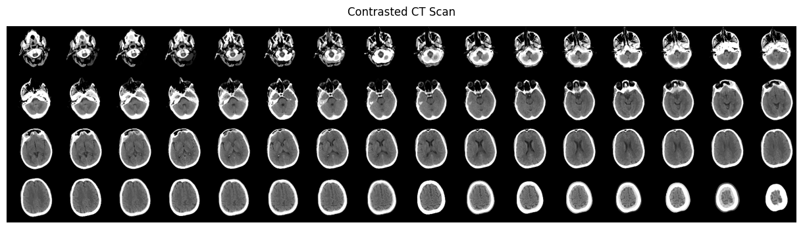

<!-- CSS for scrollable code output -->
<style>
.scrollable-output .highlight .chroma {
    max-height: 1000px;
    overflow-y: auto;
    background-color: #23252f !important;
    border-color: #23252f !important;
}
</style>


## Introduction

The [Brain Stroke CT Image Dataset](https://www.kaggle.com/datasets/afridirahman/brain-stroke-ct-image-dataset) from Kaggle provides normal and stroke brain Computer Tomography (CT) scans. The dataset presents very low activity even though it has been uploaded more than 2 years ago. It may be probably due to its quite low usability (3.13). The challenge is to get some interesting result, i.e., to try to perform brain stroke detection, even from this low-quality CT scans dataset. The followed approach is based on the usage of a 3D Convolutional Neural Network (CNN) in place of a standard 2D one. 2D CNNs are commonly used to process both grayscale (1 channel) and RGB images (3 channels), while a 3D CNN represents the 3D equivalent since it takes as input a 3D volume or a sequence of 2D frames, e.g. slices in a CT scan. 
The provided example takes inspiration from the great work [3D image classification from CT scans](https://keras.io/examples/vision/3D_image_classification/) done by [Hasib Zunair](https://twitter.com/hasibzunair) who clearly demonstrated how to use a 3D CNN to predict the presence of viral pneumonia from CT scans.

## Dataset exploration

The CT scans dataset is public available on Kaggle, but for the sake of simplicy it has been made available also on my Github profile so it can be easily downloaded without the need of an API key and additional Python packages.


```python
import os
import zipfile
import tensorflow as tf

# Download dataset from Github
url = "https://github.com/Peco602/brain-stroke-detection-3d-cnn/releases/download/v0.0.1/brain_ct_data.zip"
filename = os.path.join(os.getcwd(), "brain_ct_data.zip")
tf.keras.utils.get_file(filename, url)

# Unzip dataset
with zipfile.ZipFile("brain_ct_data.zip", "r") as z_fp:
    z_fp.extractall(".")
```

    Downloading data from https://github.com/Peco602/brain-stroke-detection-3d-cnn/releases/download/v0.0.1/brain_ct_data.zip
    63160014/63160014 [==============================] - 1s 0us/step


```python
!ls -al brain_ct_data
```

    total 92
    drwxr-xr-x 4 root root  4096 Apr 21 07:03 .
    drwxr-xr-x 1 root root  4096 Apr 21 07:03 ..
    drwxr-xr-x 2 root root 49152 Apr 21 07:03 Normal
    drwxr-xr-x 2 root root 32768 Apr 21 07:03 Stroke


The dataset contains both normal and stroke images respectively in the `Normal` and `Stroke` folders.


```python
!ls brain_ct_data/Normal | head
```

    100 (10).jpg
    100 (11).jpg
    100 (12).jpg
    100 (13).jpg
    100 (14).jpg
    100 (15).jpg
    100 (16).jpg
    100 (17).jpg
    100 (18).jpg
    100 (19).jpg


```python
!ls brain_ct_data/Stroke | head
```

    58 (10).jpg
    58 (11).jpg
    58 (12).jpg
    58 (13).jpg
    58 (15).jpg
    58 (17).jpg
    58 (18).jpg
    58 (19).jpg
    58 (1).jpg
    58 (20).jpg


It is important to clarify the dataset does not contain CT scans, which are usually provided as DICOM or NIfTI files, but the CT scan slices in JPEG format (most probably extracted from DICOM or NIfTI files). A previous [post](https://www.peco602.com/post/0090-python-dicom/) clearly explains how to extract slice images from a DICOM file. Giving a further look to the slice images it is easy to understand the naming convention `PATIENT_ID (SLICE_ID).jpg`, e.g. `49 (1).jpg`, `49 (2).jpg` and for each patient ID several slices are available. The following function is able to plot up to 40 slices (if available) for a specific patient ID.


```python
import matplotlib.pyplot as plt
import imageio.v2 as imageio
import numpy as np

def plot_scan_from_path(slices_path, patient_id):
    """Plot 40 slices for a patient ID"""
    num_rows = 4
    num_columns = 10
    factor = 1.2
    f, axarr = plt.subplots(
        num_rows,
        num_columns,
        figsize=(num_columns*factor, num_rows*factor),
    )
    f.suptitle(f"Patient {patient_id}", y=1.1)
    image_id = 1
    for i in range(num_rows):
        for j in range(num_columns):
          try:
            img = imageio.imread(f'{slices_path}/{patient_id} ({image_id}).jpg')
          except Exception as e:
            print(e)
            img = np.zeros((2,2))
          finally:
            axarr[i, j].imshow(img, cmap='gray')
            axarr[i, j].axis('off')
            image_id += 1
    plt.subplots_adjust(wspace=0, hspace=0, left=0, right=1, bottom=0, top=1)
    plt.show()
```

Let's start with patient 49:


```python
plot_scan_from_path(slices_path='brain_ct_data/Normal', patient_id=49)
```

    No such file: '/content/brain_ct_data/Normal/49 (34).jpg'
    No such file: '/content/brain_ct_data/Normal/49 (35).jpg'
    No such file: '/content/brain_ct_data/Normal/49 (36).jpg'
    No such file: '/content/brain_ct_data/Normal/49 (37).jpg'
    No such file: '/content/brain_ct_data/Normal/49 (38).jpg'
    No such file: '/content/brain_ct_data/Normal/49 (39).jpg'
    No such file: '/content/brain_ct_data/Normal/49 (40).jpg'


    

    


Patient 49 has 33 slices, but it is fundamental to underline the slices are not correctly sorted. It seems the slices go from the middle of the head to the top, but then they suddenly start back from the bottom. This may be among the reasons the dataset usability is low. This may not be an issue for a 2D CNN since it takes single images as input, but is a big obstacle for a 3D CNN where the volumetric representation of the brain is needed.


```python
plot_scan_from_path(slices_path='brain_ct_data/Normal', patient_id=50)
```

    No such file: '/content/brain_ct_data/Normal/50 (13).jpg'
    No such file: '/content/brain_ct_data/Normal/50 (15).jpg'
    No such file: '/content/brain_ct_data/Normal/50 (17).jpg'
    No such file: '/content/brain_ct_data/Normal/50 (19).jpg'
    No such file: '/content/brain_ct_data/Normal/50 (21).jpg'
    No such file: '/content/brain_ct_data/Normal/50 (23).jpg'
    No such file: '/content/brain_ct_data/Normal/50 (25).jpg'
    No such file: '/content/brain_ct_data/Normal/50 (27).jpg'
    No such file: '/content/brain_ct_data/Normal/50 (29).jpg'
    No such file: '/content/brain_ct_data/Normal/50 (31).jpg'
    No such file: '/content/brain_ct_data/Normal/50 (33).jpg'
    No such file: '/content/brain_ct_data/Normal/50 (35).jpg'
    No such file: '/content/brain_ct_data/Normal/50 (39).jpg'
    No such file: '/content/brain_ct_data/Normal/50 (40).jpg'


    

    


For patient 50 the situation is even worse: there are holes in slice sequence, which makes dataset importing even more difficult.

## Dataset fixing

Before going deeper into modeling it is necessary to try to fix the dataset otherwise it is quite difficult to expect good results. If you are not interested in this section you can skip it and directly jump to the next one since the fixed dataset is also already available on my Github profile.

The fixing consists of correctly sorting the slices and removing the existing holes. The idea is to create a dictionary where each key represents a patient ID, while the value is the list of correctly sorted images. The creation of such a dictionary was quite demanding since it required to visually analyze the entire dataset to try to determine the correct sequence for each patient.


```python
INPUT_PATH='brain_ct_data'
OUTPUT_PATH='brain_ct_data_fixed'
NORMAL_INPUT_PATH=f'{INPUT_PATH}/Normal'
NORMAL_OUTPUT_PATH=f'{OUTPUT_PATH}/Normal'
STROKE_INPUT_PATH=f'{INPUT_PATH}/Stroke'
STROKE_OUTPUT_PATH=f'{OUTPUT_PATH}/Stroke'

NORMAL_SORTING_CONFIG = {
    49:  [14, 15, 16, 11, 17, 18, 19, 20, 21, 22, 23, 24, 25, 26, 27, 28, 29, 30, 31, 32, 33, 1, 2, 3, 4, 5, 6, 7, 8, 9, 10, 12, 13],
    50:  [36, 37, 38, 1, 2, 3, 4, 5, 6, 7, 8, 9, 10, 11, 12, 14, 16, 18, 20, 22, 24, 26, 28, 30, 32, 34],
    51:  [1, 2, 3, 4, 5, 6, 7, 8, 9, 10, 11, 12, 13, 14, 16, 18, 20, 22, 24, 26, 28, 30, 32, 34, 36, 38, 40, 42, 44, 46, 48, 50],
    52:  [1, 2, 3, 4, 5, 6, 7, 8, 9, 10, 11, 13, 15, 17, 19, 21, 23, 25, 27, 29, 30, 31, 32, 33, 34, 35, 36, 37, 38, 39],
    53:  [5, 6, 7, 8, 9, 10, 11, 12, 13, 14, 15, 16, 17, 18, 19, 20, 21, 22, 24, 26, 28, 29, 31, 33, 35, 37, 39, 41, 43, 1, 2, 3, 4],
    54:  [20, 21, 22, 23, 24, 25, 26, 27, 28, 1, 2, 3, 4, 5, 6, 7, 8, 9, 10, 11, 12, 13, 14, 15, 16, 17, 18, 19],
    55:  [30, 31, 32, 1, 2, 3, 4, 5, 6, 7, 8, 9, 10, 11, 12, 13, 14, 15, 16, 17, 18, 19, 20, 21, 22, 23, 24, 25, 26, 27, 28, 29],
    56:  [33, 1, 2, 3, 4, 5, 6, 7, 8, 9, 10, 11, 12, 13, 14, 15, 16, 17, 18, 19, 20, 21, 22, 23, 24, 25, 26, 27, 28, 29, 30, 31, 32],
    57:  [32, 33, 34, 35, 1, 2, 3, 4, 5, 6, 7, 8, 9, 10, 11, 12, 13, 14, 15, 16, 17, 18, 19, 20, 21, 22, 23, 24, 25, 26, 27, 28, 29, 30, 31],
    59:  [1, 2, 3, 4, 5, 6, 7, 8, 9, 10, 11, 12, 13, 14, 15, 16, 17, 18, 19, 20, 21, 22, 23, 24, 25, 26, 27],
    60:  [1, 2, 3, 4, 5, 6, 7, 8, 9, 10, 11, 12, 13, 14, 15, 16, 17, 18, 19, 20, 21, 22, 23, 24, 25, 26, 27, 28, 29],
    61:  [25, 26, 27, 28, 29, 30, 31, 1, 2, 3, 4, 5, 6, 7, 8, 9, 10, 11, 12, 13, 14, 15, 16, 17, 18, 19, 20, 21, 22, 23, 24],
    62:  [1, 2, 3, 4, 5, 6, 7, 8, 9, 10, 11, 12, 13, 14, 15, 16, 17, 18, 19, 20, 21, 22, 23],
    63:  [33, 34, 35, 36, 1, 2, 3, 4, 5, 6, 7, 8, 9, 10, 11, 12, 13, 14, 15, 16, 17, 18, 19, 20, 21, 22, 23, 24, 25, 26, 27, 28, 29, 30, 31, 32],
    64:  [1, 2, 3, 4, 5, 6, 7, 8, 9, 10, 11, 12, 13, 14, 15, 16, 17, 18, 19, 20, 21, 22, 23, 24, 25, 26],
    65:  [1, 2, 3, 4, 5, 6, 7, 8, 9, 10, 11, 12, 13, 14, 15, 16, 17, 18, 19, 20, 21, 22, 23, 24, 25, 26, 27, 28, 29, 30],
    95:  [1, 2, 3, 4, 5, 6, 7, 8, 9, 10, 11, 12, 13, 14, 15, 16, 17, 18, 19, 20, 21, 22, 23, 24, 25, 26, 27, 28, 29],
    96:  [1, 2, 3, 4, 5, 6, 7, 8, 9, 10, 11, 12, 13, 14, 15, 16, 17, 18, 19, 20, 21, 22, 23, 24, 25, 26, 27, 28, 29, 30, 31, 32, 33],
    98:  [29, 1, 2, 3, 4, 5, 6, 7, 8, 9, 10, 11, 12, 13, 14, 15, 16, 17, 18, 19, 20, 21, 22, 23, 24, 25, 26, 27, 28],
    99:  [1, 2, 3, 4, 5, 6, 7, 8, 9, 10, 11, 12, 13, 14, 15, 16, 17, 18, 19, 20, 21, 22, 23, 24, 25, 26, 27, 28, 29],
    100: [1, 2, 3, 4, 5, 6, 7, 8, 9, 10, 11, 12, 13, 14, 15, 16, 17, 18, 19, 20, 21, 22, 23, 24, 25, 26, 27, 28, 29, 30],
    101: [1, 2, 3, 4, 5, 6, 7, 8, 9, 10, 11, 12, 13, 14, 15, 16, 17, 18, 19, 20, 21, 22, 23, 24, 25, 26, 27, 28, 29, 30, 31],
    102: [1, 2, 3, 4, 5, 6, 7, 8, 9, 10, 11, 12, 13, 14, 15, 16, 17, 18, 19, 20, 21, 22, 23, 24, 25, 26, 27, 28, 29, 30, 31],
    103: [1, 2, 3, 4, 5, 6, 7, 8, 9, 10, 11, 12, 13, 14, 15, 16, 17, 18, 19, 20, 21, 22, 23, 24, 25, 26, 27, 28, 29, 30, 31, 32, 33, 34, 35],
    104: [1, 2, 3, 4, 5, 6, 7, 8, 9, 10, 11, 12, 13, 14, 15, 16, 17, 18, 19, 20, 21, 22, 23, 24, 25, 26, 27, 28, 29],
    105: [1, 2, 3, 4, 5, 6, 7, 8, 9, 10, 11, 12, 13, 14, 15, 16, 17, 18, 19, 20, 21, 22, 23, 24, 25, 26, 27, 28, 29, 30],
    106: [1, 2, 3, 4, 5, 6, 7, 8, 9, 10, 11, 12, 13, 14, 15, 16, 17, 18, 19, 20, 21, 22, 23, 24, 25, 26, 27, 28, 29],
    107: [1, 2, 3, 4, 5, 6, 7, 8, 9, 10, 11, 12, 13, 14, 15, 16, 17, 18, 19, 20, 21, 22, 23, 24, 25, 26, 27, 28, 29, 30],
    108: [25, 26, 27, 28, 29, 1, 2, 3, 4, 5, 6, 7, 8, 9, 10, 11, 12, 13, 14, 15, 16, 17, 18, 19, 20, 21, 22, 23, 24],
    109: [1, 2, 3, 4, 5, 6, 7, 8, 9, 10, 11, 12, 13, 14, 15, 16, 17, 18, 19, 20, 21, 22, 23, 24, 25, 26, 27, 28],
    110: [1, 2, 3, 4, 5, 6, 7, 8, 9, 10, 11, 12, 13, 14, 15, 16, 17, 18, 19, 20, 21, 22, 23, 24, 25, 26, 27, 28],
    111: [1, 2, 3, 4, 5, 6, 7, 8, 9, 10, 11, 12, 13, 14, 15, 16, 17, 18, 19, 20, 21, 22, 23, 24, 25, 26, 27, 28, 29, 30, 31, 32, 33],
    112: [1, 2, 3, 4, 5, 6, 7, 8, 9, 10, 11, 12, 13, 14, 15, 16, 17, 18, 19, 20, 21, 22, 23, 24, 25, 26],
    113: [1, 2, 3, 4, 5, 6, 7, 8, 9, 10, 11, 12, 13, 14, 15, 16, 17, 18, 19, 20, 21, 22, 23, 24, 25, 26, 27, 28],
    114: [1, 2, 3, 4, 5, 6, 7, 8, 9, 10, 11, 12, 13, 14, 15, 16, 17, 18, 19, 20, 21, 22, 23, 24, 25, 26, 27, 28, 29],
    115: [1, 2, 3, 4, 5, 6, 7, 8, 9, 10, 11, 12, 13, 14, 15, 16, 17, 18, 19, 20, 21, 22, 23, 24, 25, 26, 27, 28, 29, 30, 31, 32],
    116: [31, 1, 2, 3, 4, 5, 6, 7, 8, 9, 10, 11, 12, 13, 14, 15, 16, 17, 18, 19, 20, 21, 22, 23, 24, 25, 26, 27, 28, 29, 30],
    117: [29, 1, 2, 3, 4, 5, 6, 7, 8, 9, 10, 11, 12, 13, 14, 15, 16, 17, 18, 19, 20, 21, 22, 23, 24, 25, 26, 27, 28],
    118: [1, 2, 3, 4, 5, 6, 7, 8, 9, 10, 11, 12, 13, 14, 15, 16, 17, 18, 19, 20, 21, 22, 23, 24, 25, 26, 27, 28, 29, 30],
    119: [1, 2, 3, 4, 5, 6, 7, 8, 9, 10, 11, 12, 13, 14, 15, 16, 17, 18, 19, 20, 21, 22, 23, 24, 25, 26, 27, 28, 29, 30, 31],
    120: [1, 2, 3, 4, 5, 6, 7, 8, 9, 10, 11, 12, 13, 14, 15, 16, 17, 18, 19, 20, 21, 22, 23, 24, 25, 26, 27, 28, 29, 30],
    121: [1, 2, 3, 4, 5, 6, 7, 8, 9, 10, 11, 12, 13, 14, 15, 16, 17, 18, 19, 20, 21, 22, 23, 24, 25, 26, 27, 28, 29, 30],
    122: [1, 2, 3, 4, 5, 6, 7, 8, 9, 10, 11, 12, 13, 14, 15, 16, 17, 18, 19, 20, 21, 22, 23, 24, 25, 26, 27, 28],
    123: [39, 1, 2, 3, 4, 5, 6, 7, 8, 9, 10, 11, 12, 13, 14, 15, 16, 17, 18, 19, 20, 21, 22, 23, 24, 25, 26, 27, 28, 29, 30, 31, 32, 33, 34, 35, 36, 37, 38],
    124: [1, 2, 3, 4, 5, 6, 7, 8, 9, 10, 11, 12, 13, 14, 15, 16, 17, 18, 19, 20, 21, 22, 23, 24, 25, 26, 27, 28, 29, 30],
    125: [1, 2, 3, 4, 5, 6, 7, 8, 9, 10, 11, 12, 13, 14, 15, 16, 17, 18, 19, 20, 21, 22, 23, 24, 25, 26, 27, 28, 29, 30, 31, 32, 33, 34, 35, 36, 37, 38, 39, 40],
    126: [30, 1, 2, 3, 4, 5, 6, 7, 8, 9, 10, 11, 12, 13, 14, 15, 16, 17, 18, 19, 20, 21, 22, 23, 24, 25, 26, 27, 28, 29],
    127: [1, 2, 3, 4, 5, 6, 7, 8, 9, 10, 11, 12, 13, 14, 15, 16, 17, 18, 19, 20, 21, 22, 23, 24, 25, 26, 27, 28, 29, 30, 31, 32],
    128: [1, 2, 3, 4, 5, 6, 7, 8, 9, 10, 11, 12, 13, 14, 15, 16, 17, 18, 19, 20, 21, 22, 23, 24, 25, 26, 27, 28],
    129: [1, 2, 3, 4, 5, 6, 7, 8, 9, 10, 11, 12, 13, 14, 15, 16, 17, 18, 19, 20, 21, 22, 23, 24, 25, 26, 27, 28, 29, 30],
    130: [26, 27, 28, 29, 30, 31, 1, 2, 3, 4, 5, 6, 7, 8, 9, 10, 11, 12, 13, 14, 15, 16, 17, 18, 19, 20, 21, 22, 23, 24, 25],
}

STROKE_SORTING_CONFIG = {
    58: [1, 2, 3, 4, 5, 6, 7, 8, 9, 10, 11, 12, 13, 15, 17, 18, 19, 20, 21, 22, 23, 24, 25, 26, 27, 28, 29, 30, 31, 32, 33, 34, 35, 36],
    66: [1, 2, 3, 4, 5, 6, 7, 8, 9, 10, 11, 12, 13, 15, 17, 19, 21, 23, 25, 27, 29, 31, 33, 35, 37, 38, 39, 40, 41],
    67: [1, 2, 3, 4, 5, 6, 7, 8, 9, 10, 11, 12, 13, 14, 15, 16, 17, 19, 21, 23, 25, 27, 28, 29, 30, 31, 32, 33],
    68: [1, 2, 3, 4, 5, 6, 8, 10, 12, 14, 16, 18, 20, 22, 24, 26, 27, 28, 29, 30, 31, 32, 33, 34, 35, 36],
    69: [1, 2, 3, 4, 5, 6, 7, 8, 9, 10, 11, 12, 13, 14, 15, 16, 17, 19, 21, 22, 23, 24, 25, 26, 27, 28, 29, 30, 31, 32, 33, 34, 35, 36],
    70: [1, 2, 3, 4, 5, 6, 7, 8, 9, 10, 11, 12, 13, 15, 17, 19, 21, 23, 25, 27, 29, 31, 33, 35, 37, 39, 41, 42, 43, 44, 45, 46, 47, 48],
    71: [48, 1, 2, 3, 4, 5, 6, 7, 8, 9, 10, 12, 14, 16, 18, 20, 22, 24, 26, 28, 30, 32, 34, 36, 38, 40, 42, 44, 46],
    72: [31, 32, 1, 2, 3, 4, 5, 6, 7, 8, 9, 10, 11, 13, 15, 16, 17, 18, 19, 20, 21, 22, 23, 24, 25, 26, 27, 28, 29, 30],
    73: [1, 2, 3, 4, 5, 6, 7, 8, 9, 10, 11, 12, 13, 14, 15, 16, 17, 18, 19, 20, 21, 22, 23, 24, 25, 26, 28, 30, 32, 34, 36, 38, 39],
    74: [1, 2, 3, 4, 5, 6, 7, 8, 9, 10, 11, 12, 14, 16, 18, 20, 22, 23, 25, 27, 29, 31, 33, 35, 37, 39, 40, 41, 42, 43, 44, 45, 46],
    75: [1, 2, 3, 4, 5, 6, 7, 8, 9, 10, 11, 12, 13, 14, 15, 16, 18, 20, 22, 24, 26, 28, 30, 32, 34, 36, 38, 40, 42, 44, 46, 48, 49],
    76: [1, 2, 3, 4, 5, 6, 7, 8, 9, 10, 12, 13, 15, 17, 19, 21, 23, 25, 27, 29, 31, 33, 35, 37, 39, 40, 41, 42, 43],
    77: [1, 2, 3, 4, 5, 6, 7, 8, 9, 10, 12, 14, 16, 18, 20, 22, 24, 26, 28, 30, 32, 34, 35, 36, 37, 38, 39, 40, 41, 42, 43],
    78: [1, 2, 3, 4, 5, 6, 7, 8, 9, 10, 11, 13, 15, 17, 19, 21, 23, 25, 26, 28, 30, 32, 34, 35, 36, 37, 38, 39, 40, 41, 42],
    79: [1, 2, 3, 4, 5, 6, 7, 8, 9, 10, 11, 12, 13, 14, 16, 17, 18, 19, 20, 21, 22, 23, 24, 25, 26, 27],
    80: [1, 2, 3, 4, 5, 6, 7, 8, 10, 12, 14, 15, 16, 18, 20, 22, 24, 26, 28, 30, 32, 33, 34, 35, 36, 37, 38, 39, 40],
    81: [1, 2, 3, 4, 5, 6, 7, 8, 9, 10, 11, 12, 13, 15, 17, 19, 21, 23, 25, 27, 29, 31, 33, 35, 37, 39, 41, 43, 44],
    82: [1, 2, 3, 4, 5, 6, 7, 8, 9, 10, 12, 14, 15, 16, 17, 18, 19, 20, 21, 22, 23, 24, 25, 26, 27, 28, 29, 30, 31],
    83: [5, 6, 7, 8, 9, 10, 11, 12, 13, 14, 15, 16, 17, 18, 19, 20, 21, 22, 23, 25, 27, 29, 31, 33, 35, 36, 37, 38, 1, 2, 3, 4],
    84: [1, 2, 3, 4, 5, 6, 7, 8, 9, 10, 11, 12, 13, 14, 15, 16, 17, 18, 20, 22, 24, 26, 27, 28, 29, 30, 31, 32, 33, 34, 35, 36, 37, 38, 39, 40],
    85: [21, 1, 2, 3, 4, 5, 6, 7, 8, 9, 10, 11, 13, 15, 16, 17, 18, 19, 20],
    86: [31, 32, 33, 34, 35, 36, 1, 2, 3, 4, 6, 8, 10, 12, 14, 16, 18, 19, 20, 21, 22, 23, 24, 25, 26, 27, 28, 29, 30],
    87: [1, 2, 3, 4, 5, 6, 7, 8, 9, 10, 11, 12, 13, 14, 15, 17, 19, 21, 23, 25, 27, 29, 31, 33, 35, 37, 39, 40, 41, 42, 43, 44],
    88: [1, 2, 3, 4, 5, 6, 7, 8, 9, 10, 11, 12, 13, 14, 15, 16, 17, 18, 19, 20, 21, 22, 24, 26, 28, 30, 32, 34, 35, 36, 37],
    89: [1, 2, 3, 4, 5, 6, 7, 8, 9, 10, 11, 12, 13, 14, 15, 16, 17, 19, 21, 23, 25, 27, 29, 31, 33, 34, 35, 36, 37, 38, 39, 40, 41, 42, 43],
    90: [1, 2, 3, 4, 5, 6, 7, 8, 9, 10, 11, 12, 13, 15, 17, 19, 21, 22, 23, 24, 25, 26, 27, 28, 29, 30, 31, 32],
    91: [1, 2, 3, 4, 5, 6, 7, 8, 9, 10, 11, 12, 13, 14, 15, 17, 19, 21, 23, 25, 27, 29, 30, 31, 32, 33, 34, 35, 36, 37, 38, 39, 40],
    92: [1, 2, 3, 4, 5, 6, 7, 8, 9, 10, 11, 12, 13, 14, 15, 17, 19, 20, 21, 23, 25, 27, 29, 31, 32, 33, 34, 36, 38, 40, 42],
    93: [1, 2, 3, 4, 5, 6, 7, 8, 9, 10, 11, 12, 13, 14, 15, 16, 17, 18, 20, 22, 24, 26, 27, 28, 29, 30, 31, 32, 33, 34, 35, 36],
    94: [1, 2, 3, 4, 5, 6, 7, 8, 9, 10, 11, 12, 13, 14, 15, 16, 17, 18, 19, 21, 23, 25, 27, 29, 31, 33, 35, 37, 39, 41, 43, 44, 45, 46],
    97: [1, 2, 3, 4, 5, 6, 7, 8, 9, 10, 11, 12, 13, 14, 15, 16, 18, 20, 22, 24, 26, 28, 30, 32, 34, 35, 36, 37, 38, 39, 40],
}
```

Given both the `NORMAL_SORTING_CONFIG` and `STROKE_SORTING_CONFIG` it is just a matter of copying all the slices in the correct order to a different path, i.e., `brain_ct_data_fixed`.


```python
import os
import shutil

def sort_slices(input_path, output_path, patient_id, order):
  """Copy the slices in the correct order"""
  # Create output folder for sorted images (if it does not exist)
  if not os.path.exists(output_path):
    os.makedirs(output_path, exist_ok=True)

  # Move the image to the output path with a name based on the correct sorting order
  for new_id in range(1, len(order)+1):
    old_id = order[new_id-1]
    shutil.copyfile(f'{input_path}{os.sep}{patient_id} ({old_id}).jpg', f'{output_path}{os.sep}{patient_id} ({new_id}).jpg')


# Normal slices sorting
for patient_id, order in NORMAL_SORTING_CONFIG.items():
    sort_slices(
      input_path=NORMAL_INPUT_PATH,
      output_path=NORMAL_OUTPUT_PATH,
      patient_id=patient_id,
      order=order)

# Stroke slices sorting
for patient_id, order in STROKE_SORTING_CONFIG.items():
    sort_slices(
      input_path=STROKE_INPUT_PATH,
      output_path=STROKE_OUTPUT_PATH,
      patient_id=patient_id,
      order=order)
```

Let's try to plot again CT slices for both patients 49 and 50:


```python
plot_scan_from_path(slices_path=NORMAL_OUTPUT_PATH, patient_id=49)
```

    No such file: '/content/brain_ct_data_fixed/Normal/49 (34).jpg'
    No such file: '/content/brain_ct_data_fixed/Normal/49 (35).jpg'
    No such file: '/content/brain_ct_data_fixed/Normal/49 (36).jpg'
    No such file: '/content/brain_ct_data_fixed/Normal/49 (37).jpg'
    No such file: '/content/brain_ct_data_fixed/Normal/49 (38).jpg'
    No such file: '/content/brain_ct_data_fixed/Normal/49 (39).jpg'
    No such file: '/content/brain_ct_data_fixed/Normal/49 (40).jpg'


    

    


```python
plot_scan_from_path(slices_path=NORMAL_OUTPUT_PATH, patient_id=50)
```

    No such file: '/content/brain_ct_data_fixed/Normal/50 (27).jpg'
    No such file: '/content/brain_ct_data_fixed/Normal/50 (28).jpg'
    No such file: '/content/brain_ct_data_fixed/Normal/50 (29).jpg'
    No such file: '/content/brain_ct_data_fixed/Normal/50 (30).jpg'
    No such file: '/content/brain_ct_data_fixed/Normal/50 (31).jpg'
    No such file: '/content/brain_ct_data_fixed/Normal/50 (32).jpg'
    No such file: '/content/brain_ct_data_fixed/Normal/50 (33).jpg'
    No such file: '/content/brain_ct_data_fixed/Normal/50 (34).jpg'
    No such file: '/content/brain_ct_data_fixed/Normal/50 (35).jpg'
    No such file: '/content/brain_ct_data_fixed/Normal/50 (36).jpg'
    No such file: '/content/brain_ct_data_fixed/Normal/50 (37).jpg'
    No such file: '/content/brain_ct_data_fixed/Normal/50 (38).jpg'
    No such file: '/content/brain_ct_data_fixed/Normal/50 (39).jpg'
    No such file: '/content/brain_ct_data_fixed/Normal/50 (40).jpg'


    

    


Hopefully, the dataset should be fixed now. The fixed dataset is publicly available [here](https://github.com/Peco602/brain-stroke-detection-3d-cnn/releases/download/v0.0.1/brain_ct_data_fixed.zip).


## Dataset loading and preprocessing


In case the previous section has been skipped, it is possible to directly download the fixed dataset:


```python
import os
import zipfile
import tensorflow as tf

# Download dataset from Github
url = "https://github.com/Peco602/brain-stroke-detection-3d-cnn/releases/download/v0.0.1/brain_ct_data_fixed.zip"
filename = os.path.join(os.getcwd(), "brain_ct_data_fixed.zip")
tf.keras.utils.get_file(filename, url)

# Unzip dataset
with zipfile.ZipFile("brain_ct_data_fixed.zip", "r") as z_fp:
    z_fp.extractall(".")
```


```python
NORMAL_PATH = '/content/brain_ct_data_fixed/Normal'
STROKE_PATH = '/content/brain_ct_data_fixed/Stroke'
```

Before going deeper into data loading it can be interesting to give a look to a single CT slice.


```python
import imageio.v2 as imageio
import matplotlib.pyplot as plt

image = imageio.imread(f'{STROKE_PATH}/67 (15).jpg')
plt.imshow(image, cmap="gray")
```


    <matplotlib.image.AxesImage at 0x7fa302346580>


    

    


As it is possible to see, the image presents some artifacts that may hinder the CNN training process. [Vicente Rodríguez](https://vincentblog.xyz/posts/medical-images-in-python-computed-tomography) provided a nice example of CT image denoising that lead to the creation of the following `remove_noise` function:


```python
from scipy import ndimage
from skimage import morphology
import numpy as np

def remove_noise(image, display=False):
  """Remove slice noise"""
  # morphology.dilation creates a segmentation of the image
  # If one pixel is between the origin and the edge of a square of size
  # 3x3, the pixel belongs to the same class
  segmentation = morphology.dilation(image, np.ones((3, 3)))
  segmentation[segmentation < 25] = 0
  segmentation[segmentation > 25] = 1
  labels, label_nb = ndimage.label(segmentation)
  label_count = np.bincount(labels.ravel().astype(int))

  # The size of label_count is the number of classes/segmentations found.
  # The first class is not used since it's the background.
  label_count[0] = 0

  # A mask with the class with more pixels is created
  # since it should represent the brain
  mask = labels == label_count.argmax()

  # Improve the brain mask
  mask = morphology.dilation(mask, np.ones((5, 5)))
  mask = ndimage.binary_fill_holes(mask)
  mask = morphology.dilation(mask, np.ones((3, 3)))

  # Since the pixels in the mask are zeros and ones,
  # it is possible to multiple the original image to only keep the brain region
  masked_image = mask * image

  if display:
    plt.figure(figsize=(10, 2.5))
    plt.subplot(141)
    plt.imshow(image, cmap=plt.cm.bone)
    plt.title('Original Image')
    plt.axis('off')

    plt.subplot(142)
    plt.imshow(mask, cmap=plt.cm.bone)
    plt.title('Mask')
    plt.axis('off')

    plt.subplot(143)
    plt.imshow(masked_image, cmap=plt.cm.bone)
    plt.title('Clean Image')
    plt.axis('off')

  return masked_image
```

So, let's try to remove the background artifacts from the image:


```python
denoised_image = remove_noise(image, display=True)
```


    

    


As expected, the CT artifacts are not present anymore.

It is worth noting despite the CT slices have been correctly sorted and there are no holes in slice sequences anymore, the dataset is still not so straightforward to import since the number of slices per patient is not 
always the same. The `load_dataset` function appears quite complex because it has to execute in sequence multiple steps to load and pre-process the entire image dataset:

1. `count_slices`: counts the number of slices per patient
2. `merge_slices`: denoises (optionally) and merges all patient slices into a single scan
3. `normalize_scan`: normalizes the scan values to the interval `[0, 1]`
4. `resize_scan`: resizes the scan across x, y and z axis to uniform the scan sizes to fixed values 

Finally, the returned dataset is a 4D array, i.e., an array of scans (3D images).


```python
import numpy as np
from tqdm import tqdm


def resize_scan(scan):
  """Resize the CT scan to a desired uniform size across all axis"""
  # Set the desired depth
  desired_depth = 64
  desired_width = 128
  desired_height = 128
  # Get current depth
  current_depth = scan.shape[-1]
  current_width = scan.shape[0]
  current_height = scan.shape[1]
  # Compute depth factor
  depth = current_depth / desired_depth
  width = current_width / desired_width
  height = current_height / desired_height
  depth_factor = 1 / depth
  width_factor = 1 / width
  height_factor = 1 / height
  # Rotate
  scan = ndimage.rotate(scan, 90, reshape=False)
  # Resize across z-axis
  scan = ndimage.zoom(scan, (width_factor, height_factor, depth_factor), order=1)
  return scan


def normalize_scan(scan):
  """Normalize the scan to the interval [0, 1]"""
  min = 0
  max = 255
  scan[scan < min] = min
  scan[scan > max] = max
  scan = (scan - min) / (max - min)
  scan = scan.astype("float32")
  return scan


def merge_slices(path, patient_id, slice_count, denoise=False):
  """Merge all the slices for a patient into a scan"""
  if denoise:
    scan = tuple(remove_noise(imageio.imread(f'{path}/{patient_id} ({slice_id}).jpg')) for slice_id in range(1, slice_count+1))
  else:
    scan = tuple(imageio.imread(f'{path}/{patient_id} ({slice_id}).jpg') for slice_id in range(1, slice_count+1))

  return np.dstack(scan)


def count_slices(path):
  """Analyze the slices path and returns a dictionary with the slices count associated to each patient"""
  slice_dict = {}
  for dirname, _, filenames in os.walk(path):
      for filename in filenames:
        patient_id = int(filename.split()[0])
        if patient_id not in slice_dict:
          slice_dict[patient_id] = 1
        else:
          slice_dict[patient_id] = slice_dict[patient_id] + 1

  return slice_dict


def collect_scan(path, patient_id, slice_count):
  """Collect a scan for a patient id"""
  # Get a single CT scan by merging all the slices from a single patient
  # Before getting merged the slices are also denoised
  scan = merge_slices(path, patient_id, slice_count, denoise=True)

  # Normalize the CT scan to the interval [0, 1]
  scan = normalize_scan(scan)

  # Resize the CT scan to uniform the size
  scan = resize_scan(scan)

  return scan


def load_dataset(path):
  """Return the scans dataset as a 4D array""" 
  # Get a dictionary with patient IDs and slice count per patient
  slices_dict = count_slices(path)

  # Collect scans for each patient id
  dataset = np.array([collect_scan(path, patient_id, slice_count) for patient_id, slice_count in tqdm(slices_dict.items())])

  return dataset
```

Both the normal and stroke datasets are imported from the respective paths. Since the process can take some minutes the `tqdm` library can help to check the progress in realtime.


```python
normal_dataset = load_dataset(path=NORMAL_PATH)
stroke_dataset = load_dataset(path=STROKE_PATH)
```

    100%|██████████| 51/51 [02:55<00:00,  3.44s/it]
    100%|██████████| 31/31 [01:41<00:00,  3.27s/it]


```python
normal_dataset.shape, stroke_dataset.shape
```


    ((51, 128, 128, 64), (31, 128, 128, 64))


The normal and stroke datasets are represented by rank-3 tensors of shape `(samples, height, width, depth)`. There are 51 normal and 31 stroke CT scans so the dataset is quite unbalanced.

The function `plot_slices_from_dataset` can be used to plot an entire CT scan from the loaded dataset.


```python
def plot_scan_from_dataset(num_rows, num_columns, width, height, data, title):
  """Plot a scan from dataset"""
  data = np.transpose(data)
  data = np.reshape(data, (num_rows, num_columns, width, height))
  rows_data, columns_data = data.shape[0], data.shape[1]
  heights = [slc[0].shape[0] for slc in data]
  widths = [slc.shape[1] for slc in data[0]]
  fig_width = 12.0
  fig_height = fig_width * sum(heights) / sum(widths)
  f, axarr = plt.subplots(
      rows_data,
      columns_data,
      figsize=(fig_width, fig_height),
      gridspec_kw={"height_ratios": heights},
  )
  f.suptitle(title, y=1.1)
  for i in range(rows_data):
      for j in range(columns_data):
          axarr[i, j].imshow(data[i][j], cmap="gray")
          axarr[i, j].axis("off")
  plt.subplots_adjust(wspace=0, hspace=0, left=0, right=1, bottom=0, top=1)
  plt.show()
```

The first scan from both the normal and stroke datasets is shown hereafter.


```python
plot_scan_from_dataset(4, 16, 128, 128, normal_dataset[0, :, :, :], "Normal CT scan")
```


    

    


```python
plot_scan_from_dataset(4, 16, 128, 128, stroke_dataset[0, :, :, :], "Stroke CT scan")
```


    

    


Both the datasets are now splitted and merged into `training` and `validation` datasets with a ratio of 70% and 30%.


```python
# For the CT scans having presence of stroke assign 1 otherwise 0.
normal_labels = np.array([0 for _ in range(len(normal_dataset))])
stroke_labels = np.array([1 for _ in range(len(stroke_dataset))])

# Split data in the ratio 70%-30% for training and validation.
import math
VALIDATION_SPLIT = 0.7
normal_train_len = math.ceil(VALIDATION_SPLIT*len(normal_labels))
stroke_train_len = math.ceil(VALIDATION_SPLIT*len(stroke_labels))
x_train = np.concatenate((normal_dataset[:normal_train_len], stroke_dataset[:stroke_train_len]), axis=0)
y_train = np.concatenate((normal_labels[:normal_train_len], stroke_labels[:stroke_train_len]), axis=0)
x_val = np.concatenate((normal_dataset[normal_train_len:], stroke_dataset[stroke_train_len:]), axis=0)
y_val = np.concatenate((normal_labels[normal_train_len:], stroke_labels[stroke_train_len:]), axis=0)

print(f"Training samples")
print(f"Normal: {normal_train_len}")
print(f"Stroke: {stroke_train_len}")
print(f"Total: {x_train.shape[0]}")
print()
print(f"Validation samples")
print(f"Normal: {len(normal_dataset) - normal_train_len}")
print(f"Stroke: {len(stroke_dataset) - stroke_train_len}")
print(f"Total: {x_val.shape[0]}")
```

    Training samples
    Normal: 36
    Stroke: 22
    Total: 58
    
    Validation samples
    Normal: 15
    Stroke: 9
    Total: 24


## Dataset augmentation

 A machine learning model performs better and is more accurate when the dataset is rich and sufficient. Deep learning in general, but particularly in medical imaging, requires a large amount of training data in order to obtain good performance and avoid overfitting. To meet these challenges, increasing the quantity of training data is a common solution. Data augmentation is a common approach to enhance the performance and the results of machine learning models. It allows a small dataset to be rebalanced or enriched for any reason (time-consuming manual annotations, lack of accessible data...). The augmentation techniques must make sense with respect to the type of analysis desired and therefore positively influence the performance of the model during the learning phase: by applying a large number of augmentations, the performance will not necessarily be better. There are several types of transformations for medical images, but few examples which can be seen as good starting point for CT scans are provided in the following.

### Rotation

This transformation consists of rotating the original image according to a desired angle. In medical image analysis, this  represents a common augmentation technique. In this case the scan is rotated around z-axis by a random angle in the interval `[-45, 45]` degrees.


```python
rotation_layer = tf.keras.layers.RandomRotation(factor=(-0.125, 0.125), fill_mode='constant', fill_value=0)

plot_scan_from_dataset(4, 16, 128, 128, x_train[0, :, :, :], "Original CT Scan")
plot_scan_from_dataset(4, 16, 128, 128, rotation_layer(x_train[0, :, :, :]), "Rotated CT Scan")
```


    

    


    

    


### Flip

The image flips are performed along an axis of symmetry. For medical image enhancement, they can be performed vertically as well as horizontally, because images can be acquired in supine or prone position, and contain anatomical variations (e.g., situs inversus). An organ, whatever its location in the body, will always be the same organ.


```python
flipping_layer = tf.keras.layers.RandomFlip(mode='vertical')

plot_scan_from_dataset(4, 16, 128, 128, x_train[0, :, :, :], "Original CT Scan")
plot_scan_from_dataset(4, 16, 128, 128, flipping_layer(x_train[0, :, :, :]), "Flipped CT Scan")
```


    

    


    

    


### Shift

This transformation can be performed along the x and/or y axis randomly. The transformed image keeps the same size and orientation as the original image, but is moved in the applied direction. The added pixels are filled with zeros.


```python
shifting_layer = tf.keras.layers.RandomTranslation(height_factor=0.2, width_factor=0.2, fill_mode='constant', fill_value=0)

plot_scan_from_dataset(4, 16, 128, 128, x_train[0, :, :, :], "Original CT Scan")
plot_scan_from_dataset(4, 16, 128, 128, shifting_layer(x_train[0, :, :, :]), "Shifted CT Scan")
```


    

    


    

    


### Zoom

A zoom augmentation randomly zooms the image in or out. The zoomed image keeps the same size and orientation as the original image.


```python
zoom_layer = tf.keras.layers.RandomZoom(height_factor=0.15, fill_mode='constant', fill_value=0)

plot_scan_from_dataset(4, 16, 128, 128, x_train[0, :, :, :], "Original CT Scan")
plot_scan_from_dataset(4, 16, 128, 128, zoom_layer(x_train[0, :, :, :]), "Zoomed CT Scan")
```


    

    


    

    


### Shear

Shearing is an affine transformation that consists of shifting in opposite directions the top and bottom of the image (horizontal shearing) or the right and left of the image (vertical shearing). Unlike the previous methods, the image is distorted. Shear augmentation is not available in `tensorflow` so the `keras_cv` package must be installed.


```python
!pip install keras_cv
```

    Looking in indexes: https://pypi.org/simple, https://us-python.pkg.dev/colab-wheels/public/simple/
    Collecting keras_cv
      Downloading keras_cv-0.4.2-py3-none-any.whl (634 kB)
         ━━━━━━━━━━━━━━━━━━━━━━━━━━━━━━━━━━━━━━ 634.9/634.9 kB 13.2 MB/s eta 0:00:00
    [?25hRequirement already satisfied: packaging in /usr/local/lib/python3.9/dist-packages (from keras_cv) (23.1)
    Requirement already satisfied: absl-py in /usr/local/lib/python3.9/dist-packages (from keras_cv) (1.4.0)
    Requirement already satisfied: tensorflow-datasets in /usr/local/lib/python3.9/dist-packages (from keras_cv) (4.8.3)
    Requirement already satisfied: regex in /usr/local/lib/python3.9/dist-packages (from keras_cv) (2022.10.31)
    Requirement already satisfied: promise in /usr/local/lib/python3.9/dist-packages (from tensorflow-datasets->keras_cv) (2.3)
    Requirement already satisfied: tensorflow-metadata in /usr/local/lib/python3.9/dist-packages (from tensorflow-datasets->keras_cv) (1.13.1)
    Requirement already satisfied: tqdm in /usr/local/lib/python3.9/dist-packages (from tensorflow-datasets->keras_cv) (4.65.0)
    Requirement already satisfied: protobuf>=3.12.2 in /usr/local/lib/python3.9/dist-packages (from tensorflow-datasets->keras_cv) (3.20.3)
    Requirement already satisfied: toml in /usr/local/lib/python3.9/dist-packages (from tensorflow-datasets->keras_cv) (0.10.2)
    Requirement already satisfied: requests>=2.19.0 in /usr/local/lib/python3.9/dist-packages (from tensorflow-datasets->keras_cv) (2.27.1)
    Requirement already satisfied: click in /usr/local/lib/python3.9/dist-packages (from tensorflow-datasets->keras_cv) (8.1.3)
    Requirement already satisfied: etils[enp,epath]>=0.9.0 in /usr/local/lib/python3.9/dist-packages (from tensorflow-datasets->keras_cv) (1.2.0)
    Requirement already satisfied: termcolor in /usr/local/lib/python3.9/dist-packages (from tensorflow-datasets->keras_cv) (2.2.0)
    Requirement already satisfied: numpy in /usr/local/lib/python3.9/dist-packages (from tensorflow-datasets->keras_cv) (1.22.4)
    Requirement already satisfied: wrapt in /usr/local/lib/python3.9/dist-packages (from tensorflow-datasets->keras_cv) (1.14.1)
    Requirement already satisfied: psutil in /usr/local/lib/python3.9/dist-packages (from tensorflow-datasets->keras_cv) (5.9.5)
    Requirement already satisfied: dm-tree in /usr/local/lib/python3.9/dist-packages (from tensorflow-datasets->keras_cv) (0.1.8)
    Requirement already satisfied: importlib_resources in /usr/local/lib/python3.9/dist-packages (from etils[enp,epath]>=0.9.0->tensorflow-datasets->keras_cv) (5.12.0)
    Requirement already satisfied: zipp in /usr/local/lib/python3.9/dist-packages (from etils[enp,epath]>=0.9.0->tensorflow-datasets->keras_cv) (3.15.0)
    Requirement already satisfied: typing_extensions in /usr/local/lib/python3.9/dist-packages (from etils[enp,epath]>=0.9.0->tensorflow-datasets->keras_cv) (4.5.0)
    Requirement already satisfied: idna<4,>=2.5 in /usr/local/lib/python3.9/dist-packages (from requests>=2.19.0->tensorflow-datasets->keras_cv) (3.4)
    Requirement already satisfied: certifi>=2017.4.17 in /usr/local/lib/python3.9/dist-packages (from requests>=2.19.0->tensorflow-datasets->keras_cv) (2022.12.7)
    Requirement already satisfied: urllib3<1.27,>=1.21.1 in /usr/local/lib/python3.9/dist-packages (from requests>=2.19.0->tensorflow-datasets->keras_cv) (1.26.15)
    Requirement already satisfied: charset-normalizer~=2.0.0 in /usr/local/lib/python3.9/dist-packages (from requests>=2.19.0->tensorflow-datasets->keras_cv) (2.0.12)
    Requirement already satisfied: six in /usr/local/lib/python3.9/dist-packages (from promise->tensorflow-datasets->keras_cv) (1.16.0)
    Requirement already satisfied: googleapis-common-protos<2,>=1.52.0 in /usr/local/lib/python3.9/dist-packages (from tensorflow-metadata->tensorflow-datasets->keras_cv) (1.59.0)
    Installing collected packages: keras_cv
    Successfully installed keras_cv-0.4.2


```python
import keras_cv

shear_layer = keras_cv.layers.RandomShear(x_factor=(0, 0.3), y_factor=(0, 0.3), interpolation="bilinear", fill_mode="nearest", fill_value=0.0)

plot_scan_from_dataset(4, 16, 128, 128, x_train[0, :, :, :], "Original CT Scan")
plot_scan_from_dataset(4, 16, 128, 128, shear_layer(x_train[0, :, :, :]), "Sheared CT Scan")
```

    You do not have Waymo Open Dataset installed, so KerasCV Waymo metrics are not available.


    

    


    

    


### Brightness

The higher the value of the brighteness, the lighter is the image. In order to increase the size of the data set in medical imaging, brightness variations belonging to the interval `[-0.1; 0.1]` are randomly applied.


```python
brighteness_layer = tf.keras.layers.RandomBrightness(factor=0.1, value_range=[0.0, 1.0])

plot_scan_from_dataset(4, 16, 128, 128, x_train[0, :, :, :], "Original CT Scan")
plot_scan_from_dataset(4, 16, 128, 128, brighteness_layer(x_train[0, :, :, :]), "Brightened CT Scan")
```


    

    


    

    


## Contrast

The contrast of an image is increased when the darker pixels are darkened and the lighter pixels are lightened: a contrasted image will therefore contain a greater quantity of black and white. The contrast increase is clearly visible on image histogram, because the gap between the brightest and the darkest pixels is greater, i.e., the histogram is more spread out.


```python
contrast_layer = tf.keras.layers.RandomContrast(factor=(0, 1.2))

plot_scan_from_dataset(4, 16, 128, 128, x_train[0, :, :, :], "Original CT Scan")
plot_scan_from_dataset(4, 16, 128, 128, contrast_layer(x_train[0, :, :, :]), "Contrasted CT Scan")
```


    

    


    

    


The training and validation data loaders must be defined. In this case, data augmentation is not applied through the data loader but directly on the CNN by adding the related augmentation layers.


```python
# Set TensorFlow random seed
tf.random.set_seed(42)

# Define data loaders
training_loader = tf.data.Dataset.from_tensor_slices((x_train, y_train))
validation_loader = tf.data.Dataset.from_tensor_slices((x_val, y_val))

# Define batch size
batch_size = 2

# Training dataset
training_dataset = (
    training_loader.shuffle(len(x_train))
    .batch(batch_size)
    .prefetch(2)
)

# Validation dataset
validation_dataset = (
    validation_loader.shuffle(len(x_val))
    .batch(batch_size)
    .prefetch(2)
)
```

## Model definition


The architecture of the 3D CNN is the same used [here](https://keras.io/examples/vision/3D_image_classification/), but, as already said, the CT scans are optionally augmented by passing them through some augmentation layers which have been directly embedded into the model. A reshape layer has also been added since the data is stored in rank-3 tensors of shape (samples, height, width, depth), a dimension of size 1 at axis 4 is needed in order to be able to perform 3D convolutions on the data. The additional dimension is needed to take into account the number of image channel which in this case is just 1.


```python
from tensorflow import keras
from tensorflow.keras import layers

# Default arguments
WIDTH=128
HEIGHT=128
DEPTH=64
INITIAL_LEARNING_RATE=0.0001
DECAY_STEPS=100000
DECAY_RATE=0.96

# Performance metrics
METRICS=[
      keras.metrics.TruePositives(name='tp'),
      keras.metrics.FalsePositives(name='fp'),
      keras.metrics.TrueNegatives(name='tn'),
      keras.metrics.FalseNegatives(name='fn'), 
      keras.metrics.BinaryAccuracy(name='accuracy'),
      keras.metrics.Precision(name='precision'),
      keras.metrics.Recall(name='recall'),
      keras.metrics.AUC(name='auc'),
      keras.metrics.AUC(name='prc', curve='PR'), # precision-recall curve
]

def build_model(width=WIDTH, 
                height=HEIGHT, 
                depth=DEPTH, 
                initial_learning_rate=INITIAL_LEARNING_RATE, 
                decay_steps=DECAY_STEPS, 
                decay_rate=DECAY_RATE,
                metrics=METRICS,
                augmentation=False,
                rotation=False,
                flip=False,
                shift=False,
                zoom=False,
                shear=False,
                brightness=False,
                contrast=False):
  """Build a 3D convolutional neural network model with augmentation layers"""

  # Define the model
  model = keras.Sequential()
  model.add(keras.Input((width, height, depth)))

  # (Optionally) Add augmentation layers
  if augmentation:
    if rotation:
      model.add(layers.RandomRotation(factor=(-0.125, 0.125), fill_mode='constant', fill_value=0))
    if flip:
      model.add(layers.RandomFlip(mode='vertical'))
    if shift:
      model.add(layers.RandomTranslation(height_factor=0.2, width_factor=0.2, fill_mode='constant', fill_value=0))
    if zoom:
      model.add(layers.RandomZoom(height_factor=0.15, fill_mode='constant', fill_value=0))
    if shear:
      model.add(keras_cv.layers.RandomShear(x_factor=(0, 0.3), y_factor=(0, 0.3), interpolation="bilinear", fill_mode="nearest", fill_value=0.0))
    if brightness:
      model.add(layers.RandomBrightness(factor=0.1, value_range=[0.0, 1.0]))
    if contrast:
      model.add(layers.RandomContrast(factor=(0, 1.2)))

  # Add a dimension to perform 3D convolutions
  model.add(layers.Reshape(target_shape=(width, height, depth, 1)))

  model.add(layers.Conv3D(filters=64, kernel_size=3, activation="relu"))
  model.add(layers.MaxPool3D(pool_size=2))
  model.add(layers.BatchNormalization())

  model.add(layers.Conv3D(filters=64, kernel_size=3, activation="relu"))
  model.add(layers.MaxPool3D(pool_size=2))
  model.add(layers.BatchNormalization())

  model.add(layers.Conv3D(filters=128, kernel_size=3, activation="relu"))
  model.add(layers.MaxPool3D(pool_size=2))
  model.add(layers.BatchNormalization())

  model.add(layers.Conv3D(filters=256, kernel_size=3, activation="relu"))
  model.add(layers.MaxPool3D(pool_size=2))
  model.add(layers.BatchNormalization())

  model.add(layers.GlobalAveragePooling3D())
  model.add(layers.Dense(units=512, activation="relu"))
  model.add(layers.Dropout(0.3))

  model.add(layers.Dense(units=1, activation="sigmoid"))

  # Define the optimizer
  lr_schedule = keras.optimizers.schedules.ExponentialDecay(
    initial_learning_rate, decay_steps=decay_steps, decay_rate=decay_rate, staircase=True
  )

  # Compile the model
  model.compile(
    loss="binary_crossentropy",
    optimizer=keras.optimizers.Adam(learning_rate=lr_schedule),
    metrics=metrics,
  )
    
  return model
```


```python
# Build the model with default parameters
model = build_model()

# Print the model summary
model.summary()
```

    Model: "sequential"
    _________________________________________________________________
     Layer (type)                Output Shape              Param #   
    =================================================================
     reshape (Reshape)           (None, 128, 128, 64, 1)   0         
                                                                     
     conv3d (Conv3D)             (None, 126, 126, 62, 64)  1792      
                                                                     
     max_pooling3d (MaxPooling3D  (None, 63, 63, 31, 64)   0         
     )                                                               
                                                                     
     batch_normalization (BatchN  (None, 63, 63, 31, 64)   256       
     ormalization)                                                   
                                                                     
     conv3d_1 (Conv3D)           (None, 61, 61, 29, 64)    110656    
                                                                     
     max_pooling3d_1 (MaxPooling  (None, 30, 30, 14, 64)   0         
     3D)                                                             
                                                                     
     batch_normalization_1 (Batc  (None, 30, 30, 14, 64)   256       
     hNormalization)                                                 
                                                                     
     conv3d_2 (Conv3D)           (None, 28, 28, 12, 128)   221312    
                                                                     
     max_pooling3d_2 (MaxPooling  (None, 14, 14, 6, 128)   0         
     3D)                                                             
                                                                     
     batch_normalization_2 (Batc  (None, 14, 14, 6, 128)   512       
     hNormalization)                                                 
                                                                     
     conv3d_3 (Conv3D)           (None, 12, 12, 4, 256)    884992    
                                                                     
     max_pooling3d_3 (MaxPooling  (None, 6, 6, 2, 256)     0         
     3D)                                                             
                                                                     
     batch_normalization_3 (Batc  (None, 6, 6, 2, 256)     1024      
     hNormalization)                                                 
                                                                     
     global_average_pooling3d (G  (None, 256)              0         
     lobalAveragePooling3D)                                          
                                                                     
     dense (Dense)               (None, 512)               131584    
                                                                     
     dropout (Dropout)           (None, 512)               0         
                                                                     
     dense_1 (Dense)             (None, 1)                 513       
                                                                     
    =================================================================
    Total params: 1,352,897
    Trainable params: 1,351,873
    Non-trainable params: 1,024
    _________________________________________________________________


## Model training

The proposed model will be trained by default for 150 epochs in 4 different conditions:

- **Absent augmentation**: all augmentation layers disabled
- **Basic augmentation**: brightness and contrast layers enabled
- **Intermediate augmentation**: brightness, contrast, rotation, flip and shift layers enabled
- **Advanced augmentation**: all augmentation layers enabled

It is worth noting a **Checkpoint callback** is also defined to automatically save the model in `h5` format based on the validation Receiver Operating Characteristics Area Under Curve (ROC AUC) value. Please note the ROC AUC is preferred to the standard classification accuracy since the dataset is not balanced.


```python
# Default epochs number
EPOCHS=150

# Callback
CHECKPOINT_CB = keras.callbacks.ModelCheckpoint(
    "ct-scan-brain-stroke-detection-{epoch:03d}-{val_auc:.4f}.h5", 
    save_best_only=True, 
    monitor='val_auc', 
    mode='max'
)

# Model training function
def train_model(model, training_dataset, validation_dataset, epochs=EPOCHS, callbacks=[CHECKPOINT_CB]):
  """Train a model doing validation at the end of each epoch"""
  history = model.fit(
    training_dataset,
    validation_data=validation_dataset,
    epochs=epochs,
    shuffle=True,
    verbose=1,
    callbacks=callbacks
  )

  return history
```

An empty dictionary to store model metrics is also created to store all the metrics.


```python
performance = {}
```

### Absent augmentation

In this case the data augmentation is completely disabled. The model will be trained by using only the CT scans already available in the training dataset.


```python
model = build_model()

performance["absent"] = train_model(model, training_dataset, validation_dataset)
```

<div class="scrollable-output">

```
    Epoch 1/150
    29/29 [==============================] - 27s 197ms/step - loss: 0.7002 - tp: 6.0000 - fp: 14.0000 - tn: 22.0000 - fn: 16.0000 - accuracy: 0.4828 - precision: 0.3000 - recall: 0.2727 - auc: 0.4236 - prc: 0.3796 - val_loss: 0.6891 - val_tp: 0.0000e+00 - val_fp: 0.0000e+00 - val_tn: 15.0000 - val_fn: 9.0000 - val_accuracy: 0.6250 - val_precision: 0.0000e+00 - val_recall: 0.0000e+00 - val_auc: 0.6741 - val_prc: 0.5665
    Epoch 2/150
    29/29 [==============================] - 5s 170ms/step - loss: 0.6772 - tp: 9.0000 - fp: 7.0000 - tn: 29.0000 - fn: 13.0000 - accuracy: 0.6552 - precision: 0.5625 - recall: 0.4091 - auc: 0.5852 - prc: 0.4299 - val_loss: 0.6758 - val_tp: 0.0000e+00 - val_fp: 0.0000e+00 - val_tn: 15.0000 - val_fn: 9.0000 - val_accuracy: 0.6250 - val_precision: 0.0000e+00 - val_recall: 0.0000e+00 - val_auc: 0.6556 - val_prc: 0.6161
    Epoch 3/150
    29/29 [==============================] - 5s 172ms/step - loss: 0.6412 - tp: 13.0000 - fp: 8.0000 - tn: 28.0000 - fn: 9.0000 - accuracy: 0.7069 - precision: 0.6190 - recall: 0.5909 - auc: 0.7184 - prc: 0.6360 - val_loss: 0.9218 - val_tp: 9.0000 - val_fp: 15.0000 - val_tn: 0.0000e+00 - val_fn: 0.0000e+00 - val_accuracy: 0.3750 - val_precision: 0.3750 - val_recall: 1.0000 - val_auc: 0.6111 - val_prc: 0.4476
    Epoch 4/150
    29/29 [==============================] - 5s 171ms/step - loss: 0.6143 - tp: 10.0000 - fp: 5.0000 - tn: 31.0000 - fn: 12.0000 - accuracy: 0.7069 - precision: 0.6667 - recall: 0.4545 - auc: 0.7279 - prc: 0.6874 - val_loss: 0.7125 - val_tp: 9.0000 - val_fp: 15.0000 - val_tn: 0.0000e+00 - val_fn: 0.0000e+00 - val_accuracy: 0.3750 - val_precision: 0.3750 - val_recall: 1.0000 - val_auc: 0.6259 - val_prc: 0.5567
    Epoch 5/150
    29/29 [==============================] - 5s 175ms/step - loss: 0.6074 - tp: 10.0000 - fp: 3.0000 - tn: 33.0000 - fn: 12.0000 - accuracy: 0.7414 - precision: 0.7692 - recall: 0.4545 - auc: 0.7330 - prc: 0.5813 - val_loss: 0.7482 - val_tp: 9.0000 - val_fp: 15.0000 - val_tn: 0.0000e+00 - val_fn: 0.0000e+00 - val_accuracy: 0.3750 - val_precision: 0.3750 - val_recall: 1.0000 - val_auc: 0.6519 - val_prc: 0.5625
    Epoch 6/150
    29/29 [==============================] - 5s 173ms/step - loss: 0.6351 - tp: 8.0000 - fp: 7.0000 - tn: 29.0000 - fn: 14.0000 - accuracy: 0.6379 - precision: 0.5333 - recall: 0.3636 - auc: 0.6938 - prc: 0.5982 - val_loss: 1.2574 - val_tp: 9.0000 - val_fp: 15.0000 - val_tn: 0.0000e+00 - val_fn: 0.0000e+00 - val_accuracy: 0.3750 - val_precision: 0.3750 - val_recall: 1.0000 - val_auc: 0.6481 - val_prc: 0.6029
    Epoch 7/150
    29/29 [==============================] - 5s 173ms/step - loss: 0.6018 - tp: 10.0000 - fp: 7.0000 - tn: 29.0000 - fn: 12.0000 - accuracy: 0.6724 - precision: 0.5882 - recall: 0.4545 - auc: 0.7551 - prc: 0.5616 - val_loss: 0.8819 - val_tp: 9.0000 - val_fp: 15.0000 - val_tn: 0.0000e+00 - val_fn: 0.0000e+00 - val_accuracy: 0.3750 - val_precision: 0.3750 - val_recall: 1.0000 - val_auc: 0.6556 - val_prc: 0.6027
    Epoch 8/150
    29/29 [==============================] - 5s 174ms/step - loss: 0.5746 - tp: 14.0000 - fp: 7.0000 - tn: 29.0000 - fn: 8.0000 - accuracy: 0.7414 - precision: 0.6667 - recall: 0.6364 - auc: 0.7696 - prc: 0.6991 - val_loss: 1.0019 - val_tp: 9.0000 - val_fp: 15.0000 - val_tn: 0.0000e+00 - val_fn: 0.0000e+00 - val_accuracy: 0.3750 - val_precision: 0.3750 - val_recall: 1.0000 - val_auc: 0.5889 - val_prc: 0.5081
    Epoch 9/150
    29/29 [==============================] - 5s 174ms/step - loss: 0.5749 - tp: 12.0000 - fp: 3.0000 - tn: 33.0000 - fn: 10.0000 - accuracy: 0.7759 - precision: 0.8000 - recall: 0.5455 - auc: 0.7254 - prc: 0.6337 - val_loss: 1.4884 - val_tp: 9.0000 - val_fp: 15.0000 - val_tn: 0.0000e+00 - val_fn: 0.0000e+00 - val_accuracy: 0.3750 - val_precision: 0.3750 - val_recall: 1.0000 - val_auc: 0.6111 - val_prc: 0.5376
    Epoch 10/150
    29/29 [==============================] - 5s 187ms/step - loss: 0.5709 - tp: 10.0000 - fp: 7.0000 - tn: 29.0000 - fn: 12.0000 - accuracy: 0.6724 - precision: 0.5882 - recall: 0.4545 - auc: 0.7557 - prc: 0.6680 - val_loss: 1.6774 - val_tp: 9.0000 - val_fp: 15.0000 - val_tn: 0.0000e+00 - val_fn: 0.0000e+00 - val_accuracy: 0.3750 - val_precision: 0.3750 - val_recall: 1.0000 - val_auc: 0.6593 - val_prc: 0.6106
    Epoch 11/150
    29/29 [==============================] - 5s 176ms/step - loss: 0.5601 - tp: 12.0000 - fp: 7.0000 - tn: 29.0000 - fn: 10.0000 - accuracy: 0.7069 - precision: 0.6316 - recall: 0.5455 - auc: 0.7670 - prc: 0.6901 - val_loss: 2.4892 - val_tp: 9.0000 - val_fp: 15.0000 - val_tn: 0.0000e+00 - val_fn: 0.0000e+00 - val_accuracy: 0.3750 - val_precision: 0.3750 - val_recall: 1.0000 - val_auc: 0.6519 - val_prc: 0.4787
    Epoch 12/150
    29/29 [==============================] - 5s 178ms/step - loss: 0.5151 - tp: 14.0000 - fp: 5.0000 - tn: 31.0000 - fn: 8.0000 - accuracy: 0.7759 - precision: 0.7368 - recall: 0.6364 - auc: 0.8396 - prc: 0.7432 - val_loss: 2.5274 - val_tp: 9.0000 - val_fp: 15.0000 - val_tn: 0.0000e+00 - val_fn: 0.0000e+00 - val_accuracy: 0.3750 - val_precision: 0.3750 - val_recall: 1.0000 - val_auc: 0.6222 - val_prc: 0.4381
    Epoch 13/150
    29/29 [==============================] - 5s 178ms/step - loss: 0.4865 - tp: 14.0000 - fp: 5.0000 - tn: 31.0000 - fn: 8.0000 - accuracy: 0.7759 - precision: 0.7368 - recall: 0.6364 - auc: 0.8396 - prc: 0.8283 - val_loss: 3.3881 - val_tp: 9.0000 - val_fp: 15.0000 - val_tn: 0.0000e+00 - val_fn: 0.0000e+00 - val_accuracy: 0.3750 - val_precision: 0.3750 - val_recall: 1.0000 - val_auc: 0.4667 - val_prc: 0.3570
    Epoch 14/150
    29/29 [==============================] - 5s 178ms/step - loss: 0.4484 - tp: 15.0000 - fp: 2.0000 - tn: 34.0000 - fn: 7.0000 - accuracy: 0.8448 - precision: 0.8824 - recall: 0.6818 - auc: 0.9198 - prc: 0.8888 - val_loss: 1.4274 - val_tp: 9.0000 - val_fp: 15.0000 - val_tn: 0.0000e+00 - val_fn: 0.0000e+00 - val_accuracy: 0.3750 - val_precision: 0.3750 - val_recall: 1.0000 - val_auc: 0.5889 - val_prc: 0.5541
    Epoch 15/150
    29/29 [==============================] - 6s 201ms/step - loss: 0.4467 - tp: 15.0000 - fp: 5.0000 - tn: 31.0000 - fn: 7.0000 - accuracy: 0.7931 - precision: 0.7500 - recall: 0.6818 - auc: 0.8946 - prc: 0.8335 - val_loss: 2.2831 - val_tp: 9.0000 - val_fp: 15.0000 - val_tn: 0.0000e+00 - val_fn: 0.0000e+00 - val_accuracy: 0.3750 - val_precision: 0.3750 - val_recall: 1.0000 - val_auc: 0.5889 - val_prc: 0.5586
    Epoch 16/150
    29/29 [==============================] - 5s 177ms/step - loss: 0.3943 - tp: 16.0000 - fp: 2.0000 - tn: 34.0000 - fn: 6.0000 - accuracy: 0.8621 - precision: 0.8889 - recall: 0.7273 - auc: 0.9192 - prc: 0.8970 - val_loss: 5.1814 - val_tp: 9.0000 - val_fp: 15.0000 - val_tn: 0.0000e+00 - val_fn: 0.0000e+00 - val_accuracy: 0.3750 - val_precision: 0.3750 - val_recall: 1.0000 - val_auc: 0.5000 - val_prc: 0.3750
    Epoch 17/150
    29/29 [==============================] - 6s 201ms/step - loss: 0.3981 - tp: 18.0000 - fp: 4.0000 - tn: 32.0000 - fn: 4.0000 - accuracy: 0.8621 - precision: 0.8182 - recall: 0.8182 - auc: 0.9072 - prc: 0.8860 - val_loss: 4.0833 - val_tp: 9.0000 - val_fp: 15.0000 - val_tn: 0.0000e+00 - val_fn: 0.0000e+00 - val_accuracy: 0.3750 - val_precision: 0.3750 - val_recall: 1.0000 - val_auc: 0.5000 - val_prc: 0.3750
    Epoch 18/150
    29/29 [==============================] - 5s 177ms/step - loss: 0.2982 - tp: 21.0000 - fp: 5.0000 - tn: 31.0000 - fn: 1.0000 - accuracy: 0.8966 - precision: 0.8077 - recall: 0.9545 - auc: 0.9760 - prc: 0.9722 - val_loss: 1.5026 - val_tp: 9.0000 - val_fp: 14.0000 - val_tn: 1.0000 - val_fn: 0.0000e+00 - val_accuracy: 0.4167 - val_precision: 0.3913 - val_recall: 1.0000 - val_auc: 0.5741 - val_prc: 0.5433
    Epoch 19/150
    29/29 [==============================] - 5s 178ms/step - loss: 0.4235 - tp: 15.0000 - fp: 5.0000 - tn: 31.0000 - fn: 7.0000 - accuracy: 0.7931 - precision: 0.7500 - recall: 0.6818 - auc: 0.8832 - prc: 0.7512 - val_loss: 2.1605 - val_tp: 9.0000 - val_fp: 15.0000 - val_tn: 0.0000e+00 - val_fn: 0.0000e+00 - val_accuracy: 0.3750 - val_precision: 0.3750 - val_recall: 1.0000 - val_auc: 0.4963 - val_prc: 0.4582
    Epoch 20/150
    29/29 [==============================] - 5s 176ms/step - loss: 0.4055 - tp: 16.0000 - fp: 4.0000 - tn: 32.0000 - fn: 6.0000 - accuracy: 0.8276 - precision: 0.8000 - recall: 0.7273 - auc: 0.9129 - prc: 0.8750 - val_loss: 1.7596 - val_tp: 9.0000 - val_fp: 14.0000 - val_tn: 1.0000 - val_fn: 0.0000e+00 - val_accuracy: 0.4167 - val_precision: 0.3913 - val_recall: 1.0000 - val_auc: 0.6481 - val_prc: 0.5424
    Epoch 21/150
    29/29 [==============================] - 5s 177ms/step - loss: 0.3645 - tp: 16.0000 - fp: 2.0000 - tn: 34.0000 - fn: 6.0000 - accuracy: 0.8621 - precision: 0.8889 - recall: 0.7273 - auc: 0.9280 - prc: 0.8974 - val_loss: 1.9915 - val_tp: 9.0000 - val_fp: 15.0000 - val_tn: 0.0000e+00 - val_fn: 0.0000e+00 - val_accuracy: 0.3750 - val_precision: 0.3750 - val_recall: 1.0000 - val_auc: 0.6370 - val_prc: 0.5410
    Epoch 22/150
    29/29 [==============================] - 5s 176ms/step - loss: 0.2712 - tp: 19.0000 - fp: 3.0000 - tn: 33.0000 - fn: 3.0000 - accuracy: 0.8966 - precision: 0.8636 - recall: 0.8636 - auc: 0.9672 - prc: 0.9585 - val_loss: 0.8103 - val_tp: 4.0000 - val_fp: 8.0000 - val_tn: 7.0000 - val_fn: 5.0000 - val_accuracy: 0.4583 - val_precision: 0.3333 - val_recall: 0.4444 - val_auc: 0.5926 - val_prc: 0.5532
    Epoch 23/150
    29/29 [==============================] - 5s 175ms/step - loss: 0.3840 - tp: 15.0000 - fp: 4.0000 - tn: 32.0000 - fn: 7.0000 - accuracy: 0.8103 - precision: 0.7895 - recall: 0.6818 - auc: 0.8832 - prc: 0.8661 - val_loss: 1.5774 - val_tp: 9.0000 - val_fp: 15.0000 - val_tn: 0.0000e+00 - val_fn: 0.0000e+00 - val_accuracy: 0.3750 - val_precision: 0.3750 - val_recall: 1.0000 - val_auc: 0.6185 - val_prc: 0.5903
    Epoch 24/150
    29/29 [==============================] - 5s 177ms/step - loss: 0.3379 - tp: 19.0000 - fp: 6.0000 - tn: 30.0000 - fn: 3.0000 - accuracy: 0.8448 - precision: 0.7600 - recall: 0.8636 - auc: 0.9501 - prc: 0.9453 - val_loss: 0.8694 - val_tp: 6.0000 - val_fp: 7.0000 - val_tn: 8.0000 - val_fn: 3.0000 - val_accuracy: 0.5833 - val_precision: 0.4615 - val_recall: 0.6667 - val_auc: 0.6074 - val_prc: 0.5338
    Epoch 25/150
    29/29 [==============================] - 5s 175ms/step - loss: 0.2800 - tp: 21.0000 - fp: 2.0000 - tn: 34.0000 - fn: 1.0000 - accuracy: 0.9483 - precision: 0.9130 - recall: 0.9545 - auc: 0.9811 - prc: 0.9720 - val_loss: 2.4292 - val_tp: 9.0000 - val_fp: 15.0000 - val_tn: 0.0000e+00 - val_fn: 0.0000e+00 - val_accuracy: 0.3750 - val_precision: 0.3750 - val_recall: 1.0000 - val_auc: 0.6370 - val_prc: 0.4767
    Epoch 26/150
    29/29 [==============================] - 6s 203ms/step - loss: 0.4072 - tp: 16.0000 - fp: 7.0000 - tn: 29.0000 - fn: 6.0000 - accuracy: 0.7759 - precision: 0.6957 - recall: 0.7273 - auc: 0.8876 - prc: 0.8567 - val_loss: 1.6198 - val_tp: 9.0000 - val_fp: 11.0000 - val_tn: 4.0000 - val_fn: 0.0000e+00 - val_accuracy: 0.5417 - val_precision: 0.4500 - val_recall: 1.0000 - val_auc: 0.6815 - val_prc: 0.4556
    Epoch 27/150
    29/29 [==============================] - 5s 177ms/step - loss: 0.3483 - tp: 15.0000 - fp: 1.0000 - tn: 35.0000 - fn: 7.0000 - accuracy: 0.8621 - precision: 0.9375 - recall: 0.6818 - auc: 0.9337 - prc: 0.9232 - val_loss: 2.2016 - val_tp: 0.0000e+00 - val_fp: 0.0000e+00 - val_tn: 15.0000 - val_fn: 9.0000 - val_accuracy: 0.6250 - val_precision: 0.0000e+00 - val_recall: 0.0000e+00 - val_auc: 0.6963 - val_prc: 0.6890
    Epoch 28/150
    29/29 [==============================] - 5s 176ms/step - loss: 0.2698 - tp: 17.0000 - fp: 2.0000 - tn: 34.0000 - fn: 5.0000 - accuracy: 0.8793 - precision: 0.8947 - recall: 0.7727 - auc: 0.9747 - prc: 0.9634 - val_loss: 0.8487 - val_tp: 5.0000 - val_fp: 6.0000 - val_tn: 9.0000 - val_fn: 4.0000 - val_accuracy: 0.5833 - val_precision: 0.4545 - val_recall: 0.5556 - val_auc: 0.6444 - val_prc: 0.5897
    Epoch 29/150
    29/29 [==============================] - 5s 178ms/step - loss: 0.4407 - tp: 15.0000 - fp: 6.0000 - tn: 30.0000 - fn: 7.0000 - accuracy: 0.7759 - precision: 0.7143 - recall: 0.6818 - auc: 0.8611 - prc: 0.8201 - val_loss: 0.8850 - val_tp: 3.0000 - val_fp: 1.0000 - val_tn: 14.0000 - val_fn: 6.0000 - val_accuracy: 0.7083 - val_precision: 0.7500 - val_recall: 0.3333 - val_auc: 0.6741 - val_prc: 0.5209
    Epoch 30/150
    29/29 [==============================] - 5s 176ms/step - loss: 0.2629 - tp: 16.0000 - fp: 1.0000 - tn: 35.0000 - fn: 6.0000 - accuracy: 0.8793 - precision: 0.9412 - recall: 0.7273 - auc: 0.9760 - prc: 0.9617 - val_loss: 1.5557 - val_tp: 9.0000 - val_fp: 11.0000 - val_tn: 4.0000 - val_fn: 0.0000e+00 - val_accuracy: 0.5417 - val_precision: 0.4500 - val_recall: 1.0000 - val_auc: 0.6852 - val_prc: 0.5492
    Epoch 31/150
    29/29 [==============================] - 6s 201ms/step - loss: 0.1817 - tp: 21.0000 - fp: 3.0000 - tn: 33.0000 - fn: 1.0000 - accuracy: 0.9310 - precision: 0.8750 - recall: 0.9545 - auc: 0.9931 - prc: 0.9889 - val_loss: 1.0616 - val_tp: 6.0000 - val_fp: 9.0000 - val_tn: 6.0000 - val_fn: 3.0000 - val_accuracy: 0.5000 - val_precision: 0.4000 - val_recall: 0.6667 - val_auc: 0.6778 - val_prc: 0.5999
    Epoch 32/150
    29/29 [==============================] - 5s 178ms/step - loss: 0.2270 - tp: 18.0000 - fp: 2.0000 - tn: 34.0000 - fn: 4.0000 - accuracy: 0.8966 - precision: 0.9000 - recall: 0.8182 - auc: 0.9729 - prc: 0.9623 - val_loss: 1.7977 - val_tp: 9.0000 - val_fp: 12.0000 - val_tn: 3.0000 - val_fn: 0.0000e+00 - val_accuracy: 0.5000 - val_precision: 0.4286 - val_recall: 1.0000 - val_auc: 0.6148 - val_prc: 0.4962
    Epoch 33/150
    29/29 [==============================] - 5s 179ms/step - loss: 0.2288 - tp: 21.0000 - fp: 2.0000 - tn: 34.0000 - fn: 1.0000 - accuracy: 0.9483 - precision: 0.9130 - recall: 0.9545 - auc: 0.9874 - prc: 0.9798 - val_loss: 1.0614 - val_tp: 7.0000 - val_fp: 9.0000 - val_tn: 6.0000 - val_fn: 2.0000 - val_accuracy: 0.5417 - val_precision: 0.4375 - val_recall: 0.7778 - val_auc: 0.6222 - val_prc: 0.5203
    Epoch 34/150
    29/29 [==============================] - 5s 179ms/step - loss: 0.2219 - tp: 20.0000 - fp: 2.0000 - tn: 34.0000 - fn: 2.0000 - accuracy: 0.9310 - precision: 0.9091 - recall: 0.9091 - auc: 0.9785 - prc: 0.9716 - val_loss: 0.8000 - val_tp: 5.0000 - val_fp: 5.0000 - val_tn: 10.0000 - val_fn: 4.0000 - val_accuracy: 0.6250 - val_precision: 0.5000 - val_recall: 0.5556 - val_auc: 0.6667 - val_prc: 0.5838
    Epoch 35/150
    29/29 [==============================] - 5s 177ms/step - loss: 0.3234 - tp: 15.0000 - fp: 2.0000 - tn: 34.0000 - fn: 7.0000 - accuracy: 0.8448 - precision: 0.8824 - recall: 0.6818 - auc: 0.9306 - prc: 0.9080 - val_loss: 2.3090 - val_tp: 9.0000 - val_fp: 15.0000 - val_tn: 0.0000e+00 - val_fn: 0.0000e+00 - val_accuracy: 0.3750 - val_precision: 0.3750 - val_recall: 1.0000 - val_auc: 0.5741 - val_prc: 0.4023
    Epoch 36/150
    29/29 [==============================] - 5s 181ms/step - loss: 0.2608 - tp: 19.0000 - fp: 2.0000 - tn: 34.0000 - fn: 3.0000 - accuracy: 0.9138 - precision: 0.9048 - recall: 0.8636 - auc: 0.9697 - prc: 0.9545 - val_loss: 0.9518 - val_tp: 6.0000 - val_fp: 7.0000 - val_tn: 8.0000 - val_fn: 3.0000 - val_accuracy: 0.5833 - val_precision: 0.4615 - val_recall: 0.6667 - val_auc: 0.7037 - val_prc: 0.6025
    Epoch 37/150
    29/29 [==============================] - 5s 176ms/step - loss: 0.2390 - tp: 18.0000 - fp: 0.0000e+00 - tn: 36.0000 - fn: 4.0000 - accuracy: 0.9310 - precision: 1.0000 - recall: 0.8182 - auc: 0.9634 - prc: 0.9554 - val_loss: 0.8774 - val_tp: 2.0000 - val_fp: 1.0000 - val_tn: 14.0000 - val_fn: 7.0000 - val_accuracy: 0.6667 - val_precision: 0.6667 - val_recall: 0.2222 - val_auc: 0.5630 - val_prc: 0.5661
    Epoch 38/150
    29/29 [==============================] - 6s 199ms/step - loss: 0.0959 - tp: 22.0000 - fp: 0.0000e+00 - tn: 36.0000 - fn: 0.0000e+00 - accuracy: 1.0000 - precision: 1.0000 - recall: 1.0000 - auc: 1.0000 - prc: 1.0000 - val_loss: 1.9335 - val_tp: 1.0000 - val_fp: 0.0000e+00 - val_tn: 15.0000 - val_fn: 8.0000 - val_accuracy: 0.6667 - val_precision: 1.0000 - val_recall: 0.1111 - val_auc: 0.5704 - val_prc: 0.5011
    Epoch 39/150
    29/29 [==============================] - 5s 175ms/step - loss: 0.1951 - tp: 19.0000 - fp: 0.0000e+00 - tn: 36.0000 - fn: 3.0000 - accuracy: 0.9483 - precision: 1.0000 - recall: 0.8636 - auc: 0.9962 - prc: 0.9936 - val_loss: 2.5183 - val_tp: 9.0000 - val_fp: 14.0000 - val_tn: 1.0000 - val_fn: 0.0000e+00 - val_accuracy: 0.4167 - val_precision: 0.3913 - val_recall: 1.0000 - val_auc: 0.5889 - val_prc: 0.3990
    Epoch 40/150
    29/29 [==============================] - 5s 176ms/step - loss: 0.1823 - tp: 21.0000 - fp: 2.0000 - tn: 34.0000 - fn: 1.0000 - accuracy: 0.9483 - precision: 0.9130 - recall: 0.9545 - auc: 0.9848 - prc: 0.9738 - val_loss: 1.6855 - val_tp: 2.0000 - val_fp: 0.0000e+00 - val_tn: 15.0000 - val_fn: 7.0000 - val_accuracy: 0.7083 - val_precision: 1.0000 - val_recall: 0.2222 - val_auc: 0.6037 - val_prc: 0.6092
    Epoch 41/150
    29/29 [==============================] - 5s 175ms/step - loss: 0.2639 - tp: 18.0000 - fp: 2.0000 - tn: 34.0000 - fn: 4.0000 - accuracy: 0.8966 - precision: 0.9000 - recall: 0.8182 - auc: 0.9653 - prc: 0.9454 - val_loss: 1.5368 - val_tp: 9.0000 - val_fp: 10.0000 - val_tn: 5.0000 - val_fn: 0.0000e+00 - val_accuracy: 0.5833 - val_precision: 0.4737 - val_recall: 1.0000 - val_auc: 0.6741 - val_prc: 0.5285
    Epoch 42/150
    29/29 [==============================] - 6s 199ms/step - loss: 0.2371 - tp: 18.0000 - fp: 2.0000 - tn: 34.0000 - fn: 4.0000 - accuracy: 0.8966 - precision: 0.9000 - recall: 0.8182 - auc: 0.9823 - prc: 0.9715 - val_loss: 1.2670 - val_tp: 8.0000 - val_fp: 7.0000 - val_tn: 8.0000 - val_fn: 1.0000 - val_accuracy: 0.6667 - val_precision: 0.5333 - val_recall: 0.8889 - val_auc: 0.6852 - val_prc: 0.4862
    Epoch 43/150
    29/29 [==============================] - 5s 176ms/step - loss: 0.1463 - tp: 21.0000 - fp: 3.0000 - tn: 33.0000 - fn: 1.0000 - accuracy: 0.9310 - precision: 0.8750 - recall: 0.9545 - auc: 0.9937 - prc: 0.9914 - val_loss: 4.2052 - val_tp: 9.0000 - val_fp: 15.0000 - val_tn: 0.0000e+00 - val_fn: 0.0000e+00 - val_accuracy: 0.3750 - val_precision: 0.3750 - val_recall: 1.0000 - val_auc: 0.5519 - val_prc: 0.4005
    Epoch 44/150
    29/29 [==============================] - 5s 176ms/step - loss: 0.2017 - tp: 20.0000 - fp: 1.0000 - tn: 35.0000 - fn: 2.0000 - accuracy: 0.9483 - precision: 0.9524 - recall: 0.9091 - auc: 0.9912 - prc: 0.9866 - val_loss: 1.6621 - val_tp: 1.0000 - val_fp: 0.0000e+00 - val_tn: 15.0000 - val_fn: 8.0000 - val_accuracy: 0.6667 - val_precision: 1.0000 - val_recall: 0.1111 - val_auc: 0.6778 - val_prc: 0.6399
    Epoch 45/150
    29/29 [==============================] - 5s 179ms/step - loss: 0.1629 - tp: 19.0000 - fp: 0.0000e+00 - tn: 36.0000 - fn: 3.0000 - accuracy: 0.9483 - precision: 1.0000 - recall: 0.8636 - auc: 0.9899 - prc: 0.9856 - val_loss: 0.9936 - val_tp: 6.0000 - val_fp: 6.0000 - val_tn: 9.0000 - val_fn: 3.0000 - val_accuracy: 0.6250 - val_precision: 0.5000 - val_recall: 0.6667 - val_auc: 0.6630 - val_prc: 0.5719
    Epoch 46/150
    29/29 [==============================] - 5s 177ms/step - loss: 0.2487 - tp: 17.0000 - fp: 1.0000 - tn: 35.0000 - fn: 5.0000 - accuracy: 0.8966 - precision: 0.9444 - recall: 0.7727 - auc: 0.9697 - prc: 0.9577 - val_loss: 0.9438 - val_tp: 4.0000 - val_fp: 6.0000 - val_tn: 9.0000 - val_fn: 5.0000 - val_accuracy: 0.5417 - val_precision: 0.4000 - val_recall: 0.4444 - val_auc: 0.6407 - val_prc: 0.5744
    Epoch 47/150
    29/29 [==============================] - 5s 178ms/step - loss: 0.1986 - tp: 20.0000 - fp: 0.0000e+00 - tn: 36.0000 - fn: 2.0000 - accuracy: 0.9655 - precision: 1.0000 - recall: 0.9091 - auc: 0.9899 - prc: 0.9856 - val_loss: 0.9540 - val_tp: 3.0000 - val_fp: 3.0000 - val_tn: 12.0000 - val_fn: 6.0000 - val_accuracy: 0.6250 - val_precision: 0.5000 - val_recall: 0.3333 - val_auc: 0.6148 - val_prc: 0.5791
    Epoch 48/150
    29/29 [==============================] - 5s 176ms/step - loss: 0.1564 - tp: 19.0000 - fp: 0.0000e+00 - tn: 36.0000 - fn: 3.0000 - accuracy: 0.9483 - precision: 1.0000 - recall: 0.8636 - auc: 0.9975 - prc: 0.9961 - val_loss: 1.5473 - val_tp: 2.0000 - val_fp: 0.0000e+00 - val_tn: 15.0000 - val_fn: 7.0000 - val_accuracy: 0.7083 - val_precision: 1.0000 - val_recall: 0.2222 - val_auc: 0.6926 - val_prc: 0.6765
    Epoch 49/150
    29/29 [==============================] - 6s 200ms/step - loss: 0.1103 - tp: 22.0000 - fp: 1.0000 - tn: 35.0000 - fn: 0.0000e+00 - accuracy: 0.9828 - precision: 0.9565 - recall: 1.0000 - auc: 1.0000 - prc: 1.0000 - val_loss: 1.6924 - val_tp: 7.0000 - val_fp: 11.0000 - val_tn: 4.0000 - val_fn: 2.0000 - val_accuracy: 0.4583 - val_precision: 0.3889 - val_recall: 0.7778 - val_auc: 0.6074 - val_prc: 0.4373
    Epoch 50/150
    29/29 [==============================] - 5s 176ms/step - loss: 0.2040 - tp: 19.0000 - fp: 0.0000e+00 - tn: 36.0000 - fn: 3.0000 - accuracy: 0.9483 - precision: 1.0000 - recall: 0.8636 - auc: 0.9747 - prc: 0.9741 - val_loss: 1.6458 - val_tp: 2.0000 - val_fp: 2.0000 - val_tn: 13.0000 - val_fn: 7.0000 - val_accuracy: 0.6250 - val_precision: 0.5000 - val_recall: 0.2222 - val_auc: 0.6000 - val_prc: 0.4968
    Epoch 51/150
    29/29 [==============================] - 5s 176ms/step - loss: 0.1739 - tp: 20.0000 - fp: 2.0000 - tn: 34.0000 - fn: 2.0000 - accuracy: 0.9310 - precision: 0.9091 - recall: 0.9091 - auc: 0.9842 - prc: 0.9797 - val_loss: 2.3496 - val_tp: 9.0000 - val_fp: 12.0000 - val_tn: 3.0000 - val_fn: 0.0000e+00 - val_accuracy: 0.5000 - val_precision: 0.4286 - val_recall: 1.0000 - val_auc: 0.6444 - val_prc: 0.4245
    Epoch 52/150
    29/29 [==============================] - 5s 180ms/step - loss: 0.1342 - tp: 22.0000 - fp: 1.0000 - tn: 35.0000 - fn: 0.0000e+00 - accuracy: 0.9828 - precision: 0.9565 - recall: 1.0000 - auc: 1.0000 - prc: 1.0000 - val_loss: 0.9955 - val_tp: 6.0000 - val_fp: 6.0000 - val_tn: 9.0000 - val_fn: 3.0000 - val_accuracy: 0.6250 - val_precision: 0.5000 - val_recall: 0.6667 - val_auc: 0.7296 - val_prc: 0.5711
    Epoch 53/150
    29/29 [==============================] - 5s 176ms/step - loss: 0.0941 - tp: 22.0000 - fp: 1.0000 - tn: 35.0000 - fn: 0.0000e+00 - accuracy: 0.9828 - precision: 0.9565 - recall: 1.0000 - auc: 0.9987 - prc: 0.9980 - val_loss: 1.0994 - val_tp: 6.0000 - val_fp: 8.0000 - val_tn: 7.0000 - val_fn: 3.0000 - val_accuracy: 0.5417 - val_precision: 0.4286 - val_recall: 0.6667 - val_auc: 0.6667 - val_prc: 0.5371
    Epoch 54/150
    29/29 [==============================] - 5s 179ms/step - loss: 0.1554 - tp: 20.0000 - fp: 1.0000 - tn: 35.0000 - fn: 2.0000 - accuracy: 0.9483 - precision: 0.9524 - recall: 0.9091 - auc: 0.9949 - prc: 0.9913 - val_loss: 0.9879 - val_tp: 5.0000 - val_fp: 5.0000 - val_tn: 10.0000 - val_fn: 4.0000 - val_accuracy: 0.6250 - val_precision: 0.5000 - val_recall: 0.5556 - val_auc: 0.7074 - val_prc: 0.5396
    Epoch 55/150
    29/29 [==============================] - 5s 175ms/step - loss: 0.2241 - tp: 19.0000 - fp: 1.0000 - tn: 35.0000 - fn: 3.0000 - accuracy: 0.9310 - precision: 0.9500 - recall: 0.8636 - auc: 0.9665 - prc: 0.9654 - val_loss: 1.3689 - val_tp: 3.0000 - val_fp: 1.0000 - val_tn: 14.0000 - val_fn: 6.0000 - val_accuracy: 0.7083 - val_precision: 0.7500 - val_recall: 0.3333 - val_auc: 0.6667 - val_prc: 0.6136
    Epoch 56/150
    29/29 [==============================] - 6s 199ms/step - loss: 0.1488 - tp: 20.0000 - fp: 2.0000 - tn: 34.0000 - fn: 2.0000 - accuracy: 0.9310 - precision: 0.9091 - recall: 0.9091 - auc: 0.9912 - prc: 0.9871 - val_loss: 1.0276 - val_tp: 5.0000 - val_fp: 7.0000 - val_tn: 8.0000 - val_fn: 4.0000 - val_accuracy: 0.5417 - val_precision: 0.4167 - val_recall: 0.5556 - val_auc: 0.7074 - val_prc: 0.5311
    Epoch 57/150
    29/29 [==============================] - 5s 176ms/step - loss: 0.1302 - tp: 21.0000 - fp: 2.0000 - tn: 34.0000 - fn: 1.0000 - accuracy: 0.9483 - precision: 0.9130 - recall: 0.9545 - auc: 0.9924 - prc: 0.9882 - val_loss: 1.4677 - val_tp: 9.0000 - val_fp: 10.0000 - val_tn: 5.0000 - val_fn: 0.0000e+00 - val_accuracy: 0.5833 - val_precision: 0.4737 - val_recall: 1.0000 - val_auc: 0.6667 - val_prc: 0.4548
    Epoch 58/150
    29/29 [==============================] - 6s 199ms/step - loss: 0.0934 - tp: 22.0000 - fp: 1.0000 - tn: 35.0000 - fn: 0.0000e+00 - accuracy: 0.9828 - precision: 0.9565 - recall: 1.0000 - auc: 0.9975 - prc: 0.9959 - val_loss: 1.1227 - val_tp: 5.0000 - val_fp: 5.0000 - val_tn: 10.0000 - val_fn: 4.0000 - val_accuracy: 0.6250 - val_precision: 0.5000 - val_recall: 0.5556 - val_auc: 0.6519 - val_prc: 0.4788
    Epoch 59/150
    29/29 [==============================] - 5s 177ms/step - loss: 0.0896 - tp: 21.0000 - fp: 0.0000e+00 - tn: 36.0000 - fn: 1.0000 - accuracy: 0.9828 - precision: 1.0000 - recall: 0.9545 - auc: 0.9987 - prc: 0.9980 - val_loss: 1.2691 - val_tp: 6.0000 - val_fp: 6.0000 - val_tn: 9.0000 - val_fn: 3.0000 - val_accuracy: 0.6250 - val_precision: 0.5000 - val_recall: 0.6667 - val_auc: 0.6704 - val_prc: 0.5122
    Epoch 60/150
    29/29 [==============================] - 5s 176ms/step - loss: 0.0990 - tp: 22.0000 - fp: 0.0000e+00 - tn: 36.0000 - fn: 0.0000e+00 - accuracy: 1.0000 - precision: 1.0000 - recall: 1.0000 - auc: 1.0000 - prc: 1.0000 - val_loss: 1.2702 - val_tp: 6.0000 - val_fp: 6.0000 - val_tn: 9.0000 - val_fn: 3.0000 - val_accuracy: 0.6250 - val_precision: 0.5000 - val_recall: 0.6667 - val_auc: 0.6593 - val_prc: 0.4669
    Epoch 61/150
    29/29 [==============================] - 5s 178ms/step - loss: 0.1886 - tp: 17.0000 - fp: 0.0000e+00 - tn: 36.0000 - fn: 5.0000 - accuracy: 0.9138 - precision: 1.0000 - recall: 0.7727 - auc: 0.9886 - prc: 0.9814 - val_loss: 1.4041 - val_tp: 2.0000 - val_fp: 2.0000 - val_tn: 13.0000 - val_fn: 7.0000 - val_accuracy: 0.6250 - val_precision: 0.5000 - val_recall: 0.2222 - val_auc: 0.6037 - val_prc: 0.5516
    Epoch 62/150
    29/29 [==============================] - 5s 176ms/step - loss: 0.1292 - tp: 21.0000 - fp: 1.0000 - tn: 35.0000 - fn: 1.0000 - accuracy: 0.9655 - precision: 0.9545 - recall: 0.9545 - auc: 0.9912 - prc: 0.9880 - val_loss: 1.7597 - val_tp: 1.0000 - val_fp: 1.0000 - val_tn: 14.0000 - val_fn: 8.0000 - val_accuracy: 0.6250 - val_precision: 0.5000 - val_recall: 0.1111 - val_auc: 0.5481 - val_prc: 0.4779
    Epoch 63/150
    29/29 [==============================] - 6s 199ms/step - loss: 0.1297 - tp: 20.0000 - fp: 0.0000e+00 - tn: 36.0000 - fn: 2.0000 - accuracy: 0.9655 - precision: 1.0000 - recall: 0.9091 - auc: 0.9949 - prc: 0.9929 - val_loss: 2.6302 - val_tp: 1.0000 - val_fp: 0.0000e+00 - val_tn: 15.0000 - val_fn: 8.0000 - val_accuracy: 0.6667 - val_precision: 1.0000 - val_recall: 0.1111 - val_auc: 0.6444 - val_prc: 0.6408
    Epoch 64/150
    29/29 [==============================] - 5s 176ms/step - loss: 0.1330 - tp: 21.0000 - fp: 1.0000 - tn: 35.0000 - fn: 1.0000 - accuracy: 0.9655 - precision: 0.9545 - recall: 0.9545 - auc: 0.9937 - prc: 0.9889 - val_loss: 1.0390 - val_tp: 4.0000 - val_fp: 7.0000 - val_tn: 8.0000 - val_fn: 5.0000 - val_accuracy: 0.5000 - val_precision: 0.3636 - val_recall: 0.4444 - val_auc: 0.6630 - val_prc: 0.4934
    Epoch 65/150
    29/29 [==============================] - 5s 176ms/step - loss: 0.1245 - tp: 21.0000 - fp: 0.0000e+00 - tn: 36.0000 - fn: 1.0000 - accuracy: 0.9828 - precision: 1.0000 - recall: 0.9545 - auc: 0.9937 - prc: 0.9914 - val_loss: 1.0608 - val_tp: 5.0000 - val_fp: 4.0000 - val_tn: 11.0000 - val_fn: 4.0000 - val_accuracy: 0.6667 - val_precision: 0.5556 - val_recall: 0.5556 - val_auc: 0.6481 - val_prc: 0.5704
    Epoch 66/150
    29/29 [==============================] - 5s 178ms/step - loss: 0.1628 - tp: 21.0000 - fp: 1.0000 - tn: 35.0000 - fn: 1.0000 - accuracy: 0.9655 - precision: 0.9545 - recall: 0.9545 - auc: 0.9716 - prc: 0.9752 - val_loss: 2.2087 - val_tp: 2.0000 - val_fp: 0.0000e+00 - val_tn: 15.0000 - val_fn: 7.0000 - val_accuracy: 0.7083 - val_precision: 1.0000 - val_recall: 0.2222 - val_auc: 0.6000 - val_prc: 0.6069
    Epoch 67/150
    29/29 [==============================] - 5s 176ms/step - loss: 0.1194 - tp: 21.0000 - fp: 0.0000e+00 - tn: 36.0000 - fn: 1.0000 - accuracy: 0.9828 - precision: 1.0000 - recall: 0.9545 - auc: 0.9962 - prc: 0.9944 - val_loss: 4.2144 - val_tp: 0.0000e+00 - val_fp: 0.0000e+00 - val_tn: 15.0000 - val_fn: 9.0000 - val_accuracy: 0.6250 - val_precision: 0.0000e+00 - val_recall: 0.0000e+00 - val_auc: 0.5556 - val_prc: 0.5004
    Epoch 68/150
    29/29 [==============================] - 5s 179ms/step - loss: 0.0941 - tp: 21.0000 - fp: 0.0000e+00 - tn: 36.0000 - fn: 1.0000 - accuracy: 0.9828 - precision: 1.0000 - recall: 0.9545 - auc: 1.0000 - prc: 1.0000 - val_loss: 1.6846 - val_tp: 2.0000 - val_fp: 0.0000e+00 - val_tn: 15.0000 - val_fn: 7.0000 - val_accuracy: 0.7083 - val_precision: 1.0000 - val_recall: 0.2222 - val_auc: 0.6222 - val_prc: 0.6412
    Epoch 69/150
    29/29 [==============================] - 5s 176ms/step - loss: 0.1476 - tp: 21.0000 - fp: 2.0000 - tn: 34.0000 - fn: 1.0000 - accuracy: 0.9483 - precision: 0.9130 - recall: 0.9545 - auc: 0.9949 - prc: 0.9923 - val_loss: 1.7396 - val_tp: 2.0000 - val_fp: 2.0000 - val_tn: 13.0000 - val_fn: 7.0000 - val_accuracy: 0.6250 - val_precision: 0.5000 - val_recall: 0.2222 - val_auc: 0.6444 - val_prc: 0.5999
    Epoch 70/150
    29/29 [==============================] - 5s 176ms/step - loss: 0.1227 - tp: 20.0000 - fp: 0.0000e+00 - tn: 36.0000 - fn: 2.0000 - accuracy: 0.9655 - precision: 1.0000 - recall: 0.9091 - auc: 0.9962 - prc: 0.9940 - val_loss: 2.6796 - val_tp: 9.0000 - val_fp: 12.0000 - val_tn: 3.0000 - val_fn: 0.0000e+00 - val_accuracy: 0.5000 - val_precision: 0.4286 - val_recall: 1.0000 - val_auc: 0.6815 - val_prc: 0.4732
    Epoch 71/150
    29/29 [==============================] - 5s 179ms/step - loss: 0.0697 - tp: 21.0000 - fp: 0.0000e+00 - tn: 36.0000 - fn: 1.0000 - accuracy: 0.9828 - precision: 1.0000 - recall: 0.9545 - auc: 1.0000 - prc: 1.0000 - val_loss: 3.4592 - val_tp: 9.0000 - val_fp: 13.0000 - val_tn: 2.0000 - val_fn: 0.0000e+00 - val_accuracy: 0.4583 - val_precision: 0.4091 - val_recall: 1.0000 - val_auc: 0.7296 - val_prc: 0.5296
    Epoch 72/150
    29/29 [==============================] - 5s 177ms/step - loss: 0.1266 - tp: 21.0000 - fp: 1.0000 - tn: 35.0000 - fn: 1.0000 - accuracy: 0.9655 - precision: 0.9545 - recall: 0.9545 - auc: 0.9924 - prc: 0.9901 - val_loss: 3.2876 - val_tp: 9.0000 - val_fp: 14.0000 - val_tn: 1.0000 - val_fn: 0.0000e+00 - val_accuracy: 0.4167 - val_precision: 0.3913 - val_recall: 1.0000 - val_auc: 0.6407 - val_prc: 0.4582
    Epoch 73/150
    29/29 [==============================] - 5s 175ms/step - loss: 0.1239 - tp: 20.0000 - fp: 0.0000e+00 - tn: 36.0000 - fn: 2.0000 - accuracy: 0.9655 - precision: 1.0000 - recall: 0.9091 - auc: 0.9975 - prc: 0.9961 - val_loss: 2.2804 - val_tp: 8.0000 - val_fp: 9.0000 - val_tn: 6.0000 - val_fn: 1.0000 - val_accuracy: 0.5833 - val_precision: 0.4706 - val_recall: 0.8889 - val_auc: 0.6185 - val_prc: 0.4414
    Epoch 74/150
    29/29 [==============================] - 6s 199ms/step - loss: 0.2016 - tp: 19.0000 - fp: 2.0000 - tn: 34.0000 - fn: 3.0000 - accuracy: 0.9138 - precision: 0.9048 - recall: 0.8636 - auc: 0.9798 - prc: 0.9700 - val_loss: 1.2627 - val_tp: 3.0000 - val_fp: 3.0000 - val_tn: 12.0000 - val_fn: 6.0000 - val_accuracy: 0.6250 - val_precision: 0.5000 - val_recall: 0.3333 - val_auc: 0.6963 - val_prc: 0.6087
    Epoch 75/150
    29/29 [==============================] - 5s 177ms/step - loss: 0.1060 - tp: 21.0000 - fp: 0.0000e+00 - tn: 36.0000 - fn: 1.0000 - accuracy: 0.9828 - precision: 1.0000 - recall: 0.9545 - auc: 0.9987 - prc: 0.9980 - val_loss: 1.3861 - val_tp: 2.0000 - val_fp: 1.0000 - val_tn: 14.0000 - val_fn: 7.0000 - val_accuracy: 0.6667 - val_precision: 0.6667 - val_recall: 0.2222 - val_auc: 0.6926 - val_prc: 0.6100
    Epoch 76/150
    29/29 [==============================] - 6s 199ms/step - loss: 0.1422 - tp: 19.0000 - fp: 1.0000 - tn: 35.0000 - fn: 3.0000 - accuracy: 0.9310 - precision: 0.9500 - recall: 0.8636 - auc: 0.9886 - prc: 0.9816 - val_loss: 1.2345 - val_tp: 3.0000 - val_fp: 4.0000 - val_tn: 11.0000 - val_fn: 6.0000 - val_accuracy: 0.5833 - val_precision: 0.4286 - val_recall: 0.3333 - val_auc: 0.6296 - val_prc: 0.5761
    Epoch 77/150
    29/29 [==============================] - 5s 178ms/step - loss: 0.1297 - tp: 20.0000 - fp: 1.0000 - tn: 35.0000 - fn: 2.0000 - accuracy: 0.9483 - precision: 0.9524 - recall: 0.9091 - auc: 0.9912 - prc: 0.9866 - val_loss: 1.2191 - val_tp: 6.0000 - val_fp: 6.0000 - val_tn: 9.0000 - val_fn: 3.0000 - val_accuracy: 0.6250 - val_precision: 0.5000 - val_recall: 0.6667 - val_auc: 0.6556 - val_prc: 0.4480
    Epoch 78/150
    29/29 [==============================] - 5s 176ms/step - loss: 0.0902 - tp: 22.0000 - fp: 0.0000e+00 - tn: 36.0000 - fn: 0.0000e+00 - accuracy: 1.0000 - precision: 1.0000 - recall: 1.0000 - auc: 1.0000 - prc: 1.0000 - val_loss: 1.1026 - val_tp: 4.0000 - val_fp: 6.0000 - val_tn: 9.0000 - val_fn: 5.0000 - val_accuracy: 0.5417 - val_precision: 0.4000 - val_recall: 0.4444 - val_auc: 0.6667 - val_prc: 0.5737
    Epoch 79/150
    29/29 [==============================] - 5s 178ms/step - loss: 0.0901 - tp: 20.0000 - fp: 0.0000e+00 - tn: 36.0000 - fn: 2.0000 - accuracy: 0.9655 - precision: 1.0000 - recall: 0.9091 - auc: 0.9987 - prc: 0.9980 - val_loss: 1.1582 - val_tp: 2.0000 - val_fp: 3.0000 - val_tn: 12.0000 - val_fn: 7.0000 - val_accuracy: 0.5833 - val_precision: 0.4000 - val_recall: 0.2222 - val_auc: 0.6556 - val_prc: 0.5782
    Epoch 80/150
    29/29 [==============================] - 5s 176ms/step - loss: 0.0799 - tp: 21.0000 - fp: 0.0000e+00 - tn: 36.0000 - fn: 1.0000 - accuracy: 0.9828 - precision: 1.0000 - recall: 0.9545 - auc: 1.0000 - prc: 1.0000 - val_loss: 1.5908 - val_tp: 9.0000 - val_fp: 9.0000 - val_tn: 6.0000 - val_fn: 0.0000e+00 - val_accuracy: 0.6250 - val_precision: 0.5000 - val_recall: 1.0000 - val_auc: 0.6444 - val_prc: 0.4394
    Epoch 81/150
    29/29 [==============================] - 5s 178ms/step - loss: 0.0732 - tp: 22.0000 - fp: 0.0000e+00 - tn: 36.0000 - fn: 0.0000e+00 - accuracy: 1.0000 - precision: 1.0000 - recall: 1.0000 - auc: 1.0000 - prc: 1.0000 - val_loss: 1.1505 - val_tp: 6.0000 - val_fp: 6.0000 - val_tn: 9.0000 - val_fn: 3.0000 - val_accuracy: 0.6250 - val_precision: 0.5000 - val_recall: 0.6667 - val_auc: 0.6667 - val_prc: 0.4678
    Epoch 82/150
    29/29 [==============================] - 5s 176ms/step - loss: 0.0690 - tp: 22.0000 - fp: 0.0000e+00 - tn: 36.0000 - fn: 0.0000e+00 - accuracy: 1.0000 - precision: 1.0000 - recall: 1.0000 - auc: 1.0000 - prc: 1.0000 - val_loss: 1.0628 - val_tp: 6.0000 - val_fp: 6.0000 - val_tn: 9.0000 - val_fn: 3.0000 - val_accuracy: 0.6250 - val_precision: 0.5000 - val_recall: 0.6667 - val_auc: 0.6926 - val_prc: 0.5508
    Epoch 83/150
    29/29 [==============================] - 5s 176ms/step - loss: 0.0638 - tp: 20.0000 - fp: 0.0000e+00 - tn: 36.0000 - fn: 2.0000 - accuracy: 0.9655 - precision: 1.0000 - recall: 0.9091 - auc: 1.0000 - prc: 1.0000 - val_loss: 6.1388 - val_tp: 9.0000 - val_fp: 15.0000 - val_tn: 0.0000e+00 - val_fn: 0.0000e+00 - val_accuracy: 0.3750 - val_precision: 0.3750 - val_recall: 1.0000 - val_auc: 0.5667 - val_prc: 0.4091
    Epoch 84/150
    29/29 [==============================] - 5s 178ms/step - loss: 0.0597 - tp: 22.0000 - fp: 0.0000e+00 - tn: 36.0000 - fn: 0.0000e+00 - accuracy: 1.0000 - precision: 1.0000 - recall: 1.0000 - auc: 1.0000 - prc: 1.0000 - val_loss: 2.2742 - val_tp: 9.0000 - val_fp: 10.0000 - val_tn: 5.0000 - val_fn: 0.0000e+00 - val_accuracy: 0.5833 - val_precision: 0.4737 - val_recall: 1.0000 - val_auc: 0.6519 - val_prc: 0.4380
    Epoch 85/150
    29/29 [==============================] - 5s 176ms/step - loss: 0.0775 - tp: 20.0000 - fp: 0.0000e+00 - tn: 36.0000 - fn: 2.0000 - accuracy: 0.9655 - precision: 1.0000 - recall: 0.9091 - auc: 1.0000 - prc: 1.0000 - val_loss: 1.1804 - val_tp: 6.0000 - val_fp: 6.0000 - val_tn: 9.0000 - val_fn: 3.0000 - val_accuracy: 0.6250 - val_precision: 0.5000 - val_recall: 0.6667 - val_auc: 0.6704 - val_prc: 0.5004
    Epoch 86/150
    29/29 [==============================] - 5s 175ms/step - loss: 0.0678 - tp: 21.0000 - fp: 0.0000e+00 - tn: 36.0000 - fn: 1.0000 - accuracy: 0.9828 - precision: 1.0000 - recall: 0.9545 - auc: 1.0000 - prc: 1.0000 - val_loss: 1.1592 - val_tp: 2.0000 - val_fp: 5.0000 - val_tn: 10.0000 - val_fn: 7.0000 - val_accuracy: 0.5000 - val_precision: 0.2857 - val_recall: 0.2222 - val_auc: 0.6407 - val_prc: 0.5148
    Epoch 87/150
    29/29 [==============================] - 6s 198ms/step - loss: 0.1512 - tp: 20.0000 - fp: 0.0000e+00 - tn: 36.0000 - fn: 2.0000 - accuracy: 0.9655 - precision: 1.0000 - recall: 0.9091 - auc: 0.9798 - prc: 0.9763 - val_loss: 2.1435 - val_tp: 9.0000 - val_fp: 11.0000 - val_tn: 4.0000 - val_fn: 0.0000e+00 - val_accuracy: 0.5417 - val_precision: 0.4500 - val_recall: 1.0000 - val_auc: 0.6296 - val_prc: 0.4175
    Epoch 88/150
    29/29 [==============================] - 5s 176ms/step - loss: 0.1141 - tp: 21.0000 - fp: 2.0000 - tn: 34.0000 - fn: 1.0000 - accuracy: 0.9483 - precision: 0.9130 - recall: 0.9545 - auc: 0.9949 - prc: 0.9929 - val_loss: 2.9144 - val_tp: 0.0000e+00 - val_fp: 0.0000e+00 - val_tn: 15.0000 - val_fn: 9.0000 - val_accuracy: 0.6250 - val_precision: 0.0000e+00 - val_recall: 0.0000e+00 - val_auc: 0.6111 - val_prc: 0.5895
    Epoch 89/150
    29/29 [==============================] - 5s 179ms/step - loss: 0.1031 - tp: 19.0000 - fp: 0.0000e+00 - tn: 36.0000 - fn: 3.0000 - accuracy: 0.9483 - precision: 1.0000 - recall: 0.8636 - auc: 1.0000 - prc: 1.0000 - val_loss: 2.3662 - val_tp: 1.0000 - val_fp: 0.0000e+00 - val_tn: 15.0000 - val_fn: 8.0000 - val_accuracy: 0.6667 - val_precision: 1.0000 - val_recall: 0.1111 - val_auc: 0.5630 - val_prc: 0.5318
    Epoch 90/150
    29/29 [==============================] - 6s 200ms/step - loss: 0.2066 - tp: 19.0000 - fp: 1.0000 - tn: 35.0000 - fn: 3.0000 - accuracy: 0.9310 - precision: 0.9500 - recall: 0.8636 - auc: 0.9659 - prc: 0.9595 - val_loss: 1.1912 - val_tp: 2.0000 - val_fp: 1.0000 - val_tn: 14.0000 - val_fn: 7.0000 - val_accuracy: 0.6667 - val_precision: 0.6667 - val_recall: 0.2222 - val_auc: 0.6741 - val_prc: 0.6291
    Epoch 91/150
    29/29 [==============================] - 5s 179ms/step - loss: 0.1104 - tp: 21.0000 - fp: 0.0000e+00 - tn: 36.0000 - fn: 1.0000 - accuracy: 0.9828 - precision: 1.0000 - recall: 0.9545 - auc: 0.9962 - prc: 0.9944 - val_loss: 1.2353 - val_tp: 7.0000 - val_fp: 5.0000 - val_tn: 10.0000 - val_fn: 2.0000 - val_accuracy: 0.7083 - val_precision: 0.5833 - val_recall: 0.7778 - val_auc: 0.6370 - val_prc: 0.5101
    Epoch 92/150
    29/29 [==============================] - 5s 178ms/step - loss: 0.0842 - tp: 21.0000 - fp: 0.0000e+00 - tn: 36.0000 - fn: 1.0000 - accuracy: 0.9828 - precision: 1.0000 - recall: 0.9545 - auc: 0.9975 - prc: 0.9961 - val_loss: 1.3635 - val_tp: 7.0000 - val_fp: 6.0000 - val_tn: 9.0000 - val_fn: 2.0000 - val_accuracy: 0.6667 - val_precision: 0.5385 - val_recall: 0.7778 - val_auc: 0.6444 - val_prc: 0.4446
    Epoch 93/150
    29/29 [==============================] - 5s 177ms/step - loss: 0.0366 - tp: 22.0000 - fp: 0.0000e+00 - tn: 36.0000 - fn: 0.0000e+00 - accuracy: 1.0000 - precision: 1.0000 - recall: 1.0000 - auc: 1.0000 - prc: 1.0000 - val_loss: 1.3471 - val_tp: 6.0000 - val_fp: 7.0000 - val_tn: 8.0000 - val_fn: 3.0000 - val_accuracy: 0.5833 - val_precision: 0.4615 - val_recall: 0.6667 - val_auc: 0.6481 - val_prc: 0.4888
    Epoch 94/150
    29/29 [==============================] - 5s 178ms/step - loss: 0.0423 - tp: 22.0000 - fp: 0.0000e+00 - tn: 36.0000 - fn: 0.0000e+00 - accuracy: 1.0000 - precision: 1.0000 - recall: 1.0000 - auc: 1.0000 - prc: 1.0000 - val_loss: 1.1969 - val_tp: 5.0000 - val_fp: 6.0000 - val_tn: 9.0000 - val_fn: 4.0000 - val_accuracy: 0.5833 - val_precision: 0.4545 - val_recall: 0.5556 - val_auc: 0.6704 - val_prc: 0.5168
    Epoch 95/150
    29/29 [==============================] - 5s 179ms/step - loss: 0.0497 - tp: 21.0000 - fp: 0.0000e+00 - tn: 36.0000 - fn: 1.0000 - accuracy: 0.9828 - precision: 1.0000 - recall: 0.9545 - auc: 1.0000 - prc: 1.0000 - val_loss: 1.7935 - val_tp: 2.0000 - val_fp: 1.0000 - val_tn: 14.0000 - val_fn: 7.0000 - val_accuracy: 0.6667 - val_precision: 0.6667 - val_recall: 0.2222 - val_auc: 0.5667 - val_prc: 0.5603
    Epoch 96/150
    29/29 [==============================] - 5s 177ms/step - loss: 0.1108 - tp: 19.0000 - fp: 1.0000 - tn: 35.0000 - fn: 3.0000 - accuracy: 0.9310 - precision: 0.9500 - recall: 0.8636 - auc: 0.9962 - prc: 0.9936 - val_loss: 1.2713 - val_tp: 3.0000 - val_fp: 4.0000 - val_tn: 11.0000 - val_fn: 6.0000 - val_accuracy: 0.5833 - val_precision: 0.4286 - val_recall: 0.3333 - val_auc: 0.6741 - val_prc: 0.5315
    Epoch 97/150
    29/29 [==============================] - 5s 179ms/step - loss: 0.1410 - tp: 20.0000 - fp: 1.0000 - tn: 35.0000 - fn: 2.0000 - accuracy: 0.9483 - precision: 0.9524 - recall: 0.9091 - auc: 0.9855 - prc: 0.9805 - val_loss: 1.8814 - val_tp: 3.0000 - val_fp: 1.0000 - val_tn: 14.0000 - val_fn: 6.0000 - val_accuracy: 0.7083 - val_precision: 0.7500 - val_recall: 0.3333 - val_auc: 0.5667 - val_prc: 0.5949
    Epoch 98/150
    29/29 [==============================] - 5s 181ms/step - loss: 0.1199 - tp: 20.0000 - fp: 1.0000 - tn: 35.0000 - fn: 2.0000 - accuracy: 0.9483 - precision: 0.9524 - recall: 0.9091 - auc: 0.9937 - prc: 0.9895 - val_loss: 1.6763 - val_tp: 6.0000 - val_fp: 6.0000 - val_tn: 9.0000 - val_fn: 3.0000 - val_accuracy: 0.6250 - val_precision: 0.5000 - val_recall: 0.6667 - val_auc: 0.6407 - val_prc: 0.4256
    Epoch 99/150
    29/29 [==============================] - 5s 179ms/step - loss: 0.0804 - tp: 22.0000 - fp: 2.0000 - tn: 34.0000 - fn: 0.0000e+00 - accuracy: 0.9655 - precision: 0.9167 - recall: 1.0000 - auc: 1.0000 - prc: 1.0000 - val_loss: 1.4800 - val_tp: 2.0000 - val_fp: 2.0000 - val_tn: 13.0000 - val_fn: 7.0000 - val_accuracy: 0.6250 - val_precision: 0.5000 - val_recall: 0.2222 - val_auc: 0.5667 - val_prc: 0.4307
    Epoch 100/150
    29/29 [==============================] - 5s 179ms/step - loss: 0.1267 - tp: 21.0000 - fp: 2.0000 - tn: 34.0000 - fn: 1.0000 - accuracy: 0.9483 - precision: 0.9130 - recall: 0.9545 - auc: 0.9899 - prc: 0.9838 - val_loss: 1.5902 - val_tp: 2.0000 - val_fp: 3.0000 - val_tn: 12.0000 - val_fn: 7.0000 - val_accuracy: 0.5833 - val_precision: 0.4000 - val_recall: 0.2222 - val_auc: 0.6074 - val_prc: 0.4193
    Epoch 101/150
    29/29 [==============================] - 5s 178ms/step - loss: 0.0394 - tp: 22.0000 - fp: 0.0000e+00 - tn: 36.0000 - fn: 0.0000e+00 - accuracy: 1.0000 - precision: 1.0000 - recall: 1.0000 - auc: 1.0000 - prc: 1.0000 - val_loss: 1.5032 - val_tp: 4.0000 - val_fp: 5.0000 - val_tn: 10.0000 - val_fn: 5.0000 - val_accuracy: 0.5833 - val_precision: 0.4444 - val_recall: 0.4444 - val_auc: 0.6778 - val_prc: 0.4642
    Epoch 102/150
    29/29 [==============================] - 5s 179ms/step - loss: 0.0717 - tp: 22.0000 - fp: 0.0000e+00 - tn: 36.0000 - fn: 0.0000e+00 - accuracy: 1.0000 - precision: 1.0000 - recall: 1.0000 - auc: 1.0000 - prc: 1.0000 - val_loss: 1.3194 - val_tp: 5.0000 - val_fp: 6.0000 - val_tn: 9.0000 - val_fn: 4.0000 - val_accuracy: 0.5833 - val_precision: 0.4545 - val_recall: 0.5556 - val_auc: 0.6667 - val_prc: 0.4895
    Epoch 103/150
    29/29 [==============================] - 5s 178ms/step - loss: 0.0620 - tp: 21.0000 - fp: 0.0000e+00 - tn: 36.0000 - fn: 1.0000 - accuracy: 0.9828 - precision: 1.0000 - recall: 0.9545 - auc: 0.9994 - prc: 0.9990 - val_loss: 1.3006 - val_tp: 4.0000 - val_fp: 5.0000 - val_tn: 10.0000 - val_fn: 5.0000 - val_accuracy: 0.5833 - val_precision: 0.4444 - val_recall: 0.4444 - val_auc: 0.6370 - val_prc: 0.4972
    Epoch 104/150
    29/29 [==============================] - 6s 201ms/step - loss: 0.0364 - tp: 22.0000 - fp: 0.0000e+00 - tn: 36.0000 - fn: 0.0000e+00 - accuracy: 1.0000 - precision: 1.0000 - recall: 1.0000 - auc: 1.0000 - prc: 1.0000 - val_loss: 1.2496 - val_tp: 4.0000 - val_fp: 4.0000 - val_tn: 11.0000 - val_fn: 5.0000 - val_accuracy: 0.6250 - val_precision: 0.5000 - val_recall: 0.4444 - val_auc: 0.6519 - val_prc: 0.5683
    Epoch 105/150
    29/29 [==============================] - 5s 175ms/step - loss: 0.0381 - tp: 22.0000 - fp: 0.0000e+00 - tn: 36.0000 - fn: 0.0000e+00 - accuracy: 1.0000 - precision: 1.0000 - recall: 1.0000 - auc: 1.0000 - prc: 1.0000 - val_loss: 1.5330 - val_tp: 6.0000 - val_fp: 8.0000 - val_tn: 7.0000 - val_fn: 3.0000 - val_accuracy: 0.5417 - val_precision: 0.4286 - val_recall: 0.6667 - val_auc: 0.6556 - val_prc: 0.4690
    Epoch 106/150
    29/29 [==============================] - 5s 177ms/step - loss: 0.0475 - tp: 22.0000 - fp: 0.0000e+00 - tn: 36.0000 - fn: 0.0000e+00 - accuracy: 1.0000 - precision: 1.0000 - recall: 1.0000 - auc: 1.0000 - prc: 1.0000 - val_loss: 1.8588 - val_tp: 9.0000 - val_fp: 8.0000 - val_tn: 7.0000 - val_fn: 0.0000e+00 - val_accuracy: 0.6667 - val_precision: 0.5294 - val_recall: 1.0000 - val_auc: 0.6370 - val_prc: 0.4340
    Epoch 107/150
    29/29 [==============================] - 6s 201ms/step - loss: 0.0497 - tp: 21.0000 - fp: 0.0000e+00 - tn: 36.0000 - fn: 1.0000 - accuracy: 0.9828 - precision: 1.0000 - recall: 0.9545 - auc: 1.0000 - prc: 1.0000 - val_loss: 1.6444 - val_tp: 8.0000 - val_fp: 7.0000 - val_tn: 8.0000 - val_fn: 1.0000 - val_accuracy: 0.6667 - val_precision: 0.5333 - val_recall: 0.8889 - val_auc: 0.6481 - val_prc: 0.4369
    Epoch 108/150
    29/29 [==============================] - 5s 177ms/step - loss: 0.0306 - tp: 22.0000 - fp: 0.0000e+00 - tn: 36.0000 - fn: 0.0000e+00 - accuracy: 1.0000 - precision: 1.0000 - recall: 1.0000 - auc: 1.0000 - prc: 1.0000 - val_loss: 1.5228 - val_tp: 5.0000 - val_fp: 5.0000 - val_tn: 10.0000 - val_fn: 4.0000 - val_accuracy: 0.6250 - val_precision: 0.5000 - val_recall: 0.5556 - val_auc: 0.6815 - val_prc: 0.4597
    Epoch 109/150
    29/29 [==============================] - 5s 179ms/step - loss: 0.0238 - tp: 22.0000 - fp: 0.0000e+00 - tn: 36.0000 - fn: 0.0000e+00 - accuracy: 1.0000 - precision: 1.0000 - recall: 1.0000 - auc: 1.0000 - prc: 1.0000 - val_loss: 1.5728 - val_tp: 6.0000 - val_fp: 7.0000 - val_tn: 8.0000 - val_fn: 3.0000 - val_accuracy: 0.5833 - val_precision: 0.4615 - val_recall: 0.6667 - val_auc: 0.6889 - val_prc: 0.4670
    Epoch 110/150
    29/29 [==============================] - 5s 178ms/step - loss: 0.0216 - tp: 22.0000 - fp: 0.0000e+00 - tn: 36.0000 - fn: 0.0000e+00 - accuracy: 1.0000 - precision: 1.0000 - recall: 1.0000 - auc: 1.0000 - prc: 1.0000 - val_loss: 3.3391 - val_tp: 9.0000 - val_fp: 12.0000 - val_tn: 3.0000 - val_fn: 0.0000e+00 - val_accuracy: 0.5000 - val_precision: 0.4286 - val_recall: 1.0000 - val_auc: 0.7148 - val_prc: 0.5073
    Epoch 111/150
    29/29 [==============================] - 5s 180ms/step - loss: 0.0164 - tp: 22.0000 - fp: 0.0000e+00 - tn: 36.0000 - fn: 0.0000e+00 - accuracy: 1.0000 - precision: 1.0000 - recall: 1.0000 - auc: 1.0000 - prc: 1.0000 - val_loss: 1.6520 - val_tp: 8.0000 - val_fp: 8.0000 - val_tn: 7.0000 - val_fn: 1.0000 - val_accuracy: 0.6250 - val_precision: 0.5000 - val_recall: 0.8889 - val_auc: 0.6593 - val_prc: 0.4373
    Epoch 112/150
    29/29 [==============================] - 5s 180ms/step - loss: 0.0236 - tp: 22.0000 - fp: 0.0000e+00 - tn: 36.0000 - fn: 0.0000e+00 - accuracy: 1.0000 - precision: 1.0000 - recall: 1.0000 - auc: 1.0000 - prc: 1.0000 - val_loss: 1.3961 - val_tp: 5.0000 - val_fp: 6.0000 - val_tn: 9.0000 - val_fn: 4.0000 - val_accuracy: 0.5833 - val_precision: 0.4545 - val_recall: 0.5556 - val_auc: 0.7000 - val_prc: 0.5038
    Epoch 113/150
    29/29 [==============================] - 6s 202ms/step - loss: 0.0113 - tp: 22.0000 - fp: 0.0000e+00 - tn: 36.0000 - fn: 0.0000e+00 - accuracy: 1.0000 - precision: 1.0000 - recall: 1.0000 - auc: 1.0000 - prc: 1.0000 - val_loss: 1.9034 - val_tp: 7.0000 - val_fp: 9.0000 - val_tn: 6.0000 - val_fn: 2.0000 - val_accuracy: 0.5417 - val_precision: 0.4375 - val_recall: 0.7778 - val_auc: 0.6667 - val_prc: 0.4808
    Epoch 114/150
    29/29 [==============================] - 5s 180ms/step - loss: 0.0524 - tp: 20.0000 - fp: 0.0000e+00 - tn: 36.0000 - fn: 2.0000 - accuracy: 0.9655 - precision: 1.0000 - recall: 0.9091 - auc: 1.0000 - prc: 1.0000 - val_loss: 1.5860 - val_tp: 4.0000 - val_fp: 5.0000 - val_tn: 10.0000 - val_fn: 5.0000 - val_accuracy: 0.5833 - val_precision: 0.4444 - val_recall: 0.4444 - val_auc: 0.6370 - val_prc: 0.4572
    Epoch 115/150
    29/29 [==============================] - 6s 201ms/step - loss: 0.0723 - tp: 21.0000 - fp: 1.0000 - tn: 35.0000 - fn: 1.0000 - accuracy: 0.9655 - precision: 0.9545 - recall: 0.9545 - auc: 0.9975 - prc: 0.9959 - val_loss: 4.4519 - val_tp: 0.0000e+00 - val_fp: 0.0000e+00 - val_tn: 15.0000 - val_fn: 9.0000 - val_accuracy: 0.6250 - val_precision: 0.0000e+00 - val_recall: 0.0000e+00 - val_auc: 0.6111 - val_prc: 0.5895
    Epoch 116/150
    29/29 [==============================] - 5s 179ms/step - loss: 0.0839 - tp: 20.0000 - fp: 0.0000e+00 - tn: 36.0000 - fn: 2.0000 - accuracy: 0.9655 - precision: 1.0000 - recall: 0.9091 - auc: 1.0000 - prc: 1.0000 - val_loss: 1.6600 - val_tp: 4.0000 - val_fp: 5.0000 - val_tn: 10.0000 - val_fn: 5.0000 - val_accuracy: 0.5833 - val_precision: 0.4444 - val_recall: 0.4444 - val_auc: 0.6370 - val_prc: 0.5225
    Epoch 117/150
    29/29 [==============================] - 5s 178ms/step - loss: 0.1030 - tp: 21.0000 - fp: 0.0000e+00 - tn: 36.0000 - fn: 1.0000 - accuracy: 0.9828 - precision: 1.0000 - recall: 0.9545 - auc: 0.9861 - prc: 0.9846 - val_loss: 2.1225 - val_tp: 9.0000 - val_fp: 8.0000 - val_tn: 7.0000 - val_fn: 0.0000e+00 - val_accuracy: 0.6667 - val_precision: 0.5294 - val_recall: 1.0000 - val_auc: 0.6519 - val_prc: 0.4370
    Epoch 118/150
    29/29 [==============================] - 5s 178ms/step - loss: 0.0572 - tp: 22.0000 - fp: 1.0000 - tn: 35.0000 - fn: 0.0000e+00 - accuracy: 0.9828 - precision: 0.9565 - recall: 1.0000 - auc: 0.9987 - prc: 0.9980 - val_loss: 2.9734 - val_tp: 8.0000 - val_fp: 11.0000 - val_tn: 4.0000 - val_fn: 1.0000 - val_accuracy: 0.5000 - val_precision: 0.4211 - val_recall: 0.8889 - val_auc: 0.5000 - val_prc: 0.3483
    Epoch 119/150
    29/29 [==============================] - 5s 176ms/step - loss: 0.0498 - tp: 22.0000 - fp: 0.0000e+00 - tn: 36.0000 - fn: 0.0000e+00 - accuracy: 1.0000 - precision: 1.0000 - recall: 1.0000 - auc: 1.0000 - prc: 1.0000 - val_loss: 2.0978 - val_tp: 2.0000 - val_fp: 3.0000 - val_tn: 12.0000 - val_fn: 7.0000 - val_accuracy: 0.5833 - val_precision: 0.4000 - val_recall: 0.2222 - val_auc: 0.6407 - val_prc: 0.5501
    Epoch 120/150
    29/29 [==============================] - 6s 200ms/step - loss: 0.0777 - tp: 21.0000 - fp: 0.0000e+00 - tn: 36.0000 - fn: 1.0000 - accuracy: 0.9828 - precision: 1.0000 - recall: 0.9545 - auc: 0.9962 - prc: 0.9944 - val_loss: 3.4611 - val_tp: 6.0000 - val_fp: 11.0000 - val_tn: 4.0000 - val_fn: 3.0000 - val_accuracy: 0.4167 - val_precision: 0.3529 - val_recall: 0.6667 - val_auc: 0.4259 - val_prc: 0.3369
    Epoch 121/150
    29/29 [==============================] - 5s 175ms/step - loss: 0.0966 - tp: 22.0000 - fp: 1.0000 - tn: 35.0000 - fn: 0.0000e+00 - accuracy: 0.9828 - precision: 0.9565 - recall: 1.0000 - auc: 0.9949 - prc: 0.9913 - val_loss: 1.6355 - val_tp: 3.0000 - val_fp: 3.0000 - val_tn: 12.0000 - val_fn: 6.0000 - val_accuracy: 0.6250 - val_precision: 0.5000 - val_recall: 0.3333 - val_auc: 0.6481 - val_prc: 0.4467
    Epoch 122/150
    29/29 [==============================] - 5s 175ms/step - loss: 0.0975 - tp: 21.0000 - fp: 0.0000e+00 - tn: 36.0000 - fn: 1.0000 - accuracy: 0.9828 - precision: 1.0000 - recall: 0.9545 - auc: 0.9924 - prc: 0.9901 - val_loss: 5.3627 - val_tp: 9.0000 - val_fp: 14.0000 - val_tn: 1.0000 - val_fn: 0.0000e+00 - val_accuracy: 0.4167 - val_precision: 0.3913 - val_recall: 1.0000 - val_auc: 0.6667 - val_prc: 0.4737
    Epoch 123/150
    29/29 [==============================] - 5s 177ms/step - loss: 0.0575 - tp: 21.0000 - fp: 0.0000e+00 - tn: 36.0000 - fn: 1.0000 - accuracy: 0.9828 - precision: 1.0000 - recall: 0.9545 - auc: 1.0000 - prc: 1.0000 - val_loss: 1.4247 - val_tp: 7.0000 - val_fp: 7.0000 - val_tn: 8.0000 - val_fn: 2.0000 - val_accuracy: 0.6250 - val_precision: 0.5000 - val_recall: 0.7778 - val_auc: 0.6296 - val_prc: 0.4429
    Epoch 124/150
    29/29 [==============================] - 6s 202ms/step - loss: 0.0508 - tp: 22.0000 - fp: 0.0000e+00 - tn: 36.0000 - fn: 0.0000e+00 - accuracy: 1.0000 - precision: 1.0000 - recall: 1.0000 - auc: 1.0000 - prc: 1.0000 - val_loss: 1.4254 - val_tp: 3.0000 - val_fp: 4.0000 - val_tn: 11.0000 - val_fn: 6.0000 - val_accuracy: 0.5833 - val_precision: 0.4286 - val_recall: 0.3333 - val_auc: 0.5074 - val_prc: 0.4519
    Epoch 125/150
    29/29 [==============================] - 6s 201ms/step - loss: 0.0282 - tp: 22.0000 - fp: 0.0000e+00 - tn: 36.0000 - fn: 0.0000e+00 - accuracy: 1.0000 - precision: 1.0000 - recall: 1.0000 - auc: 1.0000 - prc: 1.0000 - val_loss: 1.4721 - val_tp: 3.0000 - val_fp: 6.0000 - val_tn: 9.0000 - val_fn: 6.0000 - val_accuracy: 0.5000 - val_precision: 0.3333 - val_recall: 0.3333 - val_auc: 0.6148 - val_prc: 0.5433
    Epoch 126/150
    29/29 [==============================] - 5s 180ms/step - loss: 0.0435 - tp: 20.0000 - fp: 0.0000e+00 - tn: 36.0000 - fn: 2.0000 - accuracy: 0.9655 - precision: 1.0000 - recall: 0.9091 - auc: 1.0000 - prc: 1.0000 - val_loss: 1.5210 - val_tp: 4.0000 - val_fp: 4.0000 - val_tn: 11.0000 - val_fn: 5.0000 - val_accuracy: 0.6250 - val_precision: 0.5000 - val_recall: 0.4444 - val_auc: 0.6630 - val_prc: 0.5017
    Epoch 127/150
    29/29 [==============================] - 5s 182ms/step - loss: 0.0587 - tp: 22.0000 - fp: 0.0000e+00 - tn: 36.0000 - fn: 0.0000e+00 - accuracy: 1.0000 - precision: 1.0000 - recall: 1.0000 - auc: 1.0000 - prc: 1.0000 - val_loss: 1.3495 - val_tp: 3.0000 - val_fp: 5.0000 - val_tn: 10.0000 - val_fn: 6.0000 - val_accuracy: 0.5417 - val_precision: 0.3750 - val_recall: 0.3333 - val_auc: 0.6741 - val_prc: 0.5087
    Epoch 128/150
    29/29 [==============================] - 5s 180ms/step - loss: 0.0341 - tp: 22.0000 - fp: 0.0000e+00 - tn: 36.0000 - fn: 0.0000e+00 - accuracy: 1.0000 - precision: 1.0000 - recall: 1.0000 - auc: 1.0000 - prc: 1.0000 - val_loss: 1.7384 - val_tp: 7.0000 - val_fp: 8.0000 - val_tn: 7.0000 - val_fn: 2.0000 - val_accuracy: 0.5833 - val_precision: 0.4667 - val_recall: 0.7778 - val_auc: 0.6000 - val_prc: 0.4126
    Epoch 129/150
    29/29 [==============================] - 5s 178ms/step - loss: 0.0354 - tp: 22.0000 - fp: 0.0000e+00 - tn: 36.0000 - fn: 0.0000e+00 - accuracy: 1.0000 - precision: 1.0000 - recall: 1.0000 - auc: 1.0000 - prc: 1.0000 - val_loss: 1.5934 - val_tp: 8.0000 - val_fp: 8.0000 - val_tn: 7.0000 - val_fn: 1.0000 - val_accuracy: 0.6250 - val_precision: 0.5000 - val_recall: 0.8889 - val_auc: 0.6370 - val_prc: 0.4527
    Epoch 130/150
    29/29 [==============================] - 5s 178ms/step - loss: 0.0356 - tp: 22.0000 - fp: 0.0000e+00 - tn: 36.0000 - fn: 0.0000e+00 - accuracy: 1.0000 - precision: 1.0000 - recall: 1.0000 - auc: 1.0000 - prc: 1.0000 - val_loss: 1.6407 - val_tp: 3.0000 - val_fp: 4.0000 - val_tn: 11.0000 - val_fn: 6.0000 - val_accuracy: 0.5833 - val_precision: 0.4286 - val_recall: 0.3333 - val_auc: 0.5963 - val_prc: 0.4800
    Epoch 131/150
    29/29 [==============================] - 5s 176ms/step - loss: 0.0248 - tp: 22.0000 - fp: 0.0000e+00 - tn: 36.0000 - fn: 0.0000e+00 - accuracy: 1.0000 - precision: 1.0000 - recall: 1.0000 - auc: 1.0000 - prc: 1.0000 - val_loss: 1.9388 - val_tp: 3.0000 - val_fp: 3.0000 - val_tn: 12.0000 - val_fn: 6.0000 - val_accuracy: 0.6250 - val_precision: 0.5000 - val_recall: 0.3333 - val_auc: 0.6037 - val_prc: 0.5653
    Epoch 132/150
    29/29 [==============================] - 5s 179ms/step - loss: 0.0358 - tp: 22.0000 - fp: 0.0000e+00 - tn: 36.0000 - fn: 0.0000e+00 - accuracy: 1.0000 - precision: 1.0000 - recall: 1.0000 - auc: 1.0000 - prc: 1.0000 - val_loss: 1.6263 - val_tp: 4.0000 - val_fp: 4.0000 - val_tn: 11.0000 - val_fn: 5.0000 - val_accuracy: 0.6250 - val_precision: 0.5000 - val_recall: 0.4444 - val_auc: 0.6370 - val_prc: 0.4450
    Epoch 133/150
    29/29 [==============================] - 5s 176ms/step - loss: 0.0149 - tp: 22.0000 - fp: 0.0000e+00 - tn: 36.0000 - fn: 0.0000e+00 - accuracy: 1.0000 - precision: 1.0000 - recall: 1.0000 - auc: 1.0000 - prc: 1.0000 - val_loss: 1.7919 - val_tp: 3.0000 - val_fp: 4.0000 - val_tn: 11.0000 - val_fn: 6.0000 - val_accuracy: 0.5833 - val_precision: 0.4286 - val_recall: 0.3333 - val_auc: 0.6037 - val_prc: 0.5565
    Epoch 134/150
    29/29 [==============================] - 5s 178ms/step - loss: 0.0399 - tp: 21.0000 - fp: 0.0000e+00 - tn: 36.0000 - fn: 1.0000 - accuracy: 0.9828 - precision: 1.0000 - recall: 0.9545 - auc: 1.0000 - prc: 1.0000 - val_loss: 4.3672 - val_tp: 2.0000 - val_fp: 0.0000e+00 - val_tn: 15.0000 - val_fn: 7.0000 - val_accuracy: 0.7083 - val_precision: 1.0000 - val_recall: 0.2222 - val_auc: 0.6111 - val_prc: 0.5895
    Epoch 135/150
    29/29 [==============================] - 5s 177ms/step - loss: 0.0111 - tp: 22.0000 - fp: 0.0000e+00 - tn: 36.0000 - fn: 0.0000e+00 - accuracy: 1.0000 - precision: 1.0000 - recall: 1.0000 - auc: 1.0000 - prc: 1.0000 - val_loss: 3.8030 - val_tp: 2.0000 - val_fp: 0.0000e+00 - val_tn: 15.0000 - val_fn: 7.0000 - val_accuracy: 0.7083 - val_precision: 1.0000 - val_recall: 0.2222 - val_auc: 0.6111 - val_prc: 0.5895
    Epoch 136/150
    29/29 [==============================] - 5s 178ms/step - loss: 0.0055 - tp: 22.0000 - fp: 0.0000e+00 - tn: 36.0000 - fn: 0.0000e+00 - accuracy: 1.0000 - precision: 1.0000 - recall: 1.0000 - auc: 1.0000 - prc: 1.0000 - val_loss: 1.9866 - val_tp: 3.0000 - val_fp: 3.0000 - val_tn: 12.0000 - val_fn: 6.0000 - val_accuracy: 0.6250 - val_precision: 0.5000 - val_recall: 0.3333 - val_auc: 0.6407 - val_prc: 0.6022
    Epoch 137/150
    29/29 [==============================] - 5s 177ms/step - loss: 0.0820 - tp: 20.0000 - fp: 0.0000e+00 - tn: 36.0000 - fn: 2.0000 - accuracy: 0.9655 - precision: 1.0000 - recall: 0.9091 - auc: 0.9975 - prc: 0.9959 - val_loss: 1.8939 - val_tp: 8.0000 - val_fp: 6.0000 - val_tn: 9.0000 - val_fn: 1.0000 - val_accuracy: 0.7083 - val_precision: 0.5714 - val_recall: 0.8889 - val_auc: 0.7185 - val_prc: 0.4880
    Epoch 138/150
    29/29 [==============================] - 5s 177ms/step - loss: 0.0297 - tp: 22.0000 - fp: 0.0000e+00 - tn: 36.0000 - fn: 0.0000e+00 - accuracy: 1.0000 - precision: 1.0000 - recall: 1.0000 - auc: 1.0000 - prc: 1.0000 - val_loss: 1.5812 - val_tp: 5.0000 - val_fp: 7.0000 - val_tn: 8.0000 - val_fn: 4.0000 - val_accuracy: 0.5417 - val_precision: 0.4167 - val_recall: 0.5556 - val_auc: 0.6296 - val_prc: 0.4863
    Epoch 139/150
    29/29 [==============================] - 6s 201ms/step - loss: 0.0379 - tp: 22.0000 - fp: 0.0000e+00 - tn: 36.0000 - fn: 0.0000e+00 - accuracy: 1.0000 - precision: 1.0000 - recall: 1.0000 - auc: 1.0000 - prc: 1.0000 - val_loss: 1.4258 - val_tp: 5.0000 - val_fp: 6.0000 - val_tn: 9.0000 - val_fn: 4.0000 - val_accuracy: 0.5833 - val_precision: 0.4545 - val_recall: 0.5556 - val_auc: 0.5815 - val_prc: 0.4501
    Epoch 140/150
    29/29 [==============================] - 5s 178ms/step - loss: 0.0119 - tp: 22.0000 - fp: 0.0000e+00 - tn: 36.0000 - fn: 0.0000e+00 - accuracy: 1.0000 - precision: 1.0000 - recall: 1.0000 - auc: 1.0000 - prc: 1.0000 - val_loss: 1.3512 - val_tp: 4.0000 - val_fp: 3.0000 - val_tn: 12.0000 - val_fn: 5.0000 - val_accuracy: 0.6667 - val_precision: 0.5714 - val_recall: 0.4444 - val_auc: 0.7000 - val_prc: 0.6010
    Epoch 141/150
    29/29 [==============================] - 5s 180ms/step - loss: 0.0464 - tp: 20.0000 - fp: 0.0000e+00 - tn: 36.0000 - fn: 2.0000 - accuracy: 0.9655 - precision: 1.0000 - recall: 0.9091 - auc: 1.0000 - prc: 1.0000 - val_loss: 1.3362 - val_tp: 4.0000 - val_fp: 6.0000 - val_tn: 9.0000 - val_fn: 5.0000 - val_accuracy: 0.5417 - val_precision: 0.4000 - val_recall: 0.4444 - val_auc: 0.6593 - val_prc: 0.5819
    Epoch 142/150
    29/29 [==============================] - 6s 202ms/step - loss: 0.0424 - tp: 22.0000 - fp: 0.0000e+00 - tn: 36.0000 - fn: 0.0000e+00 - accuracy: 1.0000 - precision: 1.0000 - recall: 1.0000 - auc: 1.0000 - prc: 1.0000 - val_loss: 1.4989 - val_tp: 8.0000 - val_fp: 7.0000 - val_tn: 8.0000 - val_fn: 1.0000 - val_accuracy: 0.6667 - val_precision: 0.5333 - val_recall: 0.8889 - val_auc: 0.6556 - val_prc: 0.5460
    Epoch 143/150
    29/29 [==============================] - 5s 177ms/step - loss: 0.0245 - tp: 22.0000 - fp: 0.0000e+00 - tn: 36.0000 - fn: 0.0000e+00 - accuracy: 1.0000 - precision: 1.0000 - recall: 1.0000 - auc: 1.0000 - prc: 1.0000 - val_loss: 1.9789 - val_tp: 7.0000 - val_fp: 7.0000 - val_tn: 8.0000 - val_fn: 2.0000 - val_accuracy: 0.6250 - val_precision: 0.5000 - val_recall: 0.7778 - val_auc: 0.6185 - val_prc: 0.4106
    Epoch 144/150
    29/29 [==============================] - 5s 178ms/step - loss: 0.0889 - tp: 20.0000 - fp: 0.0000e+00 - tn: 36.0000 - fn: 2.0000 - accuracy: 0.9655 - precision: 1.0000 - recall: 0.9091 - auc: 0.9949 - prc: 0.9929 - val_loss: 2.0951 - val_tp: 9.0000 - val_fp: 9.0000 - val_tn: 6.0000 - val_fn: 0.0000e+00 - val_accuracy: 0.6250 - val_precision: 0.5000 - val_recall: 1.0000 - val_auc: 0.6333 - val_prc: 0.4392
    Epoch 145/150
    29/29 [==============================] - 5s 178ms/step - loss: 0.0748 - tp: 20.0000 - fp: 0.0000e+00 - tn: 36.0000 - fn: 2.0000 - accuracy: 0.9655 - precision: 1.0000 - recall: 0.9091 - auc: 1.0000 - prc: 1.0000 - val_loss: 3.1505 - val_tp: 6.0000 - val_fp: 12.0000 - val_tn: 3.0000 - val_fn: 3.0000 - val_accuracy: 0.3750 - val_precision: 0.3333 - val_recall: 0.6667 - val_auc: 0.4259 - val_prc: 0.3118
    Epoch 146/150
    29/29 [==============================] - 5s 181ms/step - loss: 0.0888 - tp: 22.0000 - fp: 2.0000 - tn: 34.0000 - fn: 0.0000e+00 - accuracy: 0.9655 - precision: 0.9167 - recall: 1.0000 - auc: 1.0000 - prc: 1.0000 - val_loss: 1.3046 - val_tp: 4.0000 - val_fp: 3.0000 - val_tn: 12.0000 - val_fn: 5.0000 - val_accuracy: 0.6667 - val_precision: 0.5714 - val_recall: 0.4444 - val_auc: 0.6481 - val_prc: 0.6198
    Epoch 147/150
    29/29 [==============================] - 6s 202ms/step - loss: 0.1112 - tp: 20.0000 - fp: 1.0000 - tn: 35.0000 - fn: 2.0000 - accuracy: 0.9483 - precision: 0.9524 - recall: 0.9091 - auc: 0.9924 - prc: 0.9870 - val_loss: 3.0559 - val_tp: 0.0000e+00 - val_fp: 0.0000e+00 - val_tn: 15.0000 - val_fn: 9.0000 - val_accuracy: 0.6250 - val_precision: 0.0000e+00 - val_recall: 0.0000e+00 - val_auc: 0.5778 - val_prc: 0.5134
    Epoch 148/150
    29/29 [==============================] - 5s 176ms/step - loss: 0.1741 - tp: 18.0000 - fp: 2.0000 - tn: 34.0000 - fn: 4.0000 - accuracy: 0.8966 - precision: 0.9000 - recall: 0.8182 - auc: 0.9804 - prc: 0.9692 - val_loss: 2.1499 - val_tp: 3.0000 - val_fp: 2.0000 - val_tn: 13.0000 - val_fn: 6.0000 - val_accuracy: 0.6667 - val_precision: 0.6000 - val_recall: 0.3333 - val_auc: 0.5815 - val_prc: 0.5663
    Epoch 149/150
    29/29 [==============================] - 5s 177ms/step - loss: 0.1287 - tp: 21.0000 - fp: 1.0000 - tn: 35.0000 - fn: 1.0000 - accuracy: 0.9655 - precision: 0.9545 - recall: 0.9545 - auc: 0.9785 - prc: 0.9799 - val_loss: 2.6137 - val_tp: 2.0000 - val_fp: 0.0000e+00 - val_tn: 15.0000 - val_fn: 7.0000 - val_accuracy: 0.7083 - val_precision: 1.0000 - val_recall: 0.2222 - val_auc: 0.5926 - val_prc: 0.5749
    Epoch 150/150
    29/29 [==============================] - 6s 203ms/step - loss: 0.0795 - tp: 20.0000 - fp: 0.0000e+00 - tn: 36.0000 - fn: 2.0000 - accuracy: 0.9655 - precision: 1.0000 - recall: 0.9091 - auc: 1.0000 - prc: 1.0000 - val_loss: 1.4128 - val_tp: 3.0000 - val_fp: 4.0000 - val_tn: 11.0000 - val_fn: 6.0000 - val_accuracy: 0.5833 - val_precision: 0.4286 - val_recall: 0.3333 - val_auc: 0.6593 - val_prc: 0.5844
```

</div>


### Basic augmentation

The basic augmentation is very light since it just enables the brightness and contrast layers. The expected results are not much better with respect to the previous case.


```python
model = build_model(augmentation=True,
                    rotation=False,
                    flip=False,
                    shift=False,
                    zoom=False,
                    shear=False,
                    brightness=True,
                    contrast=True)

performance["basic"] = train_model(model, training_dataset, validation_dataset)
```

<div class="scrollable-output">

```
    Epoch 1/150
    29/29 [==============================] - 10s 199ms/step - loss: 0.6830 - tp: 12.0000 - fp: 12.0000 - tn: 39.0000 - fn: 19.0000 - accuracy: 0.6220 - precision: 0.5000 - recall: 0.3871 - auc: 0.5569 - prc: 0.4748 - val_loss: 0.6913 - val_tp: 5.0000 - val_fp: 6.0000 - val_tn: 9.0000 - val_fn: 4.0000 - val_accuracy: 0.5833 - val_precision: 0.4545 - val_recall: 0.5556 - val_auc: 0.6296 - val_prc: 0.4677
    Epoch 2/150
    29/29 [==============================] - 5s 177ms/step - loss: 0.6188 - tp: 10.0000 - fp: 4.0000 - tn: 32.0000 - fn: 12.0000 - accuracy: 0.7241 - precision: 0.7143 - recall: 0.4545 - auc: 0.7664 - prc: 0.7183 - val_loss: 0.7491 - val_tp: 9.0000 - val_fp: 15.0000 - val_tn: 0.0000e+00 - val_fn: 0.0000e+00 - val_accuracy: 0.3750 - val_precision: 0.3750 - val_recall: 1.0000 - val_auc: 0.6000 - val_prc: 0.5361
    Epoch 3/150
    29/29 [==============================] - 5s 178ms/step - loss: 0.6501 - tp: 9.0000 - fp: 7.0000 - tn: 29.0000 - fn: 13.0000 - accuracy: 0.6552 - precision: 0.5625 - recall: 0.4091 - auc: 0.6237 - prc: 0.5183 - val_loss: 0.7112 - val_tp: 9.0000 - val_fp: 15.0000 - val_tn: 0.0000e+00 - val_fn: 0.0000e+00 - val_accuracy: 0.3750 - val_precision: 0.3750 - val_recall: 1.0000 - val_auc: 0.6222 - val_prc: 0.5844
    Epoch 4/150
    29/29 [==============================] - 5s 180ms/step - loss: 0.5945 - tp: 12.0000 - fp: 5.0000 - tn: 31.0000 - fn: 10.0000 - accuracy: 0.7414 - precision: 0.7059 - recall: 0.5455 - auc: 0.7311 - prc: 0.6222 - val_loss: 0.8578 - val_tp: 9.0000 - val_fp: 15.0000 - val_tn: 0.0000e+00 - val_fn: 0.0000e+00 - val_accuracy: 0.3750 - val_precision: 0.3750 - val_recall: 1.0000 - val_auc: 0.5963 - val_prc: 0.5271
    Epoch 5/150
    29/29 [==============================] - 5s 179ms/step - loss: 0.6198 - tp: 4.0000 - fp: 2.0000 - tn: 34.0000 - fn: 18.0000 - accuracy: 0.6552 - precision: 0.6667 - recall: 0.1818 - auc: 0.6913 - prc: 0.6345 - val_loss: 0.6775 - val_tp: 0.0000e+00 - val_fp: 0.0000e+00 - val_tn: 15.0000 - val_fn: 9.0000 - val_accuracy: 0.6250 - val_precision: 0.0000e+00 - val_recall: 0.0000e+00 - val_auc: 0.6000 - val_prc: 0.5625
    Epoch 6/150
    29/29 [==============================] - 5s 179ms/step - loss: 0.5820 - tp: 10.0000 - fp: 4.0000 - tn: 32.0000 - fn: 12.0000 - accuracy: 0.7241 - precision: 0.7143 - recall: 0.4545 - auc: 0.7620 - prc: 0.7166 - val_loss: 0.9705 - val_tp: 9.0000 - val_fp: 15.0000 - val_tn: 0.0000e+00 - val_fn: 0.0000e+00 - val_accuracy: 0.3750 - val_precision: 0.3750 - val_recall: 1.0000 - val_auc: 0.5963 - val_prc: 0.5628
    Epoch 7/150
    29/29 [==============================] - 5s 176ms/step - loss: 0.5588 - tp: 10.0000 - fp: 4.0000 - tn: 32.0000 - fn: 12.0000 - accuracy: 0.7241 - precision: 0.7143 - recall: 0.4545 - auc: 0.7519 - prc: 0.7334 - val_loss: 1.0259 - val_tp: 9.0000 - val_fp: 15.0000 - val_tn: 0.0000e+00 - val_fn: 0.0000e+00 - val_accuracy: 0.3750 - val_precision: 0.3750 - val_recall: 1.0000 - val_auc: 0.5778 - val_prc: 0.5460
    Epoch 8/150
    29/29 [==============================] - 5s 178ms/step - loss: 0.5384 - tp: 15.0000 - fp: 6.0000 - tn: 30.0000 - fn: 7.0000 - accuracy: 0.7759 - precision: 0.7143 - recall: 0.6818 - auc: 0.8030 - prc: 0.7375 - val_loss: 3.4091 - val_tp: 9.0000 - val_fp: 15.0000 - val_tn: 0.0000e+00 - val_fn: 0.0000e+00 - val_accuracy: 0.3750 - val_precision: 0.3750 - val_recall: 1.0000 - val_auc: 0.5333 - val_prc: 0.3913
    Epoch 9/150
    29/29 [==============================] - 5s 177ms/step - loss: 0.5811 - tp: 12.0000 - fp: 12.0000 - tn: 24.0000 - fn: 10.0000 - accuracy: 0.6207 - precision: 0.5000 - recall: 0.5455 - auc: 0.7273 - prc: 0.6568 - val_loss: 0.8861 - val_tp: 9.0000 - val_fp: 15.0000 - val_tn: 0.0000e+00 - val_fn: 0.0000e+00 - val_accuracy: 0.3750 - val_precision: 0.3750 - val_recall: 1.0000 - val_auc: 0.5778 - val_prc: 0.5455
    Epoch 10/150
    29/29 [==============================] - 6s 200ms/step - loss: 0.5691 - tp: 9.0000 - fp: 6.0000 - tn: 30.0000 - fn: 13.0000 - accuracy: 0.6724 - precision: 0.6000 - recall: 0.4091 - auc: 0.7727 - prc: 0.6987 - val_loss: 1.1090 - val_tp: 9.0000 - val_fp: 15.0000 - val_tn: 0.0000e+00 - val_fn: 0.0000e+00 - val_accuracy: 0.3750 - val_precision: 0.3750 - val_recall: 1.0000 - val_auc: 0.4630 - val_prc: 0.4555
    Epoch 11/150
    29/29 [==============================] - 5s 175ms/step - loss: 0.6058 - tp: 11.0000 - fp: 8.0000 - tn: 28.0000 - fn: 11.0000 - accuracy: 0.6724 - precision: 0.5789 - recall: 0.5000 - auc: 0.7279 - prc: 0.6410 - val_loss: 2.1531 - val_tp: 9.0000 - val_fp: 15.0000 - val_tn: 0.0000e+00 - val_fn: 0.0000e+00 - val_accuracy: 0.3750 - val_precision: 0.3750 - val_recall: 1.0000 - val_auc: 0.6296 - val_prc: 0.5617
    Epoch 12/150
    29/29 [==============================] - 5s 177ms/step - loss: 0.5140 - tp: 15.0000 - fp: 5.0000 - tn: 31.0000 - fn: 7.0000 - accuracy: 0.7931 - precision: 0.7500 - recall: 0.6818 - auc: 0.8220 - prc: 0.7629 - val_loss: 2.8898 - val_tp: 9.0000 - val_fp: 15.0000 - val_tn: 0.0000e+00 - val_fn: 0.0000e+00 - val_accuracy: 0.3750 - val_precision: 0.3750 - val_recall: 1.0000 - val_auc: 0.4556 - val_prc: 0.3475
    Epoch 13/150
    29/29 [==============================] - 5s 178ms/step - loss: 0.4759 - tp: 14.0000 - fp: 2.0000 - tn: 34.0000 - fn: 8.0000 - accuracy: 0.8276 - precision: 0.8750 - recall: 0.6364 - auc: 0.8693 - prc: 0.8204 - val_loss: 1.1536 - val_tp: 9.0000 - val_fp: 15.0000 - val_tn: 0.0000e+00 - val_fn: 0.0000e+00 - val_accuracy: 0.3750 - val_precision: 0.3750 - val_recall: 1.0000 - val_auc: 0.5667 - val_prc: 0.5347
    Epoch 14/150
    29/29 [==============================] - 5s 176ms/step - loss: 0.4612 - tp: 16.0000 - fp: 5.0000 - tn: 31.0000 - fn: 6.0000 - accuracy: 0.8103 - precision: 0.7619 - recall: 0.7273 - auc: 0.8668 - prc: 0.8601 - val_loss: 4.0509 - val_tp: 9.0000 - val_fp: 15.0000 - val_tn: 0.0000e+00 - val_fn: 0.0000e+00 - val_accuracy: 0.3750 - val_precision: 0.3750 - val_recall: 1.0000 - val_auc: 0.5000 - val_prc: 0.3750
    Epoch 15/150
    29/29 [==============================] - 5s 177ms/step - loss: 0.5514 - tp: 13.0000 - fp: 11.0000 - tn: 25.0000 - fn: 9.0000 - accuracy: 0.6552 - precision: 0.5417 - recall: 0.5909 - auc: 0.7734 - prc: 0.6824 - val_loss: 2.7095 - val_tp: 9.0000 - val_fp: 15.0000 - val_tn: 0.0000e+00 - val_fn: 0.0000e+00 - val_accuracy: 0.3750 - val_precision: 0.3750 - val_recall: 1.0000 - val_auc: 0.4815 - val_prc: 0.4583
    Epoch 16/150
    29/29 [==============================] - 5s 180ms/step - loss: 0.5104 - tp: 15.0000 - fp: 6.0000 - tn: 30.0000 - fn: 7.0000 - accuracy: 0.7759 - precision: 0.7143 - recall: 0.6818 - auc: 0.8378 - prc: 0.7721 - val_loss: 3.3760 - val_tp: 9.0000 - val_fp: 15.0000 - val_tn: 0.0000e+00 - val_fn: 0.0000e+00 - val_accuracy: 0.3750 - val_precision: 0.3750 - val_recall: 1.0000 - val_auc: 0.6111 - val_prc: 0.4402
    Epoch 17/150
    29/29 [==============================] - 5s 178ms/step - loss: 0.4790 - tp: 16.0000 - fp: 5.0000 - tn: 31.0000 - fn: 6.0000 - accuracy: 0.8103 - precision: 0.7619 - recall: 0.7273 - auc: 0.8422 - prc: 0.7598 - val_loss: 0.7231 - val_tp: 5.0000 - val_fp: 9.0000 - val_tn: 6.0000 - val_fn: 4.0000 - val_accuracy: 0.4583 - val_precision: 0.3571 - val_recall: 0.5556 - val_auc: 0.4778 - val_prc: 0.5576
    Epoch 18/150
    29/29 [==============================] - 5s 176ms/step - loss: 0.4418 - tp: 15.0000 - fp: 5.0000 - tn: 31.0000 - fn: 7.0000 - accuracy: 0.7931 - precision: 0.7500 - recall: 0.6818 - auc: 0.8908 - prc: 0.8472 - val_loss: 0.8642 - val_tp: 9.0000 - val_fp: 13.0000 - val_tn: 2.0000 - val_fn: 0.0000e+00 - val_accuracy: 0.4583 - val_precision: 0.4091 - val_recall: 1.0000 - val_auc: 0.5148 - val_prc: 0.5184
    Epoch 19/150
    29/29 [==============================] - 5s 176ms/step - loss: 0.4891 - tp: 10.0000 - fp: 1.0000 - tn: 35.0000 - fn: 12.0000 - accuracy: 0.7759 - precision: 0.9091 - recall: 0.4545 - auc: 0.8422 - prc: 0.8125 - val_loss: 1.3278 - val_tp: 9.0000 - val_fp: 15.0000 - val_tn: 0.0000e+00 - val_fn: 0.0000e+00 - val_accuracy: 0.3750 - val_precision: 0.3750 - val_recall: 1.0000 - val_auc: 0.5259 - val_prc: 0.5516
    Epoch 20/150
    29/29 [==============================] - 5s 177ms/step - loss: 0.4552 - tp: 13.0000 - fp: 3.0000 - tn: 33.0000 - fn: 9.0000 - accuracy: 0.7931 - precision: 0.8125 - recall: 0.5909 - auc: 0.8586 - prc: 0.8386 - val_loss: 2.7479 - val_tp: 9.0000 - val_fp: 15.0000 - val_tn: 0.0000e+00 - val_fn: 0.0000e+00 - val_accuracy: 0.3750 - val_precision: 0.3750 - val_recall: 1.0000 - val_auc: 0.4778 - val_prc: 0.4492
    Epoch 21/150
    29/29 [==============================] - 5s 179ms/step - loss: 0.3782 - tp: 16.0000 - fp: 3.0000 - tn: 33.0000 - fn: 6.0000 - accuracy: 0.8448 - precision: 0.8421 - recall: 0.7273 - auc: 0.9318 - prc: 0.9067 - val_loss: 1.4158 - val_tp: 9.0000 - val_fp: 15.0000 - val_tn: 0.0000e+00 - val_fn: 0.0000e+00 - val_accuracy: 0.3750 - val_precision: 0.3750 - val_recall: 1.0000 - val_auc: 0.6074 - val_prc: 0.5685
    Epoch 22/150
    29/29 [==============================] - 5s 177ms/step - loss: 0.4321 - tp: 15.0000 - fp: 4.0000 - tn: 32.0000 - fn: 7.0000 - accuracy: 0.8103 - precision: 0.7895 - recall: 0.6818 - auc: 0.8643 - prc: 0.8522 - val_loss: 3.3259 - val_tp: 9.0000 - val_fp: 15.0000 - val_tn: 0.0000e+00 - val_fn: 0.0000e+00 - val_accuracy: 0.3750 - val_precision: 0.3750 - val_recall: 1.0000 - val_auc: 0.6111 - val_prc: 0.4476
    Epoch 23/150
    29/29 [==============================] - 5s 180ms/step - loss: 0.3929 - tp: 16.0000 - fp: 4.0000 - tn: 32.0000 - fn: 6.0000 - accuracy: 0.8276 - precision: 0.8000 - recall: 0.7273 - auc: 0.9015 - prc: 0.8851 - val_loss: 1.3029 - val_tp: 8.0000 - val_fp: 15.0000 - val_tn: 0.0000e+00 - val_fn: 1.0000 - val_accuracy: 0.3333 - val_precision: 0.3478 - val_recall: 0.8889 - val_auc: 0.4593 - val_prc: 0.5056
    Epoch 24/150
    29/29 [==============================] - 5s 176ms/step - loss: 0.4009 - tp: 16.0000 - fp: 4.0000 - tn: 32.0000 - fn: 6.0000 - accuracy: 0.8276 - precision: 0.8000 - recall: 0.7273 - auc: 0.9040 - prc: 0.8784 - val_loss: 2.6127 - val_tp: 9.0000 - val_fp: 15.0000 - val_tn: 0.0000e+00 - val_fn: 0.0000e+00 - val_accuracy: 0.3750 - val_precision: 0.3750 - val_recall: 1.0000 - val_auc: 0.5630 - val_prc: 0.4837
    Epoch 25/150
    29/29 [==============================] - 6s 201ms/step - loss: 0.3749 - tp: 17.0000 - fp: 4.0000 - tn: 32.0000 - fn: 5.0000 - accuracy: 0.8448 - precision: 0.8095 - recall: 0.7727 - auc: 0.9129 - prc: 0.9011 - val_loss: 1.5429 - val_tp: 9.0000 - val_fp: 15.0000 - val_tn: 0.0000e+00 - val_fn: 0.0000e+00 - val_accuracy: 0.3750 - val_precision: 0.3750 - val_recall: 1.0000 - val_auc: 0.4852 - val_prc: 0.5009
    Epoch 26/150
    29/29 [==============================] - 5s 177ms/step - loss: 0.3584 - tp: 15.0000 - fp: 2.0000 - tn: 34.0000 - fn: 7.0000 - accuracy: 0.8448 - precision: 0.8824 - recall: 0.6818 - auc: 0.9236 - prc: 0.8998 - val_loss: 1.2788 - val_tp: 8.0000 - val_fp: 13.0000 - val_tn: 2.0000 - val_fn: 1.0000 - val_accuracy: 0.4167 - val_precision: 0.3810 - val_recall: 0.8889 - val_auc: 0.5074 - val_prc: 0.5531
    Epoch 27/150
    29/29 [==============================] - 6s 199ms/step - loss: 0.3122 - tp: 19.0000 - fp: 2.0000 - tn: 34.0000 - fn: 3.0000 - accuracy: 0.9138 - precision: 0.9048 - recall: 0.8636 - auc: 0.9665 - prc: 0.9604 - val_loss: 1.8011 - val_tp: 9.0000 - val_fp: 15.0000 - val_tn: 0.0000e+00 - val_fn: 0.0000e+00 - val_accuracy: 0.3750 - val_precision: 0.3750 - val_recall: 1.0000 - val_auc: 0.4963 - val_prc: 0.5184
    Epoch 28/150
    29/29 [==============================] - 5s 175ms/step - loss: 0.4442 - tp: 15.0000 - fp: 3.0000 - tn: 33.0000 - fn: 7.0000 - accuracy: 0.8276 - precision: 0.8333 - recall: 0.6818 - auc: 0.8567 - prc: 0.8369 - val_loss: 1.3424 - val_tp: 8.0000 - val_fp: 15.0000 - val_tn: 0.0000e+00 - val_fn: 1.0000 - val_accuracy: 0.3333 - val_precision: 0.3478 - val_recall: 0.8889 - val_auc: 0.4852 - val_prc: 0.4913
    Epoch 29/150
    29/29 [==============================] - 5s 178ms/step - loss: 0.3409 - tp: 17.0000 - fp: 2.0000 - tn: 34.0000 - fn: 5.0000 - accuracy: 0.8793 - precision: 0.8947 - recall: 0.7727 - auc: 0.9362 - prc: 0.9189 - val_loss: 2.1606 - val_tp: 9.0000 - val_fp: 15.0000 - val_tn: 0.0000e+00 - val_fn: 0.0000e+00 - val_accuracy: 0.3750 - val_precision: 0.3750 - val_recall: 1.0000 - val_auc: 0.5037 - val_prc: 0.5351
    Epoch 30/150
    29/29 [==============================] - 5s 176ms/step - loss: 0.3147 - tp: 17.0000 - fp: 3.0000 - tn: 33.0000 - fn: 5.0000 - accuracy: 0.8621 - precision: 0.8500 - recall: 0.7727 - auc: 0.9438 - prc: 0.9278 - val_loss: 1.0792 - val_tp: 8.0000 - val_fp: 11.0000 - val_tn: 4.0000 - val_fn: 1.0000 - val_accuracy: 0.5000 - val_precision: 0.4211 - val_recall: 0.8889 - val_auc: 0.5889 - val_prc: 0.5584
    Epoch 31/150
    29/29 [==============================] - 5s 179ms/step - loss: 0.3214 - tp: 17.0000 - fp: 4.0000 - tn: 32.0000 - fn: 5.0000 - accuracy: 0.8448 - precision: 0.8095 - recall: 0.7727 - auc: 0.9343 - prc: 0.9314 - val_loss: 3.0873 - val_tp: 9.0000 - val_fp: 15.0000 - val_tn: 0.0000e+00 - val_fn: 0.0000e+00 - val_accuracy: 0.3750 - val_precision: 0.3750 - val_recall: 1.0000 - val_auc: 0.6741 - val_prc: 0.4884
    Epoch 32/150
    29/29 [==============================] - 5s 177ms/step - loss: 0.3385 - tp: 19.0000 - fp: 4.0000 - tn: 32.0000 - fn: 3.0000 - accuracy: 0.8793 - precision: 0.8261 - recall: 0.8636 - auc: 0.9476 - prc: 0.9213 - val_loss: 1.8834 - val_tp: 9.0000 - val_fp: 14.0000 - val_tn: 1.0000 - val_fn: 0.0000e+00 - val_accuracy: 0.4167 - val_precision: 0.3913 - val_recall: 1.0000 - val_auc: 0.6519 - val_prc: 0.4720
    Epoch 33/150
    29/29 [==============================] - 5s 177ms/step - loss: 0.2997 - tp: 18.0000 - fp: 0.0000e+00 - tn: 36.0000 - fn: 4.0000 - accuracy: 0.9310 - precision: 1.0000 - recall: 0.8182 - auc: 0.9583 - prc: 0.9510 - val_loss: 1.0953 - val_tp: 8.0000 - val_fp: 9.0000 - val_tn: 6.0000 - val_fn: 1.0000 - val_accuracy: 0.5833 - val_precision: 0.4706 - val_recall: 0.8889 - val_auc: 0.6111 - val_prc: 0.5667
    Epoch 34/150
    29/29 [==============================] - 5s 180ms/step - loss: 0.2365 - tp: 18.0000 - fp: 2.0000 - tn: 34.0000 - fn: 4.0000 - accuracy: 0.8966 - precision: 0.9000 - recall: 0.8182 - auc: 0.9779 - prc: 0.9683 - val_loss: 1.1344 - val_tp: 6.0000 - val_fp: 13.0000 - val_tn: 2.0000 - val_fn: 3.0000 - val_accuracy: 0.3333 - val_precision: 0.3158 - val_recall: 0.6667 - val_auc: 0.5148 - val_prc: 0.5397
    Epoch 35/150
    29/29 [==============================] - 5s 178ms/step - loss: 0.1734 - tp: 20.0000 - fp: 1.0000 - tn: 35.0000 - fn: 2.0000 - accuracy: 0.9483 - precision: 0.9524 - recall: 0.9091 - auc: 0.9899 - prc: 0.9856 - val_loss: 2.4849 - val_tp: 9.0000 - val_fp: 15.0000 - val_tn: 0.0000e+00 - val_fn: 0.0000e+00 - val_accuracy: 0.3750 - val_precision: 0.3750 - val_recall: 1.0000 - val_auc: 0.5296 - val_prc: 0.3963
    Epoch 36/150
    29/29 [==============================] - 5s 180ms/step - loss: 0.2748 - tp: 17.0000 - fp: 1.0000 - tn: 35.0000 - fn: 5.0000 - accuracy: 0.8966 - precision: 0.9444 - recall: 0.7727 - auc: 0.9729 - prc: 0.9567 - val_loss: 2.0846 - val_tp: 9.0000 - val_fp: 15.0000 - val_tn: 0.0000e+00 - val_fn: 0.0000e+00 - val_accuracy: 0.3750 - val_precision: 0.3750 - val_recall: 1.0000 - val_auc: 0.5704 - val_prc: 0.4378
    Epoch 37/150
    29/29 [==============================] - 5s 177ms/step - loss: 0.2393 - tp: 18.0000 - fp: 2.0000 - tn: 34.0000 - fn: 4.0000 - accuracy: 0.8966 - precision: 0.9000 - recall: 0.8182 - auc: 0.9792 - prc: 0.9694 - val_loss: 1.2777 - val_tp: 9.0000 - val_fp: 10.0000 - val_tn: 5.0000 - val_fn: 0.0000e+00 - val_accuracy: 0.5833 - val_precision: 0.4737 - val_recall: 1.0000 - val_auc: 0.7074 - val_prc: 0.5293
    Epoch 38/150
    29/29 [==============================] - 6s 201ms/step - loss: 0.1857 - tp: 20.0000 - fp: 2.0000 - tn: 34.0000 - fn: 2.0000 - accuracy: 0.9310 - precision: 0.9091 - recall: 0.9091 - auc: 0.9937 - prc: 0.9899 - val_loss: 1.1879 - val_tp: 8.0000 - val_fp: 13.0000 - val_tn: 2.0000 - val_fn: 1.0000 - val_accuracy: 0.4167 - val_precision: 0.3810 - val_recall: 0.8889 - val_auc: 0.6037 - val_prc: 0.5722
    Epoch 39/150
    29/29 [==============================] - 5s 177ms/step - loss: 0.1526 - tp: 21.0000 - fp: 0.0000e+00 - tn: 36.0000 - fn: 1.0000 - accuracy: 0.9828 - precision: 1.0000 - recall: 0.9545 - auc: 0.9994 - prc: 0.9990 - val_loss: 1.7134 - val_tp: 9.0000 - val_fp: 15.0000 - val_tn: 0.0000e+00 - val_fn: 0.0000e+00 - val_accuracy: 0.3750 - val_precision: 0.3750 - val_recall: 1.0000 - val_auc: 0.6037 - val_prc: 0.5734
    Epoch 40/150
    29/29 [==============================] - 5s 178ms/step - loss: 0.2425 - tp: 18.0000 - fp: 3.0000 - tn: 33.0000 - fn: 4.0000 - accuracy: 0.8793 - precision: 0.8571 - recall: 0.8182 - auc: 0.9646 - prc: 0.9552 - val_loss: 1.0025 - val_tp: 2.0000 - val_fp: 1.0000 - val_tn: 14.0000 - val_fn: 7.0000 - val_accuracy: 0.6667 - val_precision: 0.6667 - val_recall: 0.2222 - val_auc: 0.5741 - val_prc: 0.5739
    Epoch 41/150
    29/29 [==============================] - 5s 177ms/step - loss: 0.2049 - tp: 19.0000 - fp: 2.0000 - tn: 34.0000 - fn: 3.0000 - accuracy: 0.9138 - precision: 0.9048 - recall: 0.8636 - auc: 0.9867 - prc: 0.9788 - val_loss: 0.7786 - val_tp: 4.0000 - val_fp: 4.0000 - val_tn: 11.0000 - val_fn: 5.0000 - val_accuracy: 0.6250 - val_precision: 0.5000 - val_recall: 0.4444 - val_auc: 0.6185 - val_prc: 0.5937
    Epoch 42/150
    29/29 [==============================] - 5s 178ms/step - loss: 0.2102 - tp: 18.0000 - fp: 1.0000 - tn: 35.0000 - fn: 4.0000 - accuracy: 0.9138 - precision: 0.9474 - recall: 0.8182 - auc: 0.9697 - prc: 0.9607 - val_loss: 3.9611 - val_tp: 9.0000 - val_fp: 15.0000 - val_tn: 0.0000e+00 - val_fn: 0.0000e+00 - val_accuracy: 0.3750 - val_precision: 0.3750 - val_recall: 1.0000 - val_auc: 0.5556 - val_prc: 0.4016
    Epoch 43/150
    29/29 [==============================] - 5s 178ms/step - loss: 0.2055 - tp: 19.0000 - fp: 0.0000e+00 - tn: 36.0000 - fn: 3.0000 - accuracy: 0.9483 - precision: 1.0000 - recall: 0.8636 - auc: 0.9804 - prc: 0.9729 - val_loss: 0.8082 - val_tp: 7.0000 - val_fp: 5.0000 - val_tn: 10.0000 - val_fn: 2.0000 - val_accuracy: 0.7083 - val_precision: 0.5833 - val_recall: 0.7778 - val_auc: 0.6815 - val_prc: 0.6163
    Epoch 44/150
    29/29 [==============================] - 5s 178ms/step - loss: 0.2180 - tp: 19.0000 - fp: 1.0000 - tn: 35.0000 - fn: 3.0000 - accuracy: 0.9310 - precision: 0.9500 - recall: 0.8636 - auc: 0.9880 - prc: 0.9789 - val_loss: 2.1966 - val_tp: 9.0000 - val_fp: 15.0000 - val_tn: 0.0000e+00 - val_fn: 0.0000e+00 - val_accuracy: 0.3750 - val_precision: 0.3750 - val_recall: 1.0000 - val_auc: 0.5000 - val_prc: 0.4178
    Epoch 45/150
    29/29 [==============================] - 5s 179ms/step - loss: 0.2158 - tp: 19.0000 - fp: 0.0000e+00 - tn: 36.0000 - fn: 3.0000 - accuracy: 0.9483 - precision: 1.0000 - recall: 0.8636 - auc: 0.9760 - prc: 0.9684 - val_loss: 2.3301 - val_tp: 9.0000 - val_fp: 14.0000 - val_tn: 1.0000 - val_fn: 0.0000e+00 - val_accuracy: 0.4167 - val_precision: 0.3913 - val_recall: 1.0000 - val_auc: 0.6444 - val_prc: 0.5369
    Epoch 46/150
    29/29 [==============================] - 5s 177ms/step - loss: 0.1186 - tp: 21.0000 - fp: 1.0000 - tn: 35.0000 - fn: 1.0000 - accuracy: 0.9655 - precision: 0.9545 - recall: 0.9545 - auc: 0.9987 - prc: 0.9980 - val_loss: 2.6398 - val_tp: 9.0000 - val_fp: 15.0000 - val_tn: 0.0000e+00 - val_fn: 0.0000e+00 - val_accuracy: 0.3750 - val_precision: 0.3750 - val_recall: 1.0000 - val_auc: 0.6370 - val_prc: 0.4977
    Epoch 47/150
    29/29 [==============================] - 5s 179ms/step - loss: 0.2241 - tp: 19.0000 - fp: 1.0000 - tn: 35.0000 - fn: 3.0000 - accuracy: 0.9310 - precision: 0.9500 - recall: 0.8636 - auc: 0.9893 - prc: 0.9840 - val_loss: 0.9055 - val_tp: 3.0000 - val_fp: 1.0000 - val_tn: 14.0000 - val_fn: 6.0000 - val_accuracy: 0.7083 - val_precision: 0.7500 - val_recall: 0.3333 - val_auc: 0.5889 - val_prc: 0.5996
    Epoch 48/150
    29/29 [==============================] - 6s 200ms/step - loss: 0.2135 - tp: 21.0000 - fp: 4.0000 - tn: 32.0000 - fn: 1.0000 - accuracy: 0.9138 - precision: 0.8400 - recall: 0.9545 - auc: 0.9798 - prc: 0.9763 - val_loss: 1.1924 - val_tp: 8.0000 - val_fp: 12.0000 - val_tn: 3.0000 - val_fn: 1.0000 - val_accuracy: 0.4583 - val_precision: 0.4000 - val_recall: 0.8889 - val_auc: 0.6815 - val_prc: 0.6382
    Epoch 49/150
    29/29 [==============================] - 5s 176ms/step - loss: 0.1642 - tp: 20.0000 - fp: 1.0000 - tn: 35.0000 - fn: 2.0000 - accuracy: 0.9483 - precision: 0.9524 - recall: 0.9091 - auc: 0.9975 - prc: 0.9959 - val_loss: 1.0873 - val_tp: 6.0000 - val_fp: 9.0000 - val_tn: 6.0000 - val_fn: 3.0000 - val_accuracy: 0.5000 - val_precision: 0.4000 - val_recall: 0.6667 - val_auc: 0.5926 - val_prc: 0.5676
    Epoch 50/150
    29/29 [==============================] - 5s 176ms/step - loss: 0.1233 - tp: 21.0000 - fp: 0.0000e+00 - tn: 36.0000 - fn: 1.0000 - accuracy: 0.9828 - precision: 1.0000 - recall: 0.9545 - auc: 0.9987 - prc: 0.9980 - val_loss: 2.4068 - val_tp: 9.0000 - val_fp: 14.0000 - val_tn: 1.0000 - val_fn: 0.0000e+00 - val_accuracy: 0.4167 - val_precision: 0.3913 - val_recall: 1.0000 - val_auc: 0.6037 - val_prc: 0.4214
    Epoch 51/150
    29/29 [==============================] - 5s 181ms/step - loss: 0.0946 - tp: 22.0000 - fp: 0.0000e+00 - tn: 36.0000 - fn: 0.0000e+00 - accuracy: 1.0000 - precision: 1.0000 - recall: 1.0000 - auc: 1.0000 - prc: 1.0000 - val_loss: 1.2321 - val_tp: 8.0000 - val_fp: 11.0000 - val_tn: 4.0000 - val_fn: 1.0000 - val_accuracy: 0.5000 - val_precision: 0.4211 - val_recall: 0.8889 - val_auc: 0.6593 - val_prc: 0.6299
    Epoch 52/150
    29/29 [==============================] - 5s 179ms/step - loss: 0.1450 - tp: 19.0000 - fp: 0.0000e+00 - tn: 36.0000 - fn: 3.0000 - accuracy: 0.9483 - precision: 1.0000 - recall: 0.8636 - auc: 0.9912 - prc: 0.9864 - val_loss: 3.7010 - val_tp: 9.0000 - val_fp: 15.0000 - val_tn: 0.0000e+00 - val_fn: 0.0000e+00 - val_accuracy: 0.3750 - val_precision: 0.3750 - val_recall: 1.0000 - val_auc: 0.6926 - val_prc: 0.4969
    Epoch 53/150
    29/29 [==============================] - 6s 202ms/step - loss: 0.2643 - tp: 16.0000 - fp: 3.0000 - tn: 33.0000 - fn: 6.0000 - accuracy: 0.8448 - precision: 0.8421 - recall: 0.7273 - auc: 0.9571 - prc: 0.9395 - val_loss: 1.5267 - val_tp: 9.0000 - val_fp: 12.0000 - val_tn: 3.0000 - val_fn: 0.0000e+00 - val_accuracy: 0.5000 - val_precision: 0.4286 - val_recall: 1.0000 - val_auc: 0.6296 - val_prc: 0.4843
    Epoch 54/150
    29/29 [==============================] - 5s 179ms/step - loss: 0.2133 - tp: 21.0000 - fp: 3.0000 - tn: 33.0000 - fn: 1.0000 - accuracy: 0.9310 - precision: 0.8750 - recall: 0.9545 - auc: 0.9823 - prc: 0.9808 - val_loss: 1.6550 - val_tp: 5.0000 - val_fp: 14.0000 - val_tn: 1.0000 - val_fn: 4.0000 - val_accuracy: 0.2500 - val_precision: 0.2632 - val_recall: 0.5556 - val_auc: 0.4259 - val_prc: 0.4297
    Epoch 55/150
    29/29 [==============================] - 5s 180ms/step - loss: 0.1688 - tp: 19.0000 - fp: 0.0000e+00 - tn: 36.0000 - fn: 3.0000 - accuracy: 0.9483 - precision: 1.0000 - recall: 0.8636 - auc: 0.9975 - prc: 0.9961 - val_loss: 0.9434 - val_tp: 5.0000 - val_fp: 7.0000 - val_tn: 8.0000 - val_fn: 4.0000 - val_accuracy: 0.5417 - val_precision: 0.4167 - val_recall: 0.5556 - val_auc: 0.5926 - val_prc: 0.5287
    Epoch 56/150
    29/29 [==============================] - 5s 178ms/step - loss: 0.1485 - tp: 20.0000 - fp: 0.0000e+00 - tn: 36.0000 - fn: 2.0000 - accuracy: 0.9655 - precision: 1.0000 - recall: 0.9091 - auc: 0.9924 - prc: 0.9893 - val_loss: 1.1409 - val_tp: 7.0000 - val_fp: 10.0000 - val_tn: 5.0000 - val_fn: 2.0000 - val_accuracy: 0.5000 - val_precision: 0.4118 - val_recall: 0.7778 - val_auc: 0.6370 - val_prc: 0.5996
    Epoch 57/150
    29/29 [==============================] - 5s 177ms/step - loss: 0.1526 - tp: 22.0000 - fp: 1.0000 - tn: 35.0000 - fn: 0.0000e+00 - accuracy: 0.9828 - precision: 0.9565 - recall: 1.0000 - auc: 0.9962 - prc: 0.9936 - val_loss: 2.1477 - val_tp: 8.0000 - val_fp: 13.0000 - val_tn: 2.0000 - val_fn: 1.0000 - val_accuracy: 0.4167 - val_precision: 0.3810 - val_recall: 0.8889 - val_auc: 0.5704 - val_prc: 0.4882
    Epoch 58/150
    29/29 [==============================] - 6s 200ms/step - loss: 0.1417 - tp: 20.0000 - fp: 2.0000 - tn: 34.0000 - fn: 2.0000 - accuracy: 0.9310 - precision: 0.9091 - recall: 0.9091 - auc: 0.9924 - prc: 0.9888 - val_loss: 1.6656 - val_tp: 7.0000 - val_fp: 14.0000 - val_tn: 1.0000 - val_fn: 2.0000 - val_accuracy: 0.3333 - val_precision: 0.3333 - val_recall: 0.7778 - val_auc: 0.5259 - val_prc: 0.5352
    Epoch 59/150
    29/29 [==============================] - 5s 177ms/step - loss: 0.2337 - tp: 16.0000 - fp: 1.0000 - tn: 35.0000 - fn: 6.0000 - accuracy: 0.8793 - precision: 0.9412 - recall: 0.7273 - auc: 0.9672 - prc: 0.9556 - val_loss: 2.4534 - val_tp: 9.0000 - val_fp: 14.0000 - val_tn: 1.0000 - val_fn: 0.0000e+00 - val_accuracy: 0.4167 - val_precision: 0.3913 - val_recall: 1.0000 - val_auc: 0.6370 - val_prc: 0.4575
    Epoch 60/150
    29/29 [==============================] - 5s 176ms/step - loss: 0.1521 - tp: 20.0000 - fp: 1.0000 - tn: 35.0000 - fn: 2.0000 - accuracy: 0.9483 - precision: 0.9524 - recall: 0.9091 - auc: 0.9912 - prc: 0.9864 - val_loss: 3.3470 - val_tp: 9.0000 - val_fp: 14.0000 - val_tn: 1.0000 - val_fn: 0.0000e+00 - val_accuracy: 0.4167 - val_precision: 0.3913 - val_recall: 1.0000 - val_auc: 0.6296 - val_prc: 0.4461
    Epoch 61/150
    29/29 [==============================] - 5s 176ms/step - loss: 0.1245 - tp: 20.0000 - fp: 1.0000 - tn: 35.0000 - fn: 2.0000 - accuracy: 0.9483 - precision: 0.9524 - recall: 0.9091 - auc: 0.9924 - prc: 0.9893 - val_loss: 1.4928 - val_tp: 8.0000 - val_fp: 10.0000 - val_tn: 5.0000 - val_fn: 1.0000 - val_accuracy: 0.5417 - val_precision: 0.4444 - val_recall: 0.8889 - val_auc: 0.6444 - val_prc: 0.5180
    Epoch 62/150
    29/29 [==============================] - 6s 203ms/step - loss: 0.1665 - tp: 19.0000 - fp: 1.0000 - tn: 35.0000 - fn: 3.0000 - accuracy: 0.9310 - precision: 0.9500 - recall: 0.8636 - auc: 0.9937 - prc: 0.9889 - val_loss: 2.6169 - val_tp: 9.0000 - val_fp: 15.0000 - val_tn: 0.0000e+00 - val_fn: 0.0000e+00 - val_accuracy: 0.3750 - val_precision: 0.3750 - val_recall: 1.0000 - val_auc: 0.5852 - val_prc: 0.4785
    Epoch 63/150
    29/29 [==============================] - 5s 180ms/step - loss: 0.0910 - tp: 22.0000 - fp: 0.0000e+00 - tn: 36.0000 - fn: 0.0000e+00 - accuracy: 1.0000 - precision: 1.0000 - recall: 1.0000 - auc: 1.0000 - prc: 1.0000 - val_loss: 3.0362 - val_tp: 9.0000 - val_fp: 15.0000 - val_tn: 0.0000e+00 - val_fn: 0.0000e+00 - val_accuracy: 0.3750 - val_precision: 0.3750 - val_recall: 1.0000 - val_auc: 0.5481 - val_prc: 0.4198
    Epoch 64/150
    29/29 [==============================] - 6s 203ms/step - loss: 0.1491 - tp: 18.0000 - fp: 0.0000e+00 - tn: 36.0000 - fn: 4.0000 - accuracy: 0.9310 - precision: 1.0000 - recall: 0.8182 - auc: 0.9918 - prc: 0.9882 - val_loss: 3.3631 - val_tp: 9.0000 - val_fp: 14.0000 - val_tn: 1.0000 - val_fn: 0.0000e+00 - val_accuracy: 0.4167 - val_precision: 0.3913 - val_recall: 1.0000 - val_auc: 0.6259 - val_prc: 0.4418
    Epoch 65/150
    29/29 [==============================] - 5s 179ms/step - loss: 0.0948 - tp: 21.0000 - fp: 1.0000 - tn: 35.0000 - fn: 1.0000 - accuracy: 0.9655 - precision: 0.9545 - recall: 0.9545 - auc: 0.9962 - prc: 0.9940 - val_loss: 1.4223 - val_tp: 7.0000 - val_fp: 11.0000 - val_tn: 4.0000 - val_fn: 2.0000 - val_accuracy: 0.4583 - val_precision: 0.3889 - val_recall: 0.7778 - val_auc: 0.6259 - val_prc: 0.6189
    Epoch 66/150
    29/29 [==============================] - 5s 178ms/step - loss: 0.0844 - tp: 21.0000 - fp: 0.0000e+00 - tn: 36.0000 - fn: 1.0000 - accuracy: 0.9828 - precision: 1.0000 - recall: 0.9545 - auc: 1.0000 - prc: 1.0000 - val_loss: 4.5829 - val_tp: 9.0000 - val_fp: 15.0000 - val_tn: 0.0000e+00 - val_fn: 0.0000e+00 - val_accuracy: 0.3750 - val_precision: 0.3750 - val_recall: 1.0000 - val_auc: 0.5556 - val_prc: 0.4016
    Epoch 67/150
    29/29 [==============================] - 5s 177ms/step - loss: 0.1120 - tp: 20.0000 - fp: 2.0000 - tn: 34.0000 - fn: 2.0000 - accuracy: 0.9310 - precision: 0.9091 - recall: 0.9091 - auc: 0.9937 - prc: 0.9904 - val_loss: 3.1984 - val_tp: 9.0000 - val_fp: 15.0000 - val_tn: 0.0000e+00 - val_fn: 0.0000e+00 - val_accuracy: 0.3750 - val_precision: 0.3750 - val_recall: 1.0000 - val_auc: 0.4889 - val_prc: 0.3933
    Epoch 68/150
    29/29 [==============================] - 6s 201ms/step - loss: 0.2126 - tp: 19.0000 - fp: 0.0000e+00 - tn: 36.0000 - fn: 3.0000 - accuracy: 0.9483 - precision: 1.0000 - recall: 0.8636 - auc: 0.9646 - prc: 0.9588 - val_loss: 5.4056 - val_tp: 9.0000 - val_fp: 15.0000 - val_tn: 0.0000e+00 - val_fn: 0.0000e+00 - val_accuracy: 0.3750 - val_precision: 0.3750 - val_recall: 1.0000 - val_auc: 0.6000 - val_prc: 0.4286
    Epoch 69/150
    29/29 [==============================] - 5s 178ms/step - loss: 0.2655 - tp: 16.0000 - fp: 2.0000 - tn: 34.0000 - fn: 6.0000 - accuracy: 0.8621 - precision: 0.8889 - recall: 0.7273 - auc: 0.9628 - prc: 0.9417 - val_loss: 1.1726 - val_tp: 6.0000 - val_fp: 12.0000 - val_tn: 3.0000 - val_fn: 3.0000 - val_accuracy: 0.3750 - val_precision: 0.3333 - val_recall: 0.6667 - val_auc: 0.5704 - val_prc: 0.5607
    Epoch 70/150
    29/29 [==============================] - 5s 178ms/step - loss: 0.1365 - tp: 20.0000 - fp: 0.0000e+00 - tn: 36.0000 - fn: 2.0000 - accuracy: 0.9655 - precision: 1.0000 - recall: 0.9091 - auc: 0.9937 - prc: 0.9904 - val_loss: 3.3981 - val_tp: 9.0000 - val_fp: 14.0000 - val_tn: 1.0000 - val_fn: 0.0000e+00 - val_accuracy: 0.4167 - val_precision: 0.3913 - val_recall: 1.0000 - val_auc: 0.5370 - val_prc: 0.3859
    Epoch 71/150
    29/29 [==============================] - 5s 179ms/step - loss: 0.1574 - tp: 20.0000 - fp: 2.0000 - tn: 34.0000 - fn: 2.0000 - accuracy: 0.9310 - precision: 0.9091 - recall: 0.9091 - auc: 0.9861 - prc: 0.9806 - val_loss: 3.3246 - val_tp: 9.0000 - val_fp: 15.0000 - val_tn: 0.0000e+00 - val_fn: 0.0000e+00 - val_accuracy: 0.3750 - val_precision: 0.3750 - val_recall: 1.0000 - val_auc: 0.5444 - val_prc: 0.4212
    Epoch 72/150
    29/29 [==============================] - 5s 178ms/step - loss: 0.1275 - tp: 20.0000 - fp: 0.0000e+00 - tn: 36.0000 - fn: 2.0000 - accuracy: 0.9655 - precision: 1.0000 - recall: 0.9091 - auc: 1.0000 - prc: 1.0000 - val_loss: 4.1590 - val_tp: 9.0000 - val_fp: 15.0000 - val_tn: 0.0000e+00 - val_fn: 0.0000e+00 - val_accuracy: 0.3750 - val_precision: 0.3750 - val_recall: 1.0000 - val_auc: 0.5556 - val_prc: 0.4016
    Epoch 73/150
    29/29 [==============================] - 5s 180ms/step - loss: 0.0838 - tp: 21.0000 - fp: 1.0000 - tn: 35.0000 - fn: 1.0000 - accuracy: 0.9655 - precision: 0.9545 - recall: 0.9545 - auc: 0.9987 - prc: 0.9980 - val_loss: 1.9734 - val_tp: 8.0000 - val_fp: 14.0000 - val_tn: 1.0000 - val_fn: 1.0000 - val_accuracy: 0.3750 - val_precision: 0.3636 - val_recall: 0.8889 - val_auc: 0.5185 - val_prc: 0.4171
    Epoch 74/150
    29/29 [==============================] - 5s 179ms/step - loss: 0.1088 - tp: 22.0000 - fp: 1.0000 - tn: 35.0000 - fn: 0.0000e+00 - accuracy: 0.9828 - precision: 0.9565 - recall: 1.0000 - auc: 0.9962 - prc: 0.9936 - val_loss: 4.0157 - val_tp: 9.0000 - val_fp: 15.0000 - val_tn: 0.0000e+00 - val_fn: 0.0000e+00 - val_accuracy: 0.3750 - val_precision: 0.3750 - val_recall: 1.0000 - val_auc: 0.4667 - val_prc: 0.3500
    Epoch 75/150
    29/29 [==============================] - 5s 181ms/step - loss: 0.1446 - tp: 20.0000 - fp: 1.0000 - tn: 35.0000 - fn: 2.0000 - accuracy: 0.9483 - precision: 0.9524 - recall: 0.9091 - auc: 0.9899 - prc: 0.9837 - val_loss: 2.9612 - val_tp: 9.0000 - val_fp: 14.0000 - val_tn: 1.0000 - val_fn: 0.0000e+00 - val_accuracy: 0.4167 - val_precision: 0.3913 - val_recall: 1.0000 - val_auc: 0.5778 - val_prc: 0.4154
    Epoch 76/150
    29/29 [==============================] - 6s 203ms/step - loss: 0.0713 - tp: 22.0000 - fp: 1.0000 - tn: 35.0000 - fn: 0.0000e+00 - accuracy: 0.9828 - precision: 0.9565 - recall: 1.0000 - auc: 0.9987 - prc: 0.9980 - val_loss: 4.5733 - val_tp: 9.0000 - val_fp: 15.0000 - val_tn: 0.0000e+00 - val_fn: 0.0000e+00 - val_accuracy: 0.3750 - val_precision: 0.3750 - val_recall: 1.0000 - val_auc: 0.6000 - val_prc: 0.4286
    Epoch 77/150
    29/29 [==============================] - 5s 178ms/step - loss: 0.0964 - tp: 22.0000 - fp: 1.0000 - tn: 35.0000 - fn: 0.0000e+00 - accuracy: 0.9828 - precision: 0.9565 - recall: 1.0000 - auc: 1.0000 - prc: 1.0000 - val_loss: 2.7162 - val_tp: 9.0000 - val_fp: 14.0000 - val_tn: 1.0000 - val_fn: 0.0000e+00 - val_accuracy: 0.4167 - val_precision: 0.3913 - val_recall: 1.0000 - val_auc: 0.5630 - val_prc: 0.3880
    Epoch 78/150
    29/29 [==============================] - 5s 178ms/step - loss: 0.1358 - tp: 20.0000 - fp: 0.0000e+00 - tn: 36.0000 - fn: 2.0000 - accuracy: 0.9655 - precision: 1.0000 - recall: 0.9091 - auc: 0.9874 - prc: 0.9827 - val_loss: 1.3227 - val_tp: 7.0000 - val_fp: 9.0000 - val_tn: 6.0000 - val_fn: 2.0000 - val_accuracy: 0.5417 - val_precision: 0.4375 - val_recall: 0.7778 - val_auc: 0.6333 - val_prc: 0.4920
    Epoch 79/150
    29/29 [==============================] - 5s 177ms/step - loss: 0.0856 - tp: 21.0000 - fp: 0.0000e+00 - tn: 36.0000 - fn: 1.0000 - accuracy: 0.9828 - precision: 1.0000 - recall: 0.9545 - auc: 0.9987 - prc: 0.9980 - val_loss: 2.6552 - val_tp: 9.0000 - val_fp: 14.0000 - val_tn: 1.0000 - val_fn: 0.0000e+00 - val_accuracy: 0.4167 - val_precision: 0.3913 - val_recall: 1.0000 - val_auc: 0.5185 - val_prc: 0.4217
    Epoch 80/150
    29/29 [==============================] - 5s 179ms/step - loss: 0.1499 - tp: 18.0000 - fp: 0.0000e+00 - tn: 36.0000 - fn: 4.0000 - accuracy: 0.9310 - precision: 1.0000 - recall: 0.8182 - auc: 0.9912 - prc: 0.9862 - val_loss: 1.2554 - val_tp: 4.0000 - val_fp: 6.0000 - val_tn: 9.0000 - val_fn: 5.0000 - val_accuracy: 0.5417 - val_precision: 0.4000 - val_recall: 0.4444 - val_auc: 0.5296 - val_prc: 0.5386
    Epoch 81/150
    29/29 [==============================] - 5s 179ms/step - loss: 0.0599 - tp: 22.0000 - fp: 0.0000e+00 - tn: 36.0000 - fn: 0.0000e+00 - accuracy: 1.0000 - precision: 1.0000 - recall: 1.0000 - auc: 1.0000 - prc: 1.0000 - val_loss: 2.0355 - val_tp: 7.0000 - val_fp: 13.0000 - val_tn: 2.0000 - val_fn: 2.0000 - val_accuracy: 0.3750 - val_precision: 0.3500 - val_recall: 0.7778 - val_auc: 0.5185 - val_prc: 0.4231
    Epoch 82/150
    29/29 [==============================] - 5s 178ms/step - loss: 0.0777 - tp: 21.0000 - fp: 1.0000 - tn: 35.0000 - fn: 1.0000 - accuracy: 0.9655 - precision: 0.9545 - recall: 0.9545 - auc: 0.9962 - prc: 0.9944 - val_loss: 1.7000 - val_tp: 6.0000 - val_fp: 12.0000 - val_tn: 3.0000 - val_fn: 3.0000 - val_accuracy: 0.3750 - val_precision: 0.3333 - val_recall: 0.6667 - val_auc: 0.5333 - val_prc: 0.4734
    Epoch 83/150
    29/29 [==============================] - 6s 201ms/step - loss: 0.0676 - tp: 22.0000 - fp: 0.0000e+00 - tn: 36.0000 - fn: 0.0000e+00 - accuracy: 1.0000 - precision: 1.0000 - recall: 1.0000 - auc: 1.0000 - prc: 1.0000 - val_loss: 2.8261 - val_tp: 9.0000 - val_fp: 15.0000 - val_tn: 0.0000e+00 - val_fn: 0.0000e+00 - val_accuracy: 0.3750 - val_precision: 0.3750 - val_recall: 1.0000 - val_auc: 0.5407 - val_prc: 0.4026
    Epoch 84/150
    29/29 [==============================] - 5s 177ms/step - loss: 0.0933 - tp: 21.0000 - fp: 0.0000e+00 - tn: 36.0000 - fn: 1.0000 - accuracy: 0.9828 - precision: 1.0000 - recall: 0.9545 - auc: 1.0000 - prc: 1.0000 - val_loss: 3.7199 - val_tp: 9.0000 - val_fp: 14.0000 - val_tn: 1.0000 - val_fn: 0.0000e+00 - val_accuracy: 0.4167 - val_precision: 0.3913 - val_recall: 1.0000 - val_auc: 0.5296 - val_prc: 0.3871
    Epoch 85/150
    29/29 [==============================] - 5s 181ms/step - loss: 0.0603 - tp: 21.0000 - fp: 0.0000e+00 - tn: 36.0000 - fn: 1.0000 - accuracy: 0.9828 - precision: 1.0000 - recall: 0.9545 - auc: 0.9987 - prc: 0.9980 - val_loss: 5.5722 - val_tp: 9.0000 - val_fp: 15.0000 - val_tn: 0.0000e+00 - val_fn: 0.0000e+00 - val_accuracy: 0.3750 - val_precision: 0.3750 - val_recall: 1.0000 - val_auc: 0.5667 - val_prc: 0.4091
    Epoch 86/150
    29/29 [==============================] - 5s 179ms/step - loss: 0.0923 - tp: 21.0000 - fp: 0.0000e+00 - tn: 36.0000 - fn: 1.0000 - accuracy: 0.9828 - precision: 1.0000 - recall: 0.9545 - auc: 0.9987 - prc: 0.9980 - val_loss: 2.8736 - val_tp: 9.0000 - val_fp: 12.0000 - val_tn: 3.0000 - val_fn: 0.0000e+00 - val_accuracy: 0.5000 - val_precision: 0.4286 - val_recall: 1.0000 - val_auc: 0.6556 - val_prc: 0.4638
    Epoch 87/150
    29/29 [==============================] - 6s 204ms/step - loss: 0.0645 - tp: 21.0000 - fp: 0.0000e+00 - tn: 36.0000 - fn: 1.0000 - accuracy: 0.9828 - precision: 1.0000 - recall: 0.9545 - auc: 0.9987 - prc: 0.9980 - val_loss: 1.7041 - val_tp: 5.0000 - val_fp: 11.0000 - val_tn: 4.0000 - val_fn: 4.0000 - val_accuracy: 0.3750 - val_precision: 0.3125 - val_recall: 0.5556 - val_auc: 0.4741 - val_prc: 0.4138
    Epoch 88/150
    29/29 [==============================] - 5s 178ms/step - loss: 0.0570 - tp: 21.0000 - fp: 0.0000e+00 - tn: 36.0000 - fn: 1.0000 - accuracy: 0.9828 - precision: 1.0000 - recall: 0.9545 - auc: 1.0000 - prc: 1.0000 - val_loss: 2.4840 - val_tp: 9.0000 - val_fp: 14.0000 - val_tn: 1.0000 - val_fn: 0.0000e+00 - val_accuracy: 0.4167 - val_precision: 0.3913 - val_recall: 1.0000 - val_auc: 0.5778 - val_prc: 0.4226
    Epoch 89/150
    29/29 [==============================] - 5s 179ms/step - loss: 0.0424 - tp: 22.0000 - fp: 0.0000e+00 - tn: 36.0000 - fn: 0.0000e+00 - accuracy: 1.0000 - precision: 1.0000 - recall: 1.0000 - auc: 1.0000 - prc: 1.0000 - val_loss: 3.4750 - val_tp: 9.0000 - val_fp: 14.0000 - val_tn: 1.0000 - val_fn: 0.0000e+00 - val_accuracy: 0.4167 - val_precision: 0.3913 - val_recall: 1.0000 - val_auc: 0.5407 - val_prc: 0.3916
    Epoch 90/150
    29/29 [==============================] - 5s 178ms/step - loss: 0.1142 - tp: 20.0000 - fp: 0.0000e+00 - tn: 36.0000 - fn: 2.0000 - accuracy: 0.9655 - precision: 1.0000 - recall: 0.9091 - auc: 0.9880 - prc: 0.9861 - val_loss: 3.5888 - val_tp: 9.0000 - val_fp: 15.0000 - val_tn: 0.0000e+00 - val_fn: 0.0000e+00 - val_accuracy: 0.3750 - val_precision: 0.3750 - val_recall: 1.0000 - val_auc: 0.4963 - val_prc: 0.3667
    Epoch 91/150
    29/29 [==============================] - 5s 178ms/step - loss: 0.0507 - tp: 22.0000 - fp: 0.0000e+00 - tn: 36.0000 - fn: 0.0000e+00 - accuracy: 1.0000 - precision: 1.0000 - recall: 1.0000 - auc: 1.0000 - prc: 1.0000 - val_loss: 4.0560 - val_tp: 9.0000 - val_fp: 15.0000 - val_tn: 0.0000e+00 - val_fn: 0.0000e+00 - val_accuracy: 0.3750 - val_precision: 0.3750 - val_recall: 1.0000 - val_auc: 0.5000 - val_prc: 0.3679
    Epoch 92/150
    29/29 [==============================] - 6s 202ms/step - loss: 0.0612 - tp: 21.0000 - fp: 0.0000e+00 - tn: 36.0000 - fn: 1.0000 - accuracy: 0.9828 - precision: 1.0000 - recall: 0.9545 - auc: 1.0000 - prc: 1.0000 - val_loss: 2.2421 - val_tp: 7.0000 - val_fp: 12.0000 - val_tn: 3.0000 - val_fn: 2.0000 - val_accuracy: 0.4167 - val_precision: 0.3684 - val_recall: 0.7778 - val_auc: 0.5333 - val_prc: 0.4312
    Epoch 93/150
    29/29 [==============================] - 5s 178ms/step - loss: 0.1112 - tp: 21.0000 - fp: 3.0000 - tn: 33.0000 - fn: 1.0000 - accuracy: 0.9310 - precision: 0.8750 - recall: 0.9545 - auc: 0.9937 - prc: 0.9914 - val_loss: 2.1516 - val_tp: 9.0000 - val_fp: 14.0000 - val_tn: 1.0000 - val_fn: 0.0000e+00 - val_accuracy: 0.4167 - val_precision: 0.3913 - val_recall: 1.0000 - val_auc: 0.7259 - val_prc: 0.6492
    Epoch 94/150
    29/29 [==============================] - 5s 181ms/step - loss: 0.1179 - tp: 21.0000 - fp: 0.0000e+00 - tn: 36.0000 - fn: 1.0000 - accuracy: 0.9828 - precision: 1.0000 - recall: 0.9545 - auc: 0.9937 - prc: 0.9914 - val_loss: 1.4414 - val_tp: 6.0000 - val_fp: 9.0000 - val_tn: 6.0000 - val_fn: 3.0000 - val_accuracy: 0.5000 - val_precision: 0.4000 - val_recall: 0.6667 - val_auc: 0.6259 - val_prc: 0.5550
    Epoch 95/150
    29/29 [==============================] - 5s 179ms/step - loss: 0.1062 - tp: 21.0000 - fp: 0.0000e+00 - tn: 36.0000 - fn: 1.0000 - accuracy: 0.9828 - precision: 1.0000 - recall: 0.9545 - auc: 0.9937 - prc: 0.9914 - val_loss: 2.7095 - val_tp: 8.0000 - val_fp: 13.0000 - val_tn: 2.0000 - val_fn: 1.0000 - val_accuracy: 0.4167 - val_precision: 0.3810 - val_recall: 0.8889 - val_auc: 0.4815 - val_prc: 0.3770
    Epoch 96/150
    29/29 [==============================] - 6s 202ms/step - loss: 0.0810 - tp: 22.0000 - fp: 0.0000e+00 - tn: 36.0000 - fn: 0.0000e+00 - accuracy: 1.0000 - precision: 1.0000 - recall: 1.0000 - auc: 1.0000 - prc: 1.0000 - val_loss: 1.9633 - val_tp: 5.0000 - val_fp: 10.0000 - val_tn: 5.0000 - val_fn: 4.0000 - val_accuracy: 0.4167 - val_precision: 0.3333 - val_recall: 0.5556 - val_auc: 0.4704 - val_prc: 0.4114
    Epoch 97/150
    29/29 [==============================] - 5s 178ms/step - loss: 0.0859 - tp: 21.0000 - fp: 0.0000e+00 - tn: 36.0000 - fn: 1.0000 - accuracy: 0.9828 - precision: 1.0000 - recall: 0.9545 - auc: 0.9994 - prc: 0.9990 - val_loss: 1.9116 - val_tp: 5.0000 - val_fp: 12.0000 - val_tn: 3.0000 - val_fn: 4.0000 - val_accuracy: 0.3333 - val_precision: 0.2941 - val_recall: 0.5556 - val_auc: 0.4630 - val_prc: 0.3964
    Epoch 98/150
    29/29 [==============================] - 5s 178ms/step - loss: 0.0968 - tp: 21.0000 - fp: 1.0000 - tn: 35.0000 - fn: 1.0000 - accuracy: 0.9655 - precision: 0.9545 - recall: 0.9545 - auc: 0.9886 - prc: 0.9866 - val_loss: 2.7720 - val_tp: 9.0000 - val_fp: 14.0000 - val_tn: 1.0000 - val_fn: 0.0000e+00 - val_accuracy: 0.4167 - val_precision: 0.3913 - val_recall: 1.0000 - val_auc: 0.5778 - val_prc: 0.4204
    Epoch 99/150
    29/29 [==============================] - 5s 178ms/step - loss: 0.0579 - tp: 22.0000 - fp: 0.0000e+00 - tn: 36.0000 - fn: 0.0000e+00 - accuracy: 1.0000 - precision: 1.0000 - recall: 1.0000 - auc: 1.0000 - prc: 1.0000 - val_loss: 3.6175 - val_tp: 9.0000 - val_fp: 15.0000 - val_tn: 0.0000e+00 - val_fn: 0.0000e+00 - val_accuracy: 0.3750 - val_precision: 0.3750 - val_recall: 1.0000 - val_auc: 0.5222 - val_prc: 0.3843
    Epoch 100/150
    29/29 [==============================] - 5s 181ms/step - loss: 0.0369 - tp: 22.0000 - fp: 0.0000e+00 - tn: 36.0000 - fn: 0.0000e+00 - accuracy: 1.0000 - precision: 1.0000 - recall: 1.0000 - auc: 1.0000 - prc: 1.0000 - val_loss: 4.2924 - val_tp: 9.0000 - val_fp: 15.0000 - val_tn: 0.0000e+00 - val_fn: 0.0000e+00 - val_accuracy: 0.3750 - val_precision: 0.3750 - val_recall: 1.0000 - val_auc: 0.4667 - val_prc: 0.3500
    Epoch 101/150
    29/29 [==============================] - 5s 179ms/step - loss: 0.0925 - tp: 22.0000 - fp: 2.0000 - tn: 34.0000 - fn: 0.0000e+00 - accuracy: 0.9655 - precision: 0.9167 - recall: 1.0000 - auc: 0.9962 - prc: 0.9936 - val_loss: 2.2516 - val_tp: 9.0000 - val_fp: 14.0000 - val_tn: 1.0000 - val_fn: 0.0000e+00 - val_accuracy: 0.4167 - val_precision: 0.3913 - val_recall: 1.0000 - val_auc: 0.5259 - val_prc: 0.4097
    Epoch 102/150
    29/29 [==============================] - 6s 203ms/step - loss: 0.0926 - tp: 21.0000 - fp: 1.0000 - tn: 35.0000 - fn: 1.0000 - accuracy: 0.9655 - precision: 0.9545 - recall: 0.9545 - auc: 0.9962 - prc: 0.9936 - val_loss: 2.0684 - val_tp: 8.0000 - val_fp: 14.0000 - val_tn: 1.0000 - val_fn: 1.0000 - val_accuracy: 0.3750 - val_precision: 0.3636 - val_recall: 0.8889 - val_auc: 0.5407 - val_prc: 0.4287
    Epoch 103/150
    29/29 [==============================] - 5s 180ms/step - loss: 0.0658 - tp: 21.0000 - fp: 0.0000e+00 - tn: 36.0000 - fn: 1.0000 - accuracy: 0.9828 - precision: 1.0000 - recall: 0.9545 - auc: 1.0000 - prc: 1.0000 - val_loss: 2.8156 - val_tp: 9.0000 - val_fp: 14.0000 - val_tn: 1.0000 - val_fn: 0.0000e+00 - val_accuracy: 0.4167 - val_precision: 0.3913 - val_recall: 1.0000 - val_auc: 0.4815 - val_prc: 0.3588
    Epoch 104/150
    29/29 [==============================] - 6s 202ms/step - loss: 0.0603 - tp: 22.0000 - fp: 0.0000e+00 - tn: 36.0000 - fn: 0.0000e+00 - accuracy: 1.0000 - precision: 1.0000 - recall: 1.0000 - auc: 1.0000 - prc: 1.0000 - val_loss: 3.3681 - val_tp: 9.0000 - val_fp: 13.0000 - val_tn: 2.0000 - val_fn: 0.0000e+00 - val_accuracy: 0.4583 - val_precision: 0.4091 - val_recall: 1.0000 - val_auc: 0.4667 - val_prc: 0.3429
    Epoch 105/150
    29/29 [==============================] - 5s 178ms/step - loss: 0.0254 - tp: 22.0000 - fp: 0.0000e+00 - tn: 36.0000 - fn: 0.0000e+00 - accuracy: 1.0000 - precision: 1.0000 - recall: 1.0000 - auc: 1.0000 - prc: 1.0000 - val_loss: 3.4728 - val_tp: 9.0000 - val_fp: 15.0000 - val_tn: 0.0000e+00 - val_fn: 0.0000e+00 - val_accuracy: 0.3750 - val_precision: 0.3750 - val_recall: 1.0000 - val_auc: 0.4519 - val_prc: 0.3385
    Epoch 106/150
    29/29 [==============================] - 5s 180ms/step - loss: 0.0220 - tp: 22.0000 - fp: 0.0000e+00 - tn: 36.0000 - fn: 0.0000e+00 - accuracy: 1.0000 - precision: 1.0000 - recall: 1.0000 - auc: 1.0000 - prc: 1.0000 - val_loss: 2.9446 - val_tp: 9.0000 - val_fp: 14.0000 - val_tn: 1.0000 - val_fn: 0.0000e+00 - val_accuracy: 0.4167 - val_precision: 0.3913 - val_recall: 1.0000 - val_auc: 0.5185 - val_prc: 0.4030
    Epoch 107/150
    29/29 [==============================] - 5s 177ms/step - loss: 0.0149 - tp: 22.0000 - fp: 0.0000e+00 - tn: 36.0000 - fn: 0.0000e+00 - accuracy: 1.0000 - precision: 1.0000 - recall: 1.0000 - auc: 1.0000 - prc: 1.0000 - val_loss: 2.6206 - val_tp: 8.0000 - val_fp: 14.0000 - val_tn: 1.0000 - val_fn: 1.0000 - val_accuracy: 0.3750 - val_precision: 0.3636 - val_recall: 0.8889 - val_auc: 0.5037 - val_prc: 0.4005
    Epoch 108/150
    29/29 [==============================] - 6s 202ms/step - loss: 0.0628 - tp: 21.0000 - fp: 0.0000e+00 - tn: 36.0000 - fn: 1.0000 - accuracy: 0.9828 - precision: 1.0000 - recall: 0.9545 - auc: 1.0000 - prc: 1.0000 - val_loss: 2.1908 - val_tp: 8.0000 - val_fp: 13.0000 - val_tn: 2.0000 - val_fn: 1.0000 - val_accuracy: 0.4167 - val_precision: 0.3810 - val_recall: 0.8889 - val_auc: 0.6370 - val_prc: 0.5367
    Epoch 109/150
    29/29 [==============================] - 5s 179ms/step - loss: 0.0694 - tp: 20.0000 - fp: 0.0000e+00 - tn: 36.0000 - fn: 2.0000 - accuracy: 0.9655 - precision: 1.0000 - recall: 0.9091 - auc: 1.0000 - prc: 1.0000 - val_loss: 3.3011 - val_tp: 9.0000 - val_fp: 15.0000 - val_tn: 0.0000e+00 - val_fn: 0.0000e+00 - val_accuracy: 0.3750 - val_precision: 0.3750 - val_recall: 1.0000 - val_auc: 0.4222 - val_prc: 0.3490
    Epoch 110/150
    29/29 [==============================] - 5s 180ms/step - loss: 0.0740 - tp: 22.0000 - fp: 0.0000e+00 - tn: 36.0000 - fn: 0.0000e+00 - accuracy: 1.0000 - precision: 1.0000 - recall: 1.0000 - auc: 1.0000 - prc: 1.0000 - val_loss: 2.0451 - val_tp: 8.0000 - val_fp: 11.0000 - val_tn: 4.0000 - val_fn: 1.0000 - val_accuracy: 0.5000 - val_precision: 0.4211 - val_recall: 0.8889 - val_auc: 0.6074 - val_prc: 0.4386
    Epoch 111/150
    29/29 [==============================] - 5s 178ms/step - loss: 0.0756 - tp: 21.0000 - fp: 1.0000 - tn: 35.0000 - fn: 1.0000 - accuracy: 0.9655 - precision: 0.9545 - recall: 0.9545 - auc: 0.9962 - prc: 0.9936 - val_loss: 3.3727 - val_tp: 9.0000 - val_fp: 12.0000 - val_tn: 3.0000 - val_fn: 0.0000e+00 - val_accuracy: 0.5000 - val_precision: 0.4286 - val_recall: 1.0000 - val_auc: 0.5852 - val_prc: 0.4179
    Epoch 112/150
    29/29 [==============================] - 5s 179ms/step - loss: 0.1125 - tp: 21.0000 - fp: 1.0000 - tn: 35.0000 - fn: 1.0000 - accuracy: 0.9655 - precision: 0.9545 - recall: 0.9545 - auc: 0.9924 - prc: 0.9893 - val_loss: 1.3505 - val_tp: 6.0000 - val_fp: 6.0000 - val_tn: 9.0000 - val_fn: 3.0000 - val_accuracy: 0.6250 - val_precision: 0.5000 - val_recall: 0.6667 - val_auc: 0.6111 - val_prc: 0.5408
    Epoch 113/150
    29/29 [==============================] - 5s 179ms/step - loss: 0.0879 - tp: 21.0000 - fp: 0.0000e+00 - tn: 36.0000 - fn: 1.0000 - accuracy: 0.9828 - precision: 1.0000 - recall: 0.9545 - auc: 0.9949 - prc: 0.9929 - val_loss: 6.0629 - val_tp: 9.0000 - val_fp: 15.0000 - val_tn: 0.0000e+00 - val_fn: 0.0000e+00 - val_accuracy: 0.3750 - val_precision: 0.3750 - val_recall: 1.0000 - val_auc: 0.5667 - val_prc: 0.4091
    Epoch 114/150
    29/29 [==============================] - 5s 181ms/step - loss: 0.0532 - tp: 22.0000 - fp: 0.0000e+00 - tn: 36.0000 - fn: 0.0000e+00 - accuracy: 1.0000 - precision: 1.0000 - recall: 1.0000 - auc: 1.0000 - prc: 1.0000 - val_loss: 2.3074 - val_tp: 5.0000 - val_fp: 12.0000 - val_tn: 3.0000 - val_fn: 4.0000 - val_accuracy: 0.3333 - val_precision: 0.2941 - val_recall: 0.5556 - val_auc: 0.4852 - val_prc: 0.4030
    Epoch 115/150
    29/29 [==============================] - 6s 201ms/step - loss: 0.1137 - tp: 20.0000 - fp: 2.0000 - tn: 34.0000 - fn: 2.0000 - accuracy: 0.9310 - precision: 0.9091 - recall: 0.9091 - auc: 0.9924 - prc: 0.9886 - val_loss: 1.7581 - val_tp: 2.0000 - val_fp: 2.0000 - val_tn: 13.0000 - val_fn: 7.0000 - val_accuracy: 0.6250 - val_precision: 0.5000 - val_recall: 0.2222 - val_auc: 0.4556 - val_prc: 0.4986
    Epoch 116/150
    29/29 [==============================] - 5s 179ms/step - loss: 0.0722 - tp: 22.0000 - fp: 0.0000e+00 - tn: 36.0000 - fn: 0.0000e+00 - accuracy: 1.0000 - precision: 1.0000 - recall: 1.0000 - auc: 1.0000 - prc: 1.0000 - val_loss: 2.2569 - val_tp: 6.0000 - val_fp: 12.0000 - val_tn: 3.0000 - val_fn: 3.0000 - val_accuracy: 0.3750 - val_precision: 0.3333 - val_recall: 0.6667 - val_auc: 0.4556 - val_prc: 0.3915
    Epoch 117/150
    29/29 [==============================] - 5s 179ms/step - loss: 0.0887 - tp: 21.0000 - fp: 1.0000 - tn: 35.0000 - fn: 1.0000 - accuracy: 0.9655 - precision: 0.9545 - recall: 0.9545 - auc: 0.9987 - prc: 0.9980 - val_loss: 1.6542 - val_tp: 5.0000 - val_fp: 6.0000 - val_tn: 9.0000 - val_fn: 4.0000 - val_accuracy: 0.5833 - val_precision: 0.4545 - val_recall: 0.5556 - val_auc: 0.5111 - val_prc: 0.4582
    Epoch 118/150
    29/29 [==============================] - 5s 181ms/step - loss: 0.0650 - tp: 22.0000 - fp: 1.0000 - tn: 35.0000 - fn: 0.0000e+00 - accuracy: 0.9828 - precision: 0.9565 - recall: 1.0000 - auc: 1.0000 - prc: 1.0000 - val_loss: 1.3462 - val_tp: 5.0000 - val_fp: 8.0000 - val_tn: 7.0000 - val_fn: 4.0000 - val_accuracy: 0.5000 - val_precision: 0.3846 - val_recall: 0.5556 - val_auc: 0.5481 - val_prc: 0.5434
    Epoch 119/150
    29/29 [==============================] - 5s 179ms/step - loss: 0.0646 - tp: 21.0000 - fp: 0.0000e+00 - tn: 36.0000 - fn: 1.0000 - accuracy: 0.9828 - precision: 1.0000 - recall: 0.9545 - auc: 1.0000 - prc: 1.0000 - val_loss: 1.4556 - val_tp: 5.0000 - val_fp: 7.0000 - val_tn: 8.0000 - val_fn: 4.0000 - val_accuracy: 0.5417 - val_precision: 0.4167 - val_recall: 0.5556 - val_auc: 0.5185 - val_prc: 0.4586
    Epoch 120/150
    29/29 [==============================] - 6s 204ms/step - loss: 0.0925 - tp: 21.0000 - fp: 0.0000e+00 - tn: 36.0000 - fn: 1.0000 - accuracy: 0.9828 - precision: 1.0000 - recall: 0.9545 - auc: 0.9949 - prc: 0.9929 - val_loss: 1.4570 - val_tp: 4.0000 - val_fp: 7.0000 - val_tn: 8.0000 - val_fn: 5.0000 - val_accuracy: 0.5000 - val_precision: 0.3636 - val_recall: 0.4444 - val_auc: 0.5111 - val_prc: 0.5224
    Epoch 121/150
    29/29 [==============================] - 5s 178ms/step - loss: 0.0649 - tp: 22.0000 - fp: 1.0000 - tn: 35.0000 - fn: 0.0000e+00 - accuracy: 0.9828 - precision: 0.9565 - recall: 1.0000 - auc: 1.0000 - prc: 1.0000 - val_loss: 1.5245 - val_tp: 5.0000 - val_fp: 11.0000 - val_tn: 4.0000 - val_fn: 4.0000 - val_accuracy: 0.3750 - val_precision: 0.3125 - val_recall: 0.5556 - val_auc: 0.5185 - val_prc: 0.4232
    Epoch 122/150
    29/29 [==============================] - 5s 177ms/step - loss: 0.0733 - tp: 21.0000 - fp: 0.0000e+00 - tn: 36.0000 - fn: 1.0000 - accuracy: 0.9828 - precision: 1.0000 - recall: 0.9545 - auc: 0.9987 - prc: 0.9980 - val_loss: 1.7170 - val_tp: 5.0000 - val_fp: 10.0000 - val_tn: 5.0000 - val_fn: 4.0000 - val_accuracy: 0.4167 - val_precision: 0.3333 - val_recall: 0.5556 - val_auc: 0.4926 - val_prc: 0.4044
    Epoch 123/150
    29/29 [==============================] - 5s 179ms/step - loss: 0.0667 - tp: 22.0000 - fp: 1.0000 - tn: 35.0000 - fn: 0.0000e+00 - accuracy: 0.9828 - precision: 0.9565 - recall: 1.0000 - auc: 1.0000 - prc: 1.0000 - val_loss: 1.8725 - val_tp: 7.0000 - val_fp: 12.0000 - val_tn: 3.0000 - val_fn: 2.0000 - val_accuracy: 0.4167 - val_precision: 0.3684 - val_recall: 0.7778 - val_auc: 0.5259 - val_prc: 0.3983
    Epoch 124/150
    29/29 [==============================] - 5s 177ms/step - loss: 0.0969 - tp: 19.0000 - fp: 0.0000e+00 - tn: 36.0000 - fn: 3.0000 - accuracy: 0.9483 - precision: 1.0000 - recall: 0.8636 - auc: 1.0000 - prc: 1.0000 - val_loss: 3.0981 - val_tp: 9.0000 - val_fp: 11.0000 - val_tn: 4.0000 - val_fn: 0.0000e+00 - val_accuracy: 0.5417 - val_precision: 0.4500 - val_recall: 1.0000 - val_auc: 0.7259 - val_prc: 0.5298
    Epoch 125/150
    29/29 [==============================] - 5s 178ms/step - loss: 0.0381 - tp: 22.0000 - fp: 0.0000e+00 - tn: 36.0000 - fn: 0.0000e+00 - accuracy: 1.0000 - precision: 1.0000 - recall: 1.0000 - auc: 1.0000 - prc: 1.0000 - val_loss: 4.9360 - val_tp: 9.0000 - val_fp: 14.0000 - val_tn: 1.0000 - val_fn: 0.0000e+00 - val_accuracy: 0.4167 - val_precision: 0.3913 - val_recall: 1.0000 - val_auc: 0.7000 - val_prc: 0.5000
    Epoch 126/150
    29/29 [==============================] - 6s 203ms/step - loss: 0.0656 - tp: 21.0000 - fp: 0.0000e+00 - tn: 36.0000 - fn: 1.0000 - accuracy: 0.9828 - precision: 1.0000 - recall: 0.9545 - auc: 0.9994 - prc: 0.9990 - val_loss: 4.9518 - val_tp: 9.0000 - val_fp: 15.0000 - val_tn: 0.0000e+00 - val_fn: 0.0000e+00 - val_accuracy: 0.3750 - val_precision: 0.3750 - val_recall: 1.0000 - val_auc: 0.6000 - val_prc: 0.4286
    Epoch 127/150
    29/29 [==============================] - 5s 179ms/step - loss: 0.0255 - tp: 22.0000 - fp: 0.0000e+00 - tn: 36.0000 - fn: 0.0000e+00 - accuracy: 1.0000 - precision: 1.0000 - recall: 1.0000 - auc: 1.0000 - prc: 1.0000 - val_loss: 3.6203 - val_tp: 9.0000 - val_fp: 14.0000 - val_tn: 1.0000 - val_fn: 0.0000e+00 - val_accuracy: 0.4167 - val_precision: 0.3913 - val_recall: 1.0000 - val_auc: 0.6481 - val_prc: 0.4632
    Epoch 128/150
    29/29 [==============================] - 5s 180ms/step - loss: 0.0593 - tp: 21.0000 - fp: 0.0000e+00 - tn: 36.0000 - fn: 1.0000 - accuracy: 0.9828 - precision: 1.0000 - recall: 0.9545 - auc: 1.0000 - prc: 1.0000 - val_loss: 2.5356 - val_tp: 9.0000 - val_fp: 14.0000 - val_tn: 1.0000 - val_fn: 0.0000e+00 - val_accuracy: 0.4167 - val_precision: 0.3913 - val_recall: 1.0000 - val_auc: 0.5481 - val_prc: 0.4167
    Epoch 129/150
    29/29 [==============================] - 5s 185ms/step - loss: 0.0628 - tp: 21.0000 - fp: 0.0000e+00 - tn: 36.0000 - fn: 1.0000 - accuracy: 0.9828 - precision: 1.0000 - recall: 0.9545 - auc: 0.9975 - prc: 0.9961 - val_loss: 2.4770 - val_tp: 9.0000 - val_fp: 12.0000 - val_tn: 3.0000 - val_fn: 0.0000e+00 - val_accuracy: 0.5000 - val_precision: 0.4286 - val_recall: 1.0000 - val_auc: 0.7333 - val_prc: 0.5378
    Epoch 130/150
    29/29 [==============================] - 5s 179ms/step - loss: 0.0474 - tp: 22.0000 - fp: 0.0000e+00 - tn: 36.0000 - fn: 0.0000e+00 - accuracy: 1.0000 - precision: 1.0000 - recall: 1.0000 - auc: 1.0000 - prc: 1.0000 - val_loss: 4.2094 - val_tp: 9.0000 - val_fp: 14.0000 - val_tn: 1.0000 - val_fn: 0.0000e+00 - val_accuracy: 0.4167 - val_precision: 0.3913 - val_recall: 1.0000 - val_auc: 0.6593 - val_prc: 0.4694
    Epoch 131/150
    29/29 [==============================] - 5s 181ms/step - loss: 0.0504 - tp: 22.0000 - fp: 1.0000 - tn: 35.0000 - fn: 0.0000e+00 - accuracy: 0.9828 - precision: 0.9565 - recall: 1.0000 - auc: 1.0000 - prc: 1.0000 - val_loss: 3.4861 - val_tp: 9.0000 - val_fp: 14.0000 - val_tn: 1.0000 - val_fn: 0.0000e+00 - val_accuracy: 0.4167 - val_precision: 0.3913 - val_recall: 1.0000 - val_auc: 0.5407 - val_prc: 0.3911
    Epoch 132/150
    29/29 [==============================] - 5s 178ms/step - loss: 0.0231 - tp: 22.0000 - fp: 0.0000e+00 - tn: 36.0000 - fn: 0.0000e+00 - accuracy: 1.0000 - precision: 1.0000 - recall: 1.0000 - auc: 1.0000 - prc: 1.0000 - val_loss: 4.0904 - val_tp: 9.0000 - val_fp: 14.0000 - val_tn: 1.0000 - val_fn: 0.0000e+00 - val_accuracy: 0.4167 - val_precision: 0.3913 - val_recall: 1.0000 - val_auc: 0.4852 - val_prc: 0.3634
    Epoch 133/150
    29/29 [==============================] - 5s 180ms/step - loss: 0.0270 - tp: 22.0000 - fp: 0.0000e+00 - tn: 36.0000 - fn: 0.0000e+00 - accuracy: 1.0000 - precision: 1.0000 - recall: 1.0000 - auc: 1.0000 - prc: 1.0000 - val_loss: 4.2913 - val_tp: 9.0000 - val_fp: 14.0000 - val_tn: 1.0000 - val_fn: 0.0000e+00 - val_accuracy: 0.4167 - val_precision: 0.3913 - val_recall: 1.0000 - val_auc: 0.4481 - val_prc: 0.3385
    Epoch 134/150
    29/29 [==============================] - 5s 178ms/step - loss: 0.0095 - tp: 22.0000 - fp: 0.0000e+00 - tn: 36.0000 - fn: 0.0000e+00 - accuracy: 1.0000 - precision: 1.0000 - recall: 1.0000 - auc: 1.0000 - prc: 1.0000 - val_loss: 3.4317 - val_tp: 9.0000 - val_fp: 14.0000 - val_tn: 1.0000 - val_fn: 0.0000e+00 - val_accuracy: 0.4167 - val_precision: 0.3913 - val_recall: 1.0000 - val_auc: 0.5222 - val_prc: 0.3846
    Epoch 135/150
    29/29 [==============================] - 5s 182ms/step - loss: 0.0220 - tp: 22.0000 - fp: 0.0000e+00 - tn: 36.0000 - fn: 0.0000e+00 - accuracy: 1.0000 - precision: 1.0000 - recall: 1.0000 - auc: 1.0000 - prc: 1.0000 - val_loss: 2.4199 - val_tp: 5.0000 - val_fp: 12.0000 - val_tn: 3.0000 - val_fn: 4.0000 - val_accuracy: 0.3333 - val_precision: 0.2941 - val_recall: 0.5556 - val_auc: 0.4852 - val_prc: 0.3649
    Epoch 136/150
    29/29 [==============================] - 5s 178ms/step - loss: 0.0174 - tp: 22.0000 - fp: 0.0000e+00 - tn: 36.0000 - fn: 0.0000e+00 - accuracy: 1.0000 - precision: 1.0000 - recall: 1.0000 - auc: 1.0000 - prc: 1.0000 - val_loss: 2.6998 - val_tp: 6.0000 - val_fp: 12.0000 - val_tn: 3.0000 - val_fn: 3.0000 - val_accuracy: 0.3750 - val_precision: 0.3333 - val_recall: 0.6667 - val_auc: 0.4593 - val_prc: 0.3626
    Epoch 137/150
    29/29 [==============================] - 5s 180ms/step - loss: 0.0079 - tp: 22.0000 - fp: 0.0000e+00 - tn: 36.0000 - fn: 0.0000e+00 - accuracy: 1.0000 - precision: 1.0000 - recall: 1.0000 - auc: 1.0000 - prc: 1.0000 - val_loss: 3.4095 - val_tp: 9.0000 - val_fp: 14.0000 - val_tn: 1.0000 - val_fn: 0.0000e+00 - val_accuracy: 0.4167 - val_precision: 0.3913 - val_recall: 1.0000 - val_auc: 0.5000 - val_prc: 0.3775
    Epoch 138/150
    29/29 [==============================] - 5s 181ms/step - loss: 0.0085 - tp: 22.0000 - fp: 0.0000e+00 - tn: 36.0000 - fn: 0.0000e+00 - accuracy: 1.0000 - precision: 1.0000 - recall: 1.0000 - auc: 1.0000 - prc: 1.0000 - val_loss: 3.3366 - val_tp: 9.0000 - val_fp: 14.0000 - val_tn: 1.0000 - val_fn: 0.0000e+00 - val_accuracy: 0.4167 - val_precision: 0.3913 - val_recall: 1.0000 - val_auc: 0.5037 - val_prc: 0.3786
    Epoch 139/150
    29/29 [==============================] - 5s 178ms/step - loss: 0.0092 - tp: 22.0000 - fp: 0.0000e+00 - tn: 36.0000 - fn: 0.0000e+00 - accuracy: 1.0000 - precision: 1.0000 - recall: 1.0000 - auc: 1.0000 - prc: 1.0000 - val_loss: 2.8076 - val_tp: 9.0000 - val_fp: 14.0000 - val_tn: 1.0000 - val_fn: 0.0000e+00 - val_accuracy: 0.4167 - val_precision: 0.3913 - val_recall: 1.0000 - val_auc: 0.4259 - val_prc: 0.3315
    Epoch 140/150
    29/29 [==============================] - 6s 203ms/step - loss: 0.0059 - tp: 22.0000 - fp: 0.0000e+00 - tn: 36.0000 - fn: 0.0000e+00 - accuracy: 1.0000 - precision: 1.0000 - recall: 1.0000 - auc: 1.0000 - prc: 1.0000 - val_loss: 2.4575 - val_tp: 8.0000 - val_fp: 13.0000 - val_tn: 2.0000 - val_fn: 1.0000 - val_accuracy: 0.4167 - val_precision: 0.3810 - val_recall: 0.8889 - val_auc: 0.4963 - val_prc: 0.4059
    Epoch 141/150
    29/29 [==============================] - 5s 180ms/step - loss: 0.0131 - tp: 22.0000 - fp: 0.0000e+00 - tn: 36.0000 - fn: 0.0000e+00 - accuracy: 1.0000 - precision: 1.0000 - recall: 1.0000 - auc: 1.0000 - prc: 1.0000 - val_loss: 2.2473 - val_tp: 8.0000 - val_fp: 12.0000 - val_tn: 3.0000 - val_fn: 1.0000 - val_accuracy: 0.4583 - val_precision: 0.4000 - val_recall: 0.8889 - val_auc: 0.5185 - val_prc: 0.4143
    Epoch 142/150
    29/29 [==============================] - 5s 182ms/step - loss: 0.0465 - tp: 21.0000 - fp: 0.0000e+00 - tn: 36.0000 - fn: 1.0000 - accuracy: 0.9828 - precision: 1.0000 - recall: 0.9545 - auc: 1.0000 - prc: 1.0000 - val_loss: 1.7348 - val_tp: 5.0000 - val_fp: 9.0000 - val_tn: 6.0000 - val_fn: 4.0000 - val_accuracy: 0.4583 - val_precision: 0.3571 - val_recall: 0.5556 - val_auc: 0.5333 - val_prc: 0.4518
    Epoch 143/150
    29/29 [==============================] - 5s 179ms/step - loss: 0.0906 - tp: 22.0000 - fp: 0.0000e+00 - tn: 36.0000 - fn: 0.0000e+00 - accuracy: 1.0000 - precision: 1.0000 - recall: 1.0000 - auc: 1.0000 - prc: 1.0000 - val_loss: 1.6769 - val_tp: 2.0000 - val_fp: 1.0000 - val_tn: 14.0000 - val_fn: 7.0000 - val_accuracy: 0.6667 - val_precision: 0.6667 - val_recall: 0.2222 - val_auc: 0.5963 - val_prc: 0.5623
    Epoch 144/150
    29/29 [==============================] - 5s 179ms/step - loss: 0.0388 - tp: 22.0000 - fp: 0.0000e+00 - tn: 36.0000 - fn: 0.0000e+00 - accuracy: 1.0000 - precision: 1.0000 - recall: 1.0000 - auc: 1.0000 - prc: 1.0000 - val_loss: 1.3065 - val_tp: 4.0000 - val_fp: 5.0000 - val_tn: 10.0000 - val_fn: 5.0000 - val_accuracy: 0.5833 - val_precision: 0.4444 - val_recall: 0.4444 - val_auc: 0.5741 - val_prc: 0.5469
    Epoch 145/150
    29/29 [==============================] - 5s 180ms/step - loss: 0.0332 - tp: 22.0000 - fp: 1.0000 - tn: 35.0000 - fn: 0.0000e+00 - accuracy: 0.9828 - precision: 0.9565 - recall: 1.0000 - auc: 1.0000 - prc: 1.0000 - val_loss: 1.5890 - val_tp: 7.0000 - val_fp: 9.0000 - val_tn: 6.0000 - val_fn: 2.0000 - val_accuracy: 0.5417 - val_precision: 0.4375 - val_recall: 0.7778 - val_auc: 0.6148 - val_prc: 0.4760
    Epoch 146/150
    29/29 [==============================] - 5s 178ms/step - loss: 0.0701 - tp: 20.0000 - fp: 1.0000 - tn: 35.0000 - fn: 2.0000 - accuracy: 0.9483 - precision: 0.9524 - recall: 0.9091 - auc: 0.9962 - prc: 0.9940 - val_loss: 3.6880 - val_tp: 9.0000 - val_fp: 14.0000 - val_tn: 1.0000 - val_fn: 0.0000e+00 - val_accuracy: 0.4167 - val_precision: 0.3913 - val_recall: 1.0000 - val_auc: 0.4481 - val_prc: 0.3441
    Epoch 147/150
    29/29 [==============================] - 5s 180ms/step - loss: 0.0342 - tp: 22.0000 - fp: 1.0000 - tn: 35.0000 - fn: 0.0000e+00 - accuracy: 0.9828 - precision: 0.9565 - recall: 1.0000 - auc: 1.0000 - prc: 1.0000 - val_loss: 2.1409 - val_tp: 5.0000 - val_fp: 11.0000 - val_tn: 4.0000 - val_fn: 4.0000 - val_accuracy: 0.3750 - val_precision: 0.3125 - val_recall: 0.5556 - val_auc: 0.4926 - val_prc: 0.3831
    Epoch 148/150
    29/29 [==============================] - 5s 178ms/step - loss: 0.0566 - tp: 21.0000 - fp: 0.0000e+00 - tn: 36.0000 - fn: 1.0000 - accuracy: 0.9828 - precision: 1.0000 - recall: 0.9545 - auc: 1.0000 - prc: 1.0000 - val_loss: 2.9883 - val_tp: 9.0000 - val_fp: 14.0000 - val_tn: 1.0000 - val_fn: 0.0000e+00 - val_accuracy: 0.4167 - val_precision: 0.3913 - val_recall: 1.0000 - val_auc: 0.6000 - val_prc: 0.4391
    Epoch 149/150
    29/29 [==============================] - 5s 179ms/step - loss: 0.0578 - tp: 21.0000 - fp: 1.0000 - tn: 35.0000 - fn: 1.0000 - accuracy: 0.9655 - precision: 0.9545 - recall: 0.9545 - auc: 0.9987 - prc: 0.9980 - val_loss: 4.5376 - val_tp: 9.0000 - val_fp: 15.0000 - val_tn: 0.0000e+00 - val_fn: 0.0000e+00 - val_accuracy: 0.3750 - val_precision: 0.3750 - val_recall: 1.0000 - val_auc: 0.5852 - val_prc: 0.4203
    Epoch 150/150
    29/29 [==============================] - 5s 181ms/step - loss: 0.0794 - tp: 20.0000 - fp: 0.0000e+00 - tn: 36.0000 - fn: 2.0000 - accuracy: 0.9655 - precision: 1.0000 - recall: 0.9091 - auc: 0.9975 - prc: 0.9959 - val_loss: 3.9708 - val_tp: 9.0000 - val_fp: 14.0000 - val_tn: 1.0000 - val_fn: 0.0000e+00 - val_accuracy: 0.4167 - val_precision: 0.3913 - val_recall: 1.0000 - val_auc: 0.6667 - val_prc: 0.4737
```

</div>


### Intermediate augmentation

Additional layers, i.e., rotation, flip and shift, are enabled which will deeply enrich the training dataset. 


```python
model = build_model(augmentation=True,
                    rotation=True,
                    flip=True,
                    shift=True,
                    zoom=False,
                    shear=False,
                    brightness=True,
                    contrast=True)

performance["intermediate"] = train_model(model, training_dataset, validation_dataset)
```

<div class="scrollable-output">

```
    Epoch 1/150
    29/29 [==============================] - 10s 199ms/step - loss: 0.7231 - tp: 16.0000 - fp: 27.0000 - tn: 24.0000 - fn: 15.0000 - accuracy: 0.4878 - precision: 0.3721 - recall: 0.5161 - auc: 0.4956 - prc: 0.3989 - val_loss: 0.6800 - val_tp: 0.0000e+00 - val_fp: 0.0000e+00 - val_tn: 15.0000 - val_fn: 9.0000 - val_accuracy: 0.6250 - val_precision: 0.0000e+00 - val_recall: 0.0000e+00 - val_auc: 0.5000 - val_prc: 0.3750
    Epoch 2/150
    29/29 [==============================] - 5s 181ms/step - loss: 0.6889 - tp: 3.0000 - fp: 8.0000 - tn: 28.0000 - fn: 19.0000 - accuracy: 0.5345 - precision: 0.2727 - recall: 0.1364 - auc: 0.4356 - prc: 0.3383 - val_loss: 0.6677 - val_tp: 0.0000e+00 - val_fp: 0.0000e+00 - val_tn: 15.0000 - val_fn: 9.0000 - val_accuracy: 0.6250 - val_precision: 0.0000e+00 - val_recall: 0.0000e+00 - val_auc: 0.3333 - val_prc: 0.2886
    Epoch 3/150
    29/29 [==============================] - 5s 182ms/step - loss: 0.6853 - tp: 4.0000 - fp: 4.0000 - tn: 32.0000 - fn: 18.0000 - accuracy: 0.6207 - precision: 0.5000 - recall: 0.1818 - auc: 0.4470 - prc: 0.3943 - val_loss: 0.6686 - val_tp: 0.0000e+00 - val_fp: 0.0000e+00 - val_tn: 15.0000 - val_fn: 9.0000 - val_accuracy: 0.6250 - val_precision: 0.0000e+00 - val_recall: 0.0000e+00 - val_auc: 0.4000 - val_prc: 0.3155
    Epoch 4/150
    29/29 [==============================] - 5s 179ms/step - loss: 0.6844 - tp: 1.0000 - fp: 5.0000 - tn: 31.0000 - fn: 21.0000 - accuracy: 0.5517 - precision: 0.1667 - recall: 0.0455 - auc: 0.4691 - prc: 0.3680 - val_loss: 0.7572 - val_tp: 0.0000e+00 - val_fp: 0.0000e+00 - val_tn: 15.0000 - val_fn: 9.0000 - val_accuracy: 0.6250 - val_precision: 0.0000e+00 - val_recall: 0.0000e+00 - val_auc: 0.4778 - val_prc: 0.3643
    Epoch 5/150
    29/29 [==============================] - 5s 180ms/step - loss: 0.6479 - tp: 4.0000 - fp: 6.0000 - tn: 30.0000 - fn: 18.0000 - accuracy: 0.5862 - precision: 0.4000 - recall: 0.1818 - auc: 0.6086 - prc: 0.4274 - val_loss: 0.9019 - val_tp: 0.0000e+00 - val_fp: 0.0000e+00 - val_tn: 15.0000 - val_fn: 9.0000 - val_accuracy: 0.6250 - val_precision: 0.0000e+00 - val_recall: 0.0000e+00 - val_auc: 0.4000 - val_prc: 0.3155
    Epoch 6/150
    29/29 [==============================] - 5s 181ms/step - loss: 0.6591 - tp: 6.0000 - fp: 8.0000 - tn: 28.0000 - fn: 16.0000 - accuracy: 0.5862 - precision: 0.4286 - recall: 0.2727 - auc: 0.5922 - prc: 0.4135 - val_loss: 0.7039 - val_tp: 0.0000e+00 - val_fp: 0.0000e+00 - val_tn: 15.0000 - val_fn: 9.0000 - val_accuracy: 0.6250 - val_precision: 0.0000e+00 - val_recall: 0.0000e+00 - val_auc: 0.4630 - val_prc: 0.3416
    Epoch 7/150
    29/29 [==============================] - 5s 179ms/step - loss: 0.6428 - tp: 9.0000 - fp: 10.0000 - tn: 26.0000 - fn: 13.0000 - accuracy: 0.6034 - precision: 0.4737 - recall: 0.4091 - auc: 0.6345 - prc: 0.4728 - val_loss: 0.6765 - val_tp: 0.0000e+00 - val_fp: 0.0000e+00 - val_tn: 15.0000 - val_fn: 9.0000 - val_accuracy: 0.6250 - val_precision: 0.0000e+00 - val_recall: 0.0000e+00 - val_auc: 0.4630 - val_prc: 0.3887
    Epoch 8/150
    29/29 [==============================] - 5s 182ms/step - loss: 0.6761 - tp: 3.0000 - fp: 5.0000 - tn: 31.0000 - fn: 19.0000 - accuracy: 0.5862 - precision: 0.3750 - recall: 0.1364 - auc: 0.5038 - prc: 0.3718 - val_loss: 1.3303 - val_tp: 0.0000e+00 - val_fp: 0.0000e+00 - val_tn: 15.0000 - val_fn: 9.0000 - val_accuracy: 0.6250 - val_precision: 0.0000e+00 - val_recall: 0.0000e+00 - val_auc: 0.4111 - val_prc: 0.3283
    Epoch 9/150
    29/29 [==============================] - 5s 178ms/step - loss: 0.6448 - tp: 3.0000 - fp: 3.0000 - tn: 33.0000 - fn: 19.0000 - accuracy: 0.6207 - precision: 0.5000 - recall: 0.1364 - auc: 0.6635 - prc: 0.5027 - val_loss: 1.3146 - val_tp: 0.0000e+00 - val_fp: 0.0000e+00 - val_tn: 15.0000 - val_fn: 9.0000 - val_accuracy: 0.6250 - val_precision: 0.0000e+00 - val_recall: 0.0000e+00 - val_auc: 0.5000 - val_prc: 0.3750
    Epoch 10/150
    29/29 [==============================] - 6s 202ms/step - loss: 0.7098 - tp: 2.0000 - fp: 8.0000 - tn: 28.0000 - fn: 20.0000 - accuracy: 0.5172 - precision: 0.2000 - recall: 0.0909 - auc: 0.4369 - prc: 0.3235 - val_loss: 1.2832 - val_tp: 0.0000e+00 - val_fp: 0.0000e+00 - val_tn: 15.0000 - val_fn: 9.0000 - val_accuracy: 0.6250 - val_precision: 0.0000e+00 - val_recall: 0.0000e+00 - val_auc: 0.6556 - val_prc: 0.5505
    Epoch 11/150
    29/29 [==============================] - 5s 178ms/step - loss: 0.6728 - tp: 2.0000 - fp: 5.0000 - tn: 31.0000 - fn: 20.0000 - accuracy: 0.5690 - precision: 0.2857 - recall: 0.0909 - auc: 0.5145 - prc: 0.3877 - val_loss: 1.0651 - val_tp: 0.0000e+00 - val_fp: 0.0000e+00 - val_tn: 15.0000 - val_fn: 9.0000 - val_accuracy: 0.6250 - val_precision: 0.0000e+00 - val_recall: 0.0000e+00 - val_auc: 0.5444 - val_prc: 0.4924
    Epoch 12/150
    29/29 [==============================] - 5s 179ms/step - loss: 0.6299 - tp: 4.0000 - fp: 3.0000 - tn: 33.0000 - fn: 18.0000 - accuracy: 0.6379 - precision: 0.5714 - recall: 0.1818 - auc: 0.6604 - prc: 0.5622 - val_loss: 0.7223 - val_tp: 0.0000e+00 - val_fp: 0.0000e+00 - val_tn: 15.0000 - val_fn: 9.0000 - val_accuracy: 0.6250 - val_precision: 0.0000e+00 - val_recall: 0.0000e+00 - val_auc: 0.5889 - val_prc: 0.3991
    Epoch 13/150
    29/29 [==============================] - 5s 177ms/step - loss: 0.7063 - tp: 2.0000 - fp: 6.0000 - tn: 30.0000 - fn: 20.0000 - accuracy: 0.5517 - precision: 0.2500 - recall: 0.0909 - auc: 0.4539 - prc: 0.3761 - val_loss: 0.8667 - val_tp: 0.0000e+00 - val_fp: 0.0000e+00 - val_tn: 15.0000 - val_fn: 9.0000 - val_accuracy: 0.6250 - val_precision: 0.0000e+00 - val_recall: 0.0000e+00 - val_auc: 0.4407 - val_prc: 0.3629
    Epoch 14/150
    29/29 [==============================] - 5s 181ms/step - loss: 0.6713 - tp: 3.0000 - fp: 5.0000 - tn: 31.0000 - fn: 19.0000 - accuracy: 0.5862 - precision: 0.3750 - recall: 0.1364 - auc: 0.5139 - prc: 0.4051 - val_loss: 0.6503 - val_tp: 0.0000e+00 - val_fp: 0.0000e+00 - val_tn: 15.0000 - val_fn: 9.0000 - val_accuracy: 0.6250 - val_precision: 0.0000e+00 - val_recall: 0.0000e+00 - val_auc: 0.6333 - val_prc: 0.5285
    Epoch 15/150
    29/29 [==============================] - 5s 179ms/step - loss: 0.6131 - tp: 7.0000 - fp: 4.0000 - tn: 32.0000 - fn: 15.0000 - accuracy: 0.6724 - precision: 0.6364 - recall: 0.3182 - auc: 0.7153 - prc: 0.5919 - val_loss: 0.9687 - val_tp: 0.0000e+00 - val_fp: 0.0000e+00 - val_tn: 15.0000 - val_fn: 9.0000 - val_accuracy: 0.6250 - val_precision: 0.0000e+00 - val_recall: 0.0000e+00 - val_auc: 0.5074 - val_prc: 0.4616
    Epoch 16/150
    29/29 [==============================] - 6s 203ms/step - loss: 0.6645 - tp: 1.0000 - fp: 5.0000 - tn: 31.0000 - fn: 21.0000 - accuracy: 0.5517 - precision: 0.1667 - recall: 0.0455 - auc: 0.5657 - prc: 0.3811 - val_loss: 1.1999 - val_tp: 0.0000e+00 - val_fp: 0.0000e+00 - val_tn: 15.0000 - val_fn: 9.0000 - val_accuracy: 0.6250 - val_precision: 0.0000e+00 - val_recall: 0.0000e+00 - val_auc: 0.3296 - val_prc: 0.3140
    Epoch 17/150
    29/29 [==============================] - 5s 178ms/step - loss: 0.6871 - tp: 2.0000 - fp: 4.0000 - tn: 32.0000 - fn: 20.0000 - accuracy: 0.5862 - precision: 0.3333 - recall: 0.0909 - auc: 0.5051 - prc: 0.3926 - val_loss: 1.1274 - val_tp: 0.0000e+00 - val_fp: 0.0000e+00 - val_tn: 15.0000 - val_fn: 9.0000 - val_accuracy: 0.6250 - val_precision: 0.0000e+00 - val_recall: 0.0000e+00 - val_auc: 0.3074 - val_prc: 0.3098
    Epoch 18/150
    29/29 [==============================] - 5s 181ms/step - loss: 0.6332 - tp: 4.0000 - fp: 3.0000 - tn: 33.0000 - fn: 18.0000 - accuracy: 0.6379 - precision: 0.5714 - recall: 0.1818 - auc: 0.6793 - prc: 0.4978 - val_loss: 0.7809 - val_tp: 0.0000e+00 - val_fp: 0.0000e+00 - val_tn: 15.0000 - val_fn: 9.0000 - val_accuracy: 0.6250 - val_precision: 0.0000e+00 - val_recall: 0.0000e+00 - val_auc: 0.5037 - val_prc: 0.3814
    Epoch 19/150
    29/29 [==============================] - 5s 179ms/step - loss: 0.6442 - tp: 8.0000 - fp: 6.0000 - tn: 30.0000 - fn: 14.0000 - accuracy: 0.6552 - precision: 0.5714 - recall: 0.3636 - auc: 0.6016 - prc: 0.5000 - val_loss: 0.6405 - val_tp: 2.0000 - val_fp: 1.0000 - val_tn: 14.0000 - val_fn: 7.0000 - val_accuracy: 0.6667 - val_precision: 0.6667 - val_recall: 0.2222 - val_auc: 0.6556 - val_prc: 0.6124
    Epoch 20/150
    29/29 [==============================] - 5s 182ms/step - loss: 0.6440 - tp: 9.0000 - fp: 10.0000 - tn: 26.0000 - fn: 13.0000 - accuracy: 0.6034 - precision: 0.4737 - recall: 0.4091 - auc: 0.6654 - prc: 0.5345 - val_loss: 0.9431 - val_tp: 9.0000 - val_fp: 15.0000 - val_tn: 0.0000e+00 - val_fn: 0.0000e+00 - val_accuracy: 0.3750 - val_precision: 0.3750 - val_recall: 1.0000 - val_auc: 0.6741 - val_prc: 0.6805
    Epoch 21/150
    29/29 [==============================] - 5s 180ms/step - loss: 0.6616 - tp: 11.0000 - fp: 7.0000 - tn: 29.0000 - fn: 11.0000 - accuracy: 0.6897 - precision: 0.6111 - recall: 0.5000 - auc: 0.6477 - prc: 0.5794 - val_loss: 0.6928 - val_tp: 5.0000 - val_fp: 8.0000 - val_tn: 7.0000 - val_fn: 4.0000 - val_accuracy: 0.5000 - val_precision: 0.3846 - val_recall: 0.5556 - val_auc: 0.5481 - val_prc: 0.5116
    Epoch 22/150
    29/29 [==============================] - 5s 180ms/step - loss: 0.7111 - tp: 2.0000 - fp: 6.0000 - tn: 30.0000 - fn: 20.0000 - accuracy: 0.5517 - precision: 0.2500 - recall: 0.0909 - auc: 0.4217 - prc: 0.3235 - val_loss: 0.6896 - val_tp: 0.0000e+00 - val_fp: 2.0000 - val_tn: 13.0000 - val_fn: 9.0000 - val_accuracy: 0.5417 - val_precision: 0.0000e+00 - val_recall: 0.0000e+00 - val_auc: 0.4407 - val_prc: 0.3527
    Epoch 23/150
    29/29 [==============================] - 5s 179ms/step - loss: 0.6780 - tp: 5.0000 - fp: 3.0000 - tn: 33.0000 - fn: 17.0000 - accuracy: 0.6552 - precision: 0.6250 - recall: 0.2273 - auc: 0.6162 - prc: 0.4667 - val_loss: 0.7727 - val_tp: 6.0000 - val_fp: 12.0000 - val_tn: 3.0000 - val_fn: 3.0000 - val_accuracy: 0.3750 - val_precision: 0.3333 - val_recall: 0.6667 - val_auc: 0.3593 - val_prc: 0.3773
    Epoch 24/150
    29/29 [==============================] - 5s 178ms/step - loss: 0.6768 - tp: 2.0000 - fp: 3.0000 - tn: 33.0000 - fn: 20.0000 - accuracy: 0.6034 - precision: 0.4000 - recall: 0.0909 - auc: 0.5347 - prc: 0.3901 - val_loss: 0.7188 - val_tp: 1.0000 - val_fp: 2.0000 - val_tn: 13.0000 - val_fn: 8.0000 - val_accuracy: 0.5833 - val_precision: 0.3333 - val_recall: 0.1111 - val_auc: 0.3074 - val_prc: 0.3651
    Epoch 25/150
    29/29 [==============================] - 5s 181ms/step - loss: 0.6734 - tp: 2.0000 - fp: 4.0000 - tn: 32.0000 - fn: 20.0000 - accuracy: 0.5862 - precision: 0.3333 - recall: 0.0909 - auc: 0.4905 - prc: 0.4147 - val_loss: 0.7435 - val_tp: 0.0000e+00 - val_fp: 0.0000e+00 - val_tn: 15.0000 - val_fn: 9.0000 - val_accuracy: 0.6250 - val_precision: 0.0000e+00 - val_recall: 0.0000e+00 - val_auc: 0.3370 - val_prc: 0.3695
    Epoch 26/150
    29/29 [==============================] - 5s 178ms/step - loss: 0.6894 - tp: 5.0000 - fp: 5.0000 - tn: 31.0000 - fn: 17.0000 - accuracy: 0.6207 - precision: 0.5000 - recall: 0.2273 - auc: 0.5271 - prc: 0.4133 - val_loss: 0.7057 - val_tp: 0.0000e+00 - val_fp: 0.0000e+00 - val_tn: 15.0000 - val_fn: 9.0000 - val_accuracy: 0.6250 - val_precision: 0.0000e+00 - val_recall: 0.0000e+00 - val_auc: 0.3741 - val_prc: 0.3137
    Epoch 27/150
    29/29 [==============================] - 6s 202ms/step - loss: 0.6588 - tp: 3.0000 - fp: 2.0000 - tn: 34.0000 - fn: 19.0000 - accuracy: 0.6379 - precision: 0.6000 - recall: 0.1364 - auc: 0.6206 - prc: 0.4957 - val_loss: 0.6932 - val_tp: 0.0000e+00 - val_fp: 0.0000e+00 - val_tn: 15.0000 - val_fn: 9.0000 - val_accuracy: 0.6250 - val_precision: 0.0000e+00 - val_recall: 0.0000e+00 - val_auc: 0.4296 - val_prc: 0.3303
    Epoch 28/150
    29/29 [==============================] - 5s 178ms/step - loss: 0.6489 - tp: 2.0000 - fp: 2.0000 - tn: 34.0000 - fn: 20.0000 - accuracy: 0.6207 - precision: 0.5000 - recall: 0.0909 - auc: 0.5884 - prc: 0.4461 - val_loss: 0.7580 - val_tp: 0.0000e+00 - val_fp: 0.0000e+00 - val_tn: 15.0000 - val_fn: 9.0000 - val_accuracy: 0.6250 - val_precision: 0.0000e+00 - val_recall: 0.0000e+00 - val_auc: 0.3778 - val_prc: 0.2952
    Epoch 29/150
    29/29 [==============================] - 5s 180ms/step - loss: 0.6667 - tp: 4.0000 - fp: 4.0000 - tn: 32.0000 - fn: 18.0000 - accuracy: 0.6207 - precision: 0.5000 - recall: 0.1818 - auc: 0.5745 - prc: 0.4509 - val_loss: 0.6758 - val_tp: 1.0000 - val_fp: 0.0000e+00 - val_tn: 15.0000 - val_fn: 8.0000 - val_accuracy: 0.6667 - val_precision: 1.0000 - val_recall: 0.1111 - val_auc: 0.4407 - val_prc: 0.4427
    Epoch 30/150
    29/29 [==============================] - 5s 180ms/step - loss: 0.6734 - tp: 7.0000 - fp: 6.0000 - tn: 30.0000 - fn: 15.0000 - accuracy: 0.6379 - precision: 0.5385 - recall: 0.3182 - auc: 0.5568 - prc: 0.4381 - val_loss: 0.7776 - val_tp: 9.0000 - val_fp: 15.0000 - val_tn: 0.0000e+00 - val_fn: 0.0000e+00 - val_accuracy: 0.3750 - val_precision: 0.3750 - val_recall: 1.0000 - val_auc: 0.5963 - val_prc: 0.3982
    Epoch 31/150
    29/29 [==============================] - 5s 179ms/step - loss: 0.6876 - tp: 6.0000 - fp: 8.0000 - tn: 28.0000 - fn: 16.0000 - accuracy: 0.5862 - precision: 0.4286 - recall: 0.2727 - auc: 0.5366 - prc: 0.3830 - val_loss: 0.7346 - val_tp: 9.0000 - val_fp: 13.0000 - val_tn: 2.0000 - val_fn: 0.0000e+00 - val_accuracy: 0.4583 - val_precision: 0.4091 - val_recall: 1.0000 - val_auc: 0.4111 - val_prc: 0.4668
    Epoch 32/150
    29/29 [==============================] - 6s 202ms/step - loss: 0.6331 - tp: 6.0000 - fp: 6.0000 - tn: 30.0000 - fn: 16.0000 - accuracy: 0.6207 - precision: 0.5000 - recall: 0.2727 - auc: 0.6610 - prc: 0.4939 - val_loss: 0.6994 - val_tp: 9.0000 - val_fp: 12.0000 - val_tn: 3.0000 - val_fn: 0.0000e+00 - val_accuracy: 0.5000 - val_precision: 0.4286 - val_recall: 1.0000 - val_auc: 0.6926 - val_prc: 0.6041
    Epoch 33/150
    29/29 [==============================] - 5s 179ms/step - loss: 0.6269 - tp: 8.0000 - fp: 5.0000 - tn: 31.0000 - fn: 14.0000 - accuracy: 0.6724 - precision: 0.6154 - recall: 0.3636 - auc: 0.6629 - prc: 0.5904 - val_loss: 0.6840 - val_tp: 8.0000 - val_fp: 11.0000 - val_tn: 4.0000 - val_fn: 1.0000 - val_accuracy: 0.5000 - val_precision: 0.4211 - val_recall: 0.8889 - val_auc: 0.6593 - val_prc: 0.5837
    Epoch 34/150
    29/29 [==============================] - 5s 182ms/step - loss: 0.6252 - tp: 9.0000 - fp: 6.0000 - tn: 30.0000 - fn: 13.0000 - accuracy: 0.6724 - precision: 0.6000 - recall: 0.4091 - auc: 0.6629 - prc: 0.5198 - val_loss: 0.7985 - val_tp: 9.0000 - val_fp: 14.0000 - val_tn: 1.0000 - val_fn: 0.0000e+00 - val_accuracy: 0.4167 - val_precision: 0.3913 - val_recall: 1.0000 - val_auc: 0.5630 - val_prc: 0.5478
    Epoch 35/150
    29/29 [==============================] - 5s 179ms/step - loss: 0.6482 - tp: 3.0000 - fp: 3.0000 - tn: 33.0000 - fn: 19.0000 - accuracy: 0.6207 - precision: 0.5000 - recall: 0.1364 - auc: 0.6042 - prc: 0.4433 - val_loss: 0.8125 - val_tp: 9.0000 - val_fp: 15.0000 - val_tn: 0.0000e+00 - val_fn: 0.0000e+00 - val_accuracy: 0.3750 - val_precision: 0.3750 - val_recall: 1.0000 - val_auc: 0.5889 - val_prc: 0.5534
    Epoch 36/150
    29/29 [==============================] - 5s 183ms/step - loss: 0.6576 - tp: 8.0000 - fp: 6.0000 - tn: 30.0000 - fn: 14.0000 - accuracy: 0.6552 - precision: 0.5714 - recall: 0.3636 - auc: 0.5878 - prc: 0.4602 - val_loss: 0.8182 - val_tp: 9.0000 - val_fp: 15.0000 - val_tn: 0.0000e+00 - val_fn: 0.0000e+00 - val_accuracy: 0.3750 - val_precision: 0.3750 - val_recall: 1.0000 - val_auc: 0.6111 - val_prc: 0.6427
    Epoch 37/150
    29/29 [==============================] - 6s 202ms/step - loss: 0.5779 - tp: 9.0000 - fp: 3.0000 - tn: 33.0000 - fn: 13.0000 - accuracy: 0.7241 - precision: 0.7500 - recall: 0.4091 - auc: 0.7557 - prc: 0.6339 - val_loss: 0.8414 - val_tp: 9.0000 - val_fp: 15.0000 - val_tn: 0.0000e+00 - val_fn: 0.0000e+00 - val_accuracy: 0.3750 - val_precision: 0.3750 - val_recall: 1.0000 - val_auc: 0.6000 - val_prc: 0.5591
    Epoch 38/150
    29/29 [==============================] - 5s 180ms/step - loss: 0.6377 - tp: 6.0000 - fp: 6.0000 - tn: 30.0000 - fn: 16.0000 - accuracy: 0.6207 - precision: 0.5000 - recall: 0.2727 - auc: 0.6345 - prc: 0.5422 - val_loss: 0.8881 - val_tp: 9.0000 - val_fp: 15.0000 - val_tn: 0.0000e+00 - val_fn: 0.0000e+00 - val_accuracy: 0.3750 - val_precision: 0.3750 - val_recall: 1.0000 - val_auc: 0.5037 - val_prc: 0.3854
    Epoch 39/150
    29/29 [==============================] - 5s 178ms/step - loss: 0.5844 - tp: 9.0000 - fp: 4.0000 - tn: 32.0000 - fn: 13.0000 - accuracy: 0.7069 - precision: 0.6923 - recall: 0.4091 - auc: 0.7298 - prc: 0.6593 - val_loss: 0.8948 - val_tp: 8.0000 - val_fp: 15.0000 - val_tn: 0.0000e+00 - val_fn: 1.0000 - val_accuracy: 0.3333 - val_precision: 0.3478 - val_recall: 0.8889 - val_auc: 0.4148 - val_prc: 0.3516
    Epoch 40/150
    29/29 [==============================] - 5s 180ms/step - loss: 0.6297 - tp: 12.0000 - fp: 7.0000 - tn: 29.0000 - fn: 10.0000 - accuracy: 0.7069 - precision: 0.6316 - recall: 0.5455 - auc: 0.6635 - prc: 0.5439 - val_loss: 0.6382 - val_tp: 6.0000 - val_fp: 6.0000 - val_tn: 9.0000 - val_fn: 3.0000 - val_accuracy: 0.6250 - val_precision: 0.5000 - val_recall: 0.6667 - val_auc: 0.6778 - val_prc: 0.5666
    Epoch 41/150
    29/29 [==============================] - 5s 178ms/step - loss: 0.6754 - tp: 8.0000 - fp: 10.0000 - tn: 26.0000 - fn: 14.0000 - accuracy: 0.5862 - precision: 0.4444 - recall: 0.3636 - auc: 0.6023 - prc: 0.4386 - val_loss: 0.5928 - val_tp: 4.0000 - val_fp: 4.0000 - val_tn: 11.0000 - val_fn: 5.0000 - val_accuracy: 0.6250 - val_precision: 0.5000 - val_recall: 0.4444 - val_auc: 0.7000 - val_prc: 0.5393
    Epoch 42/150
    29/29 [==============================] - 6s 204ms/step - loss: 0.6478 - tp: 6.0000 - fp: 5.0000 - tn: 31.0000 - fn: 16.0000 - accuracy: 0.6379 - precision: 0.5455 - recall: 0.2727 - auc: 0.6143 - prc: 0.4462 - val_loss: 0.7146 - val_tp: 9.0000 - val_fp: 13.0000 - val_tn: 2.0000 - val_fn: 0.0000e+00 - val_accuracy: 0.4583 - val_precision: 0.4091 - val_recall: 1.0000 - val_auc: 0.7000 - val_prc: 0.5030
    Epoch 43/150
    29/29 [==============================] - 5s 181ms/step - loss: 0.6467 - tp: 5.0000 - fp: 6.0000 - tn: 30.0000 - fn: 17.0000 - accuracy: 0.6034 - precision: 0.4545 - recall: 0.2273 - auc: 0.6136 - prc: 0.5181 - val_loss: 0.6625 - val_tp: 8.0000 - val_fp: 8.0000 - val_tn: 7.0000 - val_fn: 1.0000 - val_accuracy: 0.6250 - val_precision: 0.5000 - val_recall: 0.8889 - val_auc: 0.7444 - val_prc: 0.6732
    Epoch 44/150
    29/29 [==============================] - 6s 205ms/step - loss: 0.5776 - tp: 10.0000 - fp: 3.0000 - tn: 33.0000 - fn: 12.0000 - accuracy: 0.7414 - precision: 0.7692 - recall: 0.4545 - auc: 0.7740 - prc: 0.6486 - val_loss: 0.8812 - val_tp: 9.0000 - val_fp: 14.0000 - val_tn: 1.0000 - val_fn: 0.0000e+00 - val_accuracy: 0.4167 - val_precision: 0.3913 - val_recall: 1.0000 - val_auc: 0.7704 - val_prc: 0.6667
    Epoch 45/150
    29/29 [==============================] - 5s 179ms/step - loss: 0.6245 - tp: 6.0000 - fp: 6.0000 - tn: 30.0000 - fn: 16.0000 - accuracy: 0.6207 - precision: 0.5000 - recall: 0.2727 - auc: 0.6818 - prc: 0.4868 - val_loss: 0.6010 - val_tp: 6.0000 - val_fp: 5.0000 - val_tn: 10.0000 - val_fn: 3.0000 - val_accuracy: 0.6667 - val_precision: 0.5455 - val_recall: 0.6667 - val_auc: 0.7259 - val_prc: 0.6229
    Epoch 46/150
    29/29 [==============================] - 6s 201ms/step - loss: 0.5504 - tp: 12.0000 - fp: 7.0000 - tn: 29.0000 - fn: 10.0000 - accuracy: 0.7069 - precision: 0.6316 - recall: 0.5455 - auc: 0.8005 - prc: 0.6214 - val_loss: 0.6673 - val_tp: 9.0000 - val_fp: 9.0000 - val_tn: 6.0000 - val_fn: 0.0000e+00 - val_accuracy: 0.6250 - val_precision: 0.5000 - val_recall: 1.0000 - val_auc: 0.7704 - val_prc: 0.6662
    Epoch 47/150
    29/29 [==============================] - 5s 179ms/step - loss: 0.6320 - tp: 10.0000 - fp: 7.0000 - tn: 29.0000 - fn: 12.0000 - accuracy: 0.6724 - precision: 0.5882 - recall: 0.4545 - auc: 0.6616 - prc: 0.5851 - val_loss: 1.2353 - val_tp: 9.0000 - val_fp: 15.0000 - val_tn: 0.0000e+00 - val_fn: 0.0000e+00 - val_accuracy: 0.3750 - val_precision: 0.3750 - val_recall: 1.0000 - val_auc: 0.5963 - val_prc: 0.6506
    Epoch 48/150
    29/29 [==============================] - 5s 181ms/step - loss: 0.6673 - tp: 5.0000 - fp: 6.0000 - tn: 30.0000 - fn: 17.0000 - accuracy: 0.6034 - precision: 0.4545 - recall: 0.2273 - auc: 0.5587 - prc: 0.4591 - val_loss: 0.6620 - val_tp: 5.0000 - val_fp: 8.0000 - val_tn: 7.0000 - val_fn: 4.0000 - val_accuracy: 0.5000 - val_precision: 0.3846 - val_recall: 0.5556 - val_auc: 0.6741 - val_prc: 0.6882
    Epoch 49/150
    29/29 [==============================] - 5s 178ms/step - loss: 0.6260 - tp: 5.0000 - fp: 5.0000 - tn: 31.0000 - fn: 17.0000 - accuracy: 0.6207 - precision: 0.5000 - recall: 0.2273 - auc: 0.6515 - prc: 0.4895 - val_loss: 0.6224 - val_tp: 6.0000 - val_fp: 3.0000 - val_tn: 12.0000 - val_fn: 3.0000 - val_accuracy: 0.7500 - val_precision: 0.6667 - val_recall: 0.6667 - val_auc: 0.7000 - val_prc: 0.5446
    Epoch 50/150
    29/29 [==============================] - 5s 177ms/step - loss: 0.5576 - tp: 8.0000 - fp: 4.0000 - tn: 32.0000 - fn: 14.0000 - accuracy: 0.6897 - precision: 0.6667 - recall: 0.3636 - auc: 0.7809 - prc: 0.7074 - val_loss: 0.6304 - val_tp: 4.0000 - val_fp: 2.0000 - val_tn: 13.0000 - val_fn: 5.0000 - val_accuracy: 0.7083 - val_precision: 0.6667 - val_recall: 0.4444 - val_auc: 0.6444 - val_prc: 0.5080
    Epoch 51/150
    29/29 [==============================] - 6s 201ms/step - loss: 0.5758 - tp: 6.0000 - fp: 7.0000 - tn: 29.0000 - fn: 16.0000 - accuracy: 0.6034 - precision: 0.4615 - recall: 0.2727 - auc: 0.7443 - prc: 0.5919 - val_loss: 0.5417 - val_tp: 7.0000 - val_fp: 7.0000 - val_tn: 8.0000 - val_fn: 2.0000 - val_accuracy: 0.6250 - val_precision: 0.5000 - val_recall: 0.7778 - val_auc: 0.7481 - val_prc: 0.6548
    Epoch 52/150
    29/29 [==============================] - 5s 179ms/step - loss: 0.6394 - tp: 11.0000 - fp: 10.0000 - tn: 26.0000 - fn: 11.0000 - accuracy: 0.6379 - precision: 0.5238 - recall: 0.5000 - auc: 0.6313 - prc: 0.5428 - val_loss: 0.8636 - val_tp: 9.0000 - val_fp: 14.0000 - val_tn: 1.0000 - val_fn: 0.0000e+00 - val_accuracy: 0.4167 - val_precision: 0.3913 - val_recall: 1.0000 - val_auc: 0.7407 - val_prc: 0.6544
    Epoch 53/150
    29/29 [==============================] - 5s 180ms/step - loss: 0.5710 - tp: 11.0000 - fp: 5.0000 - tn: 31.0000 - fn: 11.0000 - accuracy: 0.7241 - precision: 0.6875 - recall: 0.5000 - auc: 0.7614 - prc: 0.6236 - val_loss: 0.5986 - val_tp: 6.0000 - val_fp: 4.0000 - val_tn: 11.0000 - val_fn: 3.0000 - val_accuracy: 0.7083 - val_precision: 0.6000 - val_recall: 0.6667 - val_auc: 0.7704 - val_prc: 0.6903
    Epoch 54/150
    29/29 [==============================] - 5s 181ms/step - loss: 0.6205 - tp: 8.0000 - fp: 9.0000 - tn: 27.0000 - fn: 14.0000 - accuracy: 0.6034 - precision: 0.4706 - recall: 0.3636 - auc: 0.6597 - prc: 0.5286 - val_loss: 0.6661 - val_tp: 9.0000 - val_fp: 10.0000 - val_tn: 5.0000 - val_fn: 0.0000e+00 - val_accuracy: 0.5833 - val_precision: 0.4737 - val_recall: 1.0000 - val_auc: 0.7926 - val_prc: 0.7478
    Epoch 55/150
    29/29 [==============================] - 5s 179ms/step - loss: 0.6115 - tp: 8.0000 - fp: 8.0000 - tn: 28.0000 - fn: 14.0000 - accuracy: 0.6207 - precision: 0.5000 - recall: 0.3636 - auc: 0.6881 - prc: 0.5360 - val_loss: 0.6422 - val_tp: 8.0000 - val_fp: 10.0000 - val_tn: 5.0000 - val_fn: 1.0000 - val_accuracy: 0.5417 - val_precision: 0.4444 - val_recall: 0.8889 - val_auc: 0.7741 - val_prc: 0.7251
    Epoch 56/150
    29/29 [==============================] - 5s 180ms/step - loss: 0.5945 - tp: 10.0000 - fp: 9.0000 - tn: 27.0000 - fn: 12.0000 - accuracy: 0.6379 - precision: 0.5263 - recall: 0.4545 - auc: 0.7146 - prc: 0.5257 - val_loss: 0.8486 - val_tp: 9.0000 - val_fp: 13.0000 - val_tn: 2.0000 - val_fn: 0.0000e+00 - val_accuracy: 0.4583 - val_precision: 0.4091 - val_recall: 1.0000 - val_auc: 0.6852 - val_prc: 0.5973
    Epoch 57/150
    29/29 [==============================] - 5s 179ms/step - loss: 0.6536 - tp: 9.0000 - fp: 8.0000 - tn: 28.0000 - fn: 13.0000 - accuracy: 0.6379 - precision: 0.5294 - recall: 0.4091 - auc: 0.6143 - prc: 0.5606 - val_loss: 0.8299 - val_tp: 9.0000 - val_fp: 13.0000 - val_tn: 2.0000 - val_fn: 0.0000e+00 - val_accuracy: 0.4583 - val_precision: 0.4091 - val_recall: 1.0000 - val_auc: 0.7630 - val_prc: 0.5696
    Epoch 58/150
    29/29 [==============================] - 5s 178ms/step - loss: 0.5820 - tp: 11.0000 - fp: 7.0000 - tn: 29.0000 - fn: 11.0000 - accuracy: 0.6897 - precision: 0.6111 - recall: 0.5000 - auc: 0.7412 - prc: 0.5989 - val_loss: 0.8487 - val_tp: 9.0000 - val_fp: 15.0000 - val_tn: 0.0000e+00 - val_fn: 0.0000e+00 - val_accuracy: 0.3750 - val_precision: 0.3750 - val_recall: 1.0000 - val_auc: 0.7926 - val_prc: 0.7304
    Epoch 59/150
    29/29 [==============================] - 5s 182ms/step - loss: 0.5255 - tp: 14.0000 - fp: 8.0000 - tn: 28.0000 - fn: 8.0000 - accuracy: 0.7241 - precision: 0.6364 - recall: 0.6364 - auc: 0.8024 - prc: 0.6227 - val_loss: 1.0695 - val_tp: 9.0000 - val_fp: 15.0000 - val_tn: 0.0000e+00 - val_fn: 0.0000e+00 - val_accuracy: 0.3750 - val_precision: 0.3750 - val_recall: 1.0000 - val_auc: 0.7667 - val_prc: 0.6272
    Epoch 60/150
    29/29 [==============================] - 5s 179ms/step - loss: 0.5907 - tp: 11.0000 - fp: 8.0000 - tn: 28.0000 - fn: 11.0000 - accuracy: 0.6724 - precision: 0.5789 - recall: 0.5000 - auc: 0.7140 - prc: 0.5619 - val_loss: 0.9581 - val_tp: 9.0000 - val_fp: 15.0000 - val_tn: 0.0000e+00 - val_fn: 0.0000e+00 - val_accuracy: 0.3750 - val_precision: 0.3750 - val_recall: 1.0000 - val_auc: 0.7333 - val_prc: 0.5601
    Epoch 61/150
    29/29 [==============================] - 6s 203ms/step - loss: 0.6408 - tp: 7.0000 - fp: 10.0000 - tn: 26.0000 - fn: 15.0000 - accuracy: 0.5690 - precision: 0.4118 - recall: 0.3182 - auc: 0.6326 - prc: 0.4991 - val_loss: 0.7301 - val_tp: 1.0000 - val_fp: 0.0000e+00 - val_tn: 15.0000 - val_fn: 8.0000 - val_accuracy: 0.6667 - val_precision: 1.0000 - val_recall: 0.1111 - val_auc: 0.7407 - val_prc: 0.5834
    Epoch 62/150
    29/29 [==============================] - 5s 180ms/step - loss: 0.6845 - tp: 6.0000 - fp: 8.0000 - tn: 28.0000 - fn: 16.0000 - accuracy: 0.5862 - precision: 0.4286 - recall: 0.2727 - auc: 0.5713 - prc: 0.4162 - val_loss: 0.5686 - val_tp: 2.0000 - val_fp: 0.0000e+00 - val_tn: 15.0000 - val_fn: 7.0000 - val_accuracy: 0.7083 - val_precision: 1.0000 - val_recall: 0.2222 - val_auc: 0.7815 - val_prc: 0.7189
    Epoch 63/150
    29/29 [==============================] - 5s 181ms/step - loss: 0.6058 - tp: 11.0000 - fp: 4.0000 - tn: 32.0000 - fn: 11.0000 - accuracy: 0.7414 - precision: 0.7333 - recall: 0.5000 - auc: 0.7096 - prc: 0.6545 - val_loss: 0.6273 - val_tp: 2.0000 - val_fp: 2.0000 - val_tn: 13.0000 - val_fn: 7.0000 - val_accuracy: 0.6250 - val_precision: 0.5000 - val_recall: 0.2222 - val_auc: 0.6444 - val_prc: 0.4692
    Epoch 64/150
    29/29 [==============================] - 5s 180ms/step - loss: 0.5758 - tp: 10.0000 - fp: 7.0000 - tn: 29.0000 - fn: 12.0000 - accuracy: 0.6724 - precision: 0.5882 - recall: 0.4545 - auc: 0.7443 - prc: 0.5750 - val_loss: 0.5612 - val_tp: 6.0000 - val_fp: 5.0000 - val_tn: 10.0000 - val_fn: 3.0000 - val_accuracy: 0.6667 - val_precision: 0.5455 - val_recall: 0.6667 - val_auc: 0.7852 - val_prc: 0.6986
    Epoch 65/150
    29/29 [==============================] - 5s 182ms/step - loss: 0.5364 - tp: 14.0000 - fp: 5.0000 - tn: 31.0000 - fn: 8.0000 - accuracy: 0.7759 - precision: 0.7368 - recall: 0.6364 - auc: 0.8043 - prc: 0.7823 - val_loss: 0.7267 - val_tp: 9.0000 - val_fp: 12.0000 - val_tn: 3.0000 - val_fn: 0.0000e+00 - val_accuracy: 0.5000 - val_precision: 0.4286 - val_recall: 1.0000 - val_auc: 0.7815 - val_prc: 0.7058
    Epoch 66/150
    29/29 [==============================] - 5s 179ms/step - loss: 0.5138 - tp: 10.0000 - fp: 4.0000 - tn: 32.0000 - fn: 12.0000 - accuracy: 0.7241 - precision: 0.7143 - recall: 0.4545 - auc: 0.8258 - prc: 0.7563 - val_loss: 0.8425 - val_tp: 9.0000 - val_fp: 12.0000 - val_tn: 3.0000 - val_fn: 0.0000e+00 - val_accuracy: 0.5000 - val_precision: 0.4286 - val_recall: 1.0000 - val_auc: 0.7926 - val_prc: 0.6857
    Epoch 67/150
    29/29 [==============================] - 5s 180ms/step - loss: 0.6064 - tp: 10.0000 - fp: 5.0000 - tn: 31.0000 - fn: 12.0000 - accuracy: 0.7069 - precision: 0.6667 - recall: 0.4545 - auc: 0.7020 - prc: 0.6413 - val_loss: 1.0756 - val_tp: 9.0000 - val_fp: 15.0000 - val_tn: 0.0000e+00 - val_fn: 0.0000e+00 - val_accuracy: 0.3750 - val_precision: 0.3750 - val_recall: 1.0000 - val_auc: 0.7630 - val_prc: 0.6048
    Epoch 68/150
    29/29 [==============================] - 5s 178ms/step - loss: 0.4752 - tp: 13.0000 - fp: 5.0000 - tn: 31.0000 - fn: 9.0000 - accuracy: 0.7586 - precision: 0.7222 - recall: 0.5909 - auc: 0.8586 - prc: 0.8092 - val_loss: 0.5514 - val_tp: 8.0000 - val_fp: 6.0000 - val_tn: 9.0000 - val_fn: 1.0000 - val_accuracy: 0.7083 - val_precision: 0.5714 - val_recall: 0.8889 - val_auc: 0.7778 - val_prc: 0.6908
    Epoch 69/150
    29/29 [==============================] - 5s 181ms/step - loss: 0.5680 - tp: 7.0000 - fp: 6.0000 - tn: 30.0000 - fn: 15.0000 - accuracy: 0.6379 - precision: 0.5385 - recall: 0.3182 - auc: 0.7601 - prc: 0.6544 - val_loss: 0.7441 - val_tp: 9.0000 - val_fp: 9.0000 - val_tn: 6.0000 - val_fn: 0.0000e+00 - val_accuracy: 0.6250 - val_precision: 0.5000 - val_recall: 1.0000 - val_auc: 0.7778 - val_prc: 0.6757
    Epoch 70/150
    29/29 [==============================] - 5s 181ms/step - loss: 0.5528 - tp: 14.0000 - fp: 11.0000 - tn: 25.0000 - fn: 8.0000 - accuracy: 0.6724 - precision: 0.5600 - recall: 0.6364 - auc: 0.7620 - prc: 0.6741 - val_loss: 0.7975 - val_tp: 9.0000 - val_fp: 14.0000 - val_tn: 1.0000 - val_fn: 0.0000e+00 - val_accuracy: 0.4167 - val_precision: 0.3913 - val_recall: 1.0000 - val_auc: 0.8222 - val_prc: 0.7165
    Epoch 71/150
    29/29 [==============================] - 5s 179ms/step - loss: 0.6495 - tp: 8.0000 - fp: 10.0000 - tn: 26.0000 - fn: 14.0000 - accuracy: 0.5862 - precision: 0.4444 - recall: 0.3636 - auc: 0.6433 - prc: 0.4926 - val_loss: 0.5878 - val_tp: 6.0000 - val_fp: 3.0000 - val_tn: 12.0000 - val_fn: 3.0000 - val_accuracy: 0.7500 - val_precision: 0.6667 - val_recall: 0.6667 - val_auc: 0.7630 - val_prc: 0.6391
    Epoch 72/150
    29/29 [==============================] - 6s 202ms/step - loss: 0.5368 - tp: 13.0000 - fp: 5.0000 - tn: 31.0000 - fn: 9.0000 - accuracy: 0.7586 - precision: 0.7222 - recall: 0.5909 - auc: 0.7986 - prc: 0.7753 - val_loss: 0.6693 - val_tp: 9.0000 - val_fp: 10.0000 - val_tn: 5.0000 - val_fn: 0.0000e+00 - val_accuracy: 0.5833 - val_precision: 0.4737 - val_recall: 1.0000 - val_auc: 0.8222 - val_prc: 0.7316
    Epoch 73/150
    29/29 [==============================] - 5s 179ms/step - loss: 0.5834 - tp: 8.0000 - fp: 5.0000 - tn: 31.0000 - fn: 14.0000 - accuracy: 0.6724 - precision: 0.6154 - recall: 0.3636 - auc: 0.7109 - prc: 0.6415 - val_loss: 0.8784 - val_tp: 9.0000 - val_fp: 12.0000 - val_tn: 3.0000 - val_fn: 0.0000e+00 - val_accuracy: 0.5000 - val_precision: 0.4286 - val_recall: 1.0000 - val_auc: 0.7852 - val_prc: 0.6437
    Epoch 74/150
    29/29 [==============================] - 5s 180ms/step - loss: 0.5698 - tp: 9.0000 - fp: 5.0000 - tn: 31.0000 - fn: 13.0000 - accuracy: 0.6897 - precision: 0.6429 - recall: 0.4091 - auc: 0.7380 - prc: 0.6186 - val_loss: 0.7223 - val_tp: 9.0000 - val_fp: 12.0000 - val_tn: 3.0000 - val_fn: 0.0000e+00 - val_accuracy: 0.5000 - val_precision: 0.4286 - val_recall: 1.0000 - val_auc: 0.7852 - val_prc: 0.6321
    Epoch 75/150
    29/29 [==============================] - 5s 185ms/step - loss: 0.5552 - tp: 9.0000 - fp: 3.0000 - tn: 33.0000 - fn: 13.0000 - accuracy: 0.7241 - precision: 0.7500 - recall: 0.4091 - auc: 0.7677 - prc: 0.6878 - val_loss: 0.5878 - val_tp: 9.0000 - val_fp: 7.0000 - val_tn: 8.0000 - val_fn: 0.0000e+00 - val_accuracy: 0.7083 - val_precision: 0.5625 - val_recall: 1.0000 - val_auc: 0.8296 - val_prc: 0.7571
    Epoch 76/150
    29/29 [==============================] - 5s 180ms/step - loss: 0.6154 - tp: 6.0000 - fp: 8.0000 - tn: 28.0000 - fn: 16.0000 - accuracy: 0.5862 - precision: 0.4286 - recall: 0.2727 - auc: 0.6667 - prc: 0.5832 - val_loss: 1.0197 - val_tp: 9.0000 - val_fp: 13.0000 - val_tn: 2.0000 - val_fn: 0.0000e+00 - val_accuracy: 0.4583 - val_precision: 0.4091 - val_recall: 1.0000 - val_auc: 0.8074 - val_prc: 0.6452
    Epoch 77/150
    29/29 [==============================] - 5s 182ms/step - loss: 0.4835 - tp: 15.0000 - fp: 7.0000 - tn: 29.0000 - fn: 7.0000 - accuracy: 0.7586 - precision: 0.6818 - recall: 0.6818 - auc: 0.8712 - prc: 0.8272 - val_loss: 0.7506 - val_tp: 9.0000 - val_fp: 10.0000 - val_tn: 5.0000 - val_fn: 0.0000e+00 - val_accuracy: 0.5833 - val_precision: 0.4737 - val_recall: 1.0000 - val_auc: 0.7519 - val_prc: 0.5957
    Epoch 78/150
    29/29 [==============================] - 5s 181ms/step - loss: 0.4491 - tp: 17.0000 - fp: 6.0000 - tn: 30.0000 - fn: 5.0000 - accuracy: 0.8103 - precision: 0.7391 - recall: 0.7727 - auc: 0.8838 - prc: 0.8397 - val_loss: 0.5670 - val_tp: 8.0000 - val_fp: 8.0000 - val_tn: 7.0000 - val_fn: 1.0000 - val_accuracy: 0.6250 - val_precision: 0.5000 - val_recall: 0.8889 - val_auc: 0.8333 - val_prc: 0.8122
    Epoch 79/150
    29/29 [==============================] - 6s 203ms/step - loss: 0.6433 - tp: 8.0000 - fp: 8.0000 - tn: 28.0000 - fn: 14.0000 - accuracy: 0.6207 - precision: 0.5000 - recall: 0.3636 - auc: 0.6244 - prc: 0.5385 - val_loss: 0.7280 - val_tp: 9.0000 - val_fp: 10.0000 - val_tn: 5.0000 - val_fn: 0.0000e+00 - val_accuracy: 0.5833 - val_precision: 0.4737 - val_recall: 1.0000 - val_auc: 0.7370 - val_prc: 0.5898
    Epoch 80/150
    29/29 [==============================] - 5s 177ms/step - loss: 0.4756 - tp: 14.0000 - fp: 6.0000 - tn: 30.0000 - fn: 8.0000 - accuracy: 0.7586 - precision: 0.7000 - recall: 0.6364 - auc: 0.8491 - prc: 0.7622 - val_loss: 0.9462 - val_tp: 9.0000 - val_fp: 13.0000 - val_tn: 2.0000 - val_fn: 0.0000e+00 - val_accuracy: 0.4583 - val_precision: 0.4091 - val_recall: 1.0000 - val_auc: 0.7444 - val_prc: 0.5806
    Epoch 81/150
    29/29 [==============================] - 5s 181ms/step - loss: 0.5501 - tp: 15.0000 - fp: 6.0000 - tn: 30.0000 - fn: 7.0000 - accuracy: 0.7759 - precision: 0.7143 - recall: 0.6818 - auc: 0.7677 - prc: 0.7080 - val_loss: 0.7317 - val_tp: 9.0000 - val_fp: 11.0000 - val_tn: 4.0000 - val_fn: 0.0000e+00 - val_accuracy: 0.5417 - val_precision: 0.4500 - val_recall: 1.0000 - val_auc: 0.7259 - val_prc: 0.5787
    Epoch 82/150
    29/29 [==============================] - 5s 179ms/step - loss: 0.5671 - tp: 12.0000 - fp: 7.0000 - tn: 29.0000 - fn: 10.0000 - accuracy: 0.7069 - precision: 0.6316 - recall: 0.5455 - auc: 0.7633 - prc: 0.6235 - val_loss: 0.6504 - val_tp: 8.0000 - val_fp: 10.0000 - val_tn: 5.0000 - val_fn: 1.0000 - val_accuracy: 0.5417 - val_precision: 0.4444 - val_recall: 0.8889 - val_auc: 0.7222 - val_prc: 0.5968
    Epoch 83/150
    29/29 [==============================] - 5s 181ms/step - loss: 0.5685 - tp: 12.0000 - fp: 11.0000 - tn: 25.0000 - fn: 10.0000 - accuracy: 0.6379 - precision: 0.5217 - recall: 0.5455 - auc: 0.7348 - prc: 0.5781 - val_loss: 0.5893 - val_tp: 2.0000 - val_fp: 1.0000 - val_tn: 14.0000 - val_fn: 7.0000 - val_accuracy: 0.6667 - val_precision: 0.6667 - val_recall: 0.2222 - val_auc: 0.7407 - val_prc: 0.5896
    Epoch 84/150
    29/29 [==============================] - 5s 180ms/step - loss: 0.4972 - tp: 17.0000 - fp: 6.0000 - tn: 30.0000 - fn: 5.0000 - accuracy: 0.8103 - precision: 0.7391 - recall: 0.7727 - auc: 0.8371 - prc: 0.7867 - val_loss: 0.5521 - val_tp: 4.0000 - val_fp: 3.0000 - val_tn: 12.0000 - val_fn: 5.0000 - val_accuracy: 0.6667 - val_precision: 0.5714 - val_recall: 0.4444 - val_auc: 0.7407 - val_prc: 0.5887
    Epoch 85/150
    29/29 [==============================] - 5s 180ms/step - loss: 0.5048 - tp: 12.0000 - fp: 2.0000 - tn: 34.0000 - fn: 10.0000 - accuracy: 0.7931 - precision: 0.8571 - recall: 0.5455 - auc: 0.8346 - prc: 0.8221 - val_loss: 0.6126 - val_tp: 8.0000 - val_fp: 8.0000 - val_tn: 7.0000 - val_fn: 1.0000 - val_accuracy: 0.6250 - val_precision: 0.5000 - val_recall: 0.8889 - val_auc: 0.7333 - val_prc: 0.6328
    Epoch 86/150
    29/29 [==============================] - 5s 179ms/step - loss: 0.4749 - tp: 15.0000 - fp: 5.0000 - tn: 31.0000 - fn: 7.0000 - accuracy: 0.7931 - precision: 0.7500 - recall: 0.6818 - auc: 0.8554 - prc: 0.8553 - val_loss: 0.5405 - val_tp: 4.0000 - val_fp: 2.0000 - val_tn: 13.0000 - val_fn: 5.0000 - val_accuracy: 0.7083 - val_precision: 0.6667 - val_recall: 0.4444 - val_auc: 0.7519 - val_prc: 0.6317
    Epoch 87/150
    29/29 [==============================] - 5s 182ms/step - loss: 0.4594 - tp: 13.0000 - fp: 4.0000 - tn: 32.0000 - fn: 9.0000 - accuracy: 0.7759 - precision: 0.7647 - recall: 0.5909 - auc: 0.8636 - prc: 0.8104 - val_loss: 0.5732 - val_tp: 5.0000 - val_fp: 5.0000 - val_tn: 10.0000 - val_fn: 4.0000 - val_accuracy: 0.6250 - val_precision: 0.5000 - val_recall: 0.5556 - val_auc: 0.7704 - val_prc: 0.6328
    Epoch 88/150
    29/29 [==============================] - 5s 180ms/step - loss: 0.4853 - tp: 13.0000 - fp: 5.0000 - tn: 31.0000 - fn: 9.0000 - accuracy: 0.7586 - precision: 0.7222 - recall: 0.5909 - auc: 0.8422 - prc: 0.7794 - val_loss: 0.6447 - val_tp: 6.0000 - val_fp: 6.0000 - val_tn: 9.0000 - val_fn: 3.0000 - val_accuracy: 0.6250 - val_precision: 0.5000 - val_recall: 0.6667 - val_auc: 0.7111 - val_prc: 0.6129
    Epoch 89/150
    29/29 [==============================] - 6s 204ms/step - loss: 0.4654 - tp: 13.0000 - fp: 6.0000 - tn: 30.0000 - fn: 9.0000 - accuracy: 0.7414 - precision: 0.6842 - recall: 0.5909 - auc: 0.8529 - prc: 0.7959 - val_loss: 0.5588 - val_tp: 4.0000 - val_fp: 4.0000 - val_tn: 11.0000 - val_fn: 5.0000 - val_accuracy: 0.6250 - val_precision: 0.5000 - val_recall: 0.4444 - val_auc: 0.7556 - val_prc: 0.5767
    Epoch 90/150
    29/29 [==============================] - 5s 179ms/step - loss: 0.5127 - tp: 13.0000 - fp: 5.0000 - tn: 31.0000 - fn: 9.0000 - accuracy: 0.7586 - precision: 0.7222 - recall: 0.5909 - auc: 0.8207 - prc: 0.8025 - val_loss: 0.5891 - val_tp: 7.0000 - val_fp: 7.0000 - val_tn: 8.0000 - val_fn: 2.0000 - val_accuracy: 0.6250 - val_precision: 0.5000 - val_recall: 0.7778 - val_auc: 0.7259 - val_prc: 0.5909
    Epoch 91/150
    29/29 [==============================] - 5s 179ms/step - loss: 0.4447 - tp: 16.0000 - fp: 6.0000 - tn: 30.0000 - fn: 6.0000 - accuracy: 0.7931 - precision: 0.7273 - recall: 0.7273 - auc: 0.8744 - prc: 0.8160 - val_loss: 0.9514 - val_tp: 9.0000 - val_fp: 11.0000 - val_tn: 4.0000 - val_fn: 0.0000e+00 - val_accuracy: 0.5417 - val_precision: 0.4500 - val_recall: 1.0000 - val_auc: 0.7370 - val_prc: 0.5892
    Epoch 92/150
    29/29 [==============================] - 5s 179ms/step - loss: 0.4973 - tp: 12.0000 - fp: 6.0000 - tn: 30.0000 - fn: 10.0000 - accuracy: 0.7241 - precision: 0.6667 - recall: 0.5455 - auc: 0.8093 - prc: 0.7440 - val_loss: 0.7238 - val_tp: 9.0000 - val_fp: 10.0000 - val_tn: 5.0000 - val_fn: 0.0000e+00 - val_accuracy: 0.5833 - val_precision: 0.4737 - val_recall: 1.0000 - val_auc: 0.8222 - val_prc: 0.6338
    Epoch 93/150
    29/29 [==============================] - 5s 181ms/step - loss: 0.4992 - tp: 13.0000 - fp: 6.0000 - tn: 30.0000 - fn: 9.0000 - accuracy: 0.7414 - precision: 0.6842 - recall: 0.5909 - auc: 0.8213 - prc: 0.7252 - val_loss: 0.5491 - val_tp: 6.0000 - val_fp: 4.0000 - val_tn: 11.0000 - val_fn: 3.0000 - val_accuracy: 0.7083 - val_precision: 0.6000 - val_recall: 0.6667 - val_auc: 0.7741 - val_prc: 0.6171
    Epoch 94/150
    29/29 [==============================] - 5s 179ms/step - loss: 0.4720 - tp: 11.0000 - fp: 2.0000 - tn: 34.0000 - fn: 11.0000 - accuracy: 0.7759 - precision: 0.8462 - recall: 0.5000 - auc: 0.8327 - prc: 0.8080 - val_loss: 0.7878 - val_tp: 9.0000 - val_fp: 9.0000 - val_tn: 6.0000 - val_fn: 0.0000e+00 - val_accuracy: 0.6250 - val_precision: 0.5000 - val_recall: 1.0000 - val_auc: 0.7778 - val_prc: 0.6203
    Epoch 95/150
    29/29 [==============================] - 5s 179ms/step - loss: 0.4566 - tp: 13.0000 - fp: 5.0000 - tn: 31.0000 - fn: 9.0000 - accuracy: 0.7586 - precision: 0.7222 - recall: 0.5909 - auc: 0.8516 - prc: 0.7921 - val_loss: 0.8299 - val_tp: 9.0000 - val_fp: 9.0000 - val_tn: 6.0000 - val_fn: 0.0000e+00 - val_accuracy: 0.6250 - val_precision: 0.5000 - val_recall: 1.0000 - val_auc: 0.7444 - val_prc: 0.5831
    Epoch 96/150
    29/29 [==============================] - 6s 203ms/step - loss: 0.3962 - tp: 18.0000 - fp: 3.0000 - tn: 33.0000 - fn: 4.0000 - accuracy: 0.8793 - precision: 0.8571 - recall: 0.8182 - auc: 0.9205 - prc: 0.8865 - val_loss: 0.6900 - val_tp: 8.0000 - val_fp: 9.0000 - val_tn: 6.0000 - val_fn: 1.0000 - val_accuracy: 0.5833 - val_precision: 0.4706 - val_recall: 0.8889 - val_auc: 0.7407 - val_prc: 0.5802
    Epoch 97/150
    29/29 [==============================] - 5s 179ms/step - loss: 0.4767 - tp: 16.0000 - fp: 8.0000 - tn: 28.0000 - fn: 6.0000 - accuracy: 0.7586 - precision: 0.6667 - recall: 0.7273 - auc: 0.8314 - prc: 0.7729 - val_loss: 0.9409 - val_tp: 9.0000 - val_fp: 13.0000 - val_tn: 2.0000 - val_fn: 0.0000e+00 - val_accuracy: 0.4583 - val_precision: 0.4091 - val_recall: 1.0000 - val_auc: 0.7630 - val_prc: 0.5902
    Epoch 98/150
    29/29 [==============================] - 5s 181ms/step - loss: 0.5089 - tp: 13.0000 - fp: 6.0000 - tn: 30.0000 - fn: 9.0000 - accuracy: 0.7414 - precision: 0.6842 - recall: 0.5909 - auc: 0.8068 - prc: 0.7213 - val_loss: 0.7647 - val_tp: 9.0000 - val_fp: 9.0000 - val_tn: 6.0000 - val_fn: 0.0000e+00 - val_accuracy: 0.6250 - val_precision: 0.5000 - val_recall: 1.0000 - val_auc: 0.7926 - val_prc: 0.6194
    Epoch 99/150
    29/29 [==============================] - 5s 183ms/step - loss: 0.3814 - tp: 18.0000 - fp: 3.0000 - tn: 33.0000 - fn: 4.0000 - accuracy: 0.8793 - precision: 0.8571 - recall: 0.8182 - auc: 0.9211 - prc: 0.8757 - val_loss: 0.6917 - val_tp: 9.0000 - val_fp: 9.0000 - val_tn: 6.0000 - val_fn: 0.0000e+00 - val_accuracy: 0.6250 - val_precision: 0.5000 - val_recall: 1.0000 - val_auc: 0.7630 - val_prc: 0.5997
    Epoch 100/150
    29/29 [==============================] - 5s 180ms/step - loss: 0.4576 - tp: 14.0000 - fp: 7.0000 - tn: 29.0000 - fn: 8.0000 - accuracy: 0.7414 - precision: 0.6667 - recall: 0.6364 - auc: 0.8403 - prc: 0.7991 - val_loss: 0.5468 - val_tp: 7.0000 - val_fp: 5.0000 - val_tn: 10.0000 - val_fn: 2.0000 - val_accuracy: 0.7083 - val_precision: 0.5833 - val_recall: 0.7778 - val_auc: 0.7926 - val_prc: 0.6373
    Epoch 101/150
    29/29 [==============================] - 5s 182ms/step - loss: 0.4992 - tp: 10.0000 - fp: 6.0000 - tn: 30.0000 - fn: 12.0000 - accuracy: 0.6897 - precision: 0.6250 - recall: 0.4545 - auc: 0.8150 - prc: 0.6876 - val_loss: 0.5874 - val_tp: 9.0000 - val_fp: 5.0000 - val_tn: 10.0000 - val_fn: 0.0000e+00 - val_accuracy: 0.7917 - val_precision: 0.6429 - val_recall: 1.0000 - val_auc: 0.7963 - val_prc: 0.6272
    Epoch 102/150
    29/29 [==============================] - 5s 182ms/step - loss: 0.3978 - tp: 16.0000 - fp: 5.0000 - tn: 31.0000 - fn: 6.0000 - accuracy: 0.8103 - precision: 0.7619 - recall: 0.7273 - auc: 0.8971 - prc: 0.8646 - val_loss: 0.5416 - val_tp: 9.0000 - val_fp: 7.0000 - val_tn: 8.0000 - val_fn: 0.0000e+00 - val_accuracy: 0.7083 - val_precision: 0.5625 - val_recall: 1.0000 - val_auc: 0.8481 - val_prc: 0.7233
    Epoch 103/150
    29/29 [==============================] - 6s 203ms/step - loss: 0.3225 - tp: 20.0000 - fp: 4.0000 - tn: 32.0000 - fn: 2.0000 - accuracy: 0.8966 - precision: 0.8333 - recall: 0.9091 - auc: 0.9508 - prc: 0.9096 - val_loss: 0.6056 - val_tp: 9.0000 - val_fp: 6.0000 - val_tn: 9.0000 - val_fn: 0.0000e+00 - val_accuracy: 0.7500 - val_precision: 0.6000 - val_recall: 1.0000 - val_auc: 0.8111 - val_prc: 0.6288
    Epoch 104/150
    29/29 [==============================] - 5s 177ms/step - loss: 0.4978 - tp: 14.0000 - fp: 7.0000 - tn: 29.0000 - fn: 8.0000 - accuracy: 0.7414 - precision: 0.6667 - recall: 0.6364 - auc: 0.8169 - prc: 0.7811 - val_loss: 0.5363 - val_tp: 2.0000 - val_fp: 3.0000 - val_tn: 12.0000 - val_fn: 7.0000 - val_accuracy: 0.5833 - val_precision: 0.4000 - val_recall: 0.2222 - val_auc: 0.8259 - val_prc: 0.6409
    Epoch 105/150
    29/29 [==============================] - 5s 179ms/step - loss: 0.4204 - tp: 17.0000 - fp: 7.0000 - tn: 29.0000 - fn: 5.0000 - accuracy: 0.7931 - precision: 0.7083 - recall: 0.7727 - auc: 0.8920 - prc: 0.8506 - val_loss: 0.7022 - val_tp: 8.0000 - val_fp: 4.0000 - val_tn: 11.0000 - val_fn: 1.0000 - val_accuracy: 0.7917 - val_precision: 0.6667 - val_recall: 0.8889 - val_auc: 0.7852 - val_prc: 0.6055
    Epoch 106/150
    29/29 [==============================] - 5s 178ms/step - loss: 0.4013 - tp: 14.0000 - fp: 5.0000 - tn: 31.0000 - fn: 8.0000 - accuracy: 0.7759 - precision: 0.7368 - recall: 0.6364 - auc: 0.8984 - prc: 0.8537 - val_loss: 0.6417 - val_tp: 4.0000 - val_fp: 3.0000 - val_tn: 12.0000 - val_fn: 5.0000 - val_accuracy: 0.6667 - val_precision: 0.5714 - val_recall: 0.4444 - val_auc: 0.8074 - val_prc: 0.6291
    Epoch 107/150
    29/29 [==============================] - 5s 182ms/step - loss: 0.4677 - tp: 15.0000 - fp: 7.0000 - tn: 29.0000 - fn: 7.0000 - accuracy: 0.7586 - precision: 0.6818 - recall: 0.6818 - auc: 0.8403 - prc: 0.7835 - val_loss: 0.7031 - val_tp: 9.0000 - val_fp: 8.0000 - val_tn: 7.0000 - val_fn: 0.0000e+00 - val_accuracy: 0.6667 - val_precision: 0.5294 - val_recall: 1.0000 - val_auc: 0.7556 - val_prc: 0.5980
    Epoch 108/150
    29/29 [==============================] - 5s 179ms/step - loss: 0.4087 - tp: 17.0000 - fp: 7.0000 - tn: 29.0000 - fn: 5.0000 - accuracy: 0.7931 - precision: 0.7083 - recall: 0.7727 - auc: 0.8965 - prc: 0.8407 - val_loss: 0.5617 - val_tp: 7.0000 - val_fp: 5.0000 - val_tn: 10.0000 - val_fn: 2.0000 - val_accuracy: 0.7083 - val_precision: 0.5833 - val_recall: 0.7778 - val_auc: 0.7704 - val_prc: 0.6275
    Epoch 109/150
    29/29 [==============================] - 5s 181ms/step - loss: 0.3948 - tp: 18.0000 - fp: 7.0000 - tn: 29.0000 - fn: 4.0000 - accuracy: 0.8103 - precision: 0.7200 - recall: 0.8182 - auc: 0.9141 - prc: 0.8720 - val_loss: 0.7229 - val_tp: 9.0000 - val_fp: 10.0000 - val_tn: 5.0000 - val_fn: 0.0000e+00 - val_accuracy: 0.5833 - val_precision: 0.4737 - val_recall: 1.0000 - val_auc: 0.7926 - val_prc: 0.6126
    Epoch 110/150
    29/29 [==============================] - 5s 179ms/step - loss: 0.4375 - tp: 15.0000 - fp: 3.0000 - tn: 33.0000 - fn: 7.0000 - accuracy: 0.8276 - precision: 0.8333 - recall: 0.6818 - auc: 0.8712 - prc: 0.8051 - val_loss: 0.9132 - val_tp: 9.0000 - val_fp: 10.0000 - val_tn: 5.0000 - val_fn: 0.0000e+00 - val_accuracy: 0.5833 - val_precision: 0.4737 - val_recall: 1.0000 - val_auc: 0.7963 - val_prc: 0.5592
    Epoch 111/150
    29/29 [==============================] - 6s 204ms/step - loss: 0.4325 - tp: 14.0000 - fp: 4.0000 - tn: 32.0000 - fn: 8.0000 - accuracy: 0.7931 - precision: 0.7778 - recall: 0.6364 - auc: 0.8725 - prc: 0.8424 - val_loss: 0.7350 - val_tp: 7.0000 - val_fp: 7.0000 - val_tn: 8.0000 - val_fn: 2.0000 - val_accuracy: 0.6250 - val_precision: 0.5000 - val_recall: 0.7778 - val_auc: 0.7519 - val_prc: 0.5969
    Epoch 112/150
    29/29 [==============================] - 6s 206ms/step - loss: 0.3652 - tp: 18.0000 - fp: 3.0000 - tn: 33.0000 - fn: 4.0000 - accuracy: 0.8793 - precision: 0.8571 - recall: 0.8182 - auc: 0.9173 - prc: 0.8903 - val_loss: 0.7394 - val_tp: 9.0000 - val_fp: 5.0000 - val_tn: 10.0000 - val_fn: 0.0000e+00 - val_accuracy: 0.7917 - val_precision: 0.6429 - val_recall: 1.0000 - val_auc: 0.8148 - val_prc: 0.5568
    Epoch 113/150
    29/29 [==============================] - 5s 180ms/step - loss: 0.3341 - tp: 18.0000 - fp: 3.0000 - tn: 33.0000 - fn: 4.0000 - accuracy: 0.8793 - precision: 0.8571 - recall: 0.8182 - auc: 0.9318 - prc: 0.8883 - val_loss: 0.7916 - val_tp: 9.0000 - val_fp: 10.0000 - val_tn: 5.0000 - val_fn: 0.0000e+00 - val_accuracy: 0.5833 - val_precision: 0.4737 - val_recall: 1.0000 - val_auc: 0.8074 - val_prc: 0.5688
    Epoch 114/150
    29/29 [==============================] - 6s 204ms/step - loss: 0.3653 - tp: 16.0000 - fp: 6.0000 - tn: 30.0000 - fn: 6.0000 - accuracy: 0.7931 - precision: 0.7273 - recall: 0.7273 - auc: 0.9129 - prc: 0.8670 - val_loss: 0.5830 - val_tp: 9.0000 - val_fp: 5.0000 - val_tn: 10.0000 - val_fn: 0.0000e+00 - val_accuracy: 0.7917 - val_precision: 0.6429 - val_recall: 1.0000 - val_auc: 0.8259 - val_prc: 0.6409
    Epoch 115/150
    29/29 [==============================] - 5s 179ms/step - loss: 0.4516 - tp: 14.0000 - fp: 7.0000 - tn: 29.0000 - fn: 8.0000 - accuracy: 0.7414 - precision: 0.6667 - recall: 0.6364 - auc: 0.8573 - prc: 0.8112 - val_loss: 0.9753 - val_tp: 9.0000 - val_fp: 9.0000 - val_tn: 6.0000 - val_fn: 0.0000e+00 - val_accuracy: 0.6250 - val_precision: 0.5000 - val_recall: 1.0000 - val_auc: 0.7556 - val_prc: 0.5279
    Epoch 116/150
    29/29 [==============================] - 5s 181ms/step - loss: 0.3821 - tp: 15.0000 - fp: 2.0000 - tn: 34.0000 - fn: 7.0000 - accuracy: 0.8448 - precision: 0.8824 - recall: 0.6818 - auc: 0.9217 - prc: 0.8727 - val_loss: 0.8852 - val_tp: 7.0000 - val_fp: 9.0000 - val_tn: 6.0000 - val_fn: 2.0000 - val_accuracy: 0.5417 - val_precision: 0.4375 - val_recall: 0.7778 - val_auc: 0.7111 - val_prc: 0.5018
    Epoch 117/150
    29/29 [==============================] - 5s 180ms/step - loss: 0.3503 - tp: 19.0000 - fp: 6.0000 - tn: 30.0000 - fn: 3.0000 - accuracy: 0.8448 - precision: 0.7600 - recall: 0.8636 - auc: 0.9312 - prc: 0.9195 - val_loss: 0.8045 - val_tp: 7.0000 - val_fp: 3.0000 - val_tn: 12.0000 - val_fn: 2.0000 - val_accuracy: 0.7917 - val_precision: 0.7000 - val_recall: 0.7778 - val_auc: 0.6778 - val_prc: 0.4830
    Epoch 118/150
    29/29 [==============================] - 5s 180ms/step - loss: 0.3895 - tp: 15.0000 - fp: 2.0000 - tn: 34.0000 - fn: 7.0000 - accuracy: 0.8448 - precision: 0.8824 - recall: 0.6818 - auc: 0.9034 - prc: 0.8964 - val_loss: 0.6635 - val_tp: 2.0000 - val_fp: 2.0000 - val_tn: 13.0000 - val_fn: 7.0000 - val_accuracy: 0.6250 - val_precision: 0.5000 - val_recall: 0.2222 - val_auc: 0.7556 - val_prc: 0.6040
    Epoch 119/150
    29/29 [==============================] - 5s 186ms/step - loss: 0.5087 - tp: 12.0000 - fp: 10.0000 - tn: 26.0000 - fn: 10.0000 - accuracy: 0.6552 - precision: 0.5455 - recall: 0.5455 - auc: 0.7948 - prc: 0.7226 - val_loss: 0.6657 - val_tp: 2.0000 - val_fp: 2.0000 - val_tn: 13.0000 - val_fn: 7.0000 - val_accuracy: 0.6250 - val_precision: 0.5000 - val_recall: 0.2222 - val_auc: 0.8000 - val_prc: 0.5502
    Epoch 120/150
    29/29 [==============================] - 5s 179ms/step - loss: 0.2348 - tp: 21.0000 - fp: 2.0000 - tn: 34.0000 - fn: 1.0000 - accuracy: 0.9483 - precision: 0.9130 - recall: 0.9545 - auc: 0.9798 - prc: 0.9608 - val_loss: 0.5682 - val_tp: 4.0000 - val_fp: 3.0000 - val_tn: 12.0000 - val_fn: 5.0000 - val_accuracy: 0.6667 - val_precision: 0.5714 - val_recall: 0.4444 - val_auc: 0.7778 - val_prc: 0.6127
    Epoch 121/150
    29/29 [==============================] - 5s 183ms/step - loss: 0.3735 - tp: 17.0000 - fp: 5.0000 - tn: 31.0000 - fn: 5.0000 - accuracy: 0.8276 - precision: 0.7727 - recall: 0.7727 - auc: 0.9097 - prc: 0.8467 - val_loss: 0.5960 - val_tp: 3.0000 - val_fp: 3.0000 - val_tn: 12.0000 - val_fn: 6.0000 - val_accuracy: 0.6250 - val_precision: 0.5000 - val_recall: 0.3333 - val_auc: 0.7222 - val_prc: 0.6640
    Epoch 122/150
    29/29 [==============================] - 5s 181ms/step - loss: 0.3904 - tp: 18.0000 - fp: 4.0000 - tn: 32.0000 - fn: 4.0000 - accuracy: 0.8621 - precision: 0.8182 - recall: 0.8182 - auc: 0.9059 - prc: 0.8604 - val_loss: 0.7521 - val_tp: 7.0000 - val_fp: 3.0000 - val_tn: 12.0000 - val_fn: 2.0000 - val_accuracy: 0.7917 - val_precision: 0.7000 - val_recall: 0.7778 - val_auc: 0.8074 - val_prc: 0.5730
    Epoch 123/150
    29/29 [==============================] - 5s 184ms/step - loss: 0.4307 - tp: 13.0000 - fp: 4.0000 - tn: 32.0000 - fn: 9.0000 - accuracy: 0.7759 - precision: 0.7647 - recall: 0.5909 - auc: 0.8662 - prc: 0.8304 - val_loss: 0.8221 - val_tp: 8.0000 - val_fp: 5.0000 - val_tn: 10.0000 - val_fn: 1.0000 - val_accuracy: 0.7500 - val_precision: 0.6154 - val_recall: 0.8889 - val_auc: 0.7815 - val_prc: 0.5605
    Epoch 124/150
    29/29 [==============================] - 5s 181ms/step - loss: 0.3608 - tp: 15.0000 - fp: 4.0000 - tn: 32.0000 - fn: 7.0000 - accuracy: 0.8103 - precision: 0.7895 - recall: 0.6818 - auc: 0.9173 - prc: 0.8897 - val_loss: 0.6435 - val_tp: 3.0000 - val_fp: 2.0000 - val_tn: 13.0000 - val_fn: 6.0000 - val_accuracy: 0.6667 - val_precision: 0.6000 - val_recall: 0.3333 - val_auc: 0.7963 - val_prc: 0.6412
    Epoch 125/150
    29/29 [==============================] - 6s 204ms/step - loss: 0.4595 - tp: 12.0000 - fp: 7.0000 - tn: 29.0000 - fn: 10.0000 - accuracy: 0.7069 - precision: 0.6316 - recall: 0.5455 - auc: 0.8510 - prc: 0.8111 - val_loss: 0.5586 - val_tp: 7.0000 - val_fp: 3.0000 - val_tn: 12.0000 - val_fn: 2.0000 - val_accuracy: 0.7917 - val_precision: 0.7000 - val_recall: 0.7778 - val_auc: 0.8444 - val_prc: 0.6860
    Epoch 126/150
    29/29 [==============================] - 5s 179ms/step - loss: 0.5282 - tp: 14.0000 - fp: 6.0000 - tn: 30.0000 - fn: 8.0000 - accuracy: 0.7586 - precision: 0.7000 - recall: 0.6364 - auc: 0.7973 - prc: 0.7196 - val_loss: 0.5984 - val_tp: 2.0000 - val_fp: 1.0000 - val_tn: 14.0000 - val_fn: 7.0000 - val_accuracy: 0.6667 - val_precision: 0.6667 - val_recall: 0.2222 - val_auc: 0.8444 - val_prc: 0.6145
    Epoch 127/150
    29/29 [==============================] - 5s 179ms/step - loss: 0.2486 - tp: 19.0000 - fp: 1.0000 - tn: 35.0000 - fn: 3.0000 - accuracy: 0.9310 - precision: 0.9500 - recall: 0.8636 - auc: 0.9823 - prc: 0.9752 - val_loss: 0.5118 - val_tp: 5.0000 - val_fp: 2.0000 - val_tn: 13.0000 - val_fn: 4.0000 - val_accuracy: 0.7500 - val_precision: 0.7143 - val_recall: 0.5556 - val_auc: 0.8296 - val_prc: 0.6650
    Epoch 128/150
    29/29 [==============================] - 5s 184ms/step - loss: 0.3434 - tp: 18.0000 - fp: 4.0000 - tn: 32.0000 - fn: 4.0000 - accuracy: 0.8621 - precision: 0.8182 - recall: 0.8182 - auc: 0.9261 - prc: 0.9242 - val_loss: 0.8890 - val_tp: 9.0000 - val_fp: 10.0000 - val_tn: 5.0000 - val_fn: 0.0000e+00 - val_accuracy: 0.5833 - val_precision: 0.4737 - val_recall: 1.0000 - val_auc: 0.8519 - val_prc: 0.6766
    Epoch 129/150
    29/29 [==============================] - 5s 180ms/step - loss: 0.3145 - tp: 18.0000 - fp: 4.0000 - tn: 32.0000 - fn: 4.0000 - accuracy: 0.8621 - precision: 0.8182 - recall: 0.8182 - auc: 0.9457 - prc: 0.9302 - val_loss: 0.7309 - val_tp: 9.0000 - val_fp: 5.0000 - val_tn: 10.0000 - val_fn: 0.0000e+00 - val_accuracy: 0.7917 - val_precision: 0.6429 - val_recall: 1.0000 - val_auc: 0.8296 - val_prc: 0.5784
    Epoch 130/150
    29/29 [==============================] - 6s 205ms/step - loss: 0.3860 - tp: 15.0000 - fp: 5.0000 - tn: 31.0000 - fn: 7.0000 - accuracy: 0.7931 - precision: 0.7500 - recall: 0.6818 - auc: 0.9040 - prc: 0.8792 - val_loss: 0.7924 - val_tp: 9.0000 - val_fp: 10.0000 - val_tn: 5.0000 - val_fn: 0.0000e+00 - val_accuracy: 0.5833 - val_precision: 0.4737 - val_recall: 1.0000 - val_auc: 0.7741 - val_prc: 0.6130
    Epoch 131/150
    29/29 [==============================] - 5s 182ms/step - loss: 0.3228 - tp: 16.0000 - fp: 3.0000 - tn: 33.0000 - fn: 6.0000 - accuracy: 0.8448 - precision: 0.8421 - recall: 0.7273 - auc: 0.9337 - prc: 0.9099 - val_loss: 0.5971 - val_tp: 4.0000 - val_fp: 2.0000 - val_tn: 13.0000 - val_fn: 5.0000 - val_accuracy: 0.7083 - val_precision: 0.6667 - val_recall: 0.4444 - val_auc: 0.7630 - val_prc: 0.6222
    Epoch 132/150
    29/29 [==============================] - 5s 181ms/step - loss: 0.4218 - tp: 16.0000 - fp: 6.0000 - tn: 30.0000 - fn: 6.0000 - accuracy: 0.7931 - precision: 0.7273 - recall: 0.7273 - auc: 0.8788 - prc: 0.8136 - val_loss: 0.5367 - val_tp: 6.0000 - val_fp: 5.0000 - val_tn: 10.0000 - val_fn: 3.0000 - val_accuracy: 0.6667 - val_precision: 0.5455 - val_recall: 0.6667 - val_auc: 0.7704 - val_prc: 0.5306
    Epoch 133/150
    29/29 [==============================] - 5s 183ms/step - loss: 0.3656 - tp: 17.0000 - fp: 5.0000 - tn: 31.0000 - fn: 5.0000 - accuracy: 0.8276 - precision: 0.7727 - recall: 0.7727 - auc: 0.9078 - prc: 0.8838 - val_loss: 0.9682 - val_tp: 9.0000 - val_fp: 8.0000 - val_tn: 7.0000 - val_fn: 0.0000e+00 - val_accuracy: 0.6667 - val_precision: 0.5294 - val_recall: 1.0000 - val_auc: 0.8074 - val_prc: 0.5502
    Epoch 134/150
    29/29 [==============================] - 5s 181ms/step - loss: 0.3243 - tp: 17.0000 - fp: 3.0000 - tn: 33.0000 - fn: 5.0000 - accuracy: 0.8621 - precision: 0.8500 - recall: 0.7727 - auc: 0.9426 - prc: 0.9233 - val_loss: 1.0982 - val_tp: 9.0000 - val_fp: 9.0000 - val_tn: 6.0000 - val_fn: 0.0000e+00 - val_accuracy: 0.6250 - val_precision: 0.5000 - val_recall: 1.0000 - val_auc: 0.7074 - val_prc: 0.4750
    Epoch 135/150
    29/29 [==============================] - 6s 205ms/step - loss: 0.3823 - tp: 15.0000 - fp: 6.0000 - tn: 30.0000 - fn: 7.0000 - accuracy: 0.7759 - precision: 0.7143 - recall: 0.6818 - auc: 0.9015 - prc: 0.8525 - val_loss: 0.6301 - val_tp: 6.0000 - val_fp: 3.0000 - val_tn: 12.0000 - val_fn: 3.0000 - val_accuracy: 0.7500 - val_precision: 0.6667 - val_recall: 0.6667 - val_auc: 0.7556 - val_prc: 0.5358
    Epoch 136/150
    29/29 [==============================] - 5s 181ms/step - loss: 0.3087 - tp: 19.0000 - fp: 6.0000 - tn: 30.0000 - fn: 3.0000 - accuracy: 0.8448 - precision: 0.7600 - recall: 0.8636 - auc: 0.9457 - prc: 0.9215 - val_loss: 0.6437 - val_tp: 2.0000 - val_fp: 1.0000 - val_tn: 14.0000 - val_fn: 7.0000 - val_accuracy: 0.6667 - val_precision: 0.6667 - val_recall: 0.2222 - val_auc: 0.7444 - val_prc: 0.6089
    Epoch 137/150
    29/29 [==============================] - 5s 182ms/step - loss: 0.2735 - tp: 19.0000 - fp: 3.0000 - tn: 33.0000 - fn: 3.0000 - accuracy: 0.8966 - precision: 0.8636 - recall: 0.8636 - auc: 0.9602 - prc: 0.9406 - val_loss: 0.7527 - val_tp: 8.0000 - val_fp: 7.0000 - val_tn: 8.0000 - val_fn: 1.0000 - val_accuracy: 0.6667 - val_precision: 0.5333 - val_recall: 0.8889 - val_auc: 0.7407 - val_prc: 0.5234
    Epoch 138/150
    29/29 [==============================] - 5s 180ms/step - loss: 0.3350 - tp: 15.0000 - fp: 3.0000 - tn: 33.0000 - fn: 7.0000 - accuracy: 0.8276 - precision: 0.8333 - recall: 0.6818 - auc: 0.9318 - prc: 0.8967 - val_loss: 1.2845 - val_tp: 9.0000 - val_fp: 9.0000 - val_tn: 6.0000 - val_fn: 0.0000e+00 - val_accuracy: 0.6250 - val_precision: 0.5000 - val_recall: 1.0000 - val_auc: 0.6778 - val_prc: 0.4751
    Epoch 139/150
    29/29 [==============================] - 5s 181ms/step - loss: 0.2660 - tp: 20.0000 - fp: 4.0000 - tn: 32.0000 - fn: 2.0000 - accuracy: 0.8966 - precision: 0.8333 - recall: 0.9091 - auc: 0.9634 - prc: 0.9440 - val_loss: 1.0685 - val_tp: 9.0000 - val_fp: 10.0000 - val_tn: 5.0000 - val_fn: 0.0000e+00 - val_accuracy: 0.5833 - val_precision: 0.4737 - val_recall: 1.0000 - val_auc: 0.7519 - val_prc: 0.5315
    Epoch 140/150
    29/29 [==============================] - 5s 180ms/step - loss: 0.3174 - tp: 17.0000 - fp: 1.0000 - tn: 35.0000 - fn: 5.0000 - accuracy: 0.8966 - precision: 0.9444 - recall: 0.7727 - auc: 0.9362 - prc: 0.9181 - val_loss: 0.5186 - val_tp: 9.0000 - val_fp: 6.0000 - val_tn: 9.0000 - val_fn: 0.0000e+00 - val_accuracy: 0.7500 - val_precision: 0.6000 - val_recall: 1.0000 - val_auc: 0.8185 - val_prc: 0.6623
    Epoch 141/150
    29/29 [==============================] - 5s 184ms/step - loss: 0.2520 - tp: 21.0000 - fp: 3.0000 - tn: 33.0000 - fn: 1.0000 - accuracy: 0.9310 - precision: 0.8750 - recall: 0.9545 - auc: 0.9691 - prc: 0.9353 - val_loss: 0.5983 - val_tp: 6.0000 - val_fp: 4.0000 - val_tn: 11.0000 - val_fn: 3.0000 - val_accuracy: 0.7083 - val_precision: 0.6000 - val_recall: 0.6667 - val_auc: 0.7815 - val_prc: 0.5590
    Epoch 142/150
    29/29 [==============================] - 5s 181ms/step - loss: 0.2707 - tp: 17.0000 - fp: 2.0000 - tn: 34.0000 - fn: 5.0000 - accuracy: 0.8793 - precision: 0.8947 - recall: 0.7727 - auc: 0.9672 - prc: 0.9555 - val_loss: 0.8502 - val_tp: 9.0000 - val_fp: 10.0000 - val_tn: 5.0000 - val_fn: 0.0000e+00 - val_accuracy: 0.5833 - val_precision: 0.4737 - val_recall: 1.0000 - val_auc: 0.7741 - val_prc: 0.5509
    Epoch 143/150
    29/29 [==============================] - 5s 181ms/step - loss: 0.2451 - tp: 16.0000 - fp: 2.0000 - tn: 34.0000 - fn: 6.0000 - accuracy: 0.8621 - precision: 0.8889 - recall: 0.7273 - auc: 0.9602 - prc: 0.9489 - val_loss: 0.7822 - val_tp: 9.0000 - val_fp: 9.0000 - val_tn: 6.0000 - val_fn: 0.0000e+00 - val_accuracy: 0.6250 - val_precision: 0.5000 - val_recall: 1.0000 - val_auc: 0.8407 - val_prc: 0.5990
    Epoch 144/150
    29/29 [==============================] - 5s 182ms/step - loss: 0.4054 - tp: 16.0000 - fp: 8.0000 - tn: 28.0000 - fn: 6.0000 - accuracy: 0.7586 - precision: 0.6667 - recall: 0.7273 - auc: 0.8838 - prc: 0.8657 - val_loss: 0.6807 - val_tp: 6.0000 - val_fp: 7.0000 - val_tn: 8.0000 - val_fn: 3.0000 - val_accuracy: 0.5833 - val_precision: 0.4615 - val_recall: 0.6667 - val_auc: 0.6593 - val_prc: 0.5073
    Epoch 145/150
    29/29 [==============================] - 5s 181ms/step - loss: 0.3129 - tp: 16.0000 - fp: 6.0000 - tn: 30.0000 - fn: 6.0000 - accuracy: 0.7931 - precision: 0.7273 - recall: 0.7273 - auc: 0.9318 - prc: 0.9062 - val_loss: 1.0719 - val_tp: 9.0000 - val_fp: 10.0000 - val_tn: 5.0000 - val_fn: 0.0000e+00 - val_accuracy: 0.5833 - val_precision: 0.4737 - val_recall: 1.0000 - val_auc: 0.7741 - val_prc: 0.5227
    Epoch 146/150
    29/29 [==============================] - 5s 184ms/step - loss: 0.2956 - tp: 19.0000 - fp: 1.0000 - tn: 35.0000 - fn: 3.0000 - accuracy: 0.9310 - precision: 0.9500 - recall: 0.8636 - auc: 0.9527 - prc: 0.9343 - val_loss: 0.8674 - val_tp: 9.0000 - val_fp: 8.0000 - val_tn: 7.0000 - val_fn: 0.0000e+00 - val_accuracy: 0.6667 - val_precision: 0.5294 - val_recall: 1.0000 - val_auc: 0.7519 - val_prc: 0.5146
    Epoch 147/150
    29/29 [==============================] - 5s 179ms/step - loss: 0.3469 - tp: 16.0000 - fp: 4.0000 - tn: 32.0000 - fn: 6.0000 - accuracy: 0.8276 - precision: 0.8000 - recall: 0.7273 - auc: 0.9167 - prc: 0.8675 - val_loss: 1.3816 - val_tp: 9.0000 - val_fp: 13.0000 - val_tn: 2.0000 - val_fn: 0.0000e+00 - val_accuracy: 0.4583 - val_precision: 0.4091 - val_recall: 1.0000 - val_auc: 0.7630 - val_prc: 0.5416
    Epoch 148/150
    29/29 [==============================] - 5s 180ms/step - loss: 0.2680 - tp: 18.0000 - fp: 4.0000 - tn: 32.0000 - fn: 4.0000 - accuracy: 0.8621 - precision: 0.8182 - recall: 0.8182 - auc: 0.9552 - prc: 0.9417 - val_loss: 0.6550 - val_tp: 6.0000 - val_fp: 6.0000 - val_tn: 9.0000 - val_fn: 3.0000 - val_accuracy: 0.6250 - val_precision: 0.5000 - val_recall: 0.6667 - val_auc: 0.7704 - val_prc: 0.5871
    Epoch 149/150
    29/29 [==============================] - 5s 179ms/step - loss: 0.2699 - tp: 19.0000 - fp: 4.0000 - tn: 32.0000 - fn: 3.0000 - accuracy: 0.8793 - precision: 0.8261 - recall: 0.8636 - auc: 0.9640 - prc: 0.9416 - val_loss: 1.2333 - val_tp: 9.0000 - val_fp: 11.0000 - val_tn: 4.0000 - val_fn: 0.0000e+00 - val_accuracy: 0.5417 - val_precision: 0.4500 - val_recall: 1.0000 - val_auc: 0.7778 - val_prc: 0.5428
    Epoch 150/150
    29/29 [==============================] - 5s 182ms/step - loss: 0.3789 - tp: 13.0000 - fp: 3.0000 - tn: 33.0000 - fn: 9.0000 - accuracy: 0.7931 - precision: 0.8125 - recall: 0.5909 - auc: 0.8977 - prc: 0.8600 - val_loss: 0.9867 - val_tp: 9.0000 - val_fp: 10.0000 - val_tn: 5.0000 - val_fn: 0.0000e+00 - val_accuracy: 0.5833 - val_precision: 0.4737 - val_recall: 1.0000 - val_auc: 0.8185 - val_prc: 0.5882
```

</div>


### Advanced augmentation

The advanced approach is more aggressive since it includes zoom and even shear augmentation. As already specified, the latter also introduces an image distortion.


```python
model = build_model(augmentation=True,
                    rotation=True,
                    flip=True,
                    shift=True,
                    zoom=True,
                    shear=True,
                    brightness=True,
                    contrast=True)

performance["advanced"] = train_model(model, training_dataset, validation_dataset)
```

<div class="scrollable-output">

```
    WARNING:tensorflow:Using a while_loop for converting ImageProjectiveTransformV3 cause there is no registered converter for this op.
    WARNING:tensorflow:Using a while_loop for converting ImageProjectiveTransformV3 cause there is no registered converter for this op.


    Epoch 1/150


    WARNING:tensorflow:Using a while_loop for converting ImageProjectiveTransformV3 cause there is no registered converter for this op.
    WARNING:tensorflow:Using a while_loop for converting ImageProjectiveTransformV3 cause there is no registered converter for this op.
    WARNING:tensorflow:Using a while_loop for converting ImageProjectiveTransformV3 cause there is no registered converter for this op.
    WARNING:tensorflow:Using a while_loop for converting ImageProjectiveTransformV3 cause there is no registered converter for this op.


    29/29 [==============================] - 12s 203ms/step - loss: 0.7046 - tp: 14.0000 - fp: 22.0000 - tn: 29.0000 - fn: 17.0000 - accuracy: 0.5244 - precision: 0.3889 - recall: 0.4516 - auc: 0.5427 - prc: 0.4471 - val_loss: 0.6764 - val_tp: 0.0000e+00 - val_fp: 0.0000e+00 - val_tn: 15.0000 - val_fn: 9.0000 - val_accuracy: 0.6250 - val_precision: 0.0000e+00 - val_recall: 0.0000e+00 - val_auc: 0.4222 - val_prc: 0.3302
    Epoch 2/150
    29/29 [==============================] - 5s 180ms/step - loss: 0.6903 - tp: 2.0000 - fp: 7.0000 - tn: 29.0000 - fn: 20.0000 - accuracy: 0.5345 - precision: 0.2222 - recall: 0.0909 - auc: 0.4848 - prc: 0.3495 - val_loss: 0.7282 - val_tp: 9.0000 - val_fp: 15.0000 - val_tn: 0.0000e+00 - val_fn: 0.0000e+00 - val_accuracy: 0.3750 - val_precision: 0.3750 - val_recall: 1.0000 - val_auc: 0.5778 - val_prc: 0.4324
    Epoch 3/150
    29/29 [==============================] - 5s 183ms/step - loss: 0.6244 - tp: 7.0000 - fp: 7.0000 - tn: 29.0000 - fn: 15.0000 - accuracy: 0.6207 - precision: 0.5000 - recall: 0.3182 - auc: 0.6578 - prc: 0.5596 - val_loss: 0.7974 - val_tp: 9.0000 - val_fp: 15.0000 - val_tn: 0.0000e+00 - val_fn: 0.0000e+00 - val_accuracy: 0.3750 - val_precision: 0.3750 - val_recall: 1.0000 - val_auc: 0.3481 - val_prc: 0.3063
    Epoch 4/150
    29/29 [==============================] - 5s 181ms/step - loss: 0.6840 - tp: 8.0000 - fp: 13.0000 - tn: 23.0000 - fn: 14.0000 - accuracy: 0.5345 - precision: 0.3810 - recall: 0.3636 - auc: 0.5644 - prc: 0.3948 - val_loss: 0.9454 - val_tp: 9.0000 - val_fp: 15.0000 - val_tn: 0.0000e+00 - val_fn: 0.0000e+00 - val_accuracy: 0.3750 - val_precision: 0.3750 - val_recall: 1.0000 - val_auc: 0.5000 - val_prc: 0.3750
    Epoch 5/150
    29/29 [==============================] - 5s 182ms/step - loss: 0.7390 - tp: 5.0000 - fp: 14.0000 - tn: 22.0000 - fn: 17.0000 - accuracy: 0.4655 - precision: 0.2632 - recall: 0.2273 - auc: 0.3977 - prc: 0.3196 - val_loss: 0.7560 - val_tp: 9.0000 - val_fp: 15.0000 - val_tn: 0.0000e+00 - val_fn: 0.0000e+00 - val_accuracy: 0.3750 - val_precision: 0.3750 - val_recall: 1.0000 - val_auc: 0.5926 - val_prc: 0.5165
    Epoch 6/150
    29/29 [==============================] - 5s 185ms/step - loss: 0.6541 - tp: 6.0000 - fp: 2.0000 - tn: 34.0000 - fn: 16.0000 - accuracy: 0.6897 - precision: 0.7500 - recall: 0.2727 - auc: 0.6168 - prc: 0.5517 - val_loss: 0.8246 - val_tp: 9.0000 - val_fp: 15.0000 - val_tn: 0.0000e+00 - val_fn: 0.0000e+00 - val_accuracy: 0.3750 - val_precision: 0.3750 - val_recall: 1.0000 - val_auc: 0.6370 - val_prc: 0.5326
    Epoch 7/150
    29/29 [==============================] - 5s 182ms/step - loss: 0.7085 - tp: 6.0000 - fp: 13.0000 - tn: 23.0000 - fn: 16.0000 - accuracy: 0.5000 - precision: 0.3158 - recall: 0.2727 - auc: 0.4217 - prc: 0.3568 - val_loss: 0.6744 - val_tp: 0.0000e+00 - val_fp: 0.0000e+00 - val_tn: 15.0000 - val_fn: 9.0000 - val_accuracy: 0.6250 - val_precision: 0.0000e+00 - val_recall: 0.0000e+00 - val_auc: 0.6000 - val_prc: 0.5026
    Epoch 8/150
    29/29 [==============================] - 6s 205ms/step - loss: 0.6690 - tp: 2.0000 - fp: 4.0000 - tn: 32.0000 - fn: 20.0000 - accuracy: 0.5862 - precision: 0.3333 - recall: 0.0909 - auc: 0.5025 - prc: 0.3570 - val_loss: 0.7372 - val_tp: 0.0000e+00 - val_fp: 0.0000e+00 - val_tn: 15.0000 - val_fn: 9.0000 - val_accuracy: 0.6250 - val_precision: 0.0000e+00 - val_recall: 0.0000e+00 - val_auc: 0.4074 - val_prc: 0.3063
    Epoch 9/150
    29/29 [==============================] - 5s 181ms/step - loss: 0.6826 - tp: 2.0000 - fp: 2.0000 - tn: 34.0000 - fn: 20.0000 - accuracy: 0.6207 - precision: 0.5000 - recall: 0.0909 - auc: 0.4413 - prc: 0.4079 - val_loss: 0.6816 - val_tp: 0.0000e+00 - val_fp: 0.0000e+00 - val_tn: 15.0000 - val_fn: 9.0000 - val_accuracy: 0.6250 - val_precision: 0.0000e+00 - val_recall: 0.0000e+00 - val_auc: 0.5630 - val_prc: 0.5217
    Epoch 10/150
    29/29 [==============================] - 5s 183ms/step - loss: 0.6951 - tp: 3.0000 - fp: 5.0000 - tn: 31.0000 - fn: 19.0000 - accuracy: 0.5862 - precision: 0.3750 - recall: 0.1364 - auc: 0.4463 - prc: 0.3494 - val_loss: 0.6639 - val_tp: 0.0000e+00 - val_fp: 0.0000e+00 - val_tn: 15.0000 - val_fn: 9.0000 - val_accuracy: 0.6250 - val_precision: 0.0000e+00 - val_recall: 0.0000e+00 - val_auc: 0.5926 - val_prc: 0.5852
    Epoch 11/150
    29/29 [==============================] - 6s 204ms/step - loss: 0.6829 - tp: 7.0000 - fp: 10.0000 - tn: 26.0000 - fn: 15.0000 - accuracy: 0.5690 - precision: 0.4118 - recall: 0.3182 - auc: 0.4943 - prc: 0.4054 - val_loss: 0.8546 - val_tp: 9.0000 - val_fp: 15.0000 - val_tn: 0.0000e+00 - val_fn: 0.0000e+00 - val_accuracy: 0.3750 - val_precision: 0.3750 - val_recall: 1.0000 - val_auc: 0.6037 - val_prc: 0.5473
    Epoch 12/150
    29/29 [==============================] - 5s 180ms/step - loss: 0.6517 - tp: 2.0000 - fp: 3.0000 - tn: 33.0000 - fn: 20.0000 - accuracy: 0.6034 - precision: 0.4000 - recall: 0.0909 - auc: 0.5909 - prc: 0.4719 - val_loss: 0.8066 - val_tp: 9.0000 - val_fp: 15.0000 - val_tn: 0.0000e+00 - val_fn: 0.0000e+00 - val_accuracy: 0.3750 - val_precision: 0.3750 - val_recall: 1.0000 - val_auc: 0.5667 - val_prc: 0.5399
    Epoch 13/150
    29/29 [==============================] - 5s 180ms/step - loss: 0.6674 - tp: 4.0000 - fp: 3.0000 - tn: 33.0000 - fn: 18.0000 - accuracy: 0.6379 - precision: 0.5714 - recall: 0.1818 - auc: 0.5366 - prc: 0.4593 - val_loss: 0.7085 - val_tp: 7.0000 - val_fp: 13.0000 - val_tn: 2.0000 - val_fn: 2.0000 - val_accuracy: 0.3750 - val_precision: 0.3500 - val_recall: 0.7778 - val_auc: 0.5111 - val_prc: 0.4115
    Epoch 14/150
    29/29 [==============================] - 5s 184ms/step - loss: 0.6801 - tp: 4.0000 - fp: 3.0000 - tn: 33.0000 - fn: 18.0000 - accuracy: 0.6379 - precision: 0.5714 - recall: 0.1818 - auc: 0.4747 - prc: 0.3952 - val_loss: 0.6619 - val_tp: 0.0000e+00 - val_fp: 0.0000e+00 - val_tn: 15.0000 - val_fn: 9.0000 - val_accuracy: 0.6250 - val_precision: 0.0000e+00 - val_recall: 0.0000e+00 - val_auc: 0.5481 - val_prc: 0.4855
    Epoch 15/150
    29/29 [==============================] - 5s 182ms/step - loss: 0.6520 - tp: 3.0000 - fp: 5.0000 - tn: 31.0000 - fn: 19.0000 - accuracy: 0.5862 - precision: 0.3750 - recall: 0.1364 - auc: 0.5846 - prc: 0.4373 - val_loss: 0.6975 - val_tp: 4.0000 - val_fp: 7.0000 - val_tn: 8.0000 - val_fn: 5.0000 - val_accuracy: 0.5000 - val_precision: 0.3636 - val_recall: 0.4444 - val_auc: 0.4741 - val_prc: 0.3648
    Epoch 16/150
    29/29 [==============================] - 6s 208ms/step - loss: 0.6187 - tp: 4.0000 - fp: 2.0000 - tn: 34.0000 - fn: 18.0000 - accuracy: 0.6552 - precision: 0.6667 - recall: 0.1818 - auc: 0.6926 - prc: 0.5912 - val_loss: 0.7353 - val_tp: 7.0000 - val_fp: 14.0000 - val_tn: 1.0000 - val_fn: 2.0000 - val_accuracy: 0.3333 - val_precision: 0.3333 - val_recall: 0.7778 - val_auc: 0.4667 - val_prc: 0.3716
    Epoch 17/150
    29/29 [==============================] - 6s 205ms/step - loss: 0.6701 - tp: 3.0000 - fp: 9.0000 - tn: 27.0000 - fn: 19.0000 - accuracy: 0.5172 - precision: 0.2500 - recall: 0.1364 - auc: 0.5297 - prc: 0.3845 - val_loss: 0.6876 - val_tp: 0.0000e+00 - val_fp: 0.0000e+00 - val_tn: 15.0000 - val_fn: 9.0000 - val_accuracy: 0.6250 - val_precision: 0.0000e+00 - val_recall: 0.0000e+00 - val_auc: 0.5519 - val_prc: 0.4178
    Epoch 18/150
    29/29 [==============================] - 6s 205ms/step - loss: 0.6775 - tp: 6.0000 - fp: 7.0000 - tn: 29.0000 - fn: 16.0000 - accuracy: 0.6034 - precision: 0.4615 - recall: 0.2727 - auc: 0.5638 - prc: 0.4825 - val_loss: 0.6814 - val_tp: 1.0000 - val_fp: 0.0000e+00 - val_tn: 15.0000 - val_fn: 8.0000 - val_accuracy: 0.6667 - val_precision: 1.0000 - val_recall: 0.1111 - val_auc: 0.5481 - val_prc: 0.4884
    Epoch 19/150
    29/29 [==============================] - 5s 180ms/step - loss: 0.6564 - tp: 7.0000 - fp: 6.0000 - tn: 30.0000 - fn: 15.0000 - accuracy: 0.6379 - precision: 0.5385 - recall: 0.3182 - auc: 0.5909 - prc: 0.4990 - val_loss: 0.7657 - val_tp: 0.0000e+00 - val_fp: 0.0000e+00 - val_tn: 15.0000 - val_fn: 9.0000 - val_accuracy: 0.6250 - val_precision: 0.0000e+00 - val_recall: 0.0000e+00 - val_auc: 0.5481 - val_prc: 0.4780
    Epoch 20/150
    29/29 [==============================] - 5s 183ms/step - loss: 0.6924 - tp: 8.0000 - fp: 12.0000 - tn: 24.0000 - fn: 14.0000 - accuracy: 0.5517 - precision: 0.4000 - recall: 0.3636 - auc: 0.5259 - prc: 0.4359 - val_loss: 0.7146 - val_tp: 0.0000e+00 - val_fp: 0.0000e+00 - val_tn: 15.0000 - val_fn: 9.0000 - val_accuracy: 0.6250 - val_precision: 0.0000e+00 - val_recall: 0.0000e+00 - val_auc: 0.5593 - val_prc: 0.4812
    Epoch 21/150
    29/29 [==============================] - 5s 180ms/step - loss: 0.6663 - tp: 2.0000 - fp: 3.0000 - tn: 33.0000 - fn: 20.0000 - accuracy: 0.6034 - precision: 0.4000 - recall: 0.0909 - auc: 0.5114 - prc: 0.4048 - val_loss: 0.6704 - val_tp: 2.0000 - val_fp: 2.0000 - val_tn: 13.0000 - val_fn: 7.0000 - val_accuracy: 0.6250 - val_precision: 0.5000 - val_recall: 0.2222 - val_auc: 0.5370 - val_prc: 0.4039
    Epoch 22/150
    29/29 [==============================] - 5s 179ms/step - loss: 0.6685 - tp: 3.0000 - fp: 5.0000 - tn: 31.0000 - fn: 19.0000 - accuracy: 0.5862 - precision: 0.3750 - recall: 0.1364 - auc: 0.5739 - prc: 0.4351 - val_loss: 0.7108 - val_tp: 5.0000 - val_fp: 9.0000 - val_tn: 6.0000 - val_fn: 4.0000 - val_accuracy: 0.4583 - val_precision: 0.3571 - val_recall: 0.5556 - val_auc: 0.5037 - val_prc: 0.3629
    Epoch 23/150
    29/29 [==============================] - 5s 180ms/step - loss: 0.6624 - tp: 2.0000 - fp: 3.0000 - tn: 33.0000 - fn: 20.0000 - accuracy: 0.6034 - precision: 0.4000 - recall: 0.0909 - auc: 0.5404 - prc: 0.4075 - val_loss: 0.7205 - val_tp: 5.0000 - val_fp: 10.0000 - val_tn: 5.0000 - val_fn: 4.0000 - val_accuracy: 0.4167 - val_precision: 0.3333 - val_recall: 0.5556 - val_auc: 0.3963 - val_prc: 0.2977
    Epoch 24/150
    29/29 [==============================] - 6s 204ms/step - loss: 0.6372 - tp: 3.0000 - fp: 7.0000 - tn: 29.0000 - fn: 19.0000 - accuracy: 0.5517 - precision: 0.3000 - recall: 0.1364 - auc: 0.6288 - prc: 0.5001 - val_loss: 0.8073 - val_tp: 9.0000 - val_fp: 15.0000 - val_tn: 0.0000e+00 - val_fn: 0.0000e+00 - val_accuracy: 0.3750 - val_precision: 0.3750 - val_recall: 1.0000 - val_auc: 0.6815 - val_prc: 0.6517
    Epoch 25/150
    29/29 [==============================] - 5s 181ms/step - loss: 0.6473 - tp: 9.0000 - fp: 6.0000 - tn: 30.0000 - fn: 13.0000 - accuracy: 0.6724 - precision: 0.6000 - recall: 0.4091 - auc: 0.6288 - prc: 0.5083 - val_loss: 0.7682 - val_tp: 9.0000 - val_fp: 14.0000 - val_tn: 1.0000 - val_fn: 0.0000e+00 - val_accuracy: 0.4167 - val_precision: 0.3913 - val_recall: 1.0000 - val_auc: 0.6963 - val_prc: 0.6363
    Epoch 26/150
    29/29 [==============================] - 5s 186ms/step - loss: 0.6004 - tp: 5.0000 - fp: 5.0000 - tn: 31.0000 - fn: 17.0000 - accuracy: 0.6207 - precision: 0.5000 - recall: 0.2273 - auc: 0.7027 - prc: 0.5617 - val_loss: 0.7955 - val_tp: 9.0000 - val_fp: 14.0000 - val_tn: 1.0000 - val_fn: 0.0000e+00 - val_accuracy: 0.4167 - val_precision: 0.3913 - val_recall: 1.0000 - val_auc: 0.7296 - val_prc: 0.6976
    Epoch 27/150
    29/29 [==============================] - 5s 182ms/step - loss: 0.6501 - tp: 6.0000 - fp: 6.0000 - tn: 30.0000 - fn: 16.0000 - accuracy: 0.6207 - precision: 0.5000 - recall: 0.2727 - auc: 0.6111 - prc: 0.4957 - val_loss: 1.1787 - val_tp: 9.0000 - val_fp: 15.0000 - val_tn: 0.0000e+00 - val_fn: 0.0000e+00 - val_accuracy: 0.3750 - val_precision: 0.3750 - val_recall: 1.0000 - val_auc: 0.7259 - val_prc: 0.7172
    Epoch 28/150
    29/29 [==============================] - 5s 186ms/step - loss: 0.6617 - tp: 3.0000 - fp: 5.0000 - tn: 31.0000 - fn: 19.0000 - accuracy: 0.5862 - precision: 0.3750 - recall: 0.1364 - auc: 0.6080 - prc: 0.4269 - val_loss: 0.8681 - val_tp: 9.0000 - val_fp: 13.0000 - val_tn: 2.0000 - val_fn: 0.0000e+00 - val_accuracy: 0.4583 - val_precision: 0.4091 - val_recall: 1.0000 - val_auc: 0.7889 - val_prc: 0.7475
    Epoch 29/150
    29/29 [==============================] - 5s 182ms/step - loss: 0.6911 - tp: 6.0000 - fp: 5.0000 - tn: 31.0000 - fn: 16.0000 - accuracy: 0.6379 - precision: 0.5455 - recall: 0.2727 - auc: 0.4918 - prc: 0.4204 - val_loss: 0.6744 - val_tp: 8.0000 - val_fp: 9.0000 - val_tn: 6.0000 - val_fn: 1.0000 - val_accuracy: 0.5833 - val_precision: 0.4706 - val_recall: 0.8889 - val_auc: 0.7074 - val_prc: 0.6566
    Epoch 30/150
    29/29 [==============================] - 5s 183ms/step - loss: 0.6421 - tp: 6.0000 - fp: 5.0000 - tn: 31.0000 - fn: 16.0000 - accuracy: 0.6379 - precision: 0.5455 - recall: 0.2727 - auc: 0.6263 - prc: 0.5563 - val_loss: 0.7569 - val_tp: 9.0000 - val_fp: 12.0000 - val_tn: 3.0000 - val_fn: 0.0000e+00 - val_accuracy: 0.5000 - val_precision: 0.4286 - val_recall: 1.0000 - val_auc: 0.7148 - val_prc: 0.6154
    Epoch 31/150
    29/29 [==============================] - 5s 181ms/step - loss: 0.6879 - tp: 2.0000 - fp: 3.0000 - tn: 33.0000 - fn: 20.0000 - accuracy: 0.6034 - precision: 0.4000 - recall: 0.0909 - auc: 0.4729 - prc: 0.3863 - val_loss: 0.6015 - val_tp: 5.0000 - val_fp: 4.0000 - val_tn: 11.0000 - val_fn: 4.0000 - val_accuracy: 0.6667 - val_precision: 0.5556 - val_recall: 0.5556 - val_auc: 0.7185 - val_prc: 0.6091
    Epoch 32/150
    29/29 [==============================] - 5s 181ms/step - loss: 0.6516 - tp: 2.0000 - fp: 4.0000 - tn: 32.0000 - fn: 20.0000 - accuracy: 0.5862 - precision: 0.3333 - recall: 0.0909 - auc: 0.5884 - prc: 0.4562 - val_loss: 0.5953 - val_tp: 1.0000 - val_fp: 1.0000 - val_tn: 14.0000 - val_fn: 8.0000 - val_accuracy: 0.6250 - val_precision: 0.5000 - val_recall: 0.1111 - val_auc: 0.7333 - val_prc: 0.6369
    Epoch 33/150
    29/29 [==============================] - 5s 185ms/step - loss: 0.6394 - tp: 8.0000 - fp: 9.0000 - tn: 27.0000 - fn: 14.0000 - accuracy: 0.6034 - precision: 0.4706 - recall: 0.3636 - auc: 0.6187 - prc: 0.5052 - val_loss: 0.6376 - val_tp: 5.0000 - val_fp: 5.0000 - val_tn: 10.0000 - val_fn: 4.0000 - val_accuracy: 0.6250 - val_precision: 0.5000 - val_recall: 0.5556 - val_auc: 0.6926 - val_prc: 0.6676
    Epoch 34/150
    29/29 [==============================] - 5s 182ms/step - loss: 0.7035 - tp: 6.0000 - fp: 13.0000 - tn: 23.0000 - fn: 16.0000 - accuracy: 0.5000 - precision: 0.3158 - recall: 0.2727 - auc: 0.5322 - prc: 0.3737 - val_loss: 0.6689 - val_tp: 5.0000 - val_fp: 8.0000 - val_tn: 7.0000 - val_fn: 4.0000 - val_accuracy: 0.5000 - val_precision: 0.3846 - val_recall: 0.5556 - val_auc: 0.6704 - val_prc: 0.6534
    Epoch 35/150
    29/29 [==============================] - 6s 206ms/step - loss: 0.6712 - tp: 1.0000 - fp: 2.0000 - tn: 34.0000 - fn: 21.0000 - accuracy: 0.6034 - precision: 0.3333 - recall: 0.0455 - auc: 0.5840 - prc: 0.4860 - val_loss: 0.6611 - val_tp: 6.0000 - val_fp: 7.0000 - val_tn: 8.0000 - val_fn: 3.0000 - val_accuracy: 0.5833 - val_precision: 0.4615 - val_recall: 0.6667 - val_auc: 0.7074 - val_prc: 0.6201
    Epoch 36/150
    29/29 [==============================] - 5s 182ms/step - loss: 0.6275 - tp: 5.0000 - fp: 5.0000 - tn: 31.0000 - fn: 17.0000 - accuracy: 0.6207 - precision: 0.5000 - recall: 0.2273 - auc: 0.6591 - prc: 0.4538 - val_loss: 0.6931 - val_tp: 8.0000 - val_fp: 13.0000 - val_tn: 2.0000 - val_fn: 1.0000 - val_accuracy: 0.4167 - val_precision: 0.3810 - val_recall: 0.8889 - val_auc: 0.6963 - val_prc: 0.6599
    Epoch 37/150
    29/29 [==============================] - 5s 185ms/step - loss: 0.6712 - tp: 6.0000 - fp: 5.0000 - tn: 31.0000 - fn: 16.0000 - accuracy: 0.6379 - precision: 0.5455 - recall: 0.2727 - auc: 0.5404 - prc: 0.4800 - val_loss: 0.6658 - val_tp: 7.0000 - val_fp: 8.0000 - val_tn: 7.0000 - val_fn: 2.0000 - val_accuracy: 0.5833 - val_precision: 0.4667 - val_recall: 0.7778 - val_auc: 0.7222 - val_prc: 0.6967
    Epoch 38/150
    29/29 [==============================] - 5s 181ms/step - loss: 0.6676 - tp: 4.0000 - fp: 5.0000 - tn: 31.0000 - fn: 18.0000 - accuracy: 0.6034 - precision: 0.4444 - recall: 0.1818 - auc: 0.5486 - prc: 0.4141 - val_loss: 0.6029 - val_tp: 1.0000 - val_fp: 1.0000 - val_tn: 14.0000 - val_fn: 8.0000 - val_accuracy: 0.6250 - val_precision: 0.5000 - val_recall: 0.1111 - val_auc: 0.7000 - val_prc: 0.5160
    Epoch 39/150
    29/29 [==============================] - 5s 186ms/step - loss: 0.6224 - tp: 4.0000 - fp: 2.0000 - tn: 34.0000 - fn: 18.0000 - accuracy: 0.6552 - precision: 0.6667 - recall: 0.1818 - auc: 0.6578 - prc: 0.6070 - val_loss: 0.6108 - val_tp: 2.0000 - val_fp: 2.0000 - val_tn: 13.0000 - val_fn: 7.0000 - val_accuracy: 0.6250 - val_precision: 0.5000 - val_recall: 0.2222 - val_auc: 0.6704 - val_prc: 0.4683
    Epoch 40/150
    29/29 [==============================] - 5s 182ms/step - loss: 0.6676 - tp: 6.0000 - fp: 8.0000 - tn: 28.0000 - fn: 16.0000 - accuracy: 0.5862 - precision: 0.4286 - recall: 0.2727 - auc: 0.5726 - prc: 0.4630 - val_loss: 0.6539 - val_tp: 7.0000 - val_fp: 7.0000 - val_tn: 8.0000 - val_fn: 2.0000 - val_accuracy: 0.6250 - val_precision: 0.5000 - val_recall: 0.7778 - val_auc: 0.7185 - val_prc: 0.6816
    Epoch 41/150
    29/29 [==============================] - 5s 183ms/step - loss: 0.7080 - tp: 1.0000 - fp: 3.0000 - tn: 33.0000 - fn: 21.0000 - accuracy: 0.5862 - precision: 0.2500 - recall: 0.0455 - auc: 0.4028 - prc: 0.3391 - val_loss: 0.6216 - val_tp: 4.0000 - val_fp: 5.0000 - val_tn: 10.0000 - val_fn: 5.0000 - val_accuracy: 0.5833 - val_precision: 0.4444 - val_recall: 0.4444 - val_auc: 0.7481 - val_prc: 0.7127
    Epoch 42/150
    29/29 [==============================] - 5s 182ms/step - loss: 0.6574 - tp: 4.0000 - fp: 5.0000 - tn: 31.0000 - fn: 18.0000 - accuracy: 0.6034 - precision: 0.4444 - recall: 0.1818 - auc: 0.6010 - prc: 0.4143 - val_loss: 0.6158 - val_tp: 0.0000e+00 - val_fp: 0.0000e+00 - val_tn: 15.0000 - val_fn: 9.0000 - val_accuracy: 0.6250 - val_precision: 0.0000e+00 - val_recall: 0.0000e+00 - val_auc: 0.7259 - val_prc: 0.6933
    Epoch 43/150
    29/29 [==============================] - 5s 181ms/step - loss: 0.6293 - tp: 5.0000 - fp: 3.0000 - tn: 33.0000 - fn: 17.0000 - accuracy: 0.6552 - precision: 0.6250 - recall: 0.2273 - auc: 0.6692 - prc: 0.5125 - val_loss: 0.6061 - val_tp: 5.0000 - val_fp: 4.0000 - val_tn: 11.0000 - val_fn: 4.0000 - val_accuracy: 0.6667 - val_precision: 0.5556 - val_recall: 0.5556 - val_auc: 0.7111 - val_prc: 0.4929
    Epoch 44/150
    29/29 [==============================] - 5s 182ms/step - loss: 0.7083 - tp: 3.0000 - fp: 6.0000 - tn: 30.0000 - fn: 19.0000 - accuracy: 0.5690 - precision: 0.3333 - recall: 0.1364 - auc: 0.4476 - prc: 0.4012 - val_loss: 0.6599 - val_tp: 1.0000 - val_fp: 2.0000 - val_tn: 13.0000 - val_fn: 8.0000 - val_accuracy: 0.5833 - val_precision: 0.3333 - val_recall: 0.1111 - val_auc: 0.6444 - val_prc: 0.4695
    Epoch 45/150
    29/29 [==============================] - 6s 206ms/step - loss: 0.6447 - tp: 7.0000 - fp: 4.0000 - tn: 32.0000 - fn: 15.0000 - accuracy: 0.6724 - precision: 0.6364 - recall: 0.3182 - auc: 0.6111 - prc: 0.5782 - val_loss: 0.6556 - val_tp: 1.0000 - val_fp: 1.0000 - val_tn: 14.0000 - val_fn: 8.0000 - val_accuracy: 0.6250 - val_precision: 0.5000 - val_recall: 0.1111 - val_auc: 0.6889 - val_prc: 0.4995
    Epoch 46/150
    29/29 [==============================] - 5s 183ms/step - loss: 0.6695 - tp: 4.0000 - fp: 4.0000 - tn: 32.0000 - fn: 18.0000 - accuracy: 0.6207 - precision: 0.5000 - recall: 0.1818 - auc: 0.5234 - prc: 0.4325 - val_loss: 0.6279 - val_tp: 1.0000 - val_fp: 1.0000 - val_tn: 14.0000 - val_fn: 8.0000 - val_accuracy: 0.6250 - val_precision: 0.5000 - val_recall: 0.1111 - val_auc: 0.6741 - val_prc: 0.4755
    Epoch 47/150
    29/29 [==============================] - 5s 185ms/step - loss: 0.6543 - tp: 2.0000 - fp: 2.0000 - tn: 34.0000 - fn: 20.0000 - accuracy: 0.6207 - precision: 0.5000 - recall: 0.0909 - auc: 0.5726 - prc: 0.4613 - val_loss: 0.6232 - val_tp: 3.0000 - val_fp: 2.0000 - val_tn: 13.0000 - val_fn: 6.0000 - val_accuracy: 0.6667 - val_precision: 0.6000 - val_recall: 0.3333 - val_auc: 0.6630 - val_prc: 0.5356
    Epoch 48/150
    29/29 [==============================] - 5s 183ms/step - loss: 0.6752 - tp: 2.0000 - fp: 4.0000 - tn: 32.0000 - fn: 20.0000 - accuracy: 0.5862 - precision: 0.3333 - recall: 0.0909 - auc: 0.5069 - prc: 0.3705 - val_loss: 0.6255 - val_tp: 5.0000 - val_fp: 4.0000 - val_tn: 11.0000 - val_fn: 4.0000 - val_accuracy: 0.6667 - val_precision: 0.5556 - val_recall: 0.5556 - val_auc: 0.7259 - val_prc: 0.6719
    Epoch 49/150
    29/29 [==============================] - 5s 185ms/step - loss: 0.6410 - tp: 6.0000 - fp: 3.0000 - tn: 33.0000 - fn: 16.0000 - accuracy: 0.6724 - precision: 0.6667 - recall: 0.2727 - auc: 0.6477 - prc: 0.5384 - val_loss: 0.7278 - val_tp: 9.0000 - val_fp: 13.0000 - val_tn: 2.0000 - val_fn: 0.0000e+00 - val_accuracy: 0.4583 - val_precision: 0.4091 - val_recall: 1.0000 - val_auc: 0.6259 - val_prc: 0.4578
    Epoch 50/150
    29/29 [==============================] - 6s 205ms/step - loss: 0.6456 - tp: 5.0000 - fp: 5.0000 - tn: 31.0000 - fn: 17.0000 - accuracy: 0.6207 - precision: 0.5000 - recall: 0.2273 - auc: 0.6073 - prc: 0.4832 - val_loss: 0.5857 - val_tp: 1.0000 - val_fp: 0.0000e+00 - val_tn: 15.0000 - val_fn: 8.0000 - val_accuracy: 0.6667 - val_precision: 1.0000 - val_recall: 0.1111 - val_auc: 0.7074 - val_prc: 0.6049
    Epoch 51/150
    29/29 [==============================] - 5s 180ms/step - loss: 0.7014 - tp: 4.0000 - fp: 9.0000 - tn: 27.0000 - fn: 18.0000 - accuracy: 0.5345 - precision: 0.3077 - recall: 0.1818 - auc: 0.4905 - prc: 0.4029 - val_loss: 0.6040 - val_tp: 1.0000 - val_fp: 0.0000e+00 - val_tn: 15.0000 - val_fn: 8.0000 - val_accuracy: 0.6667 - val_precision: 1.0000 - val_recall: 0.1111 - val_auc: 0.6037 - val_prc: 0.4975
    Epoch 52/150
    29/29 [==============================] - 5s 181ms/step - loss: 0.5984 - tp: 10.0000 - fp: 2.0000 - tn: 34.0000 - fn: 12.0000 - accuracy: 0.7586 - precision: 0.8333 - recall: 0.4545 - auc: 0.7367 - prc: 0.7033 - val_loss: 0.5748 - val_tp: 3.0000 - val_fp: 3.0000 - val_tn: 12.0000 - val_fn: 6.0000 - val_accuracy: 0.6250 - val_precision: 0.5000 - val_recall: 0.3333 - val_auc: 0.7296 - val_prc: 0.5922
    Epoch 53/150
    29/29 [==============================] - 5s 183ms/step - loss: 0.6348 - tp: 8.0000 - fp: 5.0000 - tn: 31.0000 - fn: 14.0000 - accuracy: 0.6724 - precision: 0.6154 - recall: 0.3636 - auc: 0.6402 - prc: 0.5631 - val_loss: 0.5882 - val_tp: 3.0000 - val_fp: 3.0000 - val_tn: 12.0000 - val_fn: 6.0000 - val_accuracy: 0.6250 - val_precision: 0.5000 - val_recall: 0.3333 - val_auc: 0.7926 - val_prc: 0.7050
    Epoch 54/150
    29/29 [==============================] - 5s 181ms/step - loss: 0.6085 - tp: 5.0000 - fp: 4.0000 - tn: 32.0000 - fn: 17.0000 - accuracy: 0.6379 - precision: 0.5556 - recall: 0.2273 - auc: 0.7241 - prc: 0.5583 - val_loss: 0.5641 - val_tp: 4.0000 - val_fp: 1.0000 - val_tn: 14.0000 - val_fn: 5.0000 - val_accuracy: 0.7500 - val_precision: 0.8000 - val_recall: 0.4444 - val_auc: 0.7556 - val_prc: 0.7083
    Epoch 55/150
    29/29 [==============================] - 6s 206ms/step - loss: 0.7480 - tp: 3.0000 - fp: 10.0000 - tn: 26.0000 - fn: 19.0000 - accuracy: 0.5000 - precision: 0.2308 - recall: 0.1364 - auc: 0.4116 - prc: 0.3103 - val_loss: 0.6614 - val_tp: 8.0000 - val_fp: 7.0000 - val_tn: 8.0000 - val_fn: 1.0000 - val_accuracy: 0.6667 - val_precision: 0.5333 - val_recall: 0.8889 - val_auc: 0.7519 - val_prc: 0.6442
    Epoch 56/150
    29/29 [==============================] - 5s 182ms/step - loss: 0.6687 - tp: 2.0000 - fp: 7.0000 - tn: 29.0000 - fn: 20.0000 - accuracy: 0.5345 - precision: 0.2222 - recall: 0.0909 - auc: 0.5461 - prc: 0.3720 - val_loss: 0.6286 - val_tp: 2.0000 - val_fp: 4.0000 - val_tn: 11.0000 - val_fn: 7.0000 - val_accuracy: 0.5417 - val_precision: 0.3333 - val_recall: 0.2222 - val_auc: 0.6333 - val_prc: 0.5093
    Epoch 57/150
    29/29 [==============================] - 5s 184ms/step - loss: 0.6409 - tp: 8.0000 - fp: 3.0000 - tn: 33.0000 - fn: 14.0000 - accuracy: 0.7069 - precision: 0.7273 - recall: 0.3636 - auc: 0.6439 - prc: 0.5363 - val_loss: 0.5970 - val_tp: 0.0000e+00 - val_fp: 0.0000e+00 - val_tn: 15.0000 - val_fn: 9.0000 - val_accuracy: 0.6250 - val_precision: 0.0000e+00 - val_recall: 0.0000e+00 - val_auc: 0.7111 - val_prc: 0.4876
    Epoch 58/150
    29/29 [==============================] - 5s 185ms/step - loss: 0.5910 - tp: 10.0000 - fp: 4.0000 - tn: 32.0000 - fn: 12.0000 - accuracy: 0.7241 - precision: 0.7143 - recall: 0.4545 - auc: 0.7506 - prc: 0.6676 - val_loss: 0.5880 - val_tp: 0.0000e+00 - val_fp: 1.0000 - val_tn: 14.0000 - val_fn: 9.0000 - val_accuracy: 0.5833 - val_precision: 0.0000e+00 - val_recall: 0.0000e+00 - val_auc: 0.7222 - val_prc: 0.5002
    Epoch 59/150
    29/29 [==============================] - 6s 204ms/step - loss: 0.6581 - tp: 9.0000 - fp: 5.0000 - tn: 31.0000 - fn: 13.0000 - accuracy: 0.6897 - precision: 0.6429 - recall: 0.4091 - auc: 0.5808 - prc: 0.5330 - val_loss: 0.7256 - val_tp: 8.0000 - val_fp: 13.0000 - val_tn: 2.0000 - val_fn: 1.0000 - val_accuracy: 0.4167 - val_precision: 0.3810 - val_recall: 0.8889 - val_auc: 0.6407 - val_prc: 0.4802
    Epoch 60/150
    29/29 [==============================] - 5s 182ms/step - loss: 0.6269 - tp: 7.0000 - fp: 7.0000 - tn: 29.0000 - fn: 15.0000 - accuracy: 0.6207 - precision: 0.5000 - recall: 0.3182 - auc: 0.6566 - prc: 0.5440 - val_loss: 0.5785 - val_tp: 3.0000 - val_fp: 1.0000 - val_tn: 14.0000 - val_fn: 6.0000 - val_accuracy: 0.7083 - val_precision: 0.7500 - val_recall: 0.3333 - val_auc: 0.7444 - val_prc: 0.6829
    Epoch 61/150
    29/29 [==============================] - 6s 207ms/step - loss: 0.5986 - tp: 7.0000 - fp: 3.0000 - tn: 33.0000 - fn: 15.0000 - accuracy: 0.6897 - precision: 0.7000 - recall: 0.3182 - auc: 0.7071 - prc: 0.6466 - val_loss: 0.5624 - val_tp: 5.0000 - val_fp: 3.0000 - val_tn: 12.0000 - val_fn: 4.0000 - val_accuracy: 0.7083 - val_precision: 0.6250 - val_recall: 0.5556 - val_auc: 0.7778 - val_prc: 0.7414
    Epoch 62/150
    29/29 [==============================] - 5s 182ms/step - loss: 0.6476 - tp: 8.0000 - fp: 4.0000 - tn: 32.0000 - fn: 14.0000 - accuracy: 0.6897 - precision: 0.6667 - recall: 0.3636 - auc: 0.6080 - prc: 0.5822 - val_loss: 0.6408 - val_tp: 8.0000 - val_fp: 7.0000 - val_tn: 8.0000 - val_fn: 1.0000 - val_accuracy: 0.6667 - val_precision: 0.5333 - val_recall: 0.8889 - val_auc: 0.7519 - val_prc: 0.6329
    Epoch 63/150
    29/29 [==============================] - 5s 182ms/step - loss: 0.6191 - tp: 9.0000 - fp: 4.0000 - tn: 32.0000 - fn: 13.0000 - accuracy: 0.7069 - precision: 0.6923 - recall: 0.4091 - auc: 0.6736 - prc: 0.5997 - val_loss: 0.5931 - val_tp: 4.0000 - val_fp: 4.0000 - val_tn: 11.0000 - val_fn: 5.0000 - val_accuracy: 0.6250 - val_precision: 0.5000 - val_recall: 0.4444 - val_auc: 0.7519 - val_prc: 0.6941
    Epoch 64/150
    29/29 [==============================] - 5s 183ms/step - loss: 0.5364 - tp: 10.0000 - fp: 3.0000 - tn: 33.0000 - fn: 12.0000 - accuracy: 0.7414 - precision: 0.7692 - recall: 0.4545 - auc: 0.8125 - prc: 0.7487 - val_loss: 0.7057 - val_tp: 9.0000 - val_fp: 12.0000 - val_tn: 3.0000 - val_fn: 0.0000e+00 - val_accuracy: 0.5000 - val_precision: 0.4286 - val_recall: 1.0000 - val_auc: 0.7370 - val_prc: 0.5976
    Epoch 65/150
    29/29 [==============================] - 5s 183ms/step - loss: 0.6301 - tp: 5.0000 - fp: 3.0000 - tn: 33.0000 - fn: 17.0000 - accuracy: 0.6552 - precision: 0.6250 - recall: 0.2273 - auc: 0.6376 - prc: 0.5758 - val_loss: 0.5733 - val_tp: 7.0000 - val_fp: 4.0000 - val_tn: 11.0000 - val_fn: 2.0000 - val_accuracy: 0.7500 - val_precision: 0.6364 - val_recall: 0.7778 - val_auc: 0.7963 - val_prc: 0.7514
    Epoch 66/150
    29/29 [==============================] - 5s 181ms/step - loss: 0.6038 - tp: 8.0000 - fp: 7.0000 - tn: 29.0000 - fn: 14.0000 - accuracy: 0.6379 - precision: 0.5333 - recall: 0.3636 - auc: 0.7014 - prc: 0.5630 - val_loss: 0.6188 - val_tp: 9.0000 - val_fp: 9.0000 - val_tn: 6.0000 - val_fn: 0.0000e+00 - val_accuracy: 0.6250 - val_precision: 0.5000 - val_recall: 1.0000 - val_auc: 0.8074 - val_prc: 0.7480
    Epoch 67/150
    29/29 [==============================] - 5s 185ms/step - loss: 0.5997 - tp: 7.0000 - fp: 5.0000 - tn: 31.0000 - fn: 15.0000 - accuracy: 0.6552 - precision: 0.5833 - recall: 0.3182 - auc: 0.6812 - prc: 0.5390 - val_loss: 0.5888 - val_tp: 3.0000 - val_fp: 3.0000 - val_tn: 12.0000 - val_fn: 6.0000 - val_accuracy: 0.6250 - val_precision: 0.5000 - val_recall: 0.3333 - val_auc: 0.7185 - val_prc: 0.6326
    Epoch 68/150
    29/29 [==============================] - 5s 181ms/step - loss: 0.5919 - tp: 9.0000 - fp: 7.0000 - tn: 29.0000 - fn: 13.0000 - accuracy: 0.6552 - precision: 0.5625 - recall: 0.4091 - auc: 0.7348 - prc: 0.6161 - val_loss: 0.7248 - val_tp: 8.0000 - val_fp: 9.0000 - val_tn: 6.0000 - val_fn: 1.0000 - val_accuracy: 0.5833 - val_precision: 0.4706 - val_recall: 0.8889 - val_auc: 0.6630 - val_prc: 0.5743
    Epoch 69/150
    29/29 [==============================] - 5s 184ms/step - loss: 0.6469 - tp: 11.0000 - fp: 11.0000 - tn: 25.0000 - fn: 11.0000 - accuracy: 0.6207 - precision: 0.5000 - recall: 0.5000 - auc: 0.6364 - prc: 0.5145 - val_loss: 0.8186 - val_tp: 8.0000 - val_fp: 11.0000 - val_tn: 4.0000 - val_fn: 1.0000 - val_accuracy: 0.5000 - val_precision: 0.4211 - val_recall: 0.8889 - val_auc: 0.5963 - val_prc: 0.5537
    Epoch 70/150
    29/29 [==============================] - 5s 181ms/step - loss: 0.6409 - tp: 5.0000 - fp: 6.0000 - tn: 30.0000 - fn: 17.0000 - accuracy: 0.6034 - precision: 0.4545 - recall: 0.2273 - auc: 0.6231 - prc: 0.4339 - val_loss: 0.7859 - val_tp: 1.0000 - val_fp: 0.0000e+00 - val_tn: 15.0000 - val_fn: 8.0000 - val_accuracy: 0.6667 - val_precision: 1.0000 - val_recall: 0.1111 - val_auc: 0.5407 - val_prc: 0.5091
    Epoch 71/150
    29/29 [==============================] - 6s 205ms/step - loss: 0.6128 - tp: 11.0000 - fp: 6.0000 - tn: 30.0000 - fn: 11.0000 - accuracy: 0.7069 - precision: 0.6471 - recall: 0.5000 - auc: 0.7083 - prc: 0.6678 - val_loss: 0.9675 - val_tp: 0.0000e+00 - val_fp: 0.0000e+00 - val_tn: 15.0000 - val_fn: 9.0000 - val_accuracy: 0.6250 - val_precision: 0.0000e+00 - val_recall: 0.0000e+00 - val_auc: 0.6259 - val_prc: 0.5440
    Epoch 72/150
    29/29 [==============================] - 5s 182ms/step - loss: 0.6540 - tp: 9.0000 - fp: 7.0000 - tn: 29.0000 - fn: 13.0000 - accuracy: 0.6552 - precision: 0.5625 - recall: 0.4091 - auc: 0.5694 - prc: 0.5458 - val_loss: 1.0076 - val_tp: 0.0000e+00 - val_fp: 0.0000e+00 - val_tn: 15.0000 - val_fn: 9.0000 - val_accuracy: 0.6250 - val_precision: 0.0000e+00 - val_recall: 0.0000e+00 - val_auc: 0.7148 - val_prc: 0.5536
    Epoch 73/150
    29/29 [==============================] - 5s 185ms/step - loss: 0.6401 - tp: 9.0000 - fp: 9.0000 - tn: 27.0000 - fn: 13.0000 - accuracy: 0.6207 - precision: 0.5000 - recall: 0.4091 - auc: 0.6414 - prc: 0.5230 - val_loss: 0.7720 - val_tp: 0.0000e+00 - val_fp: 0.0000e+00 - val_tn: 15.0000 - val_fn: 9.0000 - val_accuracy: 0.6250 - val_precision: 0.0000e+00 - val_recall: 0.0000e+00 - val_auc: 0.6852 - val_prc: 0.5312
    Epoch 74/150
    29/29 [==============================] - 5s 181ms/step - loss: 0.6105 - tp: 6.0000 - fp: 4.0000 - tn: 32.0000 - fn: 16.0000 - accuracy: 0.6552 - precision: 0.6000 - recall: 0.2727 - auc: 0.6837 - prc: 0.5591 - val_loss: 0.6210 - val_tp: 0.0000e+00 - val_fp: 0.0000e+00 - val_tn: 15.0000 - val_fn: 9.0000 - val_accuracy: 0.6250 - val_precision: 0.0000e+00 - val_recall: 0.0000e+00 - val_auc: 0.7148 - val_prc: 0.5004
    Epoch 75/150
    29/29 [==============================] - 5s 182ms/step - loss: 0.6179 - tp: 9.0000 - fp: 7.0000 - tn: 29.0000 - fn: 13.0000 - accuracy: 0.6552 - precision: 0.5625 - recall: 0.4091 - auc: 0.6856 - prc: 0.5644 - val_loss: 0.9179 - val_tp: 9.0000 - val_fp: 12.0000 - val_tn: 3.0000 - val_fn: 0.0000e+00 - val_accuracy: 0.5000 - val_precision: 0.4286 - val_recall: 1.0000 - val_auc: 0.7000 - val_prc: 0.5459
    Epoch 76/150
    29/29 [==============================] - 6s 207ms/step - loss: 0.5325 - tp: 11.0000 - fp: 8.0000 - tn: 28.0000 - fn: 11.0000 - accuracy: 0.6724 - precision: 0.5789 - recall: 0.5000 - auc: 0.7942 - prc: 0.6587 - val_loss: 1.1924 - val_tp: 9.0000 - val_fp: 13.0000 - val_tn: 2.0000 - val_fn: 0.0000e+00 - val_accuracy: 0.4583 - val_precision: 0.4091 - val_recall: 1.0000 - val_auc: 0.5667 - val_prc: 0.5299
    Epoch 77/150
    29/29 [==============================] - 5s 184ms/step - loss: 0.6737 - tp: 8.0000 - fp: 7.0000 - tn: 29.0000 - fn: 14.0000 - accuracy: 0.6379 - precision: 0.5333 - recall: 0.3636 - auc: 0.5972 - prc: 0.4402 - val_loss: 0.7186 - val_tp: 9.0000 - val_fp: 12.0000 - val_tn: 3.0000 - val_fn: 0.0000e+00 - val_accuracy: 0.5000 - val_precision: 0.4286 - val_recall: 1.0000 - val_auc: 0.6148 - val_prc: 0.5530
    Epoch 78/150
    29/29 [==============================] - 6s 207ms/step - loss: 0.6254 - tp: 6.0000 - fp: 4.0000 - tn: 32.0000 - fn: 16.0000 - accuracy: 0.6552 - precision: 0.6000 - recall: 0.2727 - auc: 0.6610 - prc: 0.5580 - val_loss: 0.7345 - val_tp: 9.0000 - val_fp: 13.0000 - val_tn: 2.0000 - val_fn: 0.0000e+00 - val_accuracy: 0.4583 - val_precision: 0.4091 - val_recall: 1.0000 - val_auc: 0.6259 - val_prc: 0.5359
    Epoch 79/150
    29/29 [==============================] - 5s 182ms/step - loss: 0.6034 - tp: 6.0000 - fp: 5.0000 - tn: 31.0000 - fn: 16.0000 - accuracy: 0.6379 - precision: 0.5455 - recall: 0.2727 - auc: 0.7083 - prc: 0.6006 - val_loss: 0.6372 - val_tp: 7.0000 - val_fp: 6.0000 - val_tn: 9.0000 - val_fn: 2.0000 - val_accuracy: 0.6667 - val_precision: 0.5385 - val_recall: 0.7778 - val_auc: 0.6444 - val_prc: 0.5230
    Epoch 80/150
    29/29 [==============================] - 5s 185ms/step - loss: 0.5715 - tp: 12.0000 - fp: 4.0000 - tn: 32.0000 - fn: 10.0000 - accuracy: 0.7586 - precision: 0.7500 - recall: 0.5455 - auc: 0.7393 - prc: 0.6489 - val_loss: 1.0162 - val_tp: 9.0000 - val_fp: 15.0000 - val_tn: 0.0000e+00 - val_fn: 0.0000e+00 - val_accuracy: 0.3750 - val_precision: 0.3750 - val_recall: 1.0000 - val_auc: 0.5407 - val_prc: 0.4858
    Epoch 81/150
    29/29 [==============================] - 5s 183ms/step - loss: 0.5576 - tp: 12.0000 - fp: 8.0000 - tn: 28.0000 - fn: 10.0000 - accuracy: 0.6897 - precision: 0.6000 - recall: 0.5455 - auc: 0.7727 - prc: 0.6753 - val_loss: 0.8449 - val_tp: 8.0000 - val_fp: 12.0000 - val_tn: 3.0000 - val_fn: 1.0000 - val_accuracy: 0.4583 - val_precision: 0.4000 - val_recall: 0.8889 - val_auc: 0.5296 - val_prc: 0.4704
    Epoch 82/150
    29/29 [==============================] - 5s 186ms/step - loss: 0.6260 - tp: 7.0000 - fp: 9.0000 - tn: 27.0000 - fn: 15.0000 - accuracy: 0.5862 - precision: 0.4375 - recall: 0.3182 - auc: 0.6705 - prc: 0.5344 - val_loss: 0.7249 - val_tp: 0.0000e+00 - val_fp: 0.0000e+00 - val_tn: 15.0000 - val_fn: 9.0000 - val_accuracy: 0.6250 - val_precision: 0.0000e+00 - val_recall: 0.0000e+00 - val_auc: 0.7333 - val_prc: 0.6488
    Epoch 83/150
    29/29 [==============================] - 5s 183ms/step - loss: 0.6625 - tp: 9.0000 - fp: 7.0000 - tn: 29.0000 - fn: 13.0000 - accuracy: 0.6552 - precision: 0.5625 - recall: 0.4091 - auc: 0.5934 - prc: 0.5237 - val_loss: 0.6239 - val_tp: 6.0000 - val_fp: 6.0000 - val_tn: 9.0000 - val_fn: 3.0000 - val_accuracy: 0.6250 - val_precision: 0.5000 - val_recall: 0.6667 - val_auc: 0.6815 - val_prc: 0.4929
    Epoch 84/150
    29/29 [==============================] - 6s 207ms/step - loss: 0.6588 - tp: 7.0000 - fp: 8.0000 - tn: 28.0000 - fn: 15.0000 - accuracy: 0.6034 - precision: 0.4667 - recall: 0.3182 - auc: 0.6136 - prc: 0.4304 - val_loss: 0.5812 - val_tp: 2.0000 - val_fp: 1.0000 - val_tn: 14.0000 - val_fn: 7.0000 - val_accuracy: 0.6667 - val_precision: 0.6667 - val_recall: 0.2222 - val_auc: 0.6889 - val_prc: 0.5560
    Epoch 85/150
    29/29 [==============================] - 5s 181ms/step - loss: 0.5769 - tp: 7.0000 - fp: 4.0000 - tn: 32.0000 - fn: 15.0000 - accuracy: 0.6724 - precision: 0.6364 - recall: 0.3182 - auc: 0.7923 - prc: 0.6225 - val_loss: 0.6539 - val_tp: 0.0000e+00 - val_fp: 0.0000e+00 - val_tn: 15.0000 - val_fn: 9.0000 - val_accuracy: 0.6250 - val_precision: 0.0000e+00 - val_recall: 0.0000e+00 - val_auc: 0.7815 - val_prc: 0.6941
    Epoch 86/150
    29/29 [==============================] - 5s 184ms/step - loss: 0.6371 - tp: 10.0000 - fp: 8.0000 - tn: 28.0000 - fn: 12.0000 - accuracy: 0.6552 - precision: 0.5556 - recall: 0.4545 - auc: 0.6553 - prc: 0.4990 - val_loss: 0.5598 - val_tp: 5.0000 - val_fp: 6.0000 - val_tn: 9.0000 - val_fn: 4.0000 - val_accuracy: 0.5833 - val_precision: 0.4545 - val_recall: 0.5556 - val_auc: 0.7111 - val_prc: 0.6067
    Epoch 87/150
    29/29 [==============================] - 5s 182ms/step - loss: 0.6124 - tp: 11.0000 - fp: 8.0000 - tn: 28.0000 - fn: 11.0000 - accuracy: 0.6724 - precision: 0.5789 - recall: 0.5000 - auc: 0.7071 - prc: 0.5848 - val_loss: 0.7889 - val_tp: 9.0000 - val_fp: 13.0000 - val_tn: 2.0000 - val_fn: 0.0000e+00 - val_accuracy: 0.4583 - val_precision: 0.4091 - val_recall: 1.0000 - val_auc: 0.6926 - val_prc: 0.5178
    Epoch 88/150
    29/29 [==============================] - 5s 182ms/step - loss: 0.5571 - tp: 13.0000 - fp: 7.0000 - tn: 29.0000 - fn: 9.0000 - accuracy: 0.7241 - precision: 0.6500 - recall: 0.5909 - auc: 0.7588 - prc: 0.6341 - val_loss: 0.9594 - val_tp: 9.0000 - val_fp: 13.0000 - val_tn: 2.0000 - val_fn: 0.0000e+00 - val_accuracy: 0.4583 - val_precision: 0.4091 - val_recall: 1.0000 - val_auc: 0.6667 - val_prc: 0.5001
    Epoch 89/150
    29/29 [==============================] - 6s 206ms/step - loss: 0.5916 - tp: 11.0000 - fp: 10.0000 - tn: 26.0000 - fn: 11.0000 - accuracy: 0.6379 - precision: 0.5238 - recall: 0.5000 - auc: 0.7083 - prc: 0.6126 - val_loss: 0.6811 - val_tp: 9.0000 - val_fp: 10.0000 - val_tn: 5.0000 - val_fn: 0.0000e+00 - val_accuracy: 0.5833 - val_precision: 0.4737 - val_recall: 1.0000 - val_auc: 0.7481 - val_prc: 0.7207
    Epoch 90/150
    29/29 [==============================] - 5s 184ms/step - loss: 0.5792 - tp: 13.0000 - fp: 7.0000 - tn: 29.0000 - fn: 9.0000 - accuracy: 0.7241 - precision: 0.6500 - recall: 0.5909 - auc: 0.7468 - prc: 0.6888 - val_loss: 0.5624 - val_tp: 2.0000 - val_fp: 0.0000e+00 - val_tn: 15.0000 - val_fn: 7.0000 - val_accuracy: 0.7083 - val_precision: 1.0000 - val_recall: 0.2222 - val_auc: 0.7407 - val_prc: 0.6354
    Epoch 91/150
    29/29 [==============================] - 5s 183ms/step - loss: 0.6174 - tp: 8.0000 - fp: 7.0000 - tn: 29.0000 - fn: 14.0000 - accuracy: 0.6379 - precision: 0.5333 - recall: 0.3636 - auc: 0.6679 - prc: 0.5753 - val_loss: 0.6009 - val_tp: 0.0000e+00 - val_fp: 0.0000e+00 - val_tn: 15.0000 - val_fn: 9.0000 - val_accuracy: 0.6250 - val_precision: 0.0000e+00 - val_recall: 0.0000e+00 - val_auc: 0.7741 - val_prc: 0.6963
    Epoch 92/150
    29/29 [==============================] - 5s 184ms/step - loss: 0.6138 - tp: 8.0000 - fp: 7.0000 - tn: 29.0000 - fn: 14.0000 - accuracy: 0.6379 - precision: 0.5333 - recall: 0.3636 - auc: 0.6774 - prc: 0.5170 - val_loss: 0.5624 - val_tp: 1.0000 - val_fp: 0.0000e+00 - val_tn: 15.0000 - val_fn: 8.0000 - val_accuracy: 0.6667 - val_precision: 1.0000 - val_recall: 0.1111 - val_auc: 0.7148 - val_prc: 0.6135
    Epoch 93/150
    29/29 [==============================] - 5s 183ms/step - loss: 0.6290 - tp: 13.0000 - fp: 9.0000 - tn: 27.0000 - fn: 9.0000 - accuracy: 0.6897 - precision: 0.5909 - recall: 0.5909 - auc: 0.6806 - prc: 0.5072 - val_loss: 0.5822 - val_tp: 1.0000 - val_fp: 0.0000e+00 - val_tn: 15.0000 - val_fn: 8.0000 - val_accuracy: 0.6667 - val_precision: 1.0000 - val_recall: 0.1111 - val_auc: 0.7074 - val_prc: 0.5435
    Epoch 94/150
    29/29 [==============================] - 6s 206ms/step - loss: 0.6012 - tp: 10.0000 - fp: 5.0000 - tn: 31.0000 - fn: 12.0000 - accuracy: 0.7069 - precision: 0.6667 - recall: 0.4545 - auc: 0.7115 - prc: 0.5411 - val_loss: 0.5738 - val_tp: 2.0000 - val_fp: 2.0000 - val_tn: 13.0000 - val_fn: 7.0000 - val_accuracy: 0.6250 - val_precision: 0.5000 - val_recall: 0.2222 - val_auc: 0.7296 - val_prc: 0.6240
    Epoch 95/150
    29/29 [==============================] - 5s 184ms/step - loss: 0.6244 - tp: 8.0000 - fp: 9.0000 - tn: 27.0000 - fn: 14.0000 - accuracy: 0.6034 - precision: 0.4706 - recall: 0.3636 - auc: 0.6742 - prc: 0.5485 - val_loss: 0.5757 - val_tp: 2.0000 - val_fp: 1.0000 - val_tn: 14.0000 - val_fn: 7.0000 - val_accuracy: 0.6667 - val_precision: 0.6667 - val_recall: 0.2222 - val_auc: 0.7111 - val_prc: 0.5901
    Epoch 96/150
    29/29 [==============================] - 5s 183ms/step - loss: 0.6106 - tp: 6.0000 - fp: 3.0000 - tn: 33.0000 - fn: 16.0000 - accuracy: 0.6724 - precision: 0.6667 - recall: 0.2727 - auc: 0.7033 - prc: 0.6131 - val_loss: 0.5921 - val_tp: 2.0000 - val_fp: 2.0000 - val_tn: 13.0000 - val_fn: 7.0000 - val_accuracy: 0.6250 - val_precision: 0.5000 - val_recall: 0.2222 - val_auc: 0.6519 - val_prc: 0.5283
    Epoch 97/150
    29/29 [==============================] - 5s 187ms/step - loss: 0.6145 - tp: 9.0000 - fp: 7.0000 - tn: 29.0000 - fn: 13.0000 - accuracy: 0.6552 - precision: 0.5625 - recall: 0.4091 - auc: 0.6806 - prc: 0.5688 - val_loss: 0.6388 - val_tp: 3.0000 - val_fp: 4.0000 - val_tn: 11.0000 - val_fn: 6.0000 - val_accuracy: 0.5833 - val_precision: 0.4286 - val_recall: 0.3333 - val_auc: 0.5630 - val_prc: 0.4780
    Epoch 98/150
    29/29 [==============================] - 5s 184ms/step - loss: 0.6289 - tp: 5.0000 - fp: 8.0000 - tn: 28.0000 - fn: 17.0000 - accuracy: 0.5690 - precision: 0.3846 - recall: 0.2273 - auc: 0.6244 - prc: 0.4785 - val_loss: 0.7110 - val_tp: 0.0000e+00 - val_fp: 0.0000e+00 - val_tn: 15.0000 - val_fn: 9.0000 - val_accuracy: 0.6250 - val_precision: 0.0000e+00 - val_recall: 0.0000e+00 - val_auc: 0.6556 - val_prc: 0.6244
    Epoch 99/150
    29/29 [==============================] - 6s 207ms/step - loss: 0.5653 - tp: 9.0000 - fp: 2.0000 - tn: 34.0000 - fn: 13.0000 - accuracy: 0.7414 - precision: 0.8182 - recall: 0.4091 - auc: 0.7765 - prc: 0.7518 - val_loss: 0.5964 - val_tp: 1.0000 - val_fp: 0.0000e+00 - val_tn: 15.0000 - val_fn: 8.0000 - val_accuracy: 0.6667 - val_precision: 1.0000 - val_recall: 0.1111 - val_auc: 0.6704 - val_prc: 0.5604
    Epoch 100/150
    29/29 [==============================] - 5s 183ms/step - loss: 0.6159 - tp: 7.0000 - fp: 6.0000 - tn: 30.0000 - fn: 15.0000 - accuracy: 0.6379 - precision: 0.5385 - recall: 0.3182 - auc: 0.6856 - prc: 0.4980 - val_loss: 0.5476 - val_tp: 3.0000 - val_fp: 2.0000 - val_tn: 13.0000 - val_fn: 6.0000 - val_accuracy: 0.6667 - val_precision: 0.6000 - val_recall: 0.3333 - val_auc: 0.7778 - val_prc: 0.7039
    Epoch 101/150
    29/29 [==============================] - 5s 185ms/step - loss: 0.5697 - tp: 9.0000 - fp: 4.0000 - tn: 32.0000 - fn: 13.0000 - accuracy: 0.7069 - precision: 0.6923 - recall: 0.4091 - auc: 0.7494 - prc: 0.6223 - val_loss: 0.5477 - val_tp: 1.0000 - val_fp: 0.0000e+00 - val_tn: 15.0000 - val_fn: 8.0000 - val_accuracy: 0.6667 - val_precision: 1.0000 - val_recall: 0.1111 - val_auc: 0.7926 - val_prc: 0.6801
    Epoch 102/150
    29/29 [==============================] - 5s 185ms/step - loss: 0.6199 - tp: 7.0000 - fp: 7.0000 - tn: 29.0000 - fn: 15.0000 - accuracy: 0.6207 - precision: 0.5000 - recall: 0.3182 - auc: 0.6660 - prc: 0.4526 - val_loss: 0.6044 - val_tp: 9.0000 - val_fp: 8.0000 - val_tn: 7.0000 - val_fn: 0.0000e+00 - val_accuracy: 0.6667 - val_precision: 0.5294 - val_recall: 1.0000 - val_auc: 0.6667 - val_prc: 0.5210
    Epoch 103/150
    29/29 [==============================] - 5s 182ms/step - loss: 0.5188 - tp: 13.0000 - fp: 1.0000 - tn: 35.0000 - fn: 9.0000 - accuracy: 0.8276 - precision: 0.9286 - recall: 0.5909 - auc: 0.8365 - prc: 0.8287 - val_loss: 0.5609 - val_tp: 7.0000 - val_fp: 6.0000 - val_tn: 9.0000 - val_fn: 2.0000 - val_accuracy: 0.6667 - val_precision: 0.5385 - val_recall: 0.7778 - val_auc: 0.7481 - val_prc: 0.5854
    Epoch 104/150
    29/29 [==============================] - 6s 207ms/step - loss: 0.5498 - tp: 10.0000 - fp: 6.0000 - tn: 30.0000 - fn: 12.0000 - accuracy: 0.6897 - precision: 0.6250 - recall: 0.4545 - auc: 0.7803 - prc: 0.6850 - val_loss: 0.5660 - val_tp: 7.0000 - val_fp: 6.0000 - val_tn: 9.0000 - val_fn: 2.0000 - val_accuracy: 0.6667 - val_precision: 0.5385 - val_recall: 0.7778 - val_auc: 0.7370 - val_prc: 0.5807
    Epoch 105/150
    29/29 [==============================] - 5s 183ms/step - loss: 0.6338 - tp: 8.0000 - fp: 7.0000 - tn: 29.0000 - fn: 14.0000 - accuracy: 0.6379 - precision: 0.5333 - recall: 0.3636 - auc: 0.6313 - prc: 0.5414 - val_loss: 0.6451 - val_tp: 8.0000 - val_fp: 10.0000 - val_tn: 5.0000 - val_fn: 1.0000 - val_accuracy: 0.5417 - val_precision: 0.4444 - val_recall: 0.8889 - val_auc: 0.6778 - val_prc: 0.5501
    Epoch 106/150
    29/29 [==============================] - 5s 183ms/step - loss: 0.5249 - tp: 12.0000 - fp: 6.0000 - tn: 30.0000 - fn: 10.0000 - accuracy: 0.7241 - precision: 0.6667 - recall: 0.5455 - auc: 0.8138 - prc: 0.7819 - val_loss: 0.5430 - val_tp: 4.0000 - val_fp: 4.0000 - val_tn: 11.0000 - val_fn: 5.0000 - val_accuracy: 0.6250 - val_precision: 0.5000 - val_recall: 0.4444 - val_auc: 0.6852 - val_prc: 0.5312
    Epoch 107/150
    29/29 [==============================] - 5s 186ms/step - loss: 0.5815 - tp: 15.0000 - fp: 10.0000 - tn: 26.0000 - fn: 7.0000 - accuracy: 0.7069 - precision: 0.6000 - recall: 0.6818 - auc: 0.7216 - prc: 0.5448 - val_loss: 0.8003 - val_tp: 8.0000 - val_fp: 10.0000 - val_tn: 5.0000 - val_fn: 1.0000 - val_accuracy: 0.5417 - val_precision: 0.4444 - val_recall: 0.8889 - val_auc: 0.6222 - val_prc: 0.5369
    Epoch 108/150
    29/29 [==============================] - 5s 184ms/step - loss: 0.5578 - tp: 12.0000 - fp: 6.0000 - tn: 30.0000 - fn: 10.0000 - accuracy: 0.7241 - precision: 0.6667 - recall: 0.5455 - auc: 0.7620 - prc: 0.6217 - val_loss: 0.8668 - val_tp: 0.0000e+00 - val_fp: 0.0000e+00 - val_tn: 15.0000 - val_fn: 9.0000 - val_accuracy: 0.6250 - val_precision: 0.0000e+00 - val_recall: 0.0000e+00 - val_auc: 0.7333 - val_prc: 0.5797
    Epoch 109/150
    29/29 [==============================] - 6s 208ms/step - loss: 0.5450 - tp: 14.0000 - fp: 6.0000 - tn: 30.0000 - fn: 8.0000 - accuracy: 0.7586 - precision: 0.7000 - recall: 0.6364 - auc: 0.7847 - prc: 0.7347 - val_loss: 0.5321 - val_tp: 3.0000 - val_fp: 3.0000 - val_tn: 12.0000 - val_fn: 6.0000 - val_accuracy: 0.6250 - val_precision: 0.5000 - val_recall: 0.3333 - val_auc: 0.7630 - val_prc: 0.5972
    Epoch 110/150
    29/29 [==============================] - 5s 183ms/step - loss: 0.5715 - tp: 14.0000 - fp: 7.0000 - tn: 29.0000 - fn: 8.0000 - accuracy: 0.7414 - precision: 0.6667 - recall: 0.6364 - auc: 0.7582 - prc: 0.6544 - val_loss: 0.5747 - val_tp: 2.0000 - val_fp: 1.0000 - val_tn: 14.0000 - val_fn: 7.0000 - val_accuracy: 0.6667 - val_precision: 0.6667 - val_recall: 0.2222 - val_auc: 0.7148 - val_prc: 0.5994
    Epoch 111/150
    29/29 [==============================] - 5s 186ms/step - loss: 0.5356 - tp: 14.0000 - fp: 5.0000 - tn: 31.0000 - fn: 8.0000 - accuracy: 0.7759 - precision: 0.7368 - recall: 0.6364 - auc: 0.8087 - prc: 0.7395 - val_loss: 0.5713 - val_tp: 3.0000 - val_fp: 3.0000 - val_tn: 12.0000 - val_fn: 6.0000 - val_accuracy: 0.6250 - val_precision: 0.5000 - val_recall: 0.3333 - val_auc: 0.7037 - val_prc: 0.6061
    Epoch 112/150
    29/29 [==============================] - 5s 182ms/step - loss: 0.5344 - tp: 11.0000 - fp: 4.0000 - tn: 32.0000 - fn: 11.0000 - accuracy: 0.7414 - precision: 0.7333 - recall: 0.5000 - auc: 0.7923 - prc: 0.7589 - val_loss: 0.5548 - val_tp: 3.0000 - val_fp: 2.0000 - val_tn: 13.0000 - val_fn: 6.0000 - val_accuracy: 0.6667 - val_precision: 0.6000 - val_recall: 0.3333 - val_auc: 0.7148 - val_prc: 0.5722
    Epoch 113/150
    29/29 [==============================] - 5s 186ms/step - loss: 0.4920 - tp: 16.0000 - fp: 6.0000 - tn: 30.0000 - fn: 6.0000 - accuracy: 0.7931 - precision: 0.7273 - recall: 0.7273 - auc: 0.8586 - prc: 0.8224 - val_loss: 0.5397 - val_tp: 3.0000 - val_fp: 3.0000 - val_tn: 12.0000 - val_fn: 6.0000 - val_accuracy: 0.6250 - val_precision: 0.5000 - val_recall: 0.3333 - val_auc: 0.7370 - val_prc: 0.5998
    Epoch 114/150
    29/29 [==============================] - 5s 184ms/step - loss: 0.6154 - tp: 8.0000 - fp: 5.0000 - tn: 31.0000 - fn: 14.0000 - accuracy: 0.6724 - precision: 0.6154 - recall: 0.3636 - auc: 0.6888 - prc: 0.5479 - val_loss: 0.9068 - val_tp: 9.0000 - val_fp: 11.0000 - val_tn: 4.0000 - val_fn: 0.0000e+00 - val_accuracy: 0.5417 - val_precision: 0.4500 - val_recall: 1.0000 - val_auc: 0.6407 - val_prc: 0.5192
    Epoch 115/150
    29/29 [==============================] - 6s 207ms/step - loss: 0.5012 - tp: 14.0000 - fp: 5.0000 - tn: 31.0000 - fn: 8.0000 - accuracy: 0.7759 - precision: 0.7368 - recall: 0.6364 - auc: 0.8750 - prc: 0.8653 - val_loss: 0.7173 - val_tp: 8.0000 - val_fp: 10.0000 - val_tn: 5.0000 - val_fn: 1.0000 - val_accuracy: 0.5417 - val_precision: 0.4444 - val_recall: 0.8889 - val_auc: 0.6741 - val_prc: 0.5405
    Epoch 116/150
    29/29 [==============================] - 6s 207ms/step - loss: 0.5362 - tp: 13.0000 - fp: 5.0000 - tn: 31.0000 - fn: 9.0000 - accuracy: 0.7586 - precision: 0.7222 - recall: 0.5909 - auc: 0.7746 - prc: 0.7763 - val_loss: 0.6689 - val_tp: 9.0000 - val_fp: 10.0000 - val_tn: 5.0000 - val_fn: 0.0000e+00 - val_accuracy: 0.5833 - val_precision: 0.4737 - val_recall: 1.0000 - val_auc: 0.6889 - val_prc: 0.5579
    Epoch 117/150
    29/29 [==============================] - 6s 206ms/step - loss: 0.5471 - tp: 14.0000 - fp: 7.0000 - tn: 29.0000 - fn: 8.0000 - accuracy: 0.7414 - precision: 0.6667 - recall: 0.6364 - auc: 0.7929 - prc: 0.6062 - val_loss: 0.9950 - val_tp: 9.0000 - val_fp: 12.0000 - val_tn: 3.0000 - val_fn: 0.0000e+00 - val_accuracy: 0.5000 - val_precision: 0.4286 - val_recall: 1.0000 - val_auc: 0.6704 - val_prc: 0.5921
    Epoch 118/150
    29/29 [==============================] - 5s 182ms/step - loss: 0.5357 - tp: 13.0000 - fp: 8.0000 - tn: 28.0000 - fn: 9.0000 - accuracy: 0.7069 - precision: 0.6190 - recall: 0.5909 - auc: 0.8087 - prc: 0.7147 - val_loss: 0.6493 - val_tp: 9.0000 - val_fp: 8.0000 - val_tn: 7.0000 - val_fn: 0.0000e+00 - val_accuracy: 0.6667 - val_precision: 0.5294 - val_recall: 1.0000 - val_auc: 0.6963 - val_prc: 0.5473
    Epoch 119/150
    29/29 [==============================] - 5s 185ms/step - loss: 0.4701 - tp: 15.0000 - fp: 5.0000 - tn: 31.0000 - fn: 7.0000 - accuracy: 0.7931 - precision: 0.7500 - recall: 0.6818 - auc: 0.8725 - prc: 0.8120 - val_loss: 0.5653 - val_tp: 6.0000 - val_fp: 6.0000 - val_tn: 9.0000 - val_fn: 3.0000 - val_accuracy: 0.6250 - val_precision: 0.5000 - val_recall: 0.6667 - val_auc: 0.7407 - val_prc: 0.6079
    Epoch 120/150
    29/29 [==============================] - 5s 183ms/step - loss: 0.5085 - tp: 15.0000 - fp: 9.0000 - tn: 27.0000 - fn: 7.0000 - accuracy: 0.7241 - precision: 0.6250 - recall: 0.6818 - auc: 0.8277 - prc: 0.8029 - val_loss: 0.7471 - val_tp: 0.0000e+00 - val_fp: 0.0000e+00 - val_tn: 15.0000 - val_fn: 9.0000 - val_accuracy: 0.6250 - val_precision: 0.0000e+00 - val_recall: 0.0000e+00 - val_auc: 0.7259 - val_prc: 0.6723
    Epoch 121/150
    29/29 [==============================] - 5s 185ms/step - loss: 0.4898 - tp: 16.0000 - fp: 4.0000 - tn: 32.0000 - fn: 6.0000 - accuracy: 0.8276 - precision: 0.8000 - recall: 0.7273 - auc: 0.8371 - prc: 0.7237 - val_loss: 0.6696 - val_tp: 9.0000 - val_fp: 10.0000 - val_tn: 5.0000 - val_fn: 0.0000e+00 - val_accuracy: 0.5833 - val_precision: 0.4737 - val_recall: 1.0000 - val_auc: 0.7333 - val_prc: 0.6027
    Epoch 122/150
    29/29 [==============================] - 5s 184ms/step - loss: 0.5793 - tp: 12.0000 - fp: 9.0000 - tn: 27.0000 - fn: 10.0000 - accuracy: 0.6724 - precision: 0.5714 - recall: 0.5455 - auc: 0.7330 - prc: 0.5865 - val_loss: 0.5316 - val_tp: 4.0000 - val_fp: 4.0000 - val_tn: 11.0000 - val_fn: 5.0000 - val_accuracy: 0.6250 - val_precision: 0.5000 - val_recall: 0.4444 - val_auc: 0.7519 - val_prc: 0.6179
    Epoch 123/150
    29/29 [==============================] - 6s 208ms/step - loss: 0.5606 - tp: 11.0000 - fp: 5.0000 - tn: 31.0000 - fn: 11.0000 - accuracy: 0.7241 - precision: 0.6875 - recall: 0.5000 - auc: 0.7481 - prc: 0.6783 - val_loss: 0.5416 - val_tp: 7.0000 - val_fp: 7.0000 - val_tn: 8.0000 - val_fn: 2.0000 - val_accuracy: 0.6250 - val_precision: 0.5000 - val_recall: 0.7778 - val_auc: 0.7667 - val_prc: 0.6311
    Epoch 124/150
    29/29 [==============================] - 5s 182ms/step - loss: 0.5782 - tp: 11.0000 - fp: 8.0000 - tn: 28.0000 - fn: 11.0000 - accuracy: 0.6724 - precision: 0.5789 - recall: 0.5000 - auc: 0.7424 - prc: 0.6540 - val_loss: 0.5523 - val_tp: 4.0000 - val_fp: 5.0000 - val_tn: 10.0000 - val_fn: 5.0000 - val_accuracy: 0.5833 - val_precision: 0.4444 - val_recall: 0.4444 - val_auc: 0.6963 - val_prc: 0.5483
    Epoch 125/150
    29/29 [==============================] - 5s 187ms/step - loss: 0.5540 - tp: 15.0000 - fp: 5.0000 - tn: 31.0000 - fn: 7.0000 - accuracy: 0.7931 - precision: 0.7500 - recall: 0.6818 - auc: 0.7664 - prc: 0.6315 - val_loss: 0.6888 - val_tp: 9.0000 - val_fp: 11.0000 - val_tn: 4.0000 - val_fn: 0.0000e+00 - val_accuracy: 0.5417 - val_precision: 0.4500 - val_recall: 1.0000 - val_auc: 0.7185 - val_prc: 0.6165
    Epoch 126/150
    29/29 [==============================] - 5s 186ms/step - loss: 0.4999 - tp: 16.0000 - fp: 5.0000 - tn: 31.0000 - fn: 6.0000 - accuracy: 0.8103 - precision: 0.7619 - recall: 0.7273 - auc: 0.8359 - prc: 0.8347 - val_loss: 0.6917 - val_tp: 9.0000 - val_fp: 10.0000 - val_tn: 5.0000 - val_fn: 0.0000e+00 - val_accuracy: 0.5833 - val_precision: 0.4737 - val_recall: 1.0000 - val_auc: 0.7370 - val_prc: 0.6028
    Epoch 127/150
    29/29 [==============================] - 5s 183ms/step - loss: 0.5091 - tp: 14.0000 - fp: 8.0000 - tn: 28.0000 - fn: 8.0000 - accuracy: 0.7241 - precision: 0.6364 - recall: 0.6364 - auc: 0.8182 - prc: 0.7421 - val_loss: 0.5726 - val_tp: 7.0000 - val_fp: 7.0000 - val_tn: 8.0000 - val_fn: 2.0000 - val_accuracy: 0.6250 - val_precision: 0.5000 - val_recall: 0.7778 - val_auc: 0.7630 - val_prc: 0.6269
    Epoch 128/150
    29/29 [==============================] - 5s 186ms/step - loss: 0.5261 - tp: 12.0000 - fp: 8.0000 - tn: 28.0000 - fn: 10.0000 - accuracy: 0.6897 - precision: 0.6000 - recall: 0.5455 - auc: 0.8011 - prc: 0.6893 - val_loss: 0.5381 - val_tp: 4.0000 - val_fp: 4.0000 - val_tn: 11.0000 - val_fn: 5.0000 - val_accuracy: 0.6250 - val_precision: 0.5000 - val_recall: 0.4444 - val_auc: 0.7407 - val_prc: 0.5803
    Epoch 129/150
    29/29 [==============================] - 5s 184ms/step - loss: 0.5419 - tp: 10.0000 - fp: 6.0000 - tn: 30.0000 - fn: 12.0000 - accuracy: 0.6897 - precision: 0.6250 - recall: 0.4545 - auc: 0.7866 - prc: 0.7089 - val_loss: 0.6339 - val_tp: 8.0000 - val_fp: 9.0000 - val_tn: 6.0000 - val_fn: 1.0000 - val_accuracy: 0.5833 - val_precision: 0.4706 - val_recall: 0.8889 - val_auc: 0.7148 - val_prc: 0.5883
    Epoch 130/150
    29/29 [==============================] - 5s 189ms/step - loss: 0.5201 - tp: 14.0000 - fp: 6.0000 - tn: 30.0000 - fn: 8.0000 - accuracy: 0.7586 - precision: 0.7000 - recall: 0.6364 - auc: 0.8150 - prc: 0.7406 - val_loss: 0.7827 - val_tp: 8.0000 - val_fp: 10.0000 - val_tn: 5.0000 - val_fn: 1.0000 - val_accuracy: 0.5417 - val_precision: 0.4444 - val_recall: 0.8889 - val_auc: 0.6963 - val_prc: 0.5670
    Epoch 131/150
    29/29 [==============================] - 5s 185ms/step - loss: 0.5769 - tp: 10.0000 - fp: 8.0000 - tn: 28.0000 - fn: 12.0000 - accuracy: 0.6552 - precision: 0.5556 - recall: 0.4545 - auc: 0.7393 - prc: 0.5730 - val_loss: 0.7029 - val_tp: 9.0000 - val_fp: 10.0000 - val_tn: 5.0000 - val_fn: 0.0000e+00 - val_accuracy: 0.5833 - val_precision: 0.4737 - val_recall: 1.0000 - val_auc: 0.7556 - val_prc: 0.5191
    Epoch 132/150
    29/29 [==============================] - 6s 211ms/step - loss: 0.4640 - tp: 16.0000 - fp: 6.0000 - tn: 30.0000 - fn: 6.0000 - accuracy: 0.7931 - precision: 0.7273 - recall: 0.7273 - auc: 0.8592 - prc: 0.7727 - val_loss: 0.6821 - val_tp: 9.0000 - val_fp: 10.0000 - val_tn: 5.0000 - val_fn: 0.0000e+00 - val_accuracy: 0.5833 - val_precision: 0.4737 - val_recall: 1.0000 - val_auc: 0.7296 - val_prc: 0.5268
    Epoch 133/150
    29/29 [==============================] - 5s 185ms/step - loss: 0.4724 - tp: 15.0000 - fp: 4.0000 - tn: 32.0000 - fn: 7.0000 - accuracy: 0.8103 - precision: 0.7895 - recall: 0.6818 - auc: 0.8567 - prc: 0.8352 - val_loss: 0.9136 - val_tp: 9.0000 - val_fp: 12.0000 - val_tn: 3.0000 - val_fn: 0.0000e+00 - val_accuracy: 0.5000 - val_precision: 0.4286 - val_recall: 1.0000 - val_auc: 0.6778 - val_prc: 0.5550
    Epoch 134/150
    29/29 [==============================] - 6s 206ms/step - loss: 0.4977 - tp: 12.0000 - fp: 4.0000 - tn: 32.0000 - fn: 10.0000 - accuracy: 0.7586 - precision: 0.7500 - recall: 0.5455 - auc: 0.8232 - prc: 0.7806 - val_loss: 0.7380 - val_tp: 8.0000 - val_fp: 9.0000 - val_tn: 6.0000 - val_fn: 1.0000 - val_accuracy: 0.5833 - val_precision: 0.4706 - val_recall: 0.8889 - val_auc: 0.6444 - val_prc: 0.4939
    Epoch 135/150
    29/29 [==============================] - 5s 183ms/step - loss: 0.4914 - tp: 13.0000 - fp: 5.0000 - tn: 31.0000 - fn: 9.0000 - accuracy: 0.7586 - precision: 0.7222 - recall: 0.5909 - auc: 0.8295 - prc: 0.8147 - val_loss: 0.7016 - val_tp: 8.0000 - val_fp: 9.0000 - val_tn: 6.0000 - val_fn: 1.0000 - val_accuracy: 0.5833 - val_precision: 0.4706 - val_recall: 0.8889 - val_auc: 0.6741 - val_prc: 0.4743
    Epoch 136/150
    29/29 [==============================] - 5s 181ms/step - loss: 0.4006 - tp: 18.0000 - fp: 6.0000 - tn: 30.0000 - fn: 4.0000 - accuracy: 0.8276 - precision: 0.7500 - recall: 0.8182 - auc: 0.9160 - prc: 0.8728 - val_loss: 0.8513 - val_tp: 7.0000 - val_fp: 9.0000 - val_tn: 6.0000 - val_fn: 2.0000 - val_accuracy: 0.5417 - val_precision: 0.4375 - val_recall: 0.7778 - val_auc: 0.6704 - val_prc: 0.4851
    Epoch 137/150
    29/29 [==============================] - 5s 185ms/step - loss: 0.4486 - tp: 14.0000 - fp: 5.0000 - tn: 31.0000 - fn: 8.0000 - accuracy: 0.7759 - precision: 0.7368 - recall: 0.6364 - auc: 0.8586 - prc: 0.8096 - val_loss: 0.9344 - val_tp: 6.0000 - val_fp: 10.0000 - val_tn: 5.0000 - val_fn: 3.0000 - val_accuracy: 0.4583 - val_precision: 0.3750 - val_recall: 0.6667 - val_auc: 0.5889 - val_prc: 0.4850
    Epoch 138/150
    29/29 [==============================] - 5s 183ms/step - loss: 0.5557 - tp: 13.0000 - fp: 7.0000 - tn: 29.0000 - fn: 9.0000 - accuracy: 0.7241 - precision: 0.6500 - recall: 0.5909 - auc: 0.7740 - prc: 0.7189 - val_loss: 0.7317 - val_tp: 6.0000 - val_fp: 9.0000 - val_tn: 6.0000 - val_fn: 3.0000 - val_accuracy: 0.5000 - val_precision: 0.4000 - val_recall: 0.6667 - val_auc: 0.6185 - val_prc: 0.5282
    Epoch 139/150
    29/29 [==============================] - 6s 208ms/step - loss: 0.5169 - tp: 12.0000 - fp: 5.0000 - tn: 31.0000 - fn: 10.0000 - accuracy: 0.7414 - precision: 0.7059 - recall: 0.5455 - auc: 0.7955 - prc: 0.7069 - val_loss: 0.5705 - val_tp: 3.0000 - val_fp: 4.0000 - val_tn: 11.0000 - val_fn: 6.0000 - val_accuracy: 0.5833 - val_precision: 0.4286 - val_recall: 0.3333 - val_auc: 0.7296 - val_prc: 0.6653
    Epoch 140/150
    29/29 [==============================] - 5s 184ms/step - loss: 0.4208 - tp: 16.0000 - fp: 4.0000 - tn: 32.0000 - fn: 6.0000 - accuracy: 0.8276 - precision: 0.8000 - recall: 0.7273 - auc: 0.8902 - prc: 0.8377 - val_loss: 0.7661 - val_tp: 9.0000 - val_fp: 11.0000 - val_tn: 4.0000 - val_fn: 0.0000e+00 - val_accuracy: 0.5417 - val_precision: 0.4500 - val_recall: 1.0000 - val_auc: 0.7111 - val_prc: 0.6723
    Epoch 141/150
    29/29 [==============================] - 5s 182ms/step - loss: 0.4170 - tp: 17.0000 - fp: 6.0000 - tn: 30.0000 - fn: 5.0000 - accuracy: 0.8103 - precision: 0.7391 - recall: 0.7727 - auc: 0.8996 - prc: 0.8173 - val_loss: 1.0633 - val_tp: 9.0000 - val_fp: 11.0000 - val_tn: 4.0000 - val_fn: 0.0000e+00 - val_accuracy: 0.5417 - val_precision: 0.4500 - val_recall: 1.0000 - val_auc: 0.6667 - val_prc: 0.4958
    Epoch 142/150
    29/29 [==============================] - 5s 186ms/step - loss: 0.4598 - tp: 13.0000 - fp: 4.0000 - tn: 32.0000 - fn: 9.0000 - accuracy: 0.7759 - precision: 0.7647 - recall: 0.5909 - auc: 0.8504 - prc: 0.8274 - val_loss: 0.9489 - val_tp: 9.0000 - val_fp: 12.0000 - val_tn: 3.0000 - val_fn: 0.0000e+00 - val_accuracy: 0.5000 - val_precision: 0.4286 - val_recall: 1.0000 - val_auc: 0.6185 - val_prc: 0.4544
    Epoch 143/150
    29/29 [==============================] - 5s 183ms/step - loss: 0.4329 - tp: 16.0000 - fp: 6.0000 - tn: 30.0000 - fn: 6.0000 - accuracy: 0.7931 - precision: 0.7273 - recall: 0.7273 - auc: 0.8782 - prc: 0.8446 - val_loss: 0.9654 - val_tp: 9.0000 - val_fp: 11.0000 - val_tn: 4.0000 - val_fn: 0.0000e+00 - val_accuracy: 0.5417 - val_precision: 0.4500 - val_recall: 1.0000 - val_auc: 0.6778 - val_prc: 0.5528
    Epoch 144/150
    29/29 [==============================] - 6s 200ms/step - loss: 0.4520 - tp: 16.0000 - fp: 4.0000 - tn: 32.0000 - fn: 6.0000 - accuracy: 0.8276 - precision: 0.8000 - recall: 0.7273 - auc: 0.8611 - prc: 0.7639 - val_loss: 1.3029 - val_tp: 9.0000 - val_fp: 13.0000 - val_tn: 2.0000 - val_fn: 0.0000e+00 - val_accuracy: 0.4583 - val_precision: 0.4091 - val_recall: 1.0000 - val_auc: 0.6185 - val_prc: 0.5865
    Epoch 145/150
    29/29 [==============================] - 6s 198ms/step - loss: 0.4697 - tp: 18.0000 - fp: 9.0000 - tn: 27.0000 - fn: 4.0000 - accuracy: 0.7759 - precision: 0.6667 - recall: 0.8182 - auc: 0.8409 - prc: 0.7420 - val_loss: 0.8416 - val_tp: 8.0000 - val_fp: 11.0000 - val_tn: 4.0000 - val_fn: 1.0000 - val_accuracy: 0.5000 - val_precision: 0.4211 - val_recall: 0.8889 - val_auc: 0.6000 - val_prc: 0.5343
    Epoch 146/150
    29/29 [==============================] - 6s 216ms/step - loss: 0.4762 - tp: 13.0000 - fp: 4.0000 - tn: 32.0000 - fn: 9.0000 - accuracy: 0.7759 - precision: 0.7647 - recall: 0.5909 - auc: 0.8396 - prc: 0.7806 - val_loss: 0.7761 - val_tp: 8.0000 - val_fp: 9.0000 - val_tn: 6.0000 - val_fn: 1.0000 - val_accuracy: 0.5833 - val_precision: 0.4706 - val_recall: 0.8889 - val_auc: 0.6889 - val_prc: 0.5789
    Epoch 147/150
    29/29 [==============================] - 5s 184ms/step - loss: 0.3946 - tp: 16.0000 - fp: 3.0000 - tn: 33.0000 - fn: 6.0000 - accuracy: 0.8448 - precision: 0.8421 - recall: 0.7273 - auc: 0.9091 - prc: 0.8527 - val_loss: 0.5931 - val_tp: 6.0000 - val_fp: 5.0000 - val_tn: 10.0000 - val_fn: 3.0000 - val_accuracy: 0.6667 - val_precision: 0.5455 - val_recall: 0.6667 - val_auc: 0.7111 - val_prc: 0.5656
    Epoch 148/150
    29/29 [==============================] - 5s 182ms/step - loss: 0.4193 - tp: 18.0000 - fp: 3.0000 - tn: 33.0000 - fn: 4.0000 - accuracy: 0.8793 - precision: 0.8571 - recall: 0.8182 - auc: 0.9003 - prc: 0.9016 - val_loss: 0.6307 - val_tp: 4.0000 - val_fp: 3.0000 - val_tn: 12.0000 - val_fn: 5.0000 - val_accuracy: 0.6667 - val_precision: 0.5714 - val_recall: 0.4444 - val_auc: 0.6815 - val_prc: 0.6220
    Epoch 149/150
    29/29 [==============================] - 5s 181ms/step - loss: 0.5422 - tp: 14.0000 - fp: 9.0000 - tn: 27.0000 - fn: 8.0000 - accuracy: 0.7069 - precision: 0.6087 - recall: 0.6364 - auc: 0.7734 - prc: 0.7439 - val_loss: 0.6075 - val_tp: 6.0000 - val_fp: 6.0000 - val_tn: 9.0000 - val_fn: 3.0000 - val_accuracy: 0.6250 - val_precision: 0.5000 - val_recall: 0.6667 - val_auc: 0.6778 - val_prc: 0.4324
    Epoch 150/150
    29/29 [==============================] - 5s 184ms/step - loss: 0.4843 - tp: 13.0000 - fp: 4.0000 - tn: 32.0000 - fn: 9.0000 - accuracy: 0.7759 - precision: 0.7647 - recall: 0.5909 - auc: 0.8308 - prc: 0.7820 - val_loss: 0.7802 - val_tp: 9.0000 - val_fp: 11.0000 - val_tn: 4.0000 - val_fn: 0.0000e+00 - val_accuracy: 0.5417 - val_precision: 0.4500 - val_recall: 1.0000 - val_auc: 0.7185 - val_prc: 0.6671
```

</div>


## Performance evaluation

Once the training is completed, the model performance can be plotted. Since the validation set is unbalanced, as already specified, the ROC AUC is used to provide a representation of the model's performance.


```python
fig, ax = plt.subplots(1, 2, figsize=(20, 5))
ax = ax.ravel()

for i, metric in enumerate(["auc", "val_auc"]):
  for label, history in performance.items():
    ax[i].plot(history.history[metric])
    ax[i].set_title("Model {}".format(metric))
    ax[i].set_xlabel("epochs")
    ax[i].set_ylabel(metric)
    ax[i].set_ylim([0.2, 1])
    ax[i].legend(performance.keys())
```


    

    


```python
fig, ax = plt.subplots(1, 2, figsize=(20, 5))
ax = ax.ravel()

for i, metric in enumerate(["loss", "val_loss"]):
  for label, history in performance.items():
    ax[i].plot(history.history[metric])
    ax[i].set_title("Model {}".format(metric))
    ax[i].set_xlabel("epochs")
    ax[i].set_ylabel(metric)
    ax[i].legend(performance.keys())
```


    

    


## References

- [3D image classification from CT scans](https://keras.io/examples/vision/3D_image_classification/)
- [Medical Images In python (Computed Tomography)](https://vincentblog.xyz/posts/medical-images-in-python-computed-tomography)
- [Data augmentation for medical image analysis in deep learning](https://www.imaios.com/en/resources/blog/ai-for-medical-imaging-data-augmentation)
